# PromiseLink — AI駆動の個人ビジネス関係構築アシスタント

[English](README.en.md) | [中文](README.md) | [日本語](README.jp.md)

> **スローガン**: つながるたびに、より大きな価値を
>
> **ポジショニング**: 関係を育んでから協業を生み出す — 利他アプローチの個人ビジネス関係構築システム

<p align="center">
  <a href="https://promiselink.cn"></a>
  <br/>
  <a href="https://github.com/lulin70/PromiseLink/actions/workflows/ci.yml"></a>
  
  
  
  
  
  
  
  
  
</p>

> **PromiseLink** は、AI駆動の個人ビジネス関係構築アシスタントの**オープンソース基本版**（AGPL v3）です。
> イベント入力 → エンティティ抽出 → Todo生成 → 約束追跡 → 関連発見 → ダッシュボード、というコアループを提供します。
>
> **アーキテクチャの階層化**:
> - **コアアルゴリズム層**（エンティティ正規化 / Todo状態機械 / 約束履行 / 関連発見 / 動的スコアリング）— **純粋なアルゴリズム実装であり、LLMに依存しない**、オフラインで動作、監査可能、再現可能
> - **LLM拡張層**（エンティティ抽出 / NLG応答生成）— 任意のLLM拡張、`LLM_API_KEY`の設定が必要（Moka AI / OpenAI / Anthropic からいずれか一つ）
>
> **含まれないもの**: 音声入力、音声クエリ、メール同期、WeChat転送、OCR名刺スキャン、プライベートデータ管理 — これらはプロ版の機能です。
> 基本版は `relay_client` を介してプロ版のクラウドゲートウェイにオプションで接続し、クラウドAI機能を利用できます（プロ版ライセンスが必要）。
> フロントエンドは Taro H5 です（デスクトップブラウザのワイド画面を優先、モバイル互換）。

**Topics**: `crm` `relationship-management` `ai-assistant` `fastapi` `taro` `sqlite-vec` `local-first` `agpl`

---

## 🌟 PromiseLink を選ぶ理由

| 利点 | データによる証明 | 従来のCRMとの比較 |
|------|---------|-------------|
| 🏭 **産業グレードの品質** | 1353 テスト合格 / 72% カバレッジ / mypy 0 / ruff 0 / 50 セキュリティテスト / 17 パフォーマンステスト | 多くのオープンソースCRMはカバレッジ 30% 未満 |
| 🧠 **コアアルゴリズム層はLLMに依存しない** | エンティティ正規化 / Todo状態機械 / 約束履行 / 関連発見 / 動的スコアリング — 純粋なアルゴリズム実装（NetworkX + RapidFuzz + numpy）、オフライン動作、監査可能 | 主要なAI-CRMは全工程でGPT APIに依存 |
| 🚀 **ポータブル・ゼロデプロイ** | `pip install -e .` + `bash scripts/start.sh` ですぐ利用可能、Docker / K8s 不要 | 同種ツールは docker-compose が必要 |

> **誠実な開示**: エンティティ抽出、NLG応答生成などは `LLM_API_KEY` の設定が必要です。コアの関係構築アルゴリズム（5モジュール）は純粋なアルゴリズム実装であり、LLMが利用できない場合でもコアループは縮退運転できます。

---

## 📑 目次

- [クイックスタート](#クイックスタート)
- [30秒検証](#30秒検証llm設定不要)
- [品質指標](#品質指標)
- [コア機能](#コア機能)
- [主要ソリューションとの比較](#主要ソリューションとの比較)
- [プロジェクト構成](#プロジェクト構成)
- [ドキュメント索引](#ドキュメント索引)
- [現在の進捗](#現在の進捗)
- [技術スタック](#技術スタック)
- [製品エディション](#製品エディション)
- [インストールの検証](#インストールの検証)
- [チーム](#チーム)
- [License](#license)

---

## クイックスタート

> ⚡ **3ステップで起動、5分で導入、Docker不要 / クラウドアカウント不要 / データは完全にローカルで自律管理**

```bash
# 1. 依存関係をインストール
pip install -e '.[dev]'

# 2. 環境変数を設定
cp .env.basic.example .env
# .env を編集して LLM_API_KEY を入力（Moka AI / OpenAI / Anthropic からいずれか一つ）

# 3. アプリを起動（ローカルで直接実行、Docker不要）
python -m uvicorn promiselink.main:app --host 0.0.0.0 --port 8000
# またはワンクリック起動スクリプトを使用（推奨）
bash scripts/start.sh

# 4. アクセス
# APIドキュメント: http://localhost:8000/docs
# フロントエンドUI: http://localhost:8000
```

### 30秒検証（LLM設定不要）

> LLM APIキーなしで、プロジェクトのエンジニアリング品質を検証できます。

```bash
git clone https://github.com/lulin70/PromiseLink
cd PromiseLink
pip install -e '.[dev]'
pytest --co -q | tail -1   # 1378 tests collected と表示されるはず
pytest tests/test_security_comprehensive.py -q --no-cov   # 50件のセキュリティテスト
```

---

## 品質指標

| 指標       | 値                                                               |
| -------- | ---------------------------------------------------------------- |
| テストケース     | **1378 passed**, 45 skipped, 0 failed（50件の relay_client 堅牢性 + 12件の v5.6 修正 + 50セキュリティ + 17パフォーマンスを含む） |
| コードカバレッジ    | **72%**                                                          |
| mypy 型チェック | **0 エラー**（116ソースファイルすべて合格）                                             |
| ruff リント | **0 エラー**                                                          |
| セキュリティテスト     | **50件すべて合格**（SQLインジェクション / XSS / パストラバーサル / JWT / 権限昇格 / 入力バリデーション / レートリミット）         |
| パフォーマンステスト     | **17件すべて合格**（API応答 < 50-500ms + 並行処理 + メモリ）                         |
| APIルート    | **26ルートファイル / 72 APIエンドポイント**                                        |
| サービスモジュール     | **38個**                                                          |
| データモデル     | **8ファイル、11モデルクラス**                                                  |
| ドキュメントバージョン     | PRD v5.7 / Tech v3.2                                             |
| ソフトウェアバージョン     | v0.8.0-rc2                                                       |
| 製品階層     | 基本版（ローカル無料） / プロ版（ゲートウェイ中継） / ミニプログラム（モバイル縦画面） / カスタム版（チーム）                      |
| 全体進捗     | **85%**                                                          |

> **階層別カバレッジに関する注記**: コアアルゴリズム層（entity_resolution / todo_state_machine / promise_fulfillment / association_discovery / priority_scorer）は、プロジェクト平均の72%より高いカバレッジを持ち、LLMに依存せず、決定論的で再現可能です。

---

## コア機能

### イベント処理パイプライン（13ステップ）

```mermaid
graph LR
  A[Step01<br/>イベント検証+入力分類] --> B[Step02<br/>エンティティ抽出+正規化]
  B --> C[Step03<br/>エンティティベクトル化]
  C --> D[Step04<br/>Todo生成<br/>6種類]
  D --> E[Step05<br/>双方向約束分析]
  E --> F[Step06<br/>リソース過剰約束検出]
  F --> G[Step07<br/>動的優先度スコアリング]
  G --> H[Step08<br/>通知スケジューリング]
  H --> I[Step09<br/>メモリ保存]
  I --> J[Step10<br/>関連発見<br/>3戦略]
  J --> K[Step11<br/>関連→Todo生成]
  K --> L[Step12<br/>関係ブリーフ更新]
  L --> M[Step13<br/>イベント完了]
```



**アーキテクチャの階層化 — アルゴリズム層とLLM層の分離**:

| 層 | モジュール | LLM依存 | 説明 |
|------|------|---------|------|
| **コアアルゴリズム層** | `entity_resolution.py` | ❌ 依存しない | エンティティ正規化（5ステップアルゴリズム） |
| | `todo_state_machine.py` | ❌ 依存しない | Todo状態機械 |
| | `promise_fulfillment.py` | ❌ 依存しない | 約束履行追跡 |
| | `association_discovery.py` | ❌ 依存しない | 関連発見（3戦略） |
| | `priority_scorer.py` | ❌ 依存しない | 動的優先度スコアリング（4次元） |
| **LLM拡張層** | `entity_extractor.py` | ✅ 依存 | 非構造化テキスト→構造化エンティティ |
| | `todo_generator.py` | ✅ 依存 | Todoコンテンツ生成 |
| | `title_generator.py` | ✅ 依存 | イベントタイトル生成 |

> コアアルゴリズム層は NetworkX + RapidFuzz + numpy で実装されており、純粋なPythonアルゴリズムで、独立してユニットテスト可能、LLM環境なしで実行可能、決定論的で再現可能、ハルシネーションリスクなしです。

**Todoタイプ**（フォグ/ミストカラーパレット）:

| タイプ                  | 色 | 意味   |
| ------------------- | -- | ---- |
| promise             | フォググリーン | 約束事項 |
| help                | フォグパープル | ヘルプ提案 |
| care                | フォグブルー | 注目リマインダー |
| followup            | フォグゴールド | フォローアップ |
| cooperation_signal  | フォグホワイト | 協力シグナル |
| risk                | スモークピンク | リスク警告 |

### データ取り込み層（DataSourceAdapter）

- 手動入力 / CSVインポート（音声入力 / WeChat転送 / メール同期はプロ版の機能）

### Insight Engine（インサイトエンジン）

- 動的優先度スコアリング（4次元：緊急度×0.4 + 重要度×0.6）
- 暗黙のフィードバック学習（完了順序→関係ウェイト）
- シナリオマッチング（DependencyAnalyzer + ContextMatcher）

---

## 主要ソリューションとの比較

| 能力 | PromiseLink 基本版 | 従来のCRM | SaaS AI-CRM |
|------|-------------------|----------|-------------|
| ローカルオフライン動作 | ✅ Docker不要 | ⚠️ 一部はDocker必要 | ❌ オンライン必須 |
| コアアルゴリズムがLLMに依存しない | ✅ 純粋アルゴリズム | ✅ LLMなし | ❌ 全工程依存 |
| 約束 / Todo関係追跡 | ✅ 6種Todo状態機械 | ❌ タスクのみ | ⚠️ 単純 |
| 関連発見 | ✅ 3戦略 | ❌ | ⚠️ LLM生成 |
| データ所有権 | ✅ 100% ローカルSQLite | ⚠️ | ❌ クラウド |
| 価格 | 無料（AGPL v3） | $$$$ | $$$/月 |

---

## プロジェクト構成

<details>
<summary>📁 クリックして完全なプロジェクト構成を展開</summary>

```
PromiseLink/
├── src/promiselink/              # アプリケーションソースコード
│   ├── models/                 # データモデル（8モデルファイル、11モデルクラス）
│   │   ├── entity.py           # 人物エンティティ
│   │   ├── event.py            # インタラクションイベント
│   │   ├── todo.py             # アクションリマインダー（6種類）
│   │   ├── association.py      # 関連発見
│   │   └── relationship_brief.py  # 関係ブリーフ
│   ├── api/v1/                 # REST API（26ルートファイル）
│   │   ├── health.py           # ヘルスチェック
│   │   ├── events.py           # イベントCRUD + Pipelineトリガー
│   │   ├── entities.py         # エンティティ管理
│   │   ├── todos.py            # Todo管理
│   │   ├── associations.py     # 関連クエリ
│   │   ├── relationship_briefs.py  # 関係ブリーフ
│   │   ├── dashboard.py        # データダッシュボード
│   │   ├── export.py           # データエクスポート
│   │   ├── demand_input.py     # デマンド入力
│   │   └── auth.py             # 認証
│   ├── services/               # コアエンジン（38モジュール）
│   │   ├── event_pipeline.py   # 13ステップイベント処理パイプライン
│   │   ├── entity_extractor.py    # LLMエンティティ抽出
│   │   ├── entity_resolution.py    # エンティティ正規化（5ステップアルゴリズム、LLM不依存）
│   │   ├── todo_generator.py       # Todo生成（6種類戦略）
│   │   ├── todo_state_machine.py   # Todo状態機械（LLM不依存）
│   │   ├── promise_fulfillment.py  # 約束履行追跡（LLM不依存）
│   │   ├── association_discovery.py # 関連発見（3戦略、LLM不依存）
│   │   ├── priority_scorer.py      # 動的優先度スコアリング（LLM不依存）
│   │   ├── llm_client.py           # LLMクライアント（Moka AI）
│   │   ├── semantic_search.py      # ベクトル意味検索
│   │   ├── memory_provider.py      # CarryMem統合
│   │   └── ...                     # （20以上の他のサービスモジュール）
│   ├── core/                    # インフラストラクチャ
│   │   ├── crypto.py           # 暗号化（HMAC-SHA256 + フィールド暗号化）
│   │   ├── exceptions.py       # 三層例外体系
│   │   ├── natural_date.py     # 自然日付解析
│   │   └── logging.py / redis.py / wechat.py
│   ├── prompts/                # LLM Promptテンプレート
│   └── main.py                 # FastAPIエントリ
├── docs/                       # ドキュメント
├── tests/                      # テスト（63ファイル / 1378ケース）
├── data/                       # SQLiteデータストレージ
├── scripts/                    # ワンクリックインストール/起動スクリプト + E2Eテスト
└── frontend/                   # Taro H5フロントエンド
```

</details>

---

## ドキュメント索引

### コアドキュメント

- [PRD v5.7](docs/spec/PRD_v1.md) - 製品要件定義書
- [技術設計 v3.2](docs/architecture/PromiseLink_技术设计_v1.md) - 完全な技術ソリューション
- [プロジェクトステータス](docs/PROJECT_STATUS.md) - 11段階ライフサイクル追跡
- [QUICKSTART](QUICKSTART.md) - クイックスタートガイド（設定リファレンスとFAQを含む）
- [セットアップガイド](docs/deliverables/README_SETUP.md) - インストール手順（QUICKSTARTへ誘導）

### 詳細設計ドキュメント

- [データベース設計 v3.0](docs/design/Database_Design_v1.md)
- [API設計 v3.1](docs/design/API_Design_v1.md)
- [アルゴリズム設計 v2.8](docs/design/Algorithm_Design_v1.md)
- [テスト計画 v5.1](docs/design/Test_Plan_v1.md)
- [統合設計 v2.9](docs/design/Integration_Design_v1.md)
- [デプロイガイド v0.5.0](docs/design/Deployment_Guide.md)

> セキュリティ設計ドキュメント（Security_Design シリーズ、THREAT_MODEL）はプロ版のプライベートリポジトリ [PromiseLink-Pro](https://github.com/lulin70/PromiseLink-Pro) に移行されました。

---

## 現在の進捗

### ✅ 完了（P1-P9）

- [x] PRD v5.2（関係構築コアループ + ベクトル化意味機能）
- [x] 技術設計 v3.2（Insight Engine + DataSourceAdapter + ベクトル意味）
- [x] P0 コアアルゴリズム完全実装（エンティティ正規化 / 約束履行 / 状態機械 / 関連発見 / 動的スコアリング）
- [x] FastAPI 完全実装（26ルートファイル / 72 APIエンドポイント）
- [x] 38 サービスモジュール（Pipeline / NLG / SemanticSearch / MemoryProvider など）
- [x] 8 モデルファイル（entity / event / todo / association / relationship_brief / scheduled_event / reminder / score_audit_log）
- [x] DataSourceAdapter 抽象層（手動 / CSV；音声 / WeChat / メールはプロ版の機能）
- [x] CarryMem プロトコル分離（NullMemoryProvider グレースフルデグラデーション）
- [x] 暗号化体系（HMAC-SHA256 + フィールドレベル暗号化 + 行レベルセキュリティ）
- [x] 63 テストファイル / **1378 テストケース**（50件の relay_client 堅牢性 + 12件の v5.6 修正を含む）/ **72% カバレッジ**
- [x] CI/CD + Alembic 対応完了
- [x] PoC Demo 4/4 シナリオ合格
- [x] ワンクリックインストール / 起動スクリプト（ローカルで直接実行、Docker不要）
- [x] Taro H5 フロントエンド パッケージング＆リリース

### 🔴 未着手

- [ ] プロ版: ゲートウェイ中継開発（SQLite + relay gateway）
- [ ] カスタム版: チーム協業機能（PG + Redis + マルチテナント）

---

## 技術スタック

| 層      | 技術                                                                     |
| ------- | ---------------------------------------------------------------------- |
| **フレームワーク**  | FastAPI 0.109+ (Python 3.11+)                                          |
| **データベース** | SQLite（基本版 + プロ版長期計画） / PostgreSQL 15（カスタム版）                         |
| **ORM** | SQLAlchemy 2.0+ (async)                                                |
| **LLM** | Moka AI (Claude Sonnet 4.6) / OpenAI (GPT-5.5) / Anthropic             |
| **ベクトル**  | sqlite-vec（基本版 + プロ版） / pgvector（カスタム版）                                  |
| **キャッシュ**  | Redis（カスタム版）                                                            |
| **アルゴリズム**  | NetworkX + RapidFuzz + numpy（コアアルゴリズム層、LLM不依存）                            |
| **デプロイ**  | 基本版: ローカル直接実行（Docker不要） / プロ版: Docker + ゲートウェイ中継 / カスタム版: Docker Compose + K8s |

---

## インストールの検証

```bash
# ヘルスチェック
curl http://localhost:8000/api/v1/health

# インタラクションイベントを作成（完全なPipelineをトリガー）
curl -X POST http://localhost:8000/api/v1/events \
  -H "Content-Type: application/json" \
  -H "Authorization: Bearer <token>" \
  -d '{
    "event_type": "meeting",
    "source": "manual",
    "raw_text": "Today I talked with Mr. Zhang about cooperation; he said he needs a technical proposal next week"
  }'

# エンティティリストを照会
curl http://localhost:8000/api/v1/entities \
  -H "Authorization: Bearer <token>"

# Todoリストを照会（動的優先度ソート付き）
curl http://localhost:8000/api/v1/todos \
  -H "Authorization: Bearer <token>"

# 意味検索
curl "http://localhost:8000/api/v1/entities?search=technical cooperation" \
  -H "Authorization: Bearer <token>"
```

---

## 製品エディション

| エディション | リポジトリ | ポジショニング | 価格 | デプロイ方式 |
|------|------|------|------|----------|
| **基本版** | [PromiseLink](https://github.com/lulin70/PromiseLink) (🌐 公開 AGPL v3) | ローカル無料、プレーンテキストインタラクション、デスクトップワイド画面 | 無料 | ローカル直接実行（Docker不要） |
| **プロ版** | [PromiseLink-Pro](https://github.com/lulin70/PromiseLink-Pro) (🔒 プライベート 商用ライセンス) | クラウドAIゲートウェイ + 音声 / メール / OCR / プライバシー管理 | ¥29/月（アーリーバード） / ¥49/月（通常） | Docker + クラウドゲートウェイ |
| **ミニプログラム** | [PromiseLink-miniapp](https://github.com/lulin70/PromiseLink-miniapp) (🔒 プライベート 商用ライセンス) | WeChatミニプログラム、モバイル縦画面、プロ版モバイルクライアント | プロ版に同梱 | WeChatミニプログラムプラットフォーム |
| **カスタム版** | (非公開) | 営業チーム協業、マルチテナント | カスタム見積もり | クラウド Docker Compose + K8s |

> 基本版はプレーンテキストインタラクションであり、音声や画像スキャン機能は含まれません。プロ版はクラウドサービス認証情報に依存します。
> 基本版は `relay_client` を介してプロ版のクラウドゲートウェイにオプションで接続し、クラウドAI機能を利用できます（プロ版ライセンスが必要）。

---

## チーム

| 役割 | メンバー | GitHub |
|------|------|--------|
| プロジェクトリード | 林さん（CarryMem チーム） | [@lulin70](https://github.com/lulin70) |
| プロダクトアドバイザー | 許さん / 李さん / 簡さん | — |
| デザイン | Sophia J Lin | — |
| パートナー | IAMHERE デジタル名刺 | — |

---

## License

AGPL-3.0 — 詳細は [LICENSE](LICENSE) ファイルを参照してください
