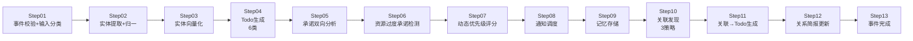

# PromiseLink — AI 驱动的个人商务关系经营助手

> **Slogan**: 让每一次连接，都更有价值
>
> **定位**: 先成就关系，再促成合作 — 利他切入的个人商务关系经营系统

<p align="center">
  <a href="https://promiselink.cn"></a>
  <br/>
  <a href="https://github.com/lulin70/PromiseLink/actions/workflows/ci.yml"></a>
  
  
  
  
  
  
  
  
  
</p>

> **PromiseLink** 是 AI 驱动的个人商务关系经营助手的**开源基础版**（MPL 2.0）。
> 提供事件录入 → 实体提取 → Todo 生成 → 承诺追踪 → 关联发现 → 仪表盘的核心闭环。
>
> **架构分层**：
> - **核心算法层**（实体归一 / Todo 状态机 / 承诺履行 / 关联发现 / 动态评分）— **主逻辑纯算法实现**（NetworkX + RapidFuzz + numpy），含可选 LLM 增强维度（entity_resolution 第5步 llm_reasoning / promise_fulfillment 的 llm_semantic 维度），均具备完整降级机制（PoC 中权重为 0.0），可离线运行、可审计、可复现
> - **LLM 增强层**（实体提取 / NLG 响应生成）— 可选 LLM 增强，需配置 `LLM_API_KEY`（Moka AI / OpenAI / Anthropic 任选）
>
> **不含**语音输入、语音查询、邮件同步、微信转发、OCR 名片扫描、隐私数据管理等专业版功能。
> 基础版可通过 `relay_client` 可选连接专业版云端网关以使用云端 AI 能力（需专业版 License）。
> 前端为 Taro H5（桌面浏览器宽屏优先，兼容移动端）。

**Topics**: `crm` `relationship-management` `ai-assistant` `fastapi` `taro` `sqlite-vec` `local-first` `mpl`

---

## 🌟 为什么选择 PromiseLink

| 优势 | 数据证明 | 对比传统 CRM |
|------|---------|-------------|
| 🏭 **工业级质量** | 1904 测试通过 / 89% 覆盖率 / mypy 0 / ruff 0 / 50 安全测试 / 17 性能测试 | 多数开源 CRM < 30% 覆盖率 |
| 🧠 **核心算法层主逻辑纯算法** | 实体归一 / Todo 状态机 / 承诺履行 / 关联发现 / 动态评分 — 主逻辑纯算法实现（NetworkX + RapidFuzz + numpy），含可选 LLM 增强维度（均具备降级机制），可离线运行、可审计 | 主流 AI-CRM 全链路依赖 GPT API |
| 🚀 **便携零部署** | `pip install -e .` + `bash scripts/start.sh` 即用，无需 Docker / K8s | 同类工具需 docker-compose |

> **诚实声明**：实体提取、NLG 响应生成等环节需配置 `LLM_API_KEY`；核心关系经营算法（5 大模块）为纯算法实现，LLM 不可用时核心闭环仍可降级运行。

---

## 📑 目录

- [快速启动](#快速启动)
- [30 秒验证](#30-秒验证无需-llm-配置)
- [质量指标](#质量指标)
- [核心能力](#核心能力)
- [与主流方案对比](#与主流方案对比)
- [项目结构](#项目结构)
- [文档索引](#文档索引)
- [当前进度](#当前进度)
- [技术栈](#技术栈)
- [产品版本](#产品版本)
- [验证安装](#验证安装)
- [团队](#团队)
- [License](#license)

---

## 快速启动

> ⚡ **3 步启动，5 分钟上手，无需 Docker / 无需云账号 / 数据完全本地自主**

```bash
# 1. 安装依赖
pip install -e '.[dev]'

# 2. 配置环境变量
cp .env.basic.example .env
# 编辑 .env 填入 LLM_API_KEY（Moka AI / OpenAI / Anthropic 任选其一）

# 3. 启动应用（本地直接运行，无需 Docker）
python -m uvicorn promiselink.main:app --host 0.0.0.0 --port 8000
# 或使用一键启动脚本（推荐）
bash scripts/start.sh

# 4. 访问
# API 文档：http://localhost:8000/docs
# 前端界面：http://localhost:8000
```

### 30 秒验证（无需 LLM 配置）

> 无需任何 LLM API Key，即可验证项目工程质量。

```bash
git clone https://github.com/lulin70/PromiseLink
cd PromiseLink
pip install -e '.[dev]'
pytest --co -q | tail -1   # 应显示 1953 tests collected
pytest tests/test_security_comprehensive.py -q --no-cov   # 50 项安全测试
```

---

## 质量指标

| 指标       | 数值                                                               |
| -------- | ---------------------------------------------------------------- |
| 测试用例     | **1904 passed**, 49 skipped, 0 failed (含 50 个 relay_client 健壮性 + 12 个 v5.6 纠偏 + 50 安全 + 17 性能 + 6 真实 LLM E2E) |
| 代码覆盖率    | **89%**                                                          |
| mypy 类型检查 | **0 错误** (112 源文件全部通过)                                             |
| ruff 代码检查 | **0 错误**                                                          |
| 安全测试     | **50 项全通过** (SQL 注入 / XSS / 路径遍历 / JWT / 越权 / 输入验证 / 速率限制)         |
| 性能测试     | **17 项全通过** (API 响应 < 50-500ms + 并发 + 内存)                         |
| API 路由    | **24 个路由文件 / 63 个 API 端点 / 53 paths**                              |
| 服务模块     | **38 个**                                                          |
| 数据模型     | **8 个文件，10 个模型类**                                                  |
| 文档版本     | PRD v5.8 / Tech v3.2                                             |
| 软件版本     | v0.8.0                                                           |
| 产品层级     | 基础版(本地免费) / 专业版(网关中继) / 小程序(手机竖屏) / 定制版(团队)                      |
| 总体进度     | **89%** (基础版 E2E 81/0/0 零 skip 达成)                              |

> **分层覆盖率提示**：核心算法层（entity_resolution / todo_state_machine / promise_fulfillment / association_discovery / priority_scorer）覆盖率高于项目平均 89%，主逻辑纯算法实现（含可选 LLM 增强维度），确定性可复现。

---

## 核心能力

### 事件处理管线（13 步）



**架构分层 — 算法层与 LLM 层解耦**：

| 层级 | 模块 | LLM 依赖 | 说明 |
|------|------|---------|------|
| **核心算法层** | `entity_resolution.py` | ❌ 不依赖 | 实体归一（5 步算法） |
| | `todo_state_machine.py` | ❌ 不依赖 | Todo 状态机 |
| | `promise_fulfillment.py` | ❌ 不依赖 | 承诺履行追踪 |
| | `association_discovery.py` | ❌ 不依赖 | 关联发现（3 策略） |
| | `priority_scorer.py` | ❌ 不依赖 | 动态优先级评分（4 维） |
| **LLM 增强层** | `entity_extractor.py` | ✅ 依赖 | 非结构化文本→结构化实体 |
| | `todo_generator.py` | ✅ 依赖 | Todo 内容生成 |
| | `title_generator.py` | ✅ 依赖 | 事件标题生成 |

> 核心算法层使用 NetworkX + RapidFuzz + numpy 实现，纯 Python 算法，可独立单测、可在无 LLM 环境下运行、确定性可复现、无幻觉风险。

**Todo 类型**（雾色系）:

| 类型                  | 颜色 | 含义   |
| ------------------- | -- | ---- |
| promise             | 雾绿 | 承诺事项 |
| help                | 雾紫 | 帮助建议 |
| care                | 雾蓝 | 关注提醒 |
| followup            | 雾金 | 后续跟进 |
| cooperation_signal  | 雾白 | 合作信号 |
| risk                | 烟粉 | 风险预警 |

### 数据接入层（DataSourceAdapter）

- 手动输入 / CSV 导入（语音输入/微信转发/邮件同步为专业版功能）

### Insight Engine（洞察引擎）

- 动态优先级评分（4 维：紧急度×0.4 + 重要度×0.6）
- 隐式反馈学习（完成顺序→关系权重）
- 场景匹配（DependencyAnalyzer + ContextMatcher）

---

## 与主流方案对比

| 能力 | PromiseLink 基础版 | 传统 CRM | SaaS AI-CRM |
|------|-------------------|----------|-------------|
| 本地离线运行 | ✅ 无需 Docker | ⚠️ 部分需 Docker | ❌ 必须联网 |
| 核心算法主逻辑纯算法（含可选 LLM 增强维度） | ✅ 主逻辑纯算法 + 可选 LLM 增强 | ✅ 无 LLM | ❌ 全链路依赖 |
| 承诺 / Todo 关系追踪 | ✅ 6 类 Todo 状态机 | ❌ 仅任务 | ⚠️ 简单 |
| 关联发现 | ✅ 3 策略 | ❌ | ⚠️ LLM 生成 |
| 数据所有权 | ✅ 100% 本地 SQLite | ⚠️ | ❌ 云端 |
| 授权方式 | 开源免费 (MPL 2.0) | 商业授权 | 商业服务 |

---

## 项目结构

<details>
<summary>📁 点击展开完整项目结构</summary>

```
PromiseLink/
├── src/promiselink/              # 应用源码
│   ├── models/                 # 数据模型（8 个模型文件，10 个模型类）
│   │   ├── entity.py           # 人物实体
│   │   ├── event.py            # 互动事件
│   │   ├── todo.py             # 行动提醒（6 类）
│   │   ├── association.py      # 关联发现
│   │   └── relationship_brief.py  # 关系简报
│   ├── api/v1/                 # REST API（24 个路由文件）
│   │   ├── health.py           # 健康检查
│   │   ├── events.py           # 事件 CRUD + Pipeline 触发
│   │   ├── entities.py         # 实体管理
│   │   ├── todos.py            # Todo 管理
│   │   ├── associations.py     # 关联查询
│   │   ├── relationship_briefs.py  # 关系简报
│   │   ├── dashboard.py        # 数据看板
│   │   ├── export.py           # 数据导出
│   │   ├── demand_input.py     # 需求输入
│   │   └── auth.py             # 认证
│   ├── services/               # 核心引擎（38 个模块）
│   │   ├── event_pipeline.py   # 13 步事件处理管线
│   │   ├── entity_extractor.py    # LLM 实体提取
│   │   ├── entity_resolution.py    # 实体归一（5 步算法，不依赖 LLM）
│   │   ├── todo_generator.py       # Todo 生成（6 类型策略）
│   │   ├── todo_state_machine.py   # Todo 状态机（不依赖 LLM）
│   │   ├── promise_fulfillment.py  # 承诺履行追踪（不依赖 LLM）
│   │   ├── association_discovery.py # 关联发现（3 策略，不依赖 LLM）
│   │   ├── priority_scorer.py      # 动态优先级评分（不依赖 LLM）
│   │   ├── llm_client.py           # LLM 客户端（Moka AI）
│   │   ├── semantic_search.py      # 向量语义搜索
│   │   ├── memory_provider.py      # CarryMem 集成
│   │   └── ...                     # （20+ 其他服务模块）
│   ├── core/                    # 基础设施
│   │   ├── crypto.py           # 加密（HMAC-SHA256 + 字段加密）
│   │   ├── exceptions.py       # 三层异常体系
│   │   ├── natural_date.py     # 自然日期解析
│   │   └── logging.py / redis.py / wechat.py
│   ├── prompts/                # LLM Prompt 模板
│   └── main.py                 # FastAPI 入口
├── docs/                       # 文档体系
├── tests/                      # 测试（67 个文件 / 1953 用例）
├── data/                       # SQLite 数据存储
├── scripts/                    # 一键安装/启动脚本 + E2E 测试
└── frontend/                   # Taro H5 前端
```

</details>

---

## 文档索引

### 核心文档

- [PRD v5.8](docs/spec/PRD_v1.md) - 产品需求文档
- [技术设计 v3.2](docs/architecture/PromiseLink_技术设计_v1.md) - 完整技术方案
- [项目状态](docs/PROJECT_STATUS.md) - 11 阶段生命周期跟踪
- [QUICKSTART](QUICKSTART.md) - 快速开始指南（含配置参考和 FAQ）
- [Setup 指南](docs/deliverables/README_SETUP.md) - 安装说明（指向 QUICKSTART）

### 详细设计文档

- [数据库设计 v3.0](docs/design/Database_Design_v1.md)
- [API 设计 v3.1](docs/design/API_Design_v1.md)
- [算法设计 v2.8](docs/design/Algorithm_Design_v1.md)
- [测试计划 v5.1](docs/design/Test_Plan_v1.md)
- [集成设计 v2.9](docs/design/Integration_Design_v1.md)
- [部署指南 v0.5.0](docs/design/Deployment_Guide.md)

> 安全设计文档（Security_Design 系列、THREAT_MODEL）已随专业版迁移至 [PromiseLink-Pro](https://github.com/lulin70/PromiseLink-Pro) 私有仓库。

---

## 当前进度

### ✅ 已完成（P1-P9）

- [x] PRD v5.2（关系经营核心闭环 + 向量化语义能力）
- [x] 技术设计 v3.2（Insight Engine + DataSourceAdapter + 向量语义）
- [x] P0 核心算法全部实现（实体归一 / 承诺履行 / 状态机 / 关联发现 / 动态评分）
- [x] FastAPI 完整实现（24 个路由文件 / 63 个 API 端点 / 53 paths）
- [x] 38 个服务模块（Pipeline / NLG / SemanticSearch / MemoryProvider 等）
- [x] 8 个模型文件（entity / event / todo / association / relationship_brief / scheduled_event / reminder / score_audit_log）
- [x] DataSourceAdapter 抽象层（手动 / CSV；语音 / 微信 / 邮件为专业版功能）
- [x] CarryMem 协议解耦（NullMemoryProvider 优雅降级）
- [x] 加密体系（HMAC-SHA256 + 字段级加密 + 行级安全）
- [x] 67 个测试文件 / **1953 测试用例**（含 50 个 relay_client 健壮性 + 12 个 v5.6 纠偏 + 6 真实 LLM E2E）/ **89% 覆盖率**
- [x] CI/CD + Alembic 就绪
- [x] PoC Demo 4/4 场景通过
- [x] 一键安装 / 启动脚本（本地直接运行，无需 Docker）
- [x] Taro H5 前端打包发布

### 🔴 未启动

- [ ] 专业版: 网关中继开发（SQLite + relay gateway）
- [ ] 定制版: 团队协作功能（PG + Redis + 多租户）

---

## 技术栈

| 层面      | 技术                                                                     |
| ------- | ---------------------------------------------------------------------- |
| **框架**  | FastAPI 0.109+ (Python 3.11+)                                          |
| **数据库** | SQLite (基础版 + 专业版长期方案) / PostgreSQL 15 (定制版)                         |
| **ORM** | SQLAlchemy 2.0+ (async)                                                |
| **LLM** | Moka AI (Claude Sonnet 4.6) / OpenAI (GPT-5.5) / Anthropic             |
| **向量**  | sqlite-vec (基础版 + 专业版) / pgvector (定制版)                                  |
| **缓存**  | Redis (定制版)                                                            |
| **算法**  | NetworkX + RapidFuzz + numpy（核心算法层，不依赖 LLM）                            |
| **部署**  | 基础版: 本地直接运行（无需 Docker） / 专业版: Docker + 网关中继 / 定制版: Docker Compose + K8s |

---

## 验证安装

```bash
# 健康检查
curl http://localhost:8000/api/v1/health

# 创建互动事件（触发完整 Pipeline）
curl -X POST http://localhost:8000/api/v1/events \
  -H "Content-Type: application/json" \
  -H "Authorization: Bearer <token>" \
  -d '{
    "event_type": "meeting",
    "source": "manual",
    "raw_text": "今天和张总聊了合作，他说下周需要一份技术方案"
  }'

# 查询实体列表
curl http://localhost:8000/api/v1/entities \
  -H "Authorization: Bearer <token>"

# 查询 Todo 列表（含动态优先级排序）
curl http://localhost:8000/api/v1/todos \
  -H "Authorization: Bearer <token>"

# 语义搜索
curl "http://localhost:8000/api/v1/entities?search=技术合作" \
  -H "Authorization: Bearer <token>"
```

---

## 产品版本

| 版本 | 仓库 | 定位 | 授权 | 部署方式 |
|------|------|------|------|----------|
| **基础版** | [PromiseLink](https://github.com/lulin70/PromiseLink) (🌐 公开 MPL 2.0) | 本地，纯文本交互，电脑宽屏 | 开源免费 | 本地直接运行（无需 Docker） |
| **专业版** | [PromiseLink-Pro](https://github.com/lulin70/PromiseLink-Pro) (🔒 私有 商业 License) | 云端 AI 网关 + 语音 / 邮件 / OCR / 隐私管理 | 联系销售 | Docker + 云端网关 |
| **小程序** | [PromiseLink-miniapp](https://github.com/lulin70/PromiseLink-miniapp) (🔒 私有 商业 License) | 微信小程序，手机竖屏，专业版移动端 | 随专业版 | 微信小程序平台 |
| **定制版** | (未公开) | 销售团队协作，多租户 | 联系销售 | 云端 Docker Compose + K8s |

> 基础版为纯文本交互，不包含语音功能和图片扫描功能。专业版依赖云端服务凭证。
> 基础版通过 `relay_client` 可选连接专业版云端网关以使用云端 AI 能力（需专业版 License）。

---

## 团队

| 角色 | 成员 | GitHub |
|------|------|--------|
| 项目负责人 | 林总（CarryMem 团队） | [@lulin70](https://github.com/lulin70) |
| 产品顾问 | 许总 / 李总 / 简总 | — |
| 设计 | Sophia J Lin | — |
| 合作方 | IAMHERE 数字名片 | — |

---

## License

MPL-2.0 — 详见 [LICENSE](LICENSE) 文件
