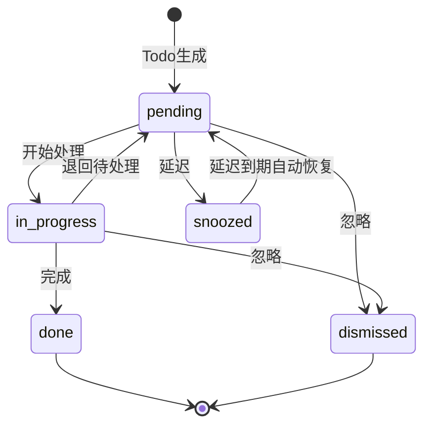

# EventLink 算法设计文档

> **版本**: v1.2
> **日期**: 2026-06-03
> **定位**: AI驱动的**个人商务关系经营助手**（非"资源匹配平台"）
> **参考**: 技术设计 v1.7 §4
> **状态**: ✅ 独立完整版，含详细算法与Python实现

---

## 关键决策铁律（8条）

| # | 决策 | 说明 |
|---|------|------|
| 1 | 产品定位 | AI驱动的**个人商务关系经营助手** |
| 2 | Todo类型 | 6种：cooperation_signal/risk/care/promise/followup/help |
| 3 | 莫兰迪色系 | 雾白#B8C4C0/烟粉#C4A7A0/雾蓝#A0B0C4/雾绿#A0C4A8/雾金#C4C0A0/雾紫#B0A0C4 |
| 4 | 匹配算法 | 六维：keyword(25%)+industry(20%)+topic(15%)+llm(10%)+history(10%)+callability(20%) |
| 5 | 敏感度 | 2级：matchable/no_match |
| 6 | 部署 | PoC本地Docker+SQLite → Phase1云端Docker Compose+PG+Redis |
| 7 | 明确排除 | RBAC/多租户/团队协作/他人资源匹配/原生APP |
| 8 | 字段名 | todo_type（非todo_nature）、callability（非availability） |

---

## 1. 实体归一5步算法

### 1.1 算法概述

实体归一是EventLink的核心基础算法，负责判断新抽取的实体是否与已有实体为同一对象。算法采用5步递进策略，从精确到模糊逐步匹配，每步产生置信度分数，根据阈值决定自动合并、人工确认或创建新实体。

**核心类**: `EntityResolutionEngine`

### 1.2 五步流程详解

#### Step 1: exact_match — 精确匹配

**触发条件**: 新实体name与已有实体name完全相同（忽略大小写和首尾空格）

**算法逻辑**:
- 对name做`.lower().strip()`后比较
- 若name完全匹配，再比较company字段
- company也匹配 → 置信度1.0
- company不匹配 → 置信度0.85（同名不同公司，可能是不同人）

**输出字段**: `{"name": 1.0, "company": 1.0 | 0.5}`

**示例**:
- "张三@阿里" vs "张三@阿里" → score=1.0, 自动合并
- "张三@阿里" vs "张三@腾讯" → score=0.85, 自动合并（同名但公司不同，仍需合并因为可能跳槽）

#### Step 2: alias_match — 别名匹配

**触发条件**: 新实体name出现在已有实体的aliases列表中

**算法逻辑**:
- 检查`new["name"]`是否在`existing.aliases`中
- 若命中别名，再比较company字段
- company匹配 → 置信度0.95
- company不匹配 → 置信度0.80

**输出字段**: `{"name": 0.95, "alias": True, "company": 1.0 | 0.5}`

**示例**:
- "老张" in ["老张", "张总"] → score=0.95（同公司）或0.80（不同公司）

#### Step 3: fuzzy_match — 模糊匹配

**触发条件**: name相似度≥0.70（使用rapidfuzz的token_sort_ratio）

**算法逻辑**:
- 计算name相似度：`fuzz.token_sort_ratio(new_name, existing_name) / 100`
- 若name相似度<0.70，直接返回0.0（提前剪枝）
- 计算company相似度和title相似度
- 综合得分 = name_sim × 0.5 + company_sim × 0.3 + title_sim × 0.2
- 上限截断为0.90（模糊匹配不超过0.90，防止误合并）

**输出字段**: `{"name": name_sim, "company": company_sim, "title": title_sim}`

**示例**:
- "张三丰" vs "张三" → name_sim≈0.67 < 0.70, 返回0.0
- "张三丰" vs "张 三 丰" → name_sim=1.0, score=min(0.5×1.0+0.3×0.8+0.2×0.5, 0.90)=0.84

#### Step 4: context_match — 上下文匹配

**触发条件**: name模糊匹配未达阈值，但上下文信息（公司/城市/行业）高度重合

**算法逻辑**:
- 公司名相同 → +0.30
- 城市相同 → +0.20
- 行业重叠 → +0.10
- 最高0.60（上下文匹配不超过0.60，仅作辅助证据）

**输出字段**: `{"company": 1.0, "city": 1.0, "industry": 0.8}`

**示例**:
- 同公司+同城市+同行业 → score=0.60, 需人工确认

#### Step 5: llm_reasoning — LLM推理

**触发条件**: 前4步均未达0.70确认阈值

**算法逻辑**:
- 将新实体和候选实体的关键信息组装为prompt
- 调用LLM判断是否为同一实体
- LLM返回0-1的置信度分数
- **PoC**: 使用规则兜底（返回0.0，直接创建新实体）
- **Phase1**: 接入LLM推理

**输出字段**: `{"llm_judgment": score}`

### 1.3 阈值体系

| 阈值 | 含义 | 动作 |
|------|------|------|
| ≥0.85 | 高置信度 | 自动合并（MERGE） |
| 0.70~0.84 | 中置信度 | 人工确认（CONFIRM） |
| <0.70 | 低置信度 | 创建新实体（CREATE） |

### 1.4 归一冲突解决策略

当多个候选实体同时满足阈值时：

1. **优先级**: exact_match > alias_match > fuzzy_match > context_match > llm_reasoning
2. **同步骤多候选**: 取置信度最高的候选
3. **合并策略**: 保留canonical_name，将新信息合并到properties，新name加入aliases
4. **字段冲突**: 新值覆盖旧值（但保留旧值在properties.merge_history中）

### 1.5 PoC vs Phase1差异

| 特性 | PoC | Phase1 |
|------|-----|--------|
| Step 5 LLM推理 | 跳过，直接CREATE | 接入LLM API |
| 候选查找 | 全表扫描（SQLite数据量小） | PG全文搜索+pg_trgm |
| 并发处理 | 同步执行 | 异步async |
| 别名管理 | 手动维护 | LLM自动发现别名 |

### 1.6 完整Python实现

```python
from rapidfuzz import fuzz
from enum import Enum
from dataclasses import dataclass, field
from typing import Optional


class ResolutionAction(str, Enum):
    MERGE = "merge"
    CONFIRM = "confirm"
    CREATE = "create"


@dataclass
class ResolutionResult:
    action: ResolutionAction
    target: Optional[object]  # Entity or None
    confidence: float
    matched_step: str
    matched_fields: dict
    explanation: str


class EntityResolutionEngine:
    """实体归一5步引擎"""

    AUTO_MERGE_THRESHOLD = 0.85
    CONFIRM_THRESHOLD = 0.70

    def __init__(self, db=None, llm_client=None, config: dict = None):
        self.db = db
        self.llm = llm_client
        self.config = config or {}

    async def resolve(self, new_entity: dict, user_id: str) -> ResolutionResult:
        """对新实体执行5步归一流程"""
        candidates = await self._find_candidates(new_entity, user_id)

        # 按优先级依次执行4步确定性匹配
        for step_name, step_fn in [
            ("exact_match", self._step_exact),
            ("alias_match", self._step_alias),
            ("fuzzy_match", self._step_fuzzy),
            ("context_match", self._step_context),
        ]:
            best_result = None
            for candidate in candidates:
                confidence, matched_fields = step_fn(new_entity, candidate)
                if confidence >= self.AUTO_MERGE_THRESHOLD:
                    return ResolutionResult(
                        action=ResolutionAction.MERGE,
                        target=candidate,
                        confidence=confidence,
                        matched_step=step_name,
                        matched_fields=matched_fields,
                        explanation=f"{step_name}: 置信度{confidence:.2f}，自动合并",
                    )
                if confidence >= self.CONFIRM_THRESHOLD:
                    if best_result is None or confidence > best_result.confidence:
                        best_result = ResolutionResult(
                            action=ResolutionAction.CONFIRM,
                            target=candidate,
                            confidence=confidence,
                            matched_step=step_name,
                            matched_fields=matched_fields,
                            explanation=f"{step_name}: 置信度{confidence:.2f}，需人工确认",
                        )
            if best_result:
                return best_result

        # Step 5: LLM推理（仅Phase1启用）
        if self.llm:
            for candidate in candidates:
                confidence, matched_fields = await self._step_llm(new_entity, candidate)
                if confidence >= self.AUTO_MERGE_THRESHOLD:
                    return ResolutionResult(
                        action=ResolutionAction.MERGE,
                        target=candidate,
                        confidence=confidence,
                        matched_step="llm_reasoning",
                        matched_fields=matched_fields,
                        explanation=f"llm_reasoning: 置信度{confidence:.2f}，自动合并",
                    )
                if confidence >= self.CONFIRM_THRESHOLD:
                    return ResolutionResult(
                        action=ResolutionAction.CONFIRM,
                        target=candidate,
                        confidence=confidence,
                        matched_step="llm_reasoning",
                        matched_fields=matched_fields,
                        explanation=f"llm_reasoning: 置信度{confidence:.2f}，需人工确认",
                    )

        return ResolutionResult(
            action=ResolutionAction.CREATE,
            target=None,
            confidence=0.0,
            matched_step="new_entity",
            matched_fields={},
            explanation="无匹配候选，创建新实体",
        )

    async def _find_candidates(self, new_entity: dict, user_id: str) -> list:
        """查找候选实体（PoC全表扫描，Phase1用PG索引）"""
        return await self.db.find_entities_by_user(user_id)

    def _step_exact(self, new: dict, existing) -> tuple:
        """Step 1: 精确匹配"""
        if new["name"].lower().strip() == existing.name.lower().strip():
            company_match = (
                new.get("company", "").lower().strip()
                == (existing.properties.get("basic", {}).get("company") or "").lower().strip()
            )
            score = 1.0 if company_match else 0.85
            fields = {"name": 1.0, "company": 1.0 if company_match else 0.5}
            return score, fields
        return 0.0, {}

    def _step_alias(self, new: dict, existing) -> tuple:
        """Step 2: 别名匹配"""
        aliases = existing.aliases or []
        if new["name"].strip() in aliases:
            company_match = (
                new.get("company", "").lower().strip()
                == (existing.properties.get("basic", {}).get("company") or "").lower().strip()
            )
            score = 0.95 if company_match else 0.80
            fields = {"name": 0.95, "alias": True, "company": 1.0 if company_match else 0.5}
            return score, fields
        return 0.0, {}

    def _step_fuzzy(self, new: dict, existing) -> tuple:
        """Step 3: 模糊匹配"""
        name_sim = fuzz.token_sort_ratio(new["name"], existing.name) / 100
        if name_sim < 0.70:
            return 0.0, {}
        company_sim = fuzz.token_sort_ratio(
            new.get("company", ""),
            existing.properties.get("basic", {}).get("company") or "",
        ) / 100
        title_sim = fuzz.token_sort_ratio(
            new.get("title", ""),
            existing.properties.get("basic", {}).get("title") or "",
        ) / 100
        score = name_sim * 0.5 + company_sim * 0.3 + title_sim * 0.2
        fields = {"name": name_sim, "company": company_sim, "title": title_sim}
        return min(score, 0.90), fields

    def _step_context(self, new: dict, existing) -> tuple:
        """Step 4: 上下文匹配"""
        context_score = 0.0
        fields = {}
        existing_basic = existing.properties.get("basic", {}) if existing.properties else {}
        if self._same_company_name(new.get("company"), existing_basic.get("company")):
            context_score += 0.3
            fields["company"] = 1.0
        if self._same_city_name(new.get("city"), existing_basic.get("city")):
            context_score += 0.2
            fields["city"] = 1.0
        if self._overlapping_industries(new, existing):
            context_score += 0.1
            fields["industry"] = 0.8
        return context_score, fields

    async def _step_llm(self, new: dict, existing) -> tuple:
        """Step 5: LLM推理（Phase1启用）"""
        prompt = (
            f"判断以下两个实体是否为同一人/组织，返回0-1的置信度：\n"
            f"实体A: name={new['name']}, company={new.get('company')}, "
            f"title={new.get('title')}, city={new.get('city')}\n"
            f"实体B: name={existing.name}, company={existing.properties.get('basic', {}).get('company')}, "
            f"title={existing.properties.get('basic', {}).get('title')}\n"
            f"只返回数字："
        )
        try:
            response = await self.llm.generate(prompt, max_tokens=10)
            score = max(0.0, min(1.0, float(response.strip())))
            return score, {"llm_judgment": score}
        except (ValueError, Exception):
            return 0.0, {}

    def _same_company_name(self, a: str, b: str) -> bool:
        if not a or not b:
            return False
        return a.lower().strip() == b.lower().strip()

    def _same_city_name(self, a: str, b: str) -> bool:
        if not a or not b:
            return False
        return a.lower().strip() == b.lower().strip()

    def _overlapping_industries(self, new: dict, existing) -> bool:
        new_ind = new.get("industry", "")
        exist_ind = (existing.properties or {}).get("basic", {}).get("industry", "")
        if not new_ind or not exist_ind:
            return False
        return new_ind == exist_ind
```

---

## 2. 商机匹配六维打分

### 2.1 算法概述

商机匹配是个人商务关系经营助手的核心能力——判断"你的需求"与"你人脉的供给"之间的匹配度。六维加权打分，其中**callability（可调用度）权重20%**，是私密助手定位下的关键维度，因为匹配结果取决于你与资源持有人的关系是否支持调用。

**核心类**: `OpportunityMatcher`

**六维权重**:

| 维度 | 权重 | 说明 |
|------|------|------|
| keyword_overlap | 25% | 关键词重叠度（TF-IDF + Jaccard） |
| industry_alignment | 20% | 行业分类匹配 |
| topic_similarity | 15% | 话题相似度 |
| llm_semantic | 10% | LLM语义判断 |
| history_collaboration | 10% | 历史交互频率衰减 |
| callability | 20% | 可调用度（资源标签与需求关键词匹配） |

### 2.2 维度1: keyword_overlap（关键词重叠度）

**权重**: 25%

**算法**: TF-IDF + Jaccard相似度

**PoC实现**:
- 提取todo的keywords集合和person的keywords集合
- 计算Jaccard相似度 = |A∩B| / |A∪B|
- 任一集合为空则返回0.0

**Phase1升级**:
- 使用TF-IDF对关键词加权（高频词降权，领域词升权）
- Jaccard改为加权Jaccard: Σmin(w_a, w_b) / Σmax(w_a, w_b)

```python
def _keyword_overlap(self, todo, person) -> float:
    """关键词重叠度 - PoC: Jaccard相似度"""
    todo_kw = set(getattr(todo, "keywords", []) or [])
    person_kw = set((person.properties or {}).get("keywords", []) or [])
    if not todo_kw or not person_kw:
        return 0.0
    intersection = todo_kw & person_kw
    union = todo_kw | person_kw
    return len(intersection) / len(union)
```

### 2.3 维度2: industry_alignment（行业分类匹配）

**权重**: 20%

**算法**: 行业分类层级匹配

**逻辑**:
- todo的domain_l1与person的industry完全相同 → 1.0
- person的industry在todo domain的关联行业列表中 → 0.5
- 否则 → 0.0

**关联行业配置示例**:
```yaml
related_industries:
  互联网:
    - 电子商务
    - SaaS
    - 在线教育
  金融:
    - 金融科技
    - 保险
    - 投资管理
```

```python
def _industry_alignment(self, todo, person) -> float:
    """行业分类匹配"""
    todo_domain = getattr(todo, "domain_l1", None)
    person_industry = (person.properties or {}).get("basic", {}).get("industry")
    if not todo_domain or not person_industry:
        return 0.0
    if todo_domain == person_industry:
        return 1.0
    related = self.config.get("related_industries", {}).get(todo_domain, [])
    return 0.5 if person_industry in related else 0.0
```

### 2.4 维度3: topic_similarity（话题相似度）

**权重**: 15%

**算法**:
- **PoC**: 基于规则的标签匹配（Jaccard on topic tags）
- **Phase1**: embedding向量余弦相似度（pgvector）

**PoC实现**:
```python
async def _topic_similarity(self, todo, person) -> float:
    """话题相似度 - PoC: 标签Jaccard"""
    todo_topics = set(getattr(todo, "topic_tags", []) or [])
    person_topics = set((person.properties or {}).get("topic_tags", []) or [])
    if not todo_topics or not person_topics:
        return 0.0
    intersection = todo_topics & person_topics
    union = todo_topics | person_topics
    return len(intersection) / len(union)
```

**Phase1实现**:
```python
async def _topic_similarity(self, todo, person) -> float:
    """话题相似度 - Phase1: embedding余弦相似度"""
    todo_vec = getattr(todo, "topic_vector", None)
    person_vec = (person.properties or {}).get("topic_vector")
    if todo_vec is None or person_vec is None:
        return 0.0
    return self._cosine_similarity(todo_vec, person_vec)
```

### 2.5 维度4: llm_semantic（LLM语义判断）

**权重**: 10%

**算法**: LLM判断商机与人物的语义相关性

**逻辑**:
- 将todo和person的关键信息脱敏后组装prompt
- LLM返回0-1的匹配度分数
- 解析失败时返回0.5（中性值，不偏不倚）

**安全**: `_sanitize_for_llm`方法确保不泄露敏感信息（电话、地址等）

```python
async def _llm_semantic_judge(self, todo, person) -> float:
    """LLM语义判断"""
    sanitized = self._sanitize_for_llm(todo, person)
    response = await self.llm.generate(
        f"判断商机与人物的匹配度(0-1)：{json.dumps(sanitized, ensure_ascii=False)}",
        max_tokens=10,
    )
    try:
        return max(0.0, min(1.0, float(response.strip())))
    except ValueError:
        return 0.5

def _sanitize_for_llm(self, todo, person) -> dict:
    """脱敏处理，只传递非敏感信息给LLM"""
    return {
        "todo": {"description": getattr(todo, "description", ""), "keywords": getattr(todo, "keywords", [])},
        "person": {
            "company": (person.properties or {}).get("basic", {}).get("company"),
            "title": (person.properties or {}).get("basic", {}).get("title"),
            "industry": (person.properties or {}).get("basic", {}).get("industry"),
        },
    }
```

### 2.6 维度5: history_collaboration（历史交互频率衰减）

**权重**: 10%

**算法**: 历史交互次数分段 + 时间衰减

**逻辑**:
- 0次交互 → 0.0
- 1次交互 → 0.3
- 2-3次交互 → 0.6
- 4次以上 → 1.0
- **Phase1增加时间衰减**: score × exp(-λ × days_since_last)

```python
def _history_collaboration(self, todo, person) -> float:
    """历史交互频率 - PoC: 分段映射"""
    count = self._get_collaboration_count(todo, person)
    if count == 0:
        return 0.0
    if count == 1:
        return 0.3
    if count <= 3:
        return 0.6
    return 1.0

def _get_collaboration_count(self, todo, person) -> int:
    """查询历史交互次数"""
    # 从associations表查询source_entity_id=person且association_type含合作类型的记录
    return 0  # placeholder
```

**Phase1时间衰减**:
```python
import math

def _history_collaboration_phase1(self, todo, person) -> float:
    """历史交互频率 - Phase1: 分段 + 时间衰减"""
    count = self._get_collaboration_count(todo, person)
    last_date = self._get_last_interaction_date(todo, person)
    if count == 0:
        return 0.0
    base = 0.3 if count == 1 else (0.6 if count <= 3 else 1.0)
    if last_date:
        days = (datetime.utcnow() - last_date).days
        decay = math.exp(-0.01 * days)
        return base * max(decay, 0.2)  # 衰减下限0.2
    return base
```

### 2.7 维度6: callability（可调用度）

**权重**: 20% — **私密助手关键维度**

**算法**: 资源标签与需求关键词的匹配度

**核心思想**: 在私密助手定位下，匹配不仅看"能力匹配"，更看"能否调用"。callability衡量的是：该person拥有的资源标签（tags）与当前需求关键词（keywords）的重合程度。

**逻辑**:
1. 获取person的资源列表 `person.properties.resource`
2. 获取todo的需求关键词 `todo.keywords`
3. 对每个资源，检查其tags与需求关键词的交集
4. callability = 有匹配的资源数 / 总资源数
5. 无资源 → 0.0，无需求关键词 → 0.3（默认中性）

```python
def _callability(self, todo, person) -> float:
    """可调用度 - 资源标签与需求关键词匹配度"""
    resources = (person.properties or {}).get("resource", [])
    if not resources:
        return 0.0
    demand_keywords = set(getattr(todo, "keywords", []) or [])
    if not demand_keywords:
        return 0.3  # 无明确需求时给中性分
    matched = sum(
        1 for r in resources
        if set(r.get("tags", [])) & demand_keywords
    )
    return min(1.0, matched / max(len(resources), 1))
```

**Phase1增强**:
- 引入关系强度权重：callability × relationship_strength
- 关系强度从association.strength获取
- 强关系（>0.7）不降权，弱关系（<0.3）降权50%

### 2.8 完整OpportunityMatcher类

```python
import json
import math
from datetime import datetime


class OpportunityMatcher:
    """商机匹配六维打分引擎"""

    WEIGHTS = {
        "keyword_overlap": 0.25,
        "industry_alignment": 0.20,
        "topic_similarity": 0.15,
        "llm_semantic": 0.10,
        "history_collaboration": 0.10,
        "callability": 0.20,
    }

    SENSITIVITY_LEVELS = {
        "matchable": True,
        "no_match": False,
    }

    def __init__(self, db=None, llm_client=None, config: dict = None):
        self.db = db
        self.llm = llm_client
        self.config = config or {}

    async def calculate_match_score(self, todo, person) -> dict:
        """计算商机匹配六维总分"""
        # 敏感度前置过滤
        if not self._check_sensitivity(person):
            return {
                "total_score": 0.0,
                "dimensions": {},
                "match_reason": "资源标记为不可匹配",
                "filtered": True,
            }

        d1 = self._keyword_overlap(todo, person)
        d2 = self._industry_alignment(todo, person)
        d3 = await self._topic_similarity(todo, person)
        d4 = await self._llm_semantic_judge(todo, person) if self.llm else 0.0
        d5 = self._history_collaboration(todo, person)
        d6 = self._callability(todo, person)

        total = (
            d1 * self.WEIGHTS["keyword_overlap"]
            + d2 * self.WEIGHTS["industry_alignment"]
            + d3 * self.WEIGHTS["topic_similarity"]
            + d4 * self.WEIGHTS["llm_semantic"]
            + d5 * self.WEIGHTS["history_collaboration"]
            + d6 * self.WEIGHTS["callability"]
        )

        return {
            "total_score": round(total, 4),
            "dimensions": {
                "keyword_overlap": round(d1, 4),
                "industry_alignment": round(d2, 4),
                "topic_similarity": round(d3, 4),
                "llm_semantic": round(d4, 4),
                "history_collaboration": round(d5, 4),
                "callability": round(d6, 4),
            },
            "match_reason": self._generate_reason(d1, d2, d3, d4, d5, d6),
        }

    def _check_sensitivity(self, person) -> bool:
        """敏感度检查"""
        sensitivity = (person.properties or {}).get("resource", {}).get("sensitivity", "matchable")
        return self.SENSITIVITY_LEVELS.get(sensitivity, True)

    def _keyword_overlap(self, todo, person) -> float:
        """关键词重叠度"""
        todo_kw = set(getattr(todo, "keywords", []) or [])
        person_kw = set((person.properties or {}).get("keywords", []) or [])
        if not todo_kw or not person_kw:
            return 0.0
        intersection = todo_kw & person_kw
        union = todo_kw | person_kw
        return len(intersection) / len(union)

    def _industry_alignment(self, todo, person) -> float:
        """行业分类匹配"""
        todo_domain = getattr(todo, "domain_l1", None)
        person_industry = (person.properties or {}).get("basic", {}).get("industry")
        if not todo_domain or not person_industry:
            return 0.0
        if todo_domain == person_industry:
            return 1.0
        related = self.config.get("related_industries", {}).get(todo_domain, [])
        return 0.5 if person_industry in related else 0.0

    async def _topic_similarity(self, todo, person) -> float:
        """话题相似度"""
        todo_topics = set(getattr(todo, "topic_tags", []) or [])
        person_topics = set((person.properties or {}).get("topic_tags", []) or [])
        if not todo_topics or not person_topics:
            return 0.0
        intersection = todo_topics & person_topics
        union = todo_topics | person_topics
        return len(intersection) / len(union)

    async def _llm_semantic_judge(self, todo, person) -> float:
        """LLM语义判断"""
        sanitized = self._sanitize_for_llm(todo, person)
        response = await self.llm.generate(
            f"判断商机与人物的匹配度(0-1)：{json.dumps(sanitized, ensure_ascii=False)}",
            max_tokens=10,
        )
        try:
            return max(0.0, min(1.0, float(response.strip())))
        except ValueError:
            return 0.5

    def _history_collaboration(self, todo, person) -> float:
        """历史交互频率"""
        count = self._get_collaboration_count(todo, person)
        if count == 0:
            return 0.0
        if count == 1:
            return 0.3
        if count <= 3:
            return 0.6
        return 1.0

    def _callability(self, todo, person) -> float:
        """可调用度 - 资源标签与需求关键词匹配度"""
        resources = (person.properties or {}).get("resource", [])
        if not resources:
            return 0.0
        demand_keywords = set(getattr(todo, "keywords", []) or [])
        if not demand_keywords:
            return 0.3
        matched = sum(
            1 for r in resources
            if set(r.get("tags", [])) & demand_keywords
        )
        return min(1.0, matched / max(len(resources), 1))

    def _sanitize_for_llm(self, todo, person) -> dict:
        """脱敏处理"""
        return {
            "todo": {"description": getattr(todo, "description", ""), "keywords": getattr(todo, "keywords", [])},
            "person": {
                "company": (person.properties or {}).get("basic", {}).get("company"),
                "title": (person.properties or {}).get("basic", {}).get("title"),
                "industry": (person.properties or {}).get("basic", {}).get("industry"),
            },
        }

    def _generate_reason(self, d1, d2, d3, d4, d5, d6) -> str:
        """生成匹配原因摘要"""
        reasons = []
        if d2 >= 0.5:
            reasons.append("同行业")
        if d1 >= 0.3:
            reasons.append("关键词相关")
        if d5 >= 0.3:
            reasons.append("有过合作")
        if d3 >= 0.5:
            reasons.append("话题相关")
        if d6 >= 0.5:
            reasons.append("可调用资源匹配")
        return "·".join(reasons) if reasons else "潜在关联"

    def _get_collaboration_count(self, todo, person) -> int:
        """查询历史交互次数"""
        return 0  # placeholder, 实际从DB查询

    @staticmethod
    def _cosine_similarity(a, b) -> float:
        """余弦相似度"""
        dot = sum(x * y for x, y in zip(a, b))
        norm_a = sum(x * x for x in a) ** 0.5
        norm_b = sum(x * x for x in b) ** 0.5
        if norm_a == 0 or norm_b == 0:
            return 0.0
        return dot / (norm_a * norm_b)
```

### 2.9 权重调优策略

| 阶段 | 策略 | 说明 |
|------|------|------|
| PoC | 固定权重 | 使用上述默认权重，收集匹配结果反馈 |
| Phase1 | A/B测试 | 对同一匹配场景使用不同权重组合，对比用户反馈（useful/not_useful） |
| Phase2 | 自适应权重 | 基于用户反馈历史，用贝叶斯优化调整个人化权重 |

**调优指标**:
- 精准率: 用户标记"useful"的匹配 / 总匹配数
- 召回率: 用户实际采纳的商机 / 系统推荐的商机
- 覆盖率: 至少产生1个匹配的person比例

---

## 3. 资源敏感度过滤算法

### 3.1 敏感度定义

EventLink采用2级敏感度模型，控制资源是否参与匹配：

| 级别 | 值 | 含义 | 参与匹配 |
|------|----|------|----------|
| 可匹配 | `matchable` | 资源可参与商机匹配 | ✅ 是 |
| 不可匹配 | `no_match` | 资源不参与任何匹配 | ❌ 否 |

**存储位置**: `entity.properties.resource.sensitivity`

**设计原则**:
- 默认值为`matchable`（开放匹配）
- 用户可手动标记为`no_match`（如：敏感客户、竞争对手关系人）
- 不设中间级别（如"仅内部可见"），避免RBAC复杂度

### 3.2 过滤流程

```
匹配请求进入
    │
    ▼
┌──────────────────────┐
│ Step 1: 敏感度前置检查  │
│ 读取person.properties  │
│ .resource.sensitivity  │
│                        │
│ 若=no_match → 直接返回  │
│ total_score=0.0        │
│ filtered=True          │
└──────────┬───────────┘
           │ matchable
           ▼
┌──────────────────────┐
│ Step 2: 六维评分计算    │
│ 正常执行6个维度打分     │
│ （见§2）               │
└──────────┬───────────┘
           │
           ▼
┌──────────────────────┐
│ Step 3: 结果返回       │
│ 包含dimensions详情     │
│ filtered=False        │
└──────────────────────┘
```

### 3.3 Python实现

```python
class SensitivityFilter:
    """资源敏感度过滤器"""

    LEVELS = {
        "matchable": True,
        "no_match": False,
    }
    DEFAULT_LEVEL = "matchable"

    def check(self, person) -> bool:
        """检查person是否可参与匹配"""
        sensitivity = self._get_sensitivity(person)
        return self.LEVELS.get(sensitivity, True)

    def _get_sensitivity(self, person) -> str:
        """获取敏感度级别"""
        props = person.properties or {}
        # 支持两种存储路径
        # 路径1: properties.resource.sensitivity
        resource = props.get("resource", {})
        if isinstance(resource, dict):
            sens = resource.get("sensitivity")
            if sens:
                return sens
        # 路径2: properties.resource_sensitivity（兼容旧格式）
        sens = props.get("resource_sensitivity")
        if sens:
            return sens
        return self.DEFAULT_LEVEL

    def set_sensitivity(self, person, level: str) -> None:
        """设置敏感度级别"""
        if level not in self.LEVELS:
            raise ValueError(f"无效敏感度级别: {level}，可选: {list(self.LEVELS.keys())}")
        props = person.properties or {}
        resource = props.get("resource", {})
        if isinstance(resource, dict):
            resource["sensitivity"] = level
        else:
            props["resource"] = {"sensitivity": level}
        person.properties = props

    def batch_filter(self, persons: list) -> tuple:
        """批量过滤，返回(matchable_list, filtered_list)"""
        matchable = []
        filtered = []
        for p in persons:
            if self.check(p):
                matchable.append(p)
            else:
                filtered.append(p)
        return matchable, filtered
```

### 3.4 敏感度标记界面交互

| 操作 | 触发 | 效果 |
|------|------|------|
| 标记为no_match | 人物详情页 → "隐私设置" → "不参与匹配" | 该人物不再出现在商机匹配结果中 |
| 恢复为matchable | 人物详情页 → "隐私设置" → "允许匹配" | 该人物重新参与匹配 |
| 批量标记 | 设置页 → "隐私管理" → 勾选多人 → "设为不可匹配" | 批量修改sensitivity |

**UI色系映射**:
- matchable: 莫兰迪雾绿 #A0C4A8（可匹配，安全）
- no_match: 莫兰迪烟粉 #C4A7A0（不可匹配，需注意）

### 3.5 匹配算法阶段化

匹配算法按产品阶段逐步开放维度，避免PoC阶段过度工程化：

| 阶段 | 启用维度 | 权重分配 | 核心目标 |
|------|---------|---------|---------|
| PoC | keyword_overlap + callability + industry | keyword(35%) + callability(35%) + industry(30%) | 承诺兑现闭环，验证核心流程 |
| Phase1 | +care（关注点匹配） | keyword(20%) + industry(15%) + care(30%) + callability(20%) + history(10%) + topic(5%) | care维度替代keyword_overlap，关注点匹配 |
| Phase2 | 完整六维 | keyword(25%) + industry(20%) + topic(15%) + llm(10%) + history(10%) + callability(20%) | 完整六维匹配 |

**PoC阶段简化策略**:
- llm_semantic维度跳过（返回0.0，避免API调用开销）
- topic_similarity维度跳过（返回0.0，PoC无embedding）
- history_collaboration维度跳过（返回0.0，PoC无历史数据）
- 仅保留keyword_overlap、callability、industry_alignment三个维度
- 匹配结果仅用于promise类型Todo的关联推荐

**Phase1阶段升级策略**:
- 启用care维度：从person.properties.care_topics提取关注点，与todo的concern_topic匹配
- care维度权重30%，成为主导维度
- keyword_overlap权重从35%降至20%
- 逐步积累history_collaboration数据

**Phase2阶段完整策略**:
- 启用全部六维
- llm_semantic接入LLM API
- topic_similarity使用embedding余弦相似度
- 权重回归标准配置

---

## 4. 6种Todo类型生成算法

### 4.1 Todo类型总览

| 类型 | todo_type值 | 莫兰迪色系 | 图标 | 含义 |
|------|-------------|-----------|------|------|
| 承诺 | `promise` | 雾绿 #A0C4A8 | 🟢 | 从交流中提取"我答应过什么" |
| 帮助 | `help` | 雾紫 #B0A0C4 | 🟣 | 识别"我能为他做什么" |
| 关心 | `care` | 雾蓝 #A0B0C4 | 🔵 | 提取"对方正在关心什么" |
| 跟进 | `followup` | 雾金 #C4C0A0 | 🟡 | 低置信度匹配需人工确认、对方回应追踪 |
| 合作信号 | `cooperation_signal` | 雾白 #B8C4C0 | ⚪ | 检测双方关注点重叠、自然出现的合作可能 |
| 风险 | `risk` | 烟粉 #C4A7A0 | 🔴 | 竞对/负面信号检测 |

### 4.2 promise（承诺）生成算法

**核心语义**: 从交流中提取"我答应过什么"

**触发条件**: 从会议记录/通话摘要/聊天记录中提取出用户做出的承诺

**生成规则**:
1. LLM分析事件内容，识别用户（第一人称）做出的承诺性表述
2. 承诺性表述模式："我会…"、"我来…"、"我负责…"、"保证…"、"下周给你…" 等
3. 提取承诺内容、承诺对象、截止时间（如有）

**优先级计算**（基于到期时间）:
- 已过期 → priority=1（最高）
- 3天内到期 → priority=2
- 7天内到期 → priority=3
- 无明确截止日期 → priority=4
- 远期承诺（>7天） → priority=5

**特有字段**:
- `due_at`: 承诺截止时间（从上下文推断或明确提及）
- `promise_to`: 承诺对象（关联person）
- `promise_content`: 承诺具体内容

```python
def generate_promise_todo(self, event, person, promises: list) -> list:
    """生成承诺Todo列表"""
    todos = []
    for promise in promises:
        due_at = promise.get("due_at")
        if due_at:
            days_left = (due_at - datetime.utcnow()).days
            if days_left < 0:
                priority = 1  # 已过期
            elif days_left <= 3:
                priority = 2
            elif days_left <= 7:
                priority = 3
            else:
                priority = 5
        else:
            priority = 4  # 无明确截止日期
        todos.append({
            "todo_type": "promise",
            "title": f"承诺: {promise['content']}",
            "priority": priority,
            "due_at": due_at,
            "related_entity_id": str(person.id) if person else None,
            "source_event_id": str(event.id),
            "properties": {
                "promise_to": promise.get("promise_to"),
                "promise_content": promise["content"],
                "due_at": due_at.isoformat() if due_at else None,
            },
        })
    return todos
```

### 4.3 help（帮助）生成算法

**核心语义**: 识别"我能为他做什么"

**触发条件**: 基于对方关注点与我的能力匹配

**生成规则**:
1. 从交流中提取对方表达的需求/关注点
2. 与用户自身的能力标签（my_capabilities）做匹配
3. 匹配度≥0.50 → 生成help类型Todo
4. 匹配度0.30~0.49 → 降级为followup类型Todo

**优先级计算**（基于对方关注点紧急程度和关系强度）:
- 强关系+紧急需求 → priority=1
- 强关系+一般需求 → priority=2
- 弱关系+紧急需求 → priority=3
- 弱关系+一般需求 → priority=4

**特有字段**:
- `their_need`: 对方的需求/关注点
- `my_capability`: 我能提供的帮助
- `match_score`: 需求-能力匹配度

```python
def generate_help_todo(self, person, their_need: str, my_capability: str,
                       match_score: float, strength: float) -> dict:
    """生成帮助Todo"""
    if match_score < 0.30:
        return None  # 不生成
    if match_score < 0.50:
        # 降级为跟进
        return self.generate_followup_todo(
            followup_type="help_check",
            confidence=match_score,
            entity=person,
            detail={"their_need": their_need, "my_capability": my_capability},
        )
    urgency = self._assess_urgency(their_need)
    if strength >= 0.7:
        priority = 1 if urgency == "high" else 2
    else:
        priority = 3 if urgency == "high" else 4
    return {
        "todo_type": "help",
        "title": f"帮助: {person.name}需要「{their_need}」→ 我可提供「{my_capability}」",
        "priority": priority,
        "related_entity_id": str(person.id),
        "properties": {
            "their_need": their_need,
            "my_capability": my_capability,
            "match_score": match_score,
            "strength": strength,
        },
    }
```

### 4.4 care（关心）生成算法

**核心语义**: 提取"对方正在关心什么"

**触发条件**: 从交流内容中识别对方关注的话题/问题

**生成规则**:
1. LLM分析事件内容，提取对方（非用户本人）表达的关注点
2. 关注点模式："我们正在找…"、"最近在关注…"、"头疼的是…"、"想了解…" 等
3. 将关注点归类为concern_topic
4. 记录来源事件，便于后续追溯

**优先级计算**（基于关注点时效性和关系强度）:
- 热点话题+强关系 → priority=2
- 一般关注+强关系 → priority=3
- 热点话题+弱关系 → priority=4
- 一般关注+弱关系 → priority=5

**特有字段**:
- `concern_topic`: 对方关心的主题
- `source_event_id`: 来源事件ID
- `concern_intensity`: 关注强度（high/medium/low）

```python
def generate_care_todo(self, event, person, concern_topic: str,
                       intensity: str, strength: float) -> dict:
    """生成关心Todo"""
    is_hot = self._is_hot_topic(concern_topic)
    if strength >= 0.7:
        priority = 2 if is_hot else 3
    else:
        priority = 4 if is_hot else 5
    return {
        "todo_type": "care",
        "title": f"关心: {person.name}正在关注「{concern_topic}」",
        "priority": priority,
        "related_entity_id": str(person.id),
        "source_event_id": str(event.id),
        "properties": {
            "concern_topic": concern_topic,
            "source_event_id": str(event.id),
            "concern_intensity": intensity,
            "is_hot_topic": is_hot,
        },
    }
```

### 4.5 followup（跟进）生成算法

**核心语义**: 低置信度匹配需人工确认、对方回应追踪

**触发条件**:
1. **实体归一**: 置信度0.70~0.84的归一结果 → 需人工确认
2. **商机匹配**: 匹配度0.30~0.49 → 需人工确认
3. **回应追踪**: 用户做出承诺后等待对方回复

**生成规则**:
1. 低置信度场景：将不确定的匹配/归一结果提交给用户确认
2. 回应追踪：当用户做出承诺后，追踪对方是否回应

**优先级计算**:
- 置信度越高，优先级越高：priority = 5 - round(confidence × 3)
- 回应追踪：等待时间越长优先级越高

```python
def generate_followup_todo(self, followup_type: str, confidence: float,
                           entity, detail: dict) -> dict:
    """生成跟进Todo"""
    if followup_type == "response_tracking":
        days_waiting = detail.get("days_waiting", 0)
        if days_waiting >= 7:
            priority = 1
        elif days_waiting >= 3:
            priority = 2
        else:
            priority = 3
    else:
        priority = max(1, min(5, 5 - round(confidence * 3)))
    return {
        "todo_type": "followup",
        "title": f"跟进: {followup_type} - {entity.name} (置信度{confidence:.0%})",
        "priority": priority,
        "related_entity_id": str(entity.id),
        "properties": {
            "followup_type": followup_type,
            "confidence": confidence,
            "detail": detail,
        },
    }
```

### 4.6 cooperation_signal（合作信号）生成算法

**核心语义**: 检测双方关注点重叠、自然出现的合作可能

**触发条件**: 双方关注点存在重叠，且存在自然合作的可能性

**生成规则**:
1. 比较用户关注点与对方关注点的重叠度
2. 关注点来源：care类型Todo的concern_topic、事件中提取的topic_tags
3. 重叠度≥0.60 → 生成cooperation_signal
4. 重叠度0.40~0.59 → 降级为followup（需人工判断）
5. 排除已有明确合作关系的pair（避免重复）

**优先级计算**（基于重叠度和关系强度）:
- 高重叠(≥0.8)+强关系 → priority=1
- 高重叠(≥0.8)+弱关系 → priority=2
- 中重叠(0.6~0.79)+强关系 → priority=3
- 中重叠(0.6~0.79)+弱关系 → priority=4

**特有字段**:
- `shared_topics`: 双方共同关注的主题列表
- `overlap_score`: 关注点重叠度
- `cooperation_possibility`: 合作可能性描述

```python
def generate_cooperation_signal_todo(self, person, shared_topics: list,
                                     overlap_score: float, strength: float) -> dict:
    """生成合作信号Todo"""
    if overlap_score < 0.40:
        return None  # 不生成
    if overlap_score < 0.60:
        # 降级为跟进
        return self.generate_followup_todo(
            followup_type="cooperation_check",
            confidence=overlap_score,
            entity=person,
            detail={"shared_topics": shared_topics},
        )
    if strength >= 0.7:
        priority = 1 if overlap_score >= 0.8 else 2
    else:
        priority = 3 if overlap_score >= 0.8 else 4
    return {
        "todo_type": "cooperation_signal",
        "title": f"合作信号: 与{person.name}在「{'、'.join(shared_topics[:3])}」上关注点重叠",
        "priority": priority,
        "related_entity_id": str(person.id),
        "properties": {
            "shared_topics": shared_topics,
            "overlap_score": overlap_score,
            "cooperation_possibility": self._describe_cooperation(shared_topics),
        },
    }
```

### 4.7 risk（风险）生成算法

**触发条件**: 竞对/负面信号检测

**生成规则**:
1. **竞对检测**: 新事件中出现与已有entity标记为competitor的关联人物同名
2. **负面信号**: LLM分析事件内容检测到负面情绪/风险信号
3. **关系降温**: association.strength连续下降超过30%

**优先级计算**:
- 竞对检测 → priority=1（最高）
- 负面信号 → priority=2
- 关系降温 → priority=3

**标题模板**:
- 竞对: `"风险: 竞对{竞对名}出现在{事件场景}"`
- 负面: `"风险: {人物名}关系出现负面信号"`
- 降温: `"风险: 与{人物名}的关系强度下降{降幅}%"`

```python
def generate_risk_todo(self, risk_type: str, person, evidence: dict) -> dict:
    """生成风险Todo"""
    templates = {
        "competitor": ("风险: 竞对{competitor}出现在{scenario}", 1),
        "negative_signal": ("风险: {person}关系出现负面信号", 2),
        "relationship_decay": ("风险: 与{person}的关系强度下降{decay}%", 3),
    }
    template, priority = templates.get(risk_type, ("风险: 未知风险", 3))
    return {
        "todo_type": "risk",
        "title": template.format(**evidence),
        "priority": priority,
        "related_entity_id": str(person.id) if person else None,
        "properties": {"risk_type": risk_type, "evidence": evidence},
    }
```

### 4.8 AI输出语言规则算法

AI生成Todo时，必须区分事实与推测，确保输出语言的严谨性。

#### 4.8.1 推测vs事实标记算法

**原则**: AI输出的每条结论都必须标注信息来源类型

**标记规则**:
1. **事实（confirmed）**: 直接来自用户输入/事件原文的内容
   - 例：用户明确说"我下周给他方案" → promise标记为confirmed
   - 判定条件：原文中有明确表述，无需推理
2. **推断（inferred）**: 基于事实的逻辑推理
   - 例：对方说"我们Q3要上线新系统" → care标记为inferred（推断对方关心技术方案）
   - 判定条件：需要一步逻辑推理，但推理链清晰
3. **推测（speculated）**: 基于有限信息的猜测
   - 例：对方提到某竞对名字 → risk标记为speculated（推测可能存在竞争关系）
   - 判定条件：需要多步推理或信息不完整

**标记流程**:
```
事件内容输入
    │
    ▼
LLM分析提取信息
    │
    ▼
对每条提取结果判定来源类型：
    - 原文直接表述 → confirmed
    - 一步逻辑推理 → inferred
    - 多步推理/信息不足 → speculated
    │
    ▼
在Todo的properties中记录：
    confidence_level: confirmed | inferred | speculated
    evidence_chain: [原始证据链]
```

#### 4.8.2 置信度分级

| 级别 | 值 | 含义 | 输出语言要求 | 示例 |
|------|----|------|-------------|------|
| 事实 | `confirmed` | 原文直接表述 | 直接陈述 | "你承诺了给张三方案" |
| 推断 | `inferred` | 一步逻辑推理 | 加"可能"/"看来" | "张三可能正在关注技术方案" |
| 推测 | `speculated` | 多步推理/信息不足 | 加"猜测"/"或许" | "或许张三与竞对存在关联" |

**置信度与优先级联动**:
- confirmed → 不降权
- inferred → priority +1（最多到5）
- speculated → priority +2（最多到5）

#### 4.8.3 敏感结论过滤规则

**过滤原则**: 涉及个人隐私、商业机密、法律风险的结论必须过滤或脱敏

**过滤规则**:
1. **个人隐私**: 不输出具体薪资、家庭状况、健康信息等
2. **商业机密**: 不输出具体的商业数据、未公开的合作信息
3. **法律风险**: 不输出可能涉及诽谤的推测性结论
4. **speculated级别限制**: speculated级别的结论不生成risk类型Todo（避免误报）

**过滤流程**:
```python
class AIOutputFilter:
    """AI输出语言过滤器"""

    SENSITIVE_PATTERNS = [
        r"薪资|工资|收入|报酬",
        r"家庭|婚姻|健康|病历",
        r"商业机密|内部数据|未公开",
    ]

    SPECULATED_RISK_BLOCKED = True  # speculated级别不生成risk Todo

    def filter_output(self, todo_dict: dict) -> dict:
        """过滤AI输出"""
        # 1. 敏感信息脱敏
        todo_dict = self._redact_sensitive(todo_dict)

        # 2. speculated级别risk拦截
        if (todo_dict.get("todo_type") == "risk"
            and todo_dict.get("properties", {}).get("confidence_level") == "speculated"
            and self.SPECULATED_RISK_BLOCKED):
            return None  # 不生成

        # 3. 语言修饰
        todo_dict = self._apply_language_rules(todo_dict)

        return todo_dict

    def _redact_sensitive(self, todo_dict: dict) -> dict:
        """敏感信息脱敏"""
        import re
        title = todo_dict.get("title", "")
        for pattern in self.SENSITIVE_PATTERNS:
            title = re.sub(pattern, "[已脱敏]", title)
        todo_dict["title"] = title
        return todo_dict

    def _apply_language_rules(self, todo_dict: dict) -> dict:
        """根据置信度级别调整语言"""
        level = todo_dict.get("properties", {}).get("confidence_level", "inferred")
        title = todo_dict.get("title", "")
        if level == "inferred" and not any(w in title for w in ["可能", "看来", "似乎"]):
            todo_dict["title"] = f"可能: {title}"
        elif level == "speculated" and not any(w in title for w in ["猜测", "或许", "也许"]):
            todo_dict["title"] = f"或许: {title}"
        return todo_dict
```

---

## 5. Todo状态机

### 5.1 状态定义

| 状态 | 值 | 含义 | 莫兰迪色 |
|------|----|------|----------|
| 待处理 | `pending` | 新生成的Todo，等待用户处理 | 雾白 #B8C4C0 |
| 处理中 | `in_progress` | 用户已开始处理 | 雾蓝 #A0B0C4 |
| 已延迟 | `snoozed` | 用户选择延后处理 | 雾金 #C4C0A0 |
| 已完成 | `done` | 用户已完成处理 | 雾绿 #A0C4A8 |
| 已忽略 | `dismissed` | 用户选择忽略 | 烟粉 #C4A7A0 |

### 5.2 状态转移图



### 5.3 状态转移矩阵

| 从\到 | pending | in_progress | snoozed | done | dismissed |
|-------|---------|-------------|---------|------|-----------|
| **pending** | - | ✅ | ✅ | - | ✅ |
| **in_progress** | ✅ | - | - | ✅ | ✅ |
| **snoozed** | ✅(自动) | - | - | - | - |
| **done** | - | - | - | - | - |
| **dismissed** | - | - | - | - | - |

### 5.4 转移触发条件与副作用

| 转移 | 触发条件 | 副作用 |
|------|----------|--------|
| pending → in_progress | 用户点击"开始处理" | 无 |
| pending → dismissed | 用户点击"忽略" | 记录feedback="not_useful" |
| pending → snoozed | 用户选择延迟时间 | 创建SnoozeSchedule记录 |
| in_progress → done | 用户点击"完成" | 记录feedback="useful"，completed_at=now |
| in_progress → dismissed | 用户点击"忽略" | 记录feedback="not_useful" |
| in_progress → pending | 用户点击"退回" | 无 |
| snoozed → pending | recover_at到期 | 删除SnoozeSchedule记录 |

### 5.5 自动状态变更规则

**Snooze到期自动恢复**:
- 后台定时任务每分钟检查`snooze_schedules`表
- 对`recover_at <= now()`的记录，将对应Todo状态恢复为`original_status`
- 删除已处理的snooze_schedule记录

**超时自动降级**（Phase1）:
- pending状态超过7天 → 自动降级priority+1
- in_progress状态超过14天 → 自动退回pending

### 5.6 完整Python实现

```python
from enum import Enum
from datetime import datetime


class TodoStatus(str, Enum):
    PENDING = "pending"
    IN_PROGRESS = "in_progress"
    DONE = "done"
    DISMISSED = "dismissed"
    SNOOZED = "snoozed"


VALID_TRANSITIONS = {
    "pending": ["in_progress", "dismissed", "snoozed"],
    "in_progress": ["done", "dismissed", "pending"],
    "snoozed": ["pending"],
    "done": [],
    "dismissed": [],
}


class InvalidTransitionError(Exception):
    pass


class TodoStateMachine:
    """Todo状态机"""

    def __init__(self, db=None):
        self.db = db

    async def transition(self, todo, new_status: str, snoozed_until=None) -> object:
        """执行状态转移"""
        if new_status not in VALID_TRANSITIONS.get(todo.status, []):
            raise InvalidTransitionError(
                f"Cannot transition from {todo.status} to {new_status}"
            )

        old_status = todo.status
        todo.status = new_status
        todo.updated_at = datetime.utcnow()

        # 副作用处理
        if new_status == "snoozed" and snoozed_until:
            await self._schedule_recovery(todo.id, old_status, snoozed_until)

        if new_status == "done":
            todo.completed_at = datetime.utcnow()
            todo.feedback = "useful"

        if new_status == "dismissed":
            todo.feedback = "not_useful"

        await self._log_transition(todo, old_status, new_status)
        return todo

    async def _schedule_recovery(self, todo_id: str, original_status: str, until: datetime):
        """创建snooze恢复计划"""
        await self.db.execute("""
            INSERT INTO snooze_schedules (todo_id, original_status, recover_at)
            VALUES (:todo_id, :original_status, :recover_at)
        """, {"todo_id": str(todo_id), "original_status": original_status, "recover_at": until})

    async def recover_expired_snoozes(self):
        """恢复已到期的snooze"""
        rows = await self.db.fetch_all("""
            SELECT ss.todo_id, ss.original_status
            FROM snooze_schedules ss
            WHERE ss.recover_at <= :now
        """, {"now": datetime.utcnow()})

        for row in rows:
            todo = await self.db.get_todo(row["todo_id"])
            if todo and todo.status == "snoozed":
                todo.status = row["original_status"]
                todo.updated_at = datetime.utcnow()
                await self.db.update(todo)
            await self.db.execute(
                "DELETE FROM snooze_schedules WHERE todo_id = :tid",
                {"tid": row["todo_id"]},
            )

    async def _log_transition(self, todo, old_status: str, new_status: str):
        """记录状态转移日志"""
        # 可选：写入audit log
        pass
```

---

## 6. 关联发现8种类型

### 6.1 关联类型总览

| 类型 | association_type | 发现算法 | 置信度范围 |
|------|-----------------|----------|-----------|
| 校友 | `alumni` | 学校名匹配 | 0.7~1.0 |
| 前同事 | `ex_colleague` | 公司+时间段重叠 | 0.6~0.9 |
| 同城 | `same_city` | 城市名匹配 | 0.5~0.8 |
| 竞对 | `competitor` | 同行业+竞对公司列表 | 0.7~0.95 |
| 技术重叠 | `tech_overlap` | 技术栈交集 | 0.5~0.9 |
| 交易关联 | `deal_link` | 共同项目/交易 | 0.8~1.0 |
| 风险关联 | `risk_link` | 负面事件共现 | 0.6~0.9 |
| 供应链 | `supply_chain` | 上下游关系 | 0.7~0.95 |

### 6.2 各类型发现算法

#### alumni（校友）

**发现条件**: 两个person的school字段匹配

**算法**:
```python
def discover_alumni(self, person_a, person_b) -> tuple:
    """校友关联发现"""
    schools_a = set((person_a.properties or {}).get("basic", {}).get("schools", []))
    schools_b = set((person_b.properties or {}).get("basic", {}).get("schools", []))
    common = schools_a & schools_b
    if not common:
        return 0.0, {}
    # 同校+同专业 → 0.95，同校不同专业 → 0.75
    majors_a = set((person_a.properties or {}).get("basic", {}).get("majors", []))
    majors_b = set((person_b.properties or {}).get("basic", {}).get("majors", []))
    confidence = 0.95 if (majors_a & majors_b) else 0.75
    evidence = {"common_schools": list(common), "common_majors": list(majors_a & majors_b)}
    return confidence, evidence
```

#### ex_colleague（前同事）

**发现条件**: 两个person在同一公司工作过，且时间段有重叠

**算法**:
```python
def discover_ex_colleague(self, person_a, person_b) -> tuple:
    """前同事关联发现"""
    history_a = (person_a.properties or {}).get("work_history", [])
    history_b = (person_b.properties or {}).get("work_history", [])
    for ha in history_a:
        for hb in history_b:
            if ha.get("company") == hb.get("company"):
                # 检查时间段重叠
                if self._periods_overlap(ha.get("start"), ha.get("end"), hb.get("start"), hb.get("end")):
                    confidence = 0.9 if self._periods_overlap_duration(ha, hb) > 365 else 0.7
                    evidence = {"company": ha["company"], "overlap_years": self._periods_overlap_duration(ha, hb) / 365}
                    return confidence, evidence
    return 0.0, {}
```

#### same_city（同城）

**发现条件**: 两个person的city字段相同

**算法**:
```python
def discover_same_city(self, person_a, person_b) -> tuple:
    """同城关联发现"""
    city_a = (person_a.properties or {}).get("basic", {}).get("city", "")
    city_b = (person_b.properties or {}).get("basic", {}).get("city", "")
    if city_a and city_b and city_a == city_b:
        confidence = 0.7  # 同城基础置信度
        evidence = {"city": city_a}
        return confidence, evidence
    return 0.0, {}
```

#### competitor（竞对）

**发现条件**: 两个person所在公司属于竞对公司列表，或同行业且公司规模相近

**算法**:
```python
def discover_competitor(self, person_a, person_b) -> tuple:
    """竞对关联发现"""
    company_a = (person_a.properties or {}).get("basic", {}).get("company", "")
    company_b = (person_b.properties or {}).get("basic", {}).get("company", "")
    # 检查竞对列表
    competitor_pairs = self.config.get("competitor_pairs", {})
    if company_b in competitor_pairs.get(company_a, []):
        return 0.95, {"company_a": company_a, "company_b": company_b, "source": "competitor_list"}
    # 同行业检查
    industry_a = (person_a.properties or {}).get("basic", {}).get("industry", "")
    industry_b = (person_b.properties or {}).get("basic", {}).get("industry", "")
    if industry_a and industry_a == industry_b:
        return 0.7, {"industry": industry_a, "source": "same_industry"}
    return 0.0, {}
```

#### tech_overlap（技术重叠）

**发现条件**: 两个person的技术栈有交集

**算法**:
```python
def discover_tech_overlap(self, person_a, person_b) -> tuple:
    """技术重叠关联发现"""
    techs_a = set((person_a.properties or {}).get("tech_stack", []))
    techs_b = set((person_b.properties or {}).get("tech_stack", []))
    if not techs_a or not techs_b:
        return 0.0, {}
    overlap = techs_a & techs_b
    if not overlap:
        return 0.0, {}
    # 重叠比例越高，置信度越高
    ratio = len(overlap) / min(len(techs_a), len(techs_b))
    confidence = 0.5 + ratio * 0.4  # 0.5~0.9
    evidence = {"common_techs": list(overlap), "overlap_ratio": round(ratio, 2)}
    return confidence, evidence
```

#### deal_link（交易关联）

**发现条件**: 两个person参与过同一项目/交易

**算法**:
```python
def discover_deal_link(self, person_a, person_b) -> tuple:
    """交易关联发现"""
    deals_a = set((person_a.properties or {}).get("deals", []))
    deals_b = set((person_b.properties or {}).get("deals", []))
    common = deals_a & deals_b
    if common:
        return 1.0, {"common_deals": list(common)}
    return 0.0, {}
```

#### risk_link（风险关联）

**发现条件**: 两个person在负面事件中共现

**算法**:
```python
def discover_risk_link(self, person_a, person_b, events: list) -> tuple:
    """风险关联发现"""
    co_occurrence = 0
    for event in events:
        mentions = event.get("mentioned_entities", [])
        if person_a.name in mentions and person_b.name in mentions:
            sentiment = event.get("sentiment", "neutral")
            if sentiment in ("negative", "warning"):
                co_occurrence += 1
    if co_occurrence > 0:
        confidence = min(0.9, 0.6 + co_occurrence * 0.1)
        return confidence, {"co_occurrence": co_occurrence}
    return 0.0, {}
```

#### supply_chain（供应链）

**发现条件**: 两个person所在公司存在上下游关系

**算法**:
```python
def discover_supply_chain(self, person_a, person_b) -> tuple:
    """供应链关联发现"""
    company_a = (person_a.properties or {}).get("basic", {}).get("company", "")
    company_b = (person_b.properties or {}).get("basic", {}).get("company", "")
    supply_chain_map = self.config.get("supply_chain_map", {})
    if company_b in supply_chain_map.get(company_a, []):
        return 0.85, {"upstream": company_a, "downstream": company_b}
    if company_a in supply_chain_map.get(company_b, []):
        return 0.85, {"upstream": company_b, "downstream": company_a}
    return 0.0, {}
```

### 6.3 置信度计算通用方法

```python
class AssociationDiscoveryEngine:
    """关联发现引擎"""

    CONFIRM_THRESHOLD = 0.70

    def __init__(self, db=None, config: dict = None):
        self.db = db
        self.config = config or {}
        self.discoverers = {
            "alumni": self.discover_alumni,
            "ex_colleague": self.discover_ex_colleague,
            "same_city": self.discover_same_city,
            "competitor": self.discover_competitor,
            "tech_overlap": self.discover_tech_overlap,
            "deal_link": self.discover_deal_link,
            "risk_link": self.discover_risk_link,
            "supply_chain": self.discover_supply_chain,
        }

    async def discover_all(self, person_a, person_b) -> list:
        """发现两个实体间的所有关联"""
        results = []
        for assoc_type, discoverer in self.discoverers.items():
            confidence, evidence = discoverer(person_a, person_b)
            if confidence > 0:
                status = "confirmed" if confidence >= self.CONFIRM_THRESHOLD else "provisional"
                results.append({
                    "association_type": assoc_type,
                    "confidence": confidence,
                    "evidence": evidence,
                    "status": status,
                })
        return results
```

### 6.4 证据链构建

每条关联记录的`properties`字段存储证据链：

```json
{
  "evidence": {
    "source": "alumni",
    "common_schools": ["清华大学"],
    "common_majors": ["计算机科学"],
    "discovered_at": "2026-06-03T10:00:00Z",
    "discovered_by": "AssociationDiscoveryEngine"
  },
  "confidence": 0.95,
  "supporting_events": ["event_id_1", "event_id_2"]
}
```

---

## 7. 算法性能基准

### 7.1 时间复杂度

| 算法 | 时间复杂度 | 说明 |
|------|-----------|------|
| 实体归一5步 | O(N × C) | N=新实体数，C=候选实体数；Step3 fuzzy最耗时 |
| 商机匹配六维 | O(P × D) | P=matchable人物数，D=维度数(6)；llm_semantic需API调用 |
| 敏感度过滤 | O(P) | P=人物数，单次属性读取 |
| Todo生成 | O(E × R) | E=事件数，R=规则数 |
| 关联发现 | O(P² × T) | P=人物数，T=关联类型数(8)；两两比较 |
| 状态机转移 | O(1) | 常数时间 |

### 7.2 PoC阶段性能目标

| 指标 | 目标 | 说明 |
|------|------|------|
| 实体归一批量处理 | ≤2s/100实体 | SQLite本地，无网络延迟 |
| 商机匹配 | ≤1s/单次匹配 | 不含LLM调用 |
| 关联发现 | ≤5s/全量扫描 | 1000个实体以内 |
| Todo生成 | ≤500ms/事件 | 单事件处理 |
| Snooze恢复 | ≤100ms/次 | 定时任务 |

### 7.3 Phase1阶段性能目标

| 指标 | 目标 | 说明 |
|------|------|------|
| 实体归一批量处理 | ≤500ms/100实体 | PG索引加速 |
| 商机匹配 | ≤200ms/单次匹配 | Redis缓存+PG索引 |
| 关联发现 | ≤2s/全量扫描 | PG并行查询 |
| Todo生成 | ≤200ms/事件 | 异步处理 |
| Snooze恢复 | ≤50ms/次 | Redis定时 |

---

## 8. PoC vs Phase1 vs Phase2算法差异对比

| 特性 | PoC | Phase1 | Phase2 |
|------|-----|--------|--------|
| **实体归一** | | | |
| Step 5 LLM推理 | 跳过，直接CREATE | 接入LLM API | LLM+知识图谱 |
| 候选查找 | SQLite全表扫描 | PG全文搜索+pg_trgm | PG+向量索引 |
| 并发 | 同步 | 异步async | 异步+批处理 |
| **商机匹配** | | | |
| keyword_overlap | Jaccard相似度 | TF-IDF加权Jaccard | BM25+语义扩展 |
| topic_similarity | 标签Jaccard | embedding余弦 | pgvector ANN |
| llm_semantic | 跳过(返回0.0) | LLM API调用 | 本地微调模型 |
| callability | 基础标签匹配 | +关系强度权重 | +历史调用成功率 |
| **敏感度** | | | |
| 级别 | 2级(matchable/no_match) | 2级 | 2级(不变) |
| **Todo生成** | | | |
| risk检测 | 规则匹配 | +LLM负面信号 | +实时新闻监控 |
| promise | 基础承诺提取 | +due_at推断 | +承诺兑现率追踪 |
| help | 对方关注点+能力匹配 | +关系强度权重 | +历史帮助成功率 |
| care | 关注点提取 | +关注点趋势 | +关注点预测 |
| followup | 低置信度确认 | +回应追踪 | +智能提醒时机 |
| cooperation_signal | 关注点重叠检测 | +合作可能性评分 | +合作成效追踪 |
| **关联发现** | | | |
| 算法 | 规则匹配 | +统计共现 | +图神经网络 |
| 竞对检测 | 静态配置列表 | +行业动态更新 | +实时竞对监控 |
| **状态机** | | | |
| 自动恢复 | 定时轮询snooze | +Redis过期通知 | +智能提醒时间 |
| 超时降级 | 无 | 7天/14天自动降级 | 个性化超时策略 |
| **权重调优** | | | |
| 匹配权重 | 固定 | A/B测试 | 贝叶斯自适应 |
| **部署** | | | |
| 数据库 | SQLite | PostgreSQL+Redis | PG+Redis+ES |
| 搜索 | Python内存过滤 | pg_trgm+pgvector | Elasticsearch |
| 缓存 | 无 | Redis | Redis+CDN |

---

*本文档为EventLink算法设计的独立完整版。所有算法均与8条铁律保持一致，字段名使用todo_type（非todo_nature）、callability（非availability），敏感度为2级（matchable/no_match），明确排除RBAC/多租户/团队协作/他人资源匹配/原生APP。*
