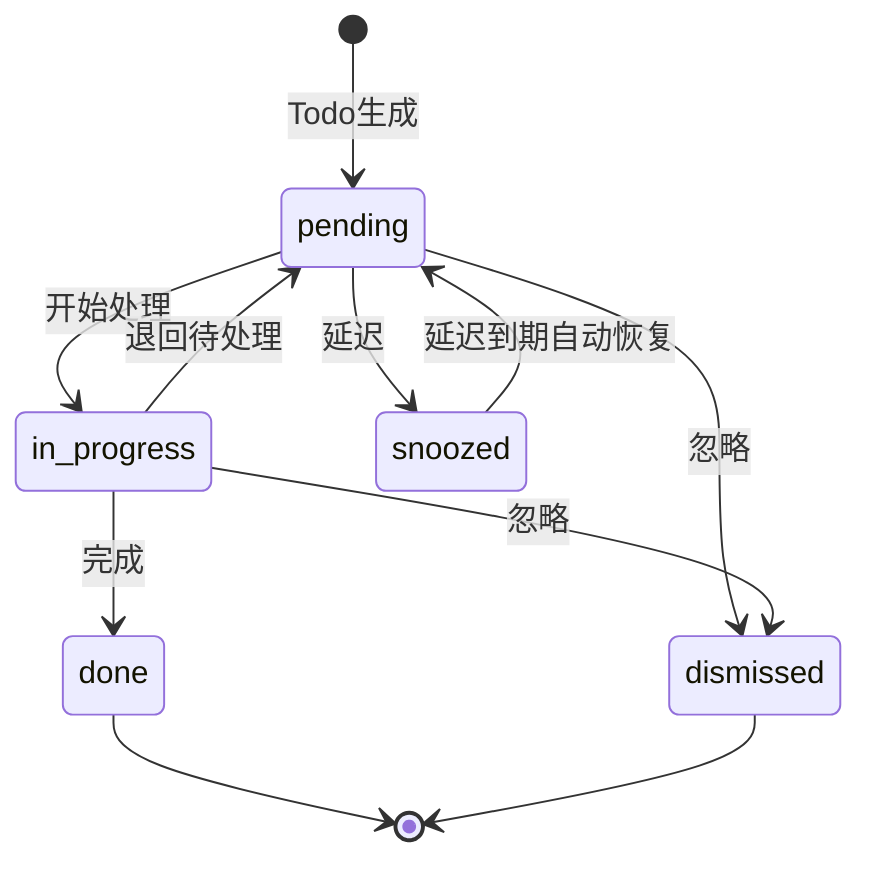

# PromiseLink 算法设计文档

> **版本**: 0.2.8 (POC阶段)
> **日期**: 2026-06-07
> **阶段**: POC (0.2.x series)
> **定位**: AI驱动的**个人商务关系经营助手**（非"资源匹配平台"）
> **参考**: 技术设计 v2.7 §4
> **状态**: ✅ 独立完整版，含详细算法与Python实现
> **v2.7变更**: 新增EmbeddingProvider算法(§2.15, F-57)、SemanticSearchEngine算法(§2.16, F-57)、关联发现语义增强算法(§2.17, F-58)
> **v2.8变更**: 新增ResourceOveruseDetector算法(§2.18, F-39)、VoiceQueryService算法(§2.19, F-50)、WeChatForwardAdapter算法(§2.20, PRD §5.17)

---

## 关键决策铁律（8条）

| # | 决策 | 说明 |
|---|------|------|
| 1 | 产品定位 | AI驱动的**个人商务关系经营助手** |
| 2 | Todo类型 | 6种：cooperation_signal/risk/care/promise/followup/help；action_type 6种(my_promise/their_promise/my_followup/mutual_action/system_reminder/unclear) |
| 3 | 莫兰迪色系 | 雾白#B8C4C0/烟粉#C4A7A0/雾蓝#A0B0C4/雾绿#A0C4A8/雾金#C4C0A0/雾紫#B0A0C4 |
| 4 | 匹配算法 | 六维：keyword(25%)+industry(20%)+topic(15%)+llm(10%)+history(10%)+callability(20%) |
| 5 | 敏感度 | 2级：matchable/no_match |
| 6 | 部署 | PoC本地Docker+SQLite → Phase1云端Docker Compose+PG+Redis |
| 7 | 明确排除 | RBAC/多租户/团队协作/他人资源匹配/原生APP |
| 8 | 字段名 | todo_type（非todo_nature）、callability（非availability） |

---

## 1. 实体归一5步算法

### 1.1 算法概述

实体归一是PromiseLink的核心基础算法，负责判断新抽取的实体是否与已有实体为同一对象。算法采用5步递进策略，从精确到模糊逐步匹配，每步产生置信度分数，根据阈值决定自动合并、人工确认或创建新实体。

**核心类**: `EntityResolutionEngine`

### 1.2 五步流程详解

#### Step 1: exact_match — 精确匹配

**触发条件**: 新实体name与已有实体name完全相同（忽略大小写和首尾空格）

**算法逻辑**:
- 对name做`.lower().strip()`后比较
- 若name完全匹配，再比较company字段
- company也匹配 → 置信度1.0
- company不匹配 → 置信度0.85（同名不同公司，可能是不同人）

**输出字段**: `{"name": 1.0, "company": 1.0 | 0.5}`

**示例**:
- "张三@阿里" vs "张三@阿里" → score=1.0, 自动合并
- "张三@阿里" vs "张三@腾讯" → score=0.85, 自动合并（同名但公司不同，仍需合并因为可能跳槽）

#### Step 2: alias_match — 别名匹配

**触发条件**: 新实体name出现在已有实体的aliases列表中

**算法逻辑**:
- 检查`new["name"]`是否在`existing.aliases`中
- 若命中别名，再比较company字段
- company匹配 → 置信度0.95
- company不匹配 → 置信度0.80

**输出字段**: `{"name": 0.95, "alias": True, "company": 1.0 | 0.5}`

**示例**:
- "老张" in ["老张", "张总"] → score=0.95（同公司）或0.80（不同公司）

#### Step 3: fuzzy_match — 模糊匹配

**触发条件**: name相似度≥0.70（使用rapidfuzz的token_sort_ratio）

**算法逻辑**:
- 计算name相似度：`fuzz.token_sort_ratio(new_name, existing_name) / 100`
- 若name相似度<0.70，直接返回0.0（提前剪枝）
- 计算company相似度和title相似度
- 综合得分 = name_sim × 0.5 + company_sim × 0.3 + title_sim × 0.2
- 上限截断为0.90（模糊匹配不超过0.90，防止误合并）

**输出字段**: `{"name": name_sim, "company": company_sim, "title": title_sim}`

**示例**:
- "张三丰" vs "张三" → name_sim≈0.67 < 0.70, 返回0.0
- "张三丰" vs "张 三 丰" → name_sim=1.0, score=min(0.5×1.0+0.3×0.8+0.2×0.5, 0.90)=0.84

#### Step 4: context_match — 上下文匹配

**触发条件**: name模糊匹配未达阈值，但上下文信息（公司/城市/行业）高度重合

**算法逻辑**:
- 公司名相同 → +0.30
- 城市相同 → +0.20
- 行业重叠 → +0.10
- 最高0.60（上下文匹配不超过0.60，仅作辅助证据）

**输出字段**: `{"company": 1.0, "city": 1.0, "industry": 0.8}`

**示例**:
- 同公司+同城市+同行业 → score=0.60, 需人工确认

#### Step 5: llm_reasoning — LLM推理

**触发条件**: 前4步均未达0.70确认阈值

**算法逻辑**:
- 将新实体和候选实体的关键信息组装为prompt
- 调用LLM判断是否为同一实体
- LLM返回0-1的置信度分数
- **PoC**: 使用规则兜底（返回0.0，直接创建新实体）
- **Phase1**: 接入LLM推理

**输出字段**: `{"llm_judgment": score}`

### 1.3 阈值体系

| 阈值 | 含义 | 动作 |
|------|------|------|
| ≥0.85 | 高置信度 | 自动合并（MERGE） |
| 0.70~0.84 | 中置信度 | 人工确认（CONFIRM） |
| <0.70 | 低置信度 | 创建新实体（CREATE） |

### 1.4 归一冲突解决策略

当多个候选实体同时满足阈值时：

1. **优先级**: exact_match > alias_match > fuzzy_match > context_match > llm_reasoning
2. **同步骤多候选**: 取置信度最高的候选
3. **合并策略**: 保留canonical_name，将新信息合并到properties，新name加入aliases
4. **字段冲突**: 新值覆盖旧值（但保留旧值在properties.merge_history中）

### 1.5 PoC vs Phase1差异

| 特性 | PoC | Phase1 |
|------|-----|--------|
| Step 5 LLM推理 | 跳过，直接CREATE | 接入LLM API |
| 候选查找 | 全表扫描（SQLite数据量小） | PG全文搜索+pg_trgm |
| 并发处理 | 同步执行 | 异步async |
| 别名管理 | 手动维护 | LLM自动发现别名 |

### 1.6 完整Python实现

```python
from rapidfuzz import fuzz
from enum import Enum
from dataclasses import dataclass, field
from typing import Optional


class ResolutionAction(str, Enum):
    MERGE = "merge"
    CONFIRM = "confirm"
    CREATE = "create"


@dataclass
class ResolutionResult:
    action: ResolutionAction
    target: Optional[object]  # Entity or None
    confidence: float
    matched_step: str
    matched_fields: dict
    explanation: str


class EntityResolutionEngine:
    """实体归一5步引擎"""

    AUTO_MERGE_THRESHOLD = 0.85
    CONFIRM_THRESHOLD = 0.70

    def __init__(self, db=None, llm_client=None, config: dict = None):
        self.db = db
        self.llm = llm_client
        self.config = config or {}

    async def resolve(self, new_entity: dict, user_id: str) -> ResolutionResult:
        """对新实体执行5步归一流程"""
        candidates = await self._find_candidates(new_entity, user_id)

        # 按优先级依次执行4步确定性匹配
        for step_name, step_fn in [
            ("exact_match", self._step_exact),
            ("alias_match", self._step_alias),
            ("fuzzy_match", self._step_fuzzy),
            ("context_match", self._step_context),
        ]:
            best_result = None
            for candidate in candidates:
                confidence, matched_fields = step_fn(new_entity, candidate)
                if confidence >= self.AUTO_MERGE_THRESHOLD:
                    return ResolutionResult(
                        action=ResolutionAction.MERGE,
                        target=candidate,
                        confidence=confidence,
                        matched_step=step_name,
                        matched_fields=matched_fields,
                        explanation=f"{step_name}: 置信度{confidence:.2f}，自动合并",
                    )
                if confidence >= self.CONFIRM_THRESHOLD:
                    if best_result is None or confidence > best_result.confidence:
                        best_result = ResolutionResult(
                            action=ResolutionAction.CONFIRM,
                            target=candidate,
                            confidence=confidence,
                            matched_step=step_name,
                            matched_fields=matched_fields,
                            explanation=f"{step_name}: 置信度{confidence:.2f}，需人工确认",
                        )
            if best_result:
                return best_result

        # Step 5: LLM推理（仅Phase1启用）
        if self.llm:
            for candidate in candidates:
                confidence, matched_fields = await self._step_llm(new_entity, candidate)
                if confidence >= self.AUTO_MERGE_THRESHOLD:
                    return ResolutionResult(
                        action=ResolutionAction.MERGE,
                        target=candidate,
                        confidence=confidence,
                        matched_step="llm_reasoning",
                        matched_fields=matched_fields,
                        explanation=f"llm_reasoning: 置信度{confidence:.2f}，自动合并",
                    )
                if confidence >= self.CONFIRM_THRESHOLD:
                    return ResolutionResult(
                        action=ResolutionAction.CONFIRM,
                        target=candidate,
                        confidence=confidence,
                        matched_step="llm_reasoning",
                        matched_fields=matched_fields,
                        explanation=f"llm_reasoning: 置信度{confidence:.2f}，需人工确认",
                    )

        return ResolutionResult(
            action=ResolutionAction.CREATE,
            target=None,
            confidence=0.0,
            matched_step="new_entity",
            matched_fields={},
            explanation="无匹配候选，创建新实体",
        )

    async def _find_candidates(self, new_entity: dict, user_id: str) -> list:
        """查找候选实体（PoC全表扫描，Phase1用PG索引）"""
        return await self.db.find_entities_by_user(user_id)

    def _step_exact(self, new: dict, existing) -> tuple:
        """Step 1: 精确匹配"""
        if new["name"].lower().strip() == existing.name.lower().strip():
            company_match = (
                new.get("company", "").lower().strip()
                == (existing.properties.get("basic", {}).get("company") or "").lower().strip()
            )
            score = 1.0 if company_match else 0.85
            fields = {"name": 1.0, "company": 1.0 if company_match else 0.5}
            return score, fields
        return 0.0, {}

    def _step_alias(self, new: dict, existing) -> tuple:
        """Step 2: 别名匹配"""
        aliases = existing.aliases or []
        if new["name"].strip() in aliases:
            company_match = (
                new.get("company", "").lower().strip()
                == (existing.properties.get("basic", {}).get("company") or "").lower().strip()
            )
            score = 0.95 if company_match else 0.80
            fields = {"name": 0.95, "alias": True, "company": 1.0 if company_match else 0.5}
            return score, fields
        return 0.0, {}

    def _step_fuzzy(self, new: dict, existing) -> tuple:
        """Step 3: 模糊匹配"""
        name_sim = fuzz.token_sort_ratio(new["name"], existing.name) / 100
        if name_sim < 0.70:
            return 0.0, {}
        company_sim = fuzz.token_sort_ratio(
            new.get("company", ""),
            existing.properties.get("basic", {}).get("company") or "",
        ) / 100
        title_sim = fuzz.token_sort_ratio(
            new.get("title", ""),
            existing.properties.get("basic", {}).get("title") or "",
        ) / 100
        score = name_sim * 0.5 + company_sim * 0.3 + title_sim * 0.2
        fields = {"name": name_sim, "company": company_sim, "title": title_sim}
        return min(score, 0.90), fields

    def _step_context(self, new: dict, existing) -> tuple:
        """Step 4: 上下文匹配"""
        context_score = 0.0
        fields = {}
        existing_basic = existing.properties.get("basic", {}) if existing.properties else {}
        if self._same_company_name(new.get("company"), existing_basic.get("company")):
            context_score += 0.3
            fields["company"] = 1.0
        if self._same_city_name(new.get("city"), existing_basic.get("city")):
            context_score += 0.2
            fields["city"] = 1.0
        if self._overlapping_industries(new, existing):
            context_score += 0.1
            fields["industry"] = 0.8
        return context_score, fields

    async def _step_llm(self, new: dict, existing) -> tuple:
        """Step 5: LLM推理（Phase1启用）"""
        prompt = (
            f"判断以下两个实体是否为同一人/组织，返回0-1的置信度：\n"
            f"实体A: name={new['name']}, company={new.get('company')}, "
            f"title={new.get('title')}, city={new.get('city')}\n"
            f"实体B: name={existing.name}, company={existing.properties.get('basic', {}).get('company')}, "
            f"title={existing.properties.get('basic', {}).get('title')}\n"
            f"只返回数字："
        )
        try:
            response = await self.llm.generate(prompt, max_tokens=10)
            score = max(0.0, min(1.0, float(response.strip())))
            return score, {"llm_judgment": score}
        except (ValueError, Exception):
            return 0.0, {}

    def _same_company_name(self, a: str, b: str) -> bool:
        if not a or not b:
            return False
        return a.lower().strip() == b.lower().strip()

    def _same_city_name(self, a: str, b: str) -> bool:
        if not a or not b:
            return False
        return a.lower().strip() == b.lower().strip()

    def _overlapping_industries(self, new: dict, existing) -> bool:
        new_ind = new.get("industry", "")
        exist_ind = (existing.properties or {}).get("basic", {}).get("industry", "")
        if not new_ind or not exist_ind:
            return False
        return new_ind == exist_ind
```

---

## 2. 商机匹配六维打分

### 2.1 算法概述

商机匹配是个人商务关系经营助手的核心能力——判断"你的需求"与"你人脉的供给"之间的匹配度。六维加权打分，其中**callability（可调用度）权重20%**，是私密助手定位下的关键维度，因为匹配结果取决于你与资源持有人的关系是否支持调用。

**核心类**: `OpportunityMatcher`

**六维权重**:

| 维度 | 权重 | 说明 |
|------|------|------|
| keyword_overlap | 25% | 关键词重叠度（TF-IDF + Jaccard） |
| industry_alignment | 20% | 行业分类匹配 |
| topic_similarity | 15% | 话题相似度 |
| llm_semantic | 10% | LLM语义判断 |
| history_collaboration | 10% | 历史交互频率衰减 |
| callability | 20% | 可调用度（资源标签与需求关键词匹配） |

### 2.2 维度1: keyword_overlap（关键词重叠度）

**权重**: 25%

**算法**: TF-IDF + Jaccard相似度

**PoC实现**:
- 提取todo的keywords集合和person的keywords集合
- 计算Jaccard相似度 = |A∩B| / |A∪B|
- 任一集合为空则返回0.0

**Phase1升级**:
- 使用TF-IDF对关键词加权（高频词降权，领域词升权）
- Jaccard改为加权Jaccard: Σmin(w_a, w_b) / Σmax(w_a, w_b)

```python
def _keyword_overlap(self, todo, person) -> float:
    """关键词重叠度 - PoC: Jaccard相似度"""
    todo_kw = set(getattr(todo, "keywords", []) or [])
    person_kw = set((person.properties or {}).get("keywords", []) or [])
    if not todo_kw or not person_kw:
        return 0.0
    intersection = todo_kw & person_kw
    union = todo_kw | person_kw
    return len(intersection) / len(union)
```

### 2.3 维度2: industry_alignment（行业分类匹配）

**权重**: 20%

**算法**: 行业分类层级匹配

**逻辑**:
- todo的domain_l1与person的industry完全相同 → 1.0
- person的industry在todo domain的关联行业列表中 → 0.5
- 否则 → 0.0

**关联行业配置示例**:
```yaml
related_industries:
  互联网:
    - 电子商务
    - SaaS
    - 在线教育
  金融:
    - 金融科技
    - 保险
    - 投资管理
```

```python
def _industry_alignment(self, todo, person) -> float:
    """行业分类匹配"""
    todo_domain = getattr(todo, "domain_l1", None)
    person_industry = (person.properties or {}).get("basic", {}).get("industry")
    if not todo_domain or not person_industry:
        return 0.0
    if todo_domain == person_industry:
        return 1.0
    related = self.config.get("related_industries", {}).get(todo_domain, [])
    return 0.5 if person_industry in related else 0.0
```

### 2.4 维度3: topic_similarity（话题相似度）

**权重**: 15%

**算法**:
- **PoC**: 基于规则的标签匹配（Jaccard on topic tags）
- **Phase1**: embedding向量余弦相似度（pgvector）

**PoC实现**:
```python
async def _topic_similarity(self, todo, person) -> float:
    """话题相似度 - PoC: 标签Jaccard"""
    todo_topics = set(getattr(todo, "topic_tags", []) or [])
    person_topics = set((person.properties or {}).get("topic_tags", []) or [])
    if not todo_topics or not person_topics:
        return 0.0
    intersection = todo_topics & person_topics
    union = todo_topics | person_topics
    return len(intersection) / len(union)
```

**Phase1实现**:
```python
async def _topic_similarity(self, todo, person) -> float:
    """话题相似度 - Phase1: embedding余弦相似度"""
    todo_vec = getattr(todo, "topic_vector", None)
    person_vec = (person.properties or {}).get("topic_vector")
    if todo_vec is None or person_vec is None:
        return 0.0
    return self._cosine_similarity(todo_vec, person_vec)
```

### 2.5 维度4: llm_semantic（LLM语义判断）

**权重**: 10%

**算法**: LLM判断商机与人物的语义相关性

**逻辑**:
- 将todo和person的关键信息脱敏后组装prompt
- LLM返回0-1的匹配度分数
- 解析失败时返回0.5（中性值，不偏不倚）

**安全**: `_sanitize_for_llm`方法确保不泄露敏感信息（电话、地址等）

```python
async def _llm_semantic_judge(self, todo, person) -> float:
    """LLM语义判断"""
    sanitized = self._sanitize_for_llm(todo, person)
    response = await self.llm.generate(
        f"判断商机与人物的匹配度(0-1)：{json.dumps(sanitized, ensure_ascii=False)}",
        max_tokens=10,
    )
    try:
        return max(0.0, min(1.0, float(response.strip())))
    except ValueError:
        return 0.5

def _sanitize_for_llm(self, todo, person) -> dict:
    """脱敏处理，只传递非敏感信息给LLM"""
    return {
        "todo": {"description": getattr(todo, "description", ""), "keywords": getattr(todo, "keywords", [])},
        "person": {
            "company": (person.properties or {}).get("basic", {}).get("company"),
            "title": (person.properties or {}).get("basic", {}).get("title"),
            "industry": (person.properties or {}).get("basic", {}).get("industry"),
        },
    }
```

### 2.6 维度5: history_collaboration（历史交互频率衰减）

**权重**: 10%

**算法**: 历史交互次数分段 + 时间衰减

**逻辑**:
- 0次交互 → 0.0
- 1次交互 → 0.3
- 2-3次交互 → 0.6
- 4次以上 → 1.0
- **Phase1增加时间衰减**: score × exp(-λ × days_since_last)

```python
def _history_collaboration(self, todo, person) -> float:
    """历史交互频率 - PoC: 分段映射"""
    count = self._get_collaboration_count(todo, person)
    if count == 0:
        return 0.0
    if count == 1:
        return 0.3
    if count <= 3:
        return 0.6
    return 1.0

def _get_collaboration_count(self, todo, person) -> int:
    """查询历史交互次数"""
    # 从associations表查询source_entity_id=person且association_type含合作类型的记录
    return 0  # placeholder
```

**Phase1时间衰减**:
```python
import math

def _history_collaboration_phase1(self, todo, person) -> float:
    """历史交互频率 - Phase1: 分段 + 时间衰减"""
    count = self._get_collaboration_count(todo, person)
    last_date = self._get_last_interaction_date(todo, person)
    if count == 0:
        return 0.0
    base = 0.3 if count == 1 else (0.6 if count <= 3 else 1.0)
    if last_date:
        days = (datetime.utcnow() - last_date).days
        decay = math.exp(-0.01 * days)
        return base * max(decay, 0.2)  # 衰减下限0.2
    return base
```

### 2.7 维度6: callability（可调用度）

**权重**: 20% — **私密助手关键维度**

**算法**: 资源标签与需求关键词的匹配度

**核心思想**: 在私密助手定位下，匹配不仅看"能力匹配"，更看"能否调用"。callability衡量的是：该person拥有的资源标签（tags）与当前需求关键词（keywords）的重合程度。

**逻辑**:
1. 获取person的资源列表 `person.properties.resource`
2. 获取todo的需求关键词 `todo.keywords`
3. 对每个资源，检查其tags与需求关键词的交集
4. callability = 有匹配的资源数 / 总资源数
5. 无资源 → 0.0，无需求关键词 → 0.3（默认中性）

```python
def _callability(self, todo, person) -> float:
    """可调用度 - 资源标签与需求关键词匹配度"""
    resources = (person.properties or {}).get("resource", [])
    if not resources:
        return 0.0
    demand_keywords = set(getattr(todo, "keywords", []) or [])
    if not demand_keywords:
        return 0.3  # 无明确需求时给中性分
    matched = sum(
        1 for r in resources
        if set(r.get("tags", [])) & demand_keywords
    )
    return min(1.0, matched / max(len(resources), 1))
```

**Phase1增强**:
- 引入关系强度权重：callability × relationship_strength
- 关系强度从association.strength获取
- 强关系（>0.7）不降权，弱关系（<0.3）降权50%

### 2.8 完整OpportunityMatcher类

```python
import json
import math
from datetime import datetime


class OpportunityMatcher:
    """商机匹配六维打分引擎"""

    WEIGHTS = {
        "keyword_overlap": 0.25,
        "industry_alignment": 0.20,
        "topic_similarity": 0.15,
        "llm_semantic": 0.10,
        "history_collaboration": 0.10,
        "callability": 0.20,
    }

    SENSITIVITY_LEVELS = {
        "matchable": True,
        "no_match": False,
    }

    def __init__(self, db=None, llm_client=None, config: dict = None):
        self.db = db
        self.llm = llm_client
        self.config = config or {}

    async def calculate_match_score(self, todo, person) -> dict:
        """计算商机匹配六维总分"""
        # 敏感度前置过滤
        if not self._check_sensitivity(person):
            return {
                "total_score": 0.0,
                "dimensions": {},
                "match_reason": "资源标记为不可匹配",
                "filtered": True,
            }

        d1 = self._keyword_overlap(todo, person)
        d2 = self._industry_alignment(todo, person)
        d3 = await self._topic_similarity(todo, person)
        d4 = await self._llm_semantic_judge(todo, person) if self.llm else 0.0
        d5 = self._history_collaboration(todo, person)
        d6 = self._callability(todo, person)

        total = (
            d1 * self.WEIGHTS["keyword_overlap"]
            + d2 * self.WEIGHTS["industry_alignment"]
            + d3 * self.WEIGHTS["topic_similarity"]
            + d4 * self.WEIGHTS["llm_semantic"]
            + d5 * self.WEIGHTS["history_collaboration"]
            + d6 * self.WEIGHTS["callability"]
        )

        return {
            "total_score": round(total, 4),
            "dimensions": {
                "keyword_overlap": round(d1, 4),
                "industry_alignment": round(d2, 4),
                "topic_similarity": round(d3, 4),
                "llm_semantic": round(d4, 4),
                "history_collaboration": round(d5, 4),
                "callability": round(d6, 4),
            },
            "match_reason": self._generate_reason(d1, d2, d3, d4, d5, d6),
        }

    def _check_sensitivity(self, person) -> bool:
        """敏感度检查"""
        sensitivity = (person.properties or {}).get("resource", {}).get("sensitivity", "matchable")
        return self.SENSITIVITY_LEVELS.get(sensitivity, True)

    def _keyword_overlap(self, todo, person) -> float:
        """关键词重叠度"""
        todo_kw = set(getattr(todo, "keywords", []) or [])
        person_kw = set((person.properties or {}).get("keywords", []) or [])
        if not todo_kw or not person_kw:
            return 0.0
        intersection = todo_kw & person_kw
        union = todo_kw | person_kw
        return len(intersection) / len(union)

    def _industry_alignment(self, todo, person) -> float:
        """行业分类匹配"""
        todo_domain = getattr(todo, "domain_l1", None)
        person_industry = (person.properties or {}).get("basic", {}).get("industry")
        if not todo_domain or not person_industry:
            return 0.0
        if todo_domain == person_industry:
            return 1.0
        related = self.config.get("related_industries", {}).get(todo_domain, [])
        return 0.5 if person_industry in related else 0.0

    async def _topic_similarity(self, todo, person) -> float:
        """话题相似度"""
        todo_topics = set(getattr(todo, "topic_tags", []) or [])
        person_topics = set((person.properties or {}).get("topic_tags", []) or [])
        if not todo_topics or not person_topics:
            return 0.0
        intersection = todo_topics & person_topics
        union = todo_topics | person_topics
        return len(intersection) / len(union)

    async def _llm_semantic_judge(self, todo, person) -> float:
        """LLM语义判断"""
        sanitized = self._sanitize_for_llm(todo, person)
        response = await self.llm.generate(
            f"判断商机与人物的匹配度(0-1)：{json.dumps(sanitized, ensure_ascii=False)}",
            max_tokens=10,
        )
        try:
            return max(0.0, min(1.0, float(response.strip())))
        except ValueError:
            return 0.5

    def _history_collaboration(self, todo, person) -> float:
        """历史交互频率"""
        count = self._get_collaboration_count(todo, person)
        if count == 0:
            return 0.0
        if count == 1:
            return 0.3
        if count <= 3:
            return 0.6
        return 1.0

    def _callability(self, todo, person) -> float:
        """可调用度 - 资源标签与需求关键词匹配度"""
        resources = (person.properties or {}).get("resource", [])
        if not resources:
            return 0.0
        demand_keywords = set(getattr(todo, "keywords", []) or [])
        if not demand_keywords:
            return 0.3
        matched = sum(
            1 for r in resources
            if set(r.get("tags", [])) & demand_keywords
        )
        return min(1.0, matched / max(len(resources), 1))

    def _sanitize_for_llm(self, todo, person) -> dict:
        """脱敏处理"""
        return {
            "todo": {"description": getattr(todo, "description", ""), "keywords": getattr(todo, "keywords", [])},
            "person": {
                "company": (person.properties or {}).get("basic", {}).get("company"),
                "title": (person.properties or {}).get("basic", {}).get("title"),
                "industry": (person.properties or {}).get("basic", {}).get("industry"),
            },
        }

    def _generate_reason(self, d1, d2, d3, d4, d5, d6) -> str:
        """生成匹配原因摘要"""
        reasons = []
        if d2 >= 0.5:
            reasons.append("同行业")
        if d1 >= 0.3:
            reasons.append("关键词相关")
        if d5 >= 0.3:
            reasons.append("有过合作")
        if d3 >= 0.5:
            reasons.append("话题相关")
        if d6 >= 0.5:
            reasons.append("可调用资源匹配")
        return "·".join(reasons) if reasons else "潜在关联"

    def _get_collaboration_count(self, todo, person) -> int:
        """查询历史交互次数"""
        return 0  # placeholder, 实际从DB查询

    @staticmethod
    def _cosine_similarity(a, b) -> float:
        """余弦相似度"""
        dot = sum(x * y for x, y in zip(a, b))
        norm_a = sum(x * x for x in a) ** 0.5
        norm_b = sum(x * x for x in b) ** 0.5
        if norm_a == 0 or norm_b == 0:
            return 0.0
        return dot / (norm_a * norm_b)
```

### 2.9 权重调优策略

> ⚠️ **F-05 商机匹配暂停（PoC阶段）**：
> L1/L2/L3匹配引擎在PoC阶段默认关闭，通过`feature_flag`控制启用。
> PoC阶段匹配结果仅用于promise类型Todo的关联推荐，不作为独立功能暴露。
> Phase1启用care维度后逐步开放完整六维匹配。

| 阶段 | 策略 | 说明 |
|------|------|------|
| PoC | 固定权重 | 使用上述默认权重，收集匹配结果反馈 |
| Phase1 | A/B测试 | 对同一匹配场景使用不同权重组合，对比用户反馈（useful/not_useful） |
| Phase2 | 自适应权重 | 基于用户反馈历史，用贝叶斯优化调整个人化权重 |

**调优指标**:
- 精准率: 用户标记"useful"的匹配 / 总匹配数
- 召回率: 用户实际采纳的商机 / 系统推荐的商机
- 覆盖率: 至少产生1个匹配的person比例

### 2.10 PriorityScorer 算法（v2.5 新增）

> **定位**: Insight Engine 的核心组件，将 Todo 从"被动记录"升级为"主动服务"，基于动态优先级评分驱动用户注意力。

#### 2.10.1 PoC 二维模型

**公式**: `Score = 0.4 × urgency + 0.6 × importance`

| 维度 | 权重 | 含义 | 取值范围 |
|------|------|------|---------|
| urgency | 0.4 | 紧急程度，基于截止时间衰减 | 0.0 ~ 1.0 |
| importance | 0.6 | 重要程度，基于 Brief.score 归一化 | 0.0 ~ 1.0 |

**最终分数范围**: 0 ~ 100（线性映射：`dynamic_score = Score × 100`）

#### 2.10.2 Urgency 计算

**有截止日期的 Todo**: 基于 due_date 的指数衰减

```
urgency = exp(-λ × days_until_due)

其中:
  λ = 0.1 (衰减系数，约7天半衰期)
  days_until_due = (due_date - now).days

特殊值:
  days_until_due < 0  → urgency = 1.0 (已过期，最高紧急度)
  days_until_due = 0  → urgency = 1.0 (今天到期)
```

**无截止日期的 Todo**: 慢速衰减（避免永久占据高优先级）

```
urgency = 0.3 × exp(-0.02 × days_since_creation)

其中:
  days_since_creation = (now - created_at).days
  上限: urgency ≤ 0.3 (无截止日项永远不超过0.3)
```

#### 2.10.3 Importance 计算

**基于 Brief.score 归一化**:

```
importance = brief_score / 100

其中:
  brief_score: 关系推进卡的评分（0-100），综合考量:
    - 关系阶段深度（越深越重要）
    - 互动频率（越高越重要）
    - 待兑现承诺数（越多越重要）
  无关联 Brief 时: importance = 0.5 (中性默认值)
```

#### 2.10.4 Phase 1 四维模型

**公式**: `Score = 0.3 × urgency + 0.35 × importance + 0.2 × dependency + 0.15 × context_match`

| 维度 | 权重 | 含义 | 说明 |
|------|------|------|------|
| urgency | 0.30 | 紧急程度 | 同PoC衰减模型 |
| importance | 0.35 | 重要程度 | 同PoC Brief归一化 |
| dependency | 0.20 | 依赖阻塞度 | 被多少Todo依赖，阻塞越多越优先 |
| context_match | 0.15 | 上下文匹配度 | 与当前时间/地点/最近交互的匹配度 |

#### 2.10.5 伪代码

```python
import math
from datetime import datetime, timezone
from typing import Optional


class PriorityScorer:
    """动态优先级评分引擎"""

    # PoC 二维权重
    POC_WEIGHTS = {"urgency": 0.4, "importance": 0.6}

    # Phase1 四维权重
    PHASE1_WEIGHTS = {
        "urgency": 0.30,
        "importance": 0.35,
        "dependency": 0.20,
        "context_match": 0.15,
    }

    # 衰减系数
    URGENCY_LAMBDA = 0.1       # 有截止日的衰减系数
    NO_DUE_LAMBDA = 0.02       # 无截止日的慢衰减系数
    NO_DUE_URGENCY_CAP = 0.3   # 无截止日紧急度上限

    def calculate_score(self, todo, brief=None, phase: str = "poc") -> dict:
        """计算动态优先级分数"""
        urgency = self._calc_urgency(todo)
        importance = self._calc_importance(todo, brief)

        if phase == "poc":
            weights = self.POC_WEIGHTS
            raw = urgency * weights["urgency"] + importance * weights["importance"]
        else:
            dependency = self._calc_dependency(todo)
            context_match = self._calc_context_match(todo)
            weights = self.PHASE1_WEIGHTS
            raw = (
                urgency * weights["urgency"]
                + importance * weights["importance"]
                + dependency * weights["dependency"]
                + context_match * weights["context_match"]
            )

        dynamic_score = round(raw * 100, 2)

        return {
            "dynamic_score": dynamic_score,
            "urgency": round(urgency, 4),
            "importance": round(importance, 4),
            "score_calculated_at": datetime.now(timezone.utc).isoformat(),
        }

    def _calc_urgency(self, todo) -> float:
        """紧急度计算"""
        now = datetime.now(timezone.utc)
        due_date = getattr(todo, "due_date", None)

        if due_date is not None:
            days_until_due = (due_date - now).days
            if days_until_due <= 0:
                return 1.0
            return math.exp(-self.URGENCY_LAMBDA * days_until_due)
        else:
            created_at = getattr(todo, "created_at", now)
            days_since_creation = max(0, (now - created_at).days)
            return min(
                self.NO_DUE_URGENCY_CAP,
                self.NO_DUE_URGENCY_CAP * math.exp(-self.NO_DUE_LAMBDA * days_since_creation),
            )

    def _calc_importance(self, todo, brief=None) -> float:
        """重要度计算"""
        if brief is not None:
            brief_score = getattr(brief, "score", 50)
            return min(1.0, max(0.0, brief_score / 100))
        return 0.5  # 无Brief时中性默认值

    def _calc_dependency(self, todo) -> float:
        """依赖阻塞度（Phase1）"""
        # 查询有多少Todo依赖此Todo完成
        # blocked_count / MAX_EXPECTED_BLOCKS 归一化
        return 0.0  # PoC占位

    def _calc_context_match(self, todo) -> float:
        """上下文匹配度（Phase1）"""
        # 基于当前时间/地点/最近交互的匹配度
        return 0.0  # PoC占位
```

---

### 2.11 ImplicitFeedbackCollector 算法（v2.5 新增）

> **核心原则**: 完成顺序 = 真实优先级信号。用户先完成哪个 Todo，说明那个 Todo 在用户心中真正更重要。

#### 2.11.1 on_todo_completed 处理

当用户完成一个 Todo 时：

1. **记录 completed_rank**: 为当前用户的已完成 Todo 分配递增序号
   ```
   completed_rank = MAX(completed_rank WHERE user_id = current_user) + 1
   ```

2. **调整人物权重**: 根据 completed_rank 调整关联人物的优先级权重

   | completed_rank | 权重调整 | 说明 |
   |----------------|---------|------|
   | rank ≤ 3 | +0.05 | 前3名完成，说明此人相关事项真正紧急重要 |
   | rank ≤ 10 | +0.02 | 前10名完成，有一定优先级信号 |
   | rank > 10 | 0 | 排名靠后，不调整权重 |

3. **写入 score_audit_logs**: 记录分数变更的触发原因和计算因子

#### 2.11.2 daily_rebalance 每日再平衡

每日凌晨定时任务，基于全天完成模式重新计算权重：

```
1. 收集当日所有 completed_todo 及其 completed_rank
2. 按 related_entity_id 分组，计算每个实体的"优先完成度":
   entity_priority_score = Σ(1 / completed_rank) for all todos of this entity
3. 归一化到 [0, 1] 范围
4. 与现有权重做指数移动平均(EMA)融合:
   new_weight = α × entity_priority_score + (1 - α) × old_weight
   α = 0.3 (EMA平滑系数)
5. 更新 person 的 priority_weight 字段
6. 触发 PriorityScorer 重新计算相关 Todo 的 dynamic_score
```

#### 2.11.3 Phase 1 扩展: 负面反馈

**长按"以后少提醒"按钮**: 显式负面反馈信号

| 操作 | 效果 | 权重调整 |
|------|------|---------|
| 长按"以后少提醒" | 该类型/该人物的 Todo 优先级降低 | -0.10 |
| 连续3次"以后少提醒" | 该人物进入"冷关注"列表 | -0.30 |
| 用户手动恢复 | 取消"冷关注"标记 | 恢复至调整前 |

#### 2.11.4 伪代码

```python
from datetime import datetime, timezone
from typing import Optional


class ImplicitFeedbackCollector:
    """隐式反馈收集器——通过完成顺序学习真实优先级"""

    # 权重调整规则
    RANK_WEIGHT_MAP = [
        (3, 0.05),    # rank ≤ 3 → +0.05
        (10, 0.02),   # rank ≤ 10 → +0.02
        (float("inf"), 0.0),  # rank > 10 → 0
    ]

    # EMA 平滑系数
    EMA_ALPHA = 0.3

    # 负面反馈权重
    NEGATIVE_FEEDBACK_WEIGHT = -0.10
    COLD_ATTENTION_THRESHOLD = 3
    COLD_ATTENTION_WEIGHT = -0.30

    def __init__(self, db=None, scorer=None):
        self.db = db
        self.scorer = scorer

    async def on_todo_completed(self, todo, user_id: str) -> dict:
        """Todo完成时的隐式反馈处理"""
        # 1. 分配 completed_rank
        max_rank = await self._get_max_rank(user_id)
        completed_rank = max_rank + 1

        # 2. 更新 Todo 的 completed_rank
        todo.completed_rank = completed_rank

        # 3. 调整关联人物权重
        weight_adjustment = self._get_weight_adjustment(completed_rank)
        related_entity_id = getattr(todo, "related_entity_id", None)

        if related_entity_id and weight_adjustment > 0:
            await self._adjust_person_weight(related_entity_id, weight_adjustment)

        # 4. 写入审计日志
        await self._write_audit_log(
            todo_id=todo.id,
            user_id=user_id,
            old_score=getattr(todo, "dynamic_score", None),
            new_score=None,  # 将由 daily_rebalance 重新计算
            factors={
                "completed_rank": completed_rank,
                "weight_adjustment": weight_adjustment,
                "entity_id": related_entity_id,
            },
            triggered_by="implicit_feedback",
        )

        return {
            "completed_rank": completed_rank,
            "weight_adjustment": weight_adjustment,
            "entity_id": related_entity_id,
        }

    async def daily_rebalance(self, user_id: str) -> dict:
        """每日再平衡——基于全天完成模式重新计算权重"""
        # 1. 收集当日完成记录
        completed_today = await self._get_completed_today(user_id)

        if not completed_today:
            return {"rebalanced": False, "reason": "no_completions"}

        # 2. 按实体分组计算优先完成度
        entity_scores = {}
        for todo in completed_today:
            entity_id = getattr(todo, "related_entity_id", None)
            if entity_id and todo.completed_rank:
                if entity_id not in entity_scores:
                    entity_scores[entity_id] = 0.0
                entity_scores[entity_id] += 1.0 / todo.completed_rank

        # 3. 归一化
        max_score = max(entity_scores.values()) if entity_scores else 1.0
        for eid in entity_scores:
            entity_scores[eid] = entity_scores[eid] / max_score

        # 4. EMA 融合并更新
        updated_entities = []
        for entity_id, new_score in entity_scores.items():
            old_weight = await self._get_person_weight(entity_id)
            blended = self.EMA_ALPHA * new_score + (1 - self.EMA_ALPHA) * old_weight
            await self._set_person_weight(entity_id, blended)
            updated_entities.append({
                "entity_id": entity_id,
                "old_weight": round(old_weight, 4),
                "new_weight": round(blended, 4),
            })

        # 5. 触发 PriorityScorer 重算
        if self.scorer:
            await self.scorer.recalculate_for_user(user_id)

        return {
            "rebalanced": True,
            "entities_updated": len(updated_entities),
            "details": updated_entities,
        }

    async def on_negative_feedback(self, todo, user_id: str) -> dict:
        """Phase1: 负面反馈处理（长按"以后少提醒"）"""
        related_entity_id = getattr(todo, "related_entity_id", None)
        if not related_entity_id:
            return {"adjusted": False}

        # 检查连续负面反馈次数
        negative_count = await self._get_negative_feedback_count(related_entity_id, user_id)

        if negative_count + 1 >= self.COLD_ATTENTION_THRESHOLD:
            weight = self.COLD_ATTENTION_WEIGHT
            await self._mark_cold_attention(related_entity_id, user_id)
        else:
            weight = self.NEGATIVE_FEEDBACK_WEIGHT

        await self._adjust_person_weight(related_entity_id, weight)

        return {
            "adjusted": True,
            "entity_id": related_entity_id,
            "weight_change": weight,
            "negative_count": negative_count + 1,
        }

    def _get_weight_adjustment(self, completed_rank: int) -> float:
        """根据完成序号获取权重调整值"""
        for threshold, weight in self.RANK_WEIGHT_MAP:
            if completed_rank <= threshold:
                return weight
        return 0.0

    # --- 以下为数据库操作占位 ---

    async def _get_max_rank(self, user_id: str) -> int:
        return await self.db.execute_scalar(
            "SELECT COALESCE(MAX(completed_rank), 0) FROM todos WHERE user_id = :uid",
            {"uid": user_id},
        )

    async def _adjust_person_weight(self, entity_id: str, delta: float):
        pass  # 更新 person 的 priority_weight

    async def _get_person_weight(self, entity_id: str) -> float:
        return 0.5  # 默认中性权重

    async def _set_person_weight(self, entity_id: str, weight: float):
        pass  # 写入更新

    async def _write_audit_log(self, **kwargs):
        pass  # 写入 score_audit_logs

    async def _get_completed_today(self, user_id: str) -> list:
        return []  # 查询当日完成的Todo

    async def _get_negative_feedback_count(self, entity_id: str, user_id: str) -> int:
        return 0  # 查询连续负面反馈次数

    async def _mark_cold_attention(self, entity_id: str, user_id: str):
        pass  # 标记冷关注
```

---

### 2.12 Concern/Capability 解析规则（v2.5 新增）

> **定位**: 为 Person 实体的 concerns 和 capabilities 字段提供结构化解析规范，支撑 topic_overlap 关联发现的召回与精度。

#### 2.12.1 JSON 格式定义

```json
{
  "concerns": [
    {
      "tag": "人才招聘",
      "detail": "正在寻找有5年经验的AI算法工程师，prefer CV方向",
      "source_event_id": "uuid-of-event"
    }
  ],
  "capabilities": [
    {
      "tag": "技术选型",
      "detail": "在微服务架构选型上有丰富经验，主导过3次技术栈迁移",
      "source_event_id": "uuid-of-event"
    }
  ]
}
```

**字段说明**:

| 字段 | 类型 | 必填 | 说明 |
|------|------|------|------|
| tag | string | 是 | 受控词汇表中的分类标签 |
| detail | string | 是 | 自由文本，描述具体细节 |
| source_event_id | string(UUID) | 是 | 来源事件ID，用于追溯 |

#### 2.12.2 Tag 受控词汇表

**concerns 标签**:

| 标签 | 含义 | 典型场景 |
|------|------|---------|
| 会议效率 | 会议组织与效率问题 | "会议太多没时间干活" |
| 资金需求 | 融资/资金周转需求 | "正在找天使轮" |
| 人才招聘 | 招人/团队扩充需求 | "缺前端开发" |
| 技术选型 | 技术架构/选型决策 | "考虑从单体迁移到微服务" |
| 市场拓展 | 市场/客户拓展需求 | "想进入东南亚市场" |
| 产品方向 | 产品策略/方向决策 | "不确定是否做B端" |
| 合作伙伴 | 寻找合作方/供应商 | "需要靠谱的云服务商" |
| 合规风控 | 法律/合规/风控问题 | "数据合规要求越来越严" |
| 组织管理 | 团队管理/组织架构 | "技术团队扩张太快管理跟不上" |
| 个人成长 | 学习/培训/职业发展 | "想学产品思维" |

**capabilities 标签**:

| 标签 | 含义 | 典型场景 |
|------|------|---------|
| 技术选型 | 技术架构决策能力 | "主导过3次技术栈迁移" |
| 融资经验 | 融资/投资对接经验 | "帮3个项目拿到A轮" |
| 行业资源 | 行业人脉/资源 | "电商圈人脉广" |
| 团队搭建 | 团队组建/管理经验 | "从0搭建过50人技术团队" |
| 市场策略 | 市场分析/策略制定 | "操盘过3个产品从0到1" |
| 政策解读 | 政策/法规解读能力 | "对数据安全法规很熟" |
| 供应链 | 供应链管理经验 | "有成熟的供应商网络" |
| 国际化 | 海外市场经验 | "做过东南亚本地化" |

#### 2.12.3 解析流程

```
raw_text 输入
    │
    ▼
LLM 提取
    │  Prompt: "从以下文本中提取人物的关注点(concerns)和能力(capabilities)，
    │           每条需映射到受控词汇表的tag，并补充detail描述"
    │
    ▼
Tag 映射
    │  1. LLM 输出的 tag 先与受控词汇表做精确匹配
    │  2. 精确匹配失败 → 做语义相似度匹配（阈值 ≥ 0.8）
    │  3. 语义匹配也失败 → 保留原始 tag 作为自由文本（fallback）
    │
    ▼
结构化输出
    [{tag, detail, source_event_id}, ...]
```

**LLM Prompt 模板**:

```
从以下文本中提取人物的关注点(concerns)和能力(capabilities)。

受控词汇表(concerns): 会议效率, 资金需求, 人才招聘, 技术选型, 市场拓展, 产品方向, 合作伙伴, 合规风控, 组织管理, 个人成长
受控词汇表(capabilities): 技术选型, 融资经验, 行业资源, 团队搭建, 市场策略, 政策解读, 供应链, 国际化

规则:
1. 每条提取结果必须映射到受控词汇表中的tag
2. 如果无法映射，使用最接近的tag并在detail中说明差异
3. detail为自由文本，描述具体细节（≤200字）
4. 返回JSON数组格式

文本: "{raw_text}"
```

#### 2.12.4 匹配策略: topic_overlap 关联发现

**两阶段匹配**:

| 阶段 | 使用字段 | 目的 | 方法 |
|------|---------|------|------|
| 召回(Recall) | tag | 快速筛选候选关联 | tag 精确匹配，命中即纳入候选 |
| 精度(Precision) | detail | 精确判断关联质量 | detail 文本相似度（Jaccard / embedding），低于阈值则降级 |

**示例**:

```
Person A: concerns = [{tag: "人才招聘", detail: "找AI算法工程师"}]
Person B: capabilities = [{tag: "团队搭建", detail: "搭建过AI算法团队"}]

召回: tag "人才招聘" 与 "团队搭建" 不精确匹配 → 语义相似度 0.75 < 0.8 → 不召回
（Phase1: 使用embedding后可能召回，因为语义相关）

Person A: concerns = [{tag: "技术选型", detail: "考虑微服务迁移"}]
Person B: capabilities = [{tag: "技术选型", detail: "主导过3次微服务迁移"}]

召回: tag "技术选型" 精确匹配 → 纳入候选
精度: detail 相似度 0.85 ≥ 阈值 → 确认关联，confidence = 0.85
```

---

### 2.13 DependencyAnalyzer 算法（v2.6 新增, F-55）

> **定位**: 依赖性全图谱路径分析——从Association图谱中提取承诺依赖链，检测阻塞关系，量化Todo的依赖阻塞度。

#### 2.13.1 核心思路

当用户对某Entity做出承诺(my_promise)后，该Entity对用户的承诺(their_promise)可能成为前置条件。DependencyAnalyzer从Association图谱中提取同一Entity下的承诺依赖链，通过BFS遍历检测阻塞关系，计算依赖阻塞得分。

**依赖图构建规则**:
- 同一Entity下，`my_promise` → `their_promise` 构成一条依赖边
- 含义：我的承诺依赖对方先兑现其承诺
- 间接依赖：支持3跳（A→B→C→D），超过3跳截断

#### 2.13.2 得分公式

```
dependency_score = Σ(1/depth) × min(1.0, blocked_count × 0.3)

其中:
  depth: 依赖链中的跳数（1/2/3）
  blocked_count: 被此Todo阻塞的其他Todo数量
  0.3: 单个阻塞项的权重系数

示例:
  - Todo A 被 2 个Todo依赖，无间接依赖 → dependency_score = 1 × min(1.0, 2×0.3) = 0.6
  - Todo B 被 1 个Todo依赖，且有1条2跳间接依赖 → dependency_score = (1 + 0.5) × min(1.0, 1×0.3) = 0.45
```

#### 2.13.3 伪代码

```python
from collections import deque
from typing import Dict, List, Set, Tuple


class DependencyAnalyzer:
    """依赖性全图谱路径分析引擎（F-55）"""

    MAX_DEPTH = 3  # 间接依赖最大跳数
    BLOCK_WEIGHT = 0.3  # 单个阻塞项权重

    def __init__(self, db=None):
        self.db = db

    async def _build_promise_dependency_graph(self, user_id: str) -> Dict[str, List[str]]:
        """
        构建承诺依赖图
        规则: 同一Entity下 my_promise → their_promise 构成依赖边

        返回: {todo_id: [依赖的todo_id列表]}
        """
        # 查询用户所有promise类型Todo
        todos = await self.db.fetch_all(
            """SELECT t.id, t.related_entity_id, t.action_type
               FROM todos t
               WHERE t.user_id = :uid
                 AND t.todo_type = 'promise'
                 AND t.status IN ('pending', 'in_progress')""",
            {"uid": user_id},
        )

        # 按Entity分组
        entity_todos: Dict[str, dict] = {}  # entity_id → {"my": [], "their": []}
        for todo in todos:
            eid = todo["related_entity_id"]
            if eid not in entity_todos:
                entity_todos[eid] = {"my": [], "their": []}
            if todo["action_type"] == "my_promise":
                entity_todos[eid]["my"].append(str(todo["id"]))
            elif todo["action_type"] == "their_promise":
                entity_todos[eid]["their"].append(str(todo["id"]))

        # 构建依赖边: my_promise → their_promise（同一Entity下）
        graph: Dict[str, List[str]] = {}
        for eid, groups in entity_todos.items():
            for my_id in groups["my"]:
                if my_id not in graph:
                    graph[my_id] = []
                graph[my_id].extend(groups["their"])

        return graph

    async def _find_blocking_chains(
        self, todo_id: str, graph: Dict[str, List[str]]
    ) -> Tuple[int, List[int]]:
        """
        BFS遍历查找阻塞链
        返回: (blocked_count, depth_counts)
          - blocked_count: 被此Todo直接/间接阻塞的Todo总数
          - depth_counts: 每层深度阻塞的Todo数量 [depth1_count, depth2_count, depth3_count]
        """
        visited: Set[str] = set()
        queue = deque()
        queue.append((todo_id, 1))  # (node, depth)
        blocked_count = 0
        depth_counts = [0, 0, 0]  # depth 1, 2, 3

        while queue:
            current, depth = queue.popleft()
            if depth > self.MAX_DEPTH:
                continue
            for neighbor in graph.get(current, []):
                if neighbor not in visited:
                    visited.add(neighbor)
                    blocked_count += 1
                    if depth <= 3:
                        depth_counts[depth - 1] += 1
                    queue.append((neighbor, depth + 1))

        return blocked_count, depth_counts

    async def _count_blocked_todos(self, todo_id: str, graph: Dict[str, List[str]]) -> int:
        """统计被此Todo阻塞的Todo数量"""
        blocked_count, _ = await self._find_blocking_chains(todo_id, graph)
        return blocked_count

    async def compute_dependency_score(self, todo_id: str, user_id: str) -> dict:
        """
        计算单个Todo的依赖阻塞度得分

        返回: {
            "dependency_score": float,
            "blocked_count": int,
            "depth_distribution": [d1, d2, d3],
            "dependency_raw": {...}  # 原始计算因子，用于审计
        }
        """
        graph = await self._build_promise_dependency_graph(user_id)
        blocked_count, depth_counts = await self._find_blocking_chains(todo_id, graph)

        # 计算得分: Σ(1/depth) × min(1.0, blocked_count × 0.3)
        depth_weight_sum = 0.0
        for i, count in enumerate(depth_counts):
            depth = i + 1
            depth_weight_sum += (1.0 / depth) * count

        score = depth_weight_sum * min(1.0, blocked_count * self.BLOCK_WEIGHT)
        score = min(1.0, score)  # 上限截断

        return {
            "dependency_score": round(score, 4),
            "blocked_count": blocked_count,
            "depth_distribution": depth_counts,
            "dependency_raw": {
                "depth_weight_sum": round(depth_weight_sum, 4),
                "blocked_count": blocked_count,
                "block_weight": self.BLOCK_WEIGHT,
                "max_depth": self.MAX_DEPTH,
            },
        }
```

#### 2.13.4 与 PriorityScorer 的集成

DependencyAnalyzer 的输出 `dependency_score` 直接作为 PriorityScorer Phase1 四维模型的第三维度（权重0.20）:

```
Score = 0.30 × urgency + 0.35 × importance + 0.20 × dependency + 0.15 × context_match
                                                         ↑
                                              DependencyAnalyzer.compute_dependency_score()
```

#### 2.13.5 PoC vs Phase1 差异

| 特性 | PoC | Phase1 |
|------|-----|--------|
| 依赖图构建 | 不启用，dependency_score=0.0 | 启用，从Association图谱实时构建 |
| 间接依赖 | 不计算 | 支持最多3跳 |
| 阻塞检测 | 不检测 | BFS遍历检测 |
| 得分审计 | 不记录 | dependency_raw写入score_audit_logs |

---

### 2.14 ContextMatcher 算法（v2.6 新增, F-56）

> **定位**: 场景匹配Event表驱动——扫描未来24h meeting/call事件，匹配关联Entity的Todo，提升即将见面人物的Todo优先级。

#### 2.14.1 核心思路

用户即将与某Entity见面时，与该Entity相关的Todo应当获得更高的优先级。ContextMatcher扫描未来24小时内的meeting/call事件，提取事件关联的Entity列表，匹配这些Entity下的待办Todo，计算场景匹配得分。

#### 2.14.2 得分公式

```
context_score = max(0, 1 - hours_until_meeting / 24)

其中:
  hours_until_meeting: 距离最近一次见面的时间（小时）
  窗口: 24小时（超过24h的事件不参与计算）
  线性衰减: 越近的会议得分越高

示例:
  - 2小时后有会议 → context_score = max(0, 1 - 2/24) = 0.917
  - 12小时后有会议 → context_score = max(0, 1 - 12/24) = 0.5
  - 24小时后有会议 → context_score = max(0, 1 - 24/24) = 0.0
  - 无即将到来的会议 → context_score = 0.0
```

#### 2.14.3 匹配逻辑

```
匹配条件: Todo.related_entity_id ∈ upcoming_event.entities

即: 如果某个Todo关联的Entity出现在未来24h的meeting/call事件的参与者列表中，
则该Todo获得场景匹配加分。
```

#### 2.14.4 伪代码

```python
from datetime import datetime, timezone, timedelta
from typing import Dict, List, Optional


class ContextMatcher:
    """场景匹配Event表驱动引擎（F-56）"""

    CONTEXT_WINDOW_HOURS = 24  # 场景匹配窗口

    def __init__(self, db=None):
        self.db = db

    async def get_upcoming_context(
        self, user_id: str
    ) -> Dict[str, dict]:
        """
        获取用户未来24h即将见面的Entity及关联Todo

        返回: {
            entity_id: {
                "nearest_meeting_at": "2026-06-06T14:00:00Z",
                "hours_until": 2.5,
                "event_title": "供应链优化方案讨论",
                "related_todos": [todo_id, ...]
            },
            ...
        }
        """
        now = datetime.now(timezone.utc)
        window_end = now + timedelta(hours=self.CONTEXT_WINDOW_HOURS)

        # 查询未来24h的meeting/call事件
        events = await self.db.fetch_all(
            """SELECT e.id, e.title, e.timestamp, e.metadata
               FROM events e
               WHERE e.user_id = :uid
                 AND e.event_type IN ('meeting', 'call')
                 AND e.timestamp >= :now
                 AND e.timestamp <= :window_end
               ORDER BY e.timestamp ASC""",
            {"uid": user_id, "now": now, "window_end": window_end},
        )

        # 提取每个事件的关联Entity
        context_map: Dict[str, dict] = {}
        for event in events:
            # 从metadata或event_entities提取参与者Entity
            entities = self._extract_event_entities(event)
            hours_until = (event["timestamp"] - now).total_seconds() / 3600

            for entity_id in entities:
                eid = str(entity_id)
                # 保留最近的会议时间
                if eid not in context_map or hours_until < context_map[eid]["hours_until"]:
                    # 查询该Entity的待办Todo
                    related_todos = await self._get_entity_pending_todos(eid, user_id)
                    context_map[eid] = {
                        "nearest_meeting_at": event["timestamp"].isoformat(),
                        "hours_until": round(hours_until, 2),
                        "event_title": event["title"],
                        "related_todos": related_todos,
                    }

        return context_map

    async def compute_context_score(self, todo_id: str, user_id: str) -> dict:
        """
        计算单个Todo的场景匹配得分

        返回: {
            "context_score": float,
            "matched_event": {...} | None,
            "context_raw": {...}  # 原始计算因子，用于审计
        }
        """
        # 获取Todo关联的Entity
        todo = await self.db.fetch_one(
            """SELECT related_entity_id FROM todos WHERE id = :tid""",
            {"tid": todo_id},
        )
        if not todo or not todo["related_entity_id"]:
            return {
                "context_score": 0.0,
                "matched_event": None,
                "context_raw": {"reason": "no_related_entity"},
            }

        entity_id = str(todo["related_entity_id"])
        context_map = await self.get_upcoming_context(user_id)

        if entity_id not in context_map:
            return {
                "context_score": 0.0,
                "matched_event": None,
                "context_raw": {"reason": "no_upcoming_meeting", "entity_id": entity_id},
            }

        ctx = context_map[entity_id]
        hours_until = ctx["hours_until"]
        score = max(0.0, 1.0 - hours_until / self.CONTEXT_WINDOW_HOURS)

        return {
            "context_score": round(score, 4),
            "matched_event": {
                "event_title": ctx["event_title"],
                "nearest_meeting_at": ctx["nearest_meeting_at"],
                "hours_until": hours_until,
            },
            "context_raw": {
                "entity_id": entity_id,
                "hours_until": hours_until,
                "window_hours": self.CONTEXT_WINDOW_HOURS,
                "formula": "max(0, 1 - hours_until / 24)",
            },
        }

    def _extract_event_entities(self, event: dict) -> List[str]:
        """从事件中提取关联Entity ID列表"""
        metadata = event.get("metadata") or {}
        participants = metadata.get("participants", [])
        # 实际实现中需将participants名称解析为entity_id
        # 此处返回已解析的entity_id列表
        return metadata.get("entity_ids", [])

    async def _get_entity_pending_todos(self, entity_id: str, user_id: str) -> List[str]:
        """获取指定Entity的待办Todo ID列表"""
        rows = await self.db.fetch_all(
            """SELECT id FROM todos
               WHERE related_entity_id = :eid
                 AND user_id = :uid
                 AND status IN ('pending', 'in_progress')""",
            {"eid": entity_id, "uid": user_id},
        )
        return [str(r["id"]) for r in rows]
```

#### 2.14.5 与 PriorityScorer 的集成

ContextMatcher 的输出 `context_score` 直接作为 PriorityScorer Phase1 四维模型的第四维度（权重0.15）:

```
Score = 0.30 × urgency + 0.35 × importance + 0.20 × dependency + 0.15 × context_match
                                                                          ↑
                                                              ContextMatcher.compute_context_score()
```

#### 2.14.6 PoC vs Phase1 差异

| 特性 | PoC | Phase1 |
|------|-----|--------|
| 场景匹配 | 不启用，context_score=0.0 | 启用，扫描未来24h事件 |
| 窗口 | 不计算 | 24小时 |
| Entity匹配 | 不匹配 | Todo.related_entity_id ∈ upcoming_event.entities |
| 得分审计 | 不记录 | context_raw写入score_audit_logs |

### 2.15 EmbeddingProvider 算法（v2.7 新增, F-57）

#### 2.15.1 核心思路

EmbeddingProvider负责将Entity/Event的文本描述转换为向量（embedding），供SemanticSearchEngine进行语义搜索。API模式使用Moka AI的text-embedding-3-small模型（768维），本地降级模式使用all-MiniLM-L6-v2模型（384维）。通过SHA256缓存避免重复调用，支持批量嵌入。

**核心类**: `EmbeddingProvider`

**关键参数**:
- 模型: `text-embedding-3-small`（Moka AI API，768维）/ `all-MiniLM-L6-v2`（本地降级，384维）
- 向量维度: API模式768维，本地降级384维（SemanticSearchEngine._actual_dims动态检测）
- 批量上限: 2048 items/batch
- 缓存策略: SHA256(text)→embedding，内存存储，重启清空

#### 2.15.2 文本组合规则

Entity和Event的文本组合遵循Template 24（见LLM_Prompt_Templates.md），确保嵌入输入的一致性：

```
Entity文本: "姓名: {name} | 公司: {company} | 行业: {industry} | 关注: {concern_tag} - {concern_detail} | 能力: {capability_tag} - {capability_detail}"
Event文本:  "{title} | 参与者: {participants} | 类型: {event_type} | 关键内容: {summary}"
```

**空字段处理**: 空字段跳过，不输出"关注: - "这种空标签。例如无concern时: "姓名: 张三 | 公司: AI公司 | 行业: 科技"

#### 2.15.3 嵌入生成算法

```python
import hashlib
import httpx

class EmbeddingProvider:
    """向量嵌入提供者"""

    MODEL = "text-embedding-3-small"
    EMBEDDING_DIMENSIONS = 768       # API模式维度
    LOCAL_EMBEDDING_DIMENSIONS = 384 # 本地降级模式维度(all-MiniLM-L6-v2)
    MAX_BATCH = 2048

    def __init__(self, api_key: str, base_url: str = "https://api.moka-ai.com/v1"):
        self.api_key = api_key
        self.base_url = base_url
        self._cache: dict[str, list[float]] = {}  # SHA256(text) → embedding

    def _cache_key(self, text: str) -> str:
        """生成缓存键"""
        return hashlib.sha256(text.encode("utf-8")).hexdigest()

    async def embed(self, text: str) -> list[float]:
        """单条文本嵌入（带缓存）"""
        key = self._cache_key(text)
        if key in self._cache:
            return self._cache[key]

        result = await self._call_api([text])
        self._cache[key] = result[0]
        return result[0]

    async def embed_batch(self, texts: list[str]) -> list[list[float]]:
        """批量嵌入（自动分批）"""
        results = []
        for i in range(0, len(texts), self.MAX_BATCH):
            batch = texts[i:i + self.MAX_BATCH]
            # 检查缓存
            uncached = []
            uncached_indices = []
            for j, text in enumerate(batch):
                key = self._cache_key(text)
                if key in self._cache:
                    results.append(self._cache[key])
                else:
                    uncached.append(text)
                    uncached_indices.append(len(results))

            if uncached:
                embeddings = await self._call_api(uncached)
                for text, embedding in zip(uncached, embeddings):
                    key = self._cache_key(text)
                    self._cache[key] = embedding
                # 按原始顺序插入
                for idx, embedding in zip(uncached_indices, embeddings):
                    results[idx] = embedding

        return results

    async def _call_api(self, texts: list[str]) -> list[list[float]]:
        """调用Moka AI Embedding API"""
        async with httpx.AsyncClient(timeout=30.0) as client:
            response = await client.post(
                f"{self.base_url}/embeddings",
                headers={"Authorization": f"Bearer {self.api_key}"},
                json={
                    "model": self.MODEL,
                    "input": texts,
                },
            )
            response.raise_for_status()
            data = response.json()
            # 按index排序确保顺序一致
            sorted_data = sorted(data["data"], key=lambda x: x["index"])
            return [item["embedding"] for item in sorted_data]

    def clear_cache(self):
        """清空缓存（重启时调用）"""
        self._cache.clear()
```

#### 2.15.4 降级策略

| 场景 | 处理方式 | 影响 |
|------|---------|------|
| API不可用 | 返回None，调用方跳过语义搜索 | 关联发现退化为纯结构化匹配 |
| 单条超时(30s) | 重试1次后返回None | 该条目无embedding |
| 批量部分失败 | 成功的写入缓存，失败的返回None | 部分条目无embedding |
| 缓存未命中 | 正常调用API | 无特殊处理 |

#### 2.15.5 PoC vs Phase1 差异

| 特性 | PoC | Phase1 |
|------|-----|--------|
| 缓存 | 内存dict，重启清空 | Redis持久化，TTL 7天 |
| 存储 | SQLite BLOB（API模式3072字节/本地模式1536字节） | PostgreSQL vector(768) + pgvector |
| 批量 | 同步分批 | 异步并发分批 |
| 监控 | 无 | Prometheus嵌入延迟/缓存命中率 |

### 2.16 SemanticSearchEngine 算法（v2.7 新增, F-57）

#### 2.16.1 核心思路

SemanticSearchEngine基于EmbeddingProvider生成的向量，实现Entity/Event的语义搜索。PoC阶段使用Python余弦相似度计算，优先尝试sqlite-vec虚拟表加速；Phase2迁移至pgvector。

**核心类**: `SemanticSearchEngine`

**关键参数**:
- 相似度算法: 余弦相似度 (cosine_similarity)
- 默认top_k: 10
- 最小相似度阈值: 0.5（低于此值不返回）

#### 2.16.2 索引构建算法

```python
import struct
import sqlite3

class SemanticSearchEngine:
    """语义搜索引擎"""

    MIN_SIMILARITY = 0.5
    DEFAULT_TOP_K = 10

    def __init__(self, embedding_provider: EmbeddingProvider, db_path: str):
        self.provider = embedding_provider
        self.db_path = db_path
        self._vec_available = self._check_sqlite_vec()

    def _check_sqlite_vec(self) -> bool:
        """检查sqlite-vec是否可用"""
        try:
            import sqlite_vec
            return True
        except ImportError:
            return False

    async def build_index(self, user_id: str) -> int:
        """为用户构建向量索引，返回索引条目数"""
        import asyncio
        from promiselink.core.database import get_session

        async with get_session() as session:
            # 1. 获取所有Entity文本
            entities = await session.execute(
                "SELECT id, name, company, industry, properties "
                "FROM entities WHERE user_id = ?",
                (user_id,)
            )
            texts = []
            targets = []
            for row in entities:
                text = self._compose_entity_text(row)
                texts.append(text)
                targets.append(("entity", row.id))

            # 2. 获取所有Event文本
            events = await session.execute(
                "SELECT id, title, event_type, summary, participants "
                "FROM events WHERE user_id = ?",
                (user_id,)
            )
            for row in events:
                text = self._compose_event_text(row)
                texts.append(text)
                targets.append(("event", row.id))

            # 3. 批量嵌入
            embeddings = await self.provider.embed_batch(texts)

            # 4. 存入vector_embeddings表
            count = 0
            for (target_type, target_id), embedding in zip(targets, embeddings):
                if embedding is not None:
                    await self._store_embedding(
                        user_id, target_type, target_id,
                        texts[count], embedding
                    )
                    count += 1

            # 5. 如果sqlite-vec可用，构建虚拟表
            if self._vec_available:
                await self._build_vec_table(user_id)

            return count

    async def _store_embedding(self, user_id, target_type, target_id,
                                source_text, embedding):
        """存储embedding到vector_embeddings表"""
        blob = struct.pack(f"{len(embedding)}f", *embedding)
        async with get_session() as session:
            await session.execute(
                """INSERT OR REPLACE INTO vector_embeddings
                   (target_type, target_id, user_id, embedding, source_text)
                   VALUES (?, ?, ?, ?, ?)""",
                (target_type, target_id, user_id, blob, source_text)
            )
```

#### 2.16.3 语义搜索算法

```python
    async def search(self, query: str, user_id: str,
                     top_k: int = 10) -> list[dict]:
        """语义搜索：返回与query最相似的Entity/Event"""
        # 1. 生成查询向量
        query_embedding = await self.provider.embed(query)
        if query_embedding is None:
            return []

        # 2. 优先使用sqlite-vec
        if self._vec_available:
            results = await self._search_sqlite_vec(
                query_embedding, user_id, top_k
            )
            if results:
                return results

        # 3. 降级：Python余弦相似度
        return await self._search_python_cosine(
            query_embedding, user_id, top_k
        )

    async def _search_sqlite_vec(self, query_embedding, user_id, top_k):
        """使用sqlite-vec虚拟表搜索"""
        import sqlite_vec

        conn = sqlite3.connect(self.db_path)
        try:
            db = sqlite_vec.connect(conn)
            db.execute(
                "CREATE VIRTUAL TABLE IF NOT EXISTS vec_entities "
                "USING vec0(embedding float[384])"  # PoC使用本地模型384维
            )
            # 查询
            query_blob = struct.pack(f"{len(query_embedding)}f", *query_embedding)
            rows = db.execute(
                "SELECT rowid, distance FROM vec_entities "
                "WHERE embedding MATCH ? AND k = ?",
                (query_blob, top_k)
            ).fetchall()

            results = []
            for rowid, distance in rows:
                # 根据rowid查找对应target
                target = await self._get_target_by_rowid(rowid, user_id)
                if target:
                    similarity = 1 - distance  # vec0 distance = 1 - cosine
                    if similarity >= self.MIN_SIMILARITY:
                        target["similarity"] = round(similarity, 4)
                        results.append(target)
            return results
        finally:
            conn.close()

    async def _search_python_cosine(self, query_embedding, user_id, top_k):
        """Python余弦相似度降级搜索"""
        import numpy as np

        async with get_session() as session:
            rows = await session.execute(
                "SELECT target_type, target_id, embedding "
                "FROM vector_embeddings WHERE user_id = ?",
                (user_id,)
            )

        candidates = []
        query_vec = np.array(query_embedding)

        for target_type, target_id, blob in rows:
            emb_vec = np.array(struct.unpack(f"{len(blob)//4}f", blob))
            similarity = float(np.dot(query_vec, emb_vec) /
                              (np.linalg.norm(query_vec) * np.linalg.norm(emb_vec)))
            if similarity >= self.MIN_SIMILARITY:
                candidates.append({
                    "target_type": target_type,
                    "target_id": target_id,
                    "similarity": round(similarity, 4),
                })

        candidates.sort(key=lambda x: x["similarity"], reverse=True)
        return candidates[:top_k]
```

#### 2.16.4 PoC vs Phase1 差异

| 特性 | PoC | Phase1 |
|------|-----|--------|
| 向量存储 | SQLite BLOB（API模式3072字节/本地模式1536字节） | PostgreSQL vector(768) + pgvector |
| 搜索引擎 | Python余弦 / sqlite-vec | pgvector索引查询 |
| 索引构建 | Pipeline触发 | 定时任务+增量更新 |
| top_k | 10 | 可配置 |

### 2.17 关联发现语义增强算法（v2.7 新增, F-58）

#### 2.17.1 核心思路

在现有AssociationDiscoveryEngine的结构化匹配基础上，引入语义相似度作为补充维度。混合评分公式：

```
final_score = 0.7 × structured_score + 0.3 × semantic_score
```

其中：
- `structured_score`: 原有六维匹配算法得分（见§2.1-2.12）
- `semantic_score`: 基于EmbeddingProvider的余弦相似度

**设计原则**:
- 结构化匹配为主（70%），语义为辅（30%）
- 语义相似度阈值: cosine_similarity > 0.7 才计入semantic_score
- 优雅降级: embedding不可用时退化为纯结构化匹配

#### 2.17.2 混合评分算法

```python
class SemanticAssociationEnhancer:
    """关联发现语义增强器"""

    STRUCTURED_WEIGHT = 0.7
    SEMANTIC_WEIGHT = 0.3
    SEMANTIC_THRESHOLD = 0.7  # 语义相似度阈值

    def __init__(self, embedding_provider: EmbeddingProvider):
        self.provider = embedding_provider

    async def enhance_score(self, structured_score: float,
                            entity_a_text: str, entity_b_text: str) -> dict:
        """计算混合评分"""
        # 1. 计算语义相似度
        semantic_score = await self._compute_semantic_score(
            entity_a_text, entity_b_text
        )

        # 2. 语义得分低于阈值时不计入
        if semantic_score < self.SEMANTIC_THRESHOLD:
            return {
                "final_score": structured_score,
                "structured_score": structured_score,
                "semantic_score": semantic_score,
                "semantic_applied": False,
                "reason": f"semantic_score {semantic_score:.4f} < threshold {self.SEMANTIC_THRESHOLD}",
            }

        # 3. 混合评分
        final_score = (
            self.STRUCTURED_WEIGHT * structured_score +
            self.SEMANTIC_WEIGHT * semantic_score
        )

        return {
            "final_score": round(final_score, 4),
            "structured_score": structured_score,
            "semantic_score": round(semantic_score, 4),
            "semantic_applied": True,
        }

    async def _compute_semantic_score(self, text_a: str, text_b: str) -> float:
        """计算两个文本的语义相似度"""
        import numpy as np

        emb_a = await self.provider.embed(text_a)
        emb_b = await self.provider.embed(text_b)

        if emb_a is None or emb_b is None:
            return 0.0  # embedding不可用时退化为0

        vec_a = np.array(emb_a)
        vec_b = np.array(emb_b)
        similarity = float(np.dot(vec_a, vec_b) /
                          (np.linalg.norm(vec_a) * np.linalg.norm(vec_b)))
        return max(0.0, min(1.0, similarity))  # clamp to [0, 1]
```

#### 2.17.3 与AssociationDiscoveryEngine的集成

```python
class AssociationDiscoveryEngine:
    """关联发现引擎（集成语义增强）"""

    def __init__(self, ..., semantic_enhancer: SemanticAssociationEnhancer = None):
        self.semantic_enhancer = semantic_enhancer

    async def discover(self, entity_a, entity_b) -> dict:
        """发现两个实体之间的关联关系"""
        # 1. 结构化匹配（原有逻辑不变）
        structured_result = self._structured_match(entity_a, entity_b)
        structured_score = structured_result["score"]

        # 2. 语义增强（如果可用）
        if self.semantic_enhancer:
            entity_a_text = self._compose_entity_text(entity_a)
            entity_b_text = self._compose_entity_text(entity_b)
            enhanced = await self.semantic_enhancer.enhance_score(
                structured_score, entity_a_text, entity_b_text
            )
            structured_result["score"] = enhanced["final_score"]
            structured_result["semantic"] = {
                "score": enhanced["semantic_score"],
                "applied": enhanced["semantic_applied"],
            }
            if not enhanced["semantic_applied"]:
                structured_result["semantic"]["reason"] = enhanced.get("reason", "")

        return structured_result
```

#### 2.17.4 降级策略

| 场景 | 处理方式 | 影响 |
|------|---------|------|
| EmbeddingProvider不可用 | semantic_enhancer=None | 退化为纯结构化匹配，final_score=structured_score |
| 单条embedding失败 | semantic_score=0.0 | 该对关联不应用语义增强 |
| 语义相似度<0.7 | semantic_applied=False | 不计入混合评分，保留structured_score |
| sqlite-vec不可用 | Python余弦相似度降级 | 性能略降，结果一致 |

#### 2.17.5 PoC vs Phase1 差异

| 特性 | PoC | Phase1 |
|------|-----|--------|
| 语义增强 | 可选启用，默认关闭 | 默认启用 |
| 权重 | 0.7/0.3 | 可配置（A/B测试） |
| 语义阈值 | 0.7 | 可配置 |
| 存储 | BLOB + Python计算 | pgvector + 索引加速 |
| 监控 | 无 | 语义增强命中率/延迟 |

### 2.18 ResourceOveruseDetector 算法（v2.8 新增, F-39）

#### 2.18.1 算法概述

ResourceOveruseDetector 检测用户是否对同一实体发出过多"索取型"请求，防止关系透支。在30天滚动窗口内，若对同一实体的 `their_promise` 类型Todo计数≥3，则触发警告。

**核心类**: `ResourceOveruseDetector`

**设计原则**:
1. **仅计数索取型**: 只计算 `action_type=their_promise` 的Todo，不计算 `my_promise`/`my_followup` 等给予型
2. **30天滚动窗口**: 超出窗口的请求不计数
3. **去重**: 同一(user, entity, 30天窗口)只生成一条警告Todo
4. **severity分级**: 3-5次=warning，≥6次=critical

#### 2.18.2 算法逻辑

```python
OVERUSE_THRESHOLD = 3    # 触发警告的阈值
WINDOW_DAYS = 30         # 滚动窗口天数
REQUEST_ACTION_TYPES = {"their_promise"}  # 索取型action_type

class ResourceOveruseDetector:
    async def check_overuse(self, user_id, target_entity_id, session):
        window_start = datetime.now(UTC) - timedelta(days=WINDOW_DAYS)

        # 查询30天内对同一实体的索取型Todo
        request_todos = await session.execute(
            select(Todo).where(
                Todo.user_id == user_id,
                Todo.related_entity_id == target_entity_id,
                Todo.action_type.in_(REQUEST_ACTION_TYPES),
                Todo.created_at >= window_start,
            )
        )
        request_count = len(request_todos.scalars().all())

        if request_count < OVERUSE_THRESHOLD:
            return None  # 未超阈值

        # severity分级
        severity = "warning"
        if request_count >= OVERUSE_THRESHOLD + 3:  # ≥6次
            severity = "critical"

        return OveruseWarning(
            entity_id=target_entity_id,
            request_count=request_count,
            window_days=WINDOW_DAYS,
            severity=severity,
        )
```

#### 2.18.3 警告Todo生成

触发时生成 `todo_type=risk` 的Todo，properties包含:

```json
{
  "risk_type": "resource_overuse",
  "target_entity_id": "uuid",
  "request_count": 4,
  "window_days": 30,
  "severity": "warning"
}
```

**去重逻辑**: 查询同一(user, entity, 30天窗口)内是否已存在 `risk_type=resource_overuse` 的Todo，存在则跳过。

#### 2.18.4 性能考量

| 数据规模 | 查询复杂度 | 预估延迟 |
|---------|-----------|---------|
| 单用户1000条Todo | O(N) where N=该实体相关Todo | < 10ms |
| Phase1 10000条Todo | SQL索引加速 | < 50ms |

**索引建议**: `idx_todos_entity_action_created ON todos(user_id, related_entity_id, action_type, created_at)`

### 2.19 VoiceQueryService 算法（v2.8 新增, F-50）

#### 2.19.1 算法概述

VoiceQueryService 实现语音查询的三阶段Pipeline: NLU意图识别 → DB查询 → NLG回答生成。与§11 NLU引擎互补，§11定义了NLU分类算法，本节定义完整的查询执行链路。

**核心类**: `VoiceQueryService.execute_query()`

#### 2.19.2 三阶段Pipeline

```
用户语音文本
    ↓
Stage 1: NLU意图识别 (复用§11 IntentClassifier)
    → IntentResult(intent, confidence, slots)
    ↓
Stage 2: DB查询 (按意图路由)
    → schedule_query → query_schedule()
    → promise_tracker → query_promises()
    → relationship_status → query_relationship()
    ↓
Stage 3: NLG回答生成 (复用NLGGenerator)
    → 自然语言回答文本
```

#### 2.19.3 查询路由实现

```python
async def execute_query(session, user_id, intent, slots) -> dict:
    """按意图路由到对应查询函数"""
    if intent == VoiceIntent.SCHEDULE_QUERY:
        return await query_schedule(session, user_id, slots)
    elif intent == VoiceIntent.PROMISE_TRACKER:
        return await query_promises(session, user_id, slots)
    elif intent == VoiceIntent.RELATIONSHIP_STATUS:
        return await query_relationship(session, user_id, slots)
    else:
        return {}
```

**各意图查询逻辑**:

| 意图 | 查询目标 | SQL/ORM | 返回结构 |
|------|---------|---------|---------|
| schedule_query | 当日Event | `SELECT Event WHERE user_id=? AND date(timestamp)=today` | `{meetings: [...], total: N}` |
| promise_tracker | 待办承诺 | `SELECT Todo WHERE user_id=? AND action_type='my_promise' AND status='pending'` | `{promises: [...], total: N}` |
| relationship_status | 关系阶段 | `SELECT RelationshipBrief WHERE user_id=? AND person_id=?` | `{stage, next_node, ...}` |

#### 2.19.4 性能目标

| 指标 | 目标 | 说明 |
|------|------|------|
| NLU延迟P95 | < 500ms | 规则匹配<50ms + LLM fallback<500ms |
| DB查询延迟 | < 100ms | 索引优化 |
| NLG延迟 | < 1s | LLM生成 |
| 端到端(含TTS) | < 5s | 全链路 |

### 2.20 WeChatForwardAdapter 算法（v2.8 新增, PRD §5.17）

#### 2.20.1 算法概述

WeChatForwardAdapter 将用户转发/粘贴的微信聊天记录解析为结构化Event对象。采用纯规则解析（无LLM依赖），支持群聊和单聊两种格式。

**核心类**: `WeChatForwardAdapter`

#### 2.20.2 微信聊天格式识别

**群聊格式**:
```
张三 10:30
明天下午3点见面聊聊合作

李四 10:32
好的，我准备一下资料
```

**单聊格式**（对方消息无名字，只有时间）:
```
张三 10:30
明天见面聊聊

10:32
好的没问题
```

#### 2.20.3 正则解析算法

**发言行模式** (`_SPEAKER_LINE_PATTERN`):
```python
re.compile(
    r"^(\S{1,20})\s+"           # 发言人名(1-20非空字符)
    r"("                         # 时间组开始
    r"(?:昨天|前天|今天|星期[一二三四五六日天]"
    r"|周[一二三四五六日天]|上午|下午|晚上)?\s*"  # 可选日期前缀
    r"\d{1,2}:\d{2}"             # HH:MM
    r"(?::\d{2})?"               # 可选:SS
    r")"                         # 时间组结束
    r"\s*$"
)
```

**纯时间行模式** (`_TIME_ONLY_PATTERN`): 单聊中对方消息只有时间没有名字。

#### 2.20.4 解析流程

```
输入文本 → 按行分割
    ↓
逐行匹配发言行模式
    ├─ 匹配 → 保存前一条消息, 开始新消息
    ├─ 纯时间行 → 保存前一条消息, 新消息speaker="对方"
    └─ 内容行 → 追加到当前消息内容
    ↓
输出: List[ChatMessage(speaker, time, content)]
    ↓
构建Event:
    event_type = "wechat_forward"
    source = "wechat_forward"
    title = "微信转发: {首发言人}等{N}人的对话"
    metadata = {speakers, message_count, time_range}
```

#### 2.20.5 降级策略

| 场景 | 处理方式 |
|------|---------|
| 无法识别格式 | 整段文本作为单条消息，speaker="未知" |
| 空输入 | 返回空列表 |
| 混合格式 | 按已识别格式解析，未识别部分归入最后一条消息 |

#### 2.20.6 性能考量

| 输入规模 | 解析复杂度 | 预估延迟 |
|---------|-----------|---------|
| 100行聊天记录 | O(N) | < 5ms |
| 1000行聊天记录 | O(N) | < 50ms |
| 512KB文本上限 | O(N) | < 200ms |

**无LLM依赖**: 纯正则解析，无网络调用，延迟可预测。

---

## 3. 资源敏感度过滤算法

### 3.1 敏感度定义

PromiseLink采用2级敏感度模型，控制资源是否参与匹配：

| 级别 | 值 | 含义 | 参与匹配 |
|------|----|------|----------|
| 可匹配 | `matchable` | 资源可参与商机匹配 | ✅ 是 |
| 不可匹配 | `no_match` | 资源不参与任何匹配 | ❌ 否 |

**存储位置**: `entity.properties.resource.sensitivity`

**设计原则**:
- 默认值为`matchable`（开放匹配）
- 用户可手动标记为`no_match`（如：敏感客户、竞争对手关系人）
- 不设中间级别（如"仅内部可见"），避免RBAC复杂度

### 3.2 过滤流程

```
匹配请求进入
    │
    ▼
┌──────────────────────┐
│ Step 1: 敏感度前置检查  │
│ 读取person.properties  │
│ .resource.sensitivity  │
│                        │
│ 若=no_match → 直接返回  │
│ total_score=0.0        │
│ filtered=True          │
└──────────┬───────────┘
           │ matchable
           ▼
┌──────────────────────┐
│ Step 2: 六维评分计算    │
│ 正常执行6个维度打分     │
│ （见§2）               │
└──────────┬───────────┘
           │
           ▼
┌──────────────────────┐
│ Step 3: 结果返回       │
│ 包含dimensions详情     │
│ filtered=False        │
└──────────────────────┘
```

### 3.3 Python实现

```python
class SensitivityFilter:
    """资源敏感度过滤器"""

    LEVELS = {
        "matchable": True,
        "no_match": False,
    }
    DEFAULT_LEVEL = "matchable"

    def check(self, person) -> bool:
        """检查person是否可参与匹配"""
        sensitivity = self._get_sensitivity(person)
        return self.LEVELS.get(sensitivity, True)

    def _get_sensitivity(self, person) -> str:
        """获取敏感度级别"""
        props = person.properties or {}
        # 支持两种存储路径
        # 路径1: properties.resource.sensitivity
        resource = props.get("resource", {})
        if isinstance(resource, dict):
            sens = resource.get("sensitivity")
            if sens:
                return sens
        # 路径2: properties.resource_sensitivity（兼容旧格式）
        sens = props.get("resource_sensitivity")
        if sens:
            return sens
        return self.DEFAULT_LEVEL

    def set_sensitivity(self, person, level: str) -> None:
        """设置敏感度级别"""
        if level not in self.LEVELS:
            raise ValueError(f"无效敏感度级别: {level}，可选: {list(self.LEVELS.keys())}")
        props = person.properties or {}
        resource = props.get("resource", {})
        if isinstance(resource, dict):
            resource["sensitivity"] = level
        else:
            props["resource"] = {"sensitivity": level}
        person.properties = props

    def batch_filter(self, persons: list) -> tuple:
        """批量过滤，返回(matchable_list, filtered_list)"""
        matchable = []
        filtered = []
        for p in persons:
            if self.check(p):
                matchable.append(p)
            else:
                filtered.append(p)
        return matchable, filtered
```

### 3.4 敏感度标记界面交互

| 操作 | 触发 | 效果 |
|------|------|------|
| 标记为no_match | 人物详情页 → "隐私设置" → "不参与匹配" | 该人物不再出现在商机匹配结果中 |
| 恢复为matchable | 人物详情页 → "隐私设置" → "允许匹配" | 该人物重新参与匹配 |
| 批量标记 | 设置页 → "隐私管理" → 勾选多人 → "设为不可匹配" | 批量修改sensitivity |

**UI色系映射**:
- matchable: 莫兰迪雾绿 #A0C4A8（可匹配，安全）
- no_match: 莫兰迪烟粉 #C4A7A0（不可匹配，需注意）

### 3.5 匹配算法阶段化

匹配算法按产品阶段逐步开放维度，避免PoC阶段过度工程化：

| 阶段 | 启用维度 | 权重分配 | 核心目标 |
|------|---------|---------|---------|
| PoC | keyword_overlap + callability + industry | keyword(35%) + callability(35%) + industry(30%) | 承诺兑现闭环，验证核心流程 |
| Phase1 | +care（关注点匹配） | keyword(20%) + industry(15%) + care(30%) + callability(20%) + history(10%) + topic(5%) | care维度替代keyword_overlap，关注点匹配 |
| Phase2 | 完整六维 | keyword(25%) + industry(20%) + topic(15%) + llm(10%) + history(10%) + callability(20%) | 完整六维匹配 |

**PoC阶段简化策略**:
- llm_semantic维度跳过（返回0.0，避免API调用开销）
- topic_similarity维度跳过（返回0.0，PoC无embedding）
- history_collaboration维度跳过（返回0.0，PoC无历史数据）
- 仅保留keyword_overlap、callability、industry_alignment三个维度
- 匹配结果仅用于promise类型Todo的关联推荐

**Phase1阶段升级策略**:
- 启用care维度：从person.properties.care_topics提取关注点，与todo的concern_topic匹配
- care维度权重30%，成为主导维度
- keyword_overlap权重从35%降至20%
- 逐步积累history_collaboration数据

**Phase2阶段完整策略**:
- 启用全部六维
- llm_semantic接入LLM API
- topic_similarity使用embedding余弦相似度
- 权重回归标准配置

---

## 4. 6种Todo类型生成算法

### 4.1 Todo类型总览

| 类型 | todo_type值 | 莫兰迪色系 | 图标 | 含义 |
|------|-------------|-----------|------|------|
| 承诺 | `promise` | 雾绿 #A0C4A8 | 🟢 | 从交流中提取"我答应过什么" |
| 帮助 | `help` | 雾紫 #B0A0C4 | 🟣 | 识别"我能为他做什么" |
| 关心 | `care` | 雾蓝 #A0B0C4 | 🔵 | 提取"对方正在关心什么" |
| 跟进 | `followup` | 雾金 #C4C0A0 | 🟡 | 低置信度匹配需人工确认、对方回应追踪 |
| 合作信号 | `cooperation_signal` | 雾白 #B8C4C0 | ⚪ | 检测双方关注点重叠、自然出现的合作可能 |
| 风险 | `risk` | 烟粉 #C4A7A0 | 🔴 | 竞对/负面信号检测 |

### 4.2 promise（承诺）生成算法

**核心语义**: 从交流中提取"我答应过什么"

**触发条件**: 从会议记录/通话摘要/聊天记录中提取出用户做出的承诺

#### 4.2a Promise 双向动作识别算法（v2.0 新增）

> **v2.0重大改造**：Promise从单向"我的承诺"升级为**双向动作识别模型**，区分动作方向、承诺人、受益人。

**6种action_type定义**:

| action_type | 方向 | 含义 | 是否进入用户Todo列表 |
|-------------|------|------|---------------------|
| `my_promise` | 我→对方 | 用户做出的承诺 | ✅ 是 |
| `their_promise` | 对方→我 | 对方做出的承诺 | ❌ 否（存入relationship_briefs.pending_promises） |
| `my_followup` | 我→对方 | 用户需要跟进的事项 | ✅ 是 |
| `mutual_action` | 双方共同 | 双方约定共同完成的事 | ✅ 是 |
| `system_reminder` | 系统→用户 | 系统自动生成的提醒（如Snooze到期） | ✅ 是 |
| `unclear` | 不明确 | AI无法确定方向或内容 | ❌ 否（置信度<0.7兜底） |

**promisor vs beneficiary 区分方法**:
1. **主语分析**: 第一人称("我"、"我们") → promisor=用户；第二/三人称("他"、"张总") → promisor=对方
2. **动词方向**: "我会给你" → my_promise；"他说会帮我" → their_promise
3. **上下文角色**: 会议中发言人与被提及人的关系推断

**confirmation_status默认值**: `pending`（所有新生成的Promise均为pending，需用户确认后才变为confirmed/rejected）

**confidence阈值兜底**: LLM返回的置信度<0.7时，强制标记为`action_type=unclear`

**evidence_quote提取**: 从原文中截取包含承诺表述的连续片段（≤200字符），经PII脱敏后存储

```python
from enum import Enum


class PromiseActionType(str, Enum):
    """Promise双向动作6种类型"""
    MY_PROMISE = "my_promise"           # 我的承诺
    THEIR_PROMISE = "their_promise"     # 对方的承诺
    MY_FOLLOWUP = "my_followup"         # 我的跟进事项
    MUTUAL_ACTION = "mutual_action"     # 共同行动
    SYSTEM_REMINDER = "system_reminder" # 系统提醒
    UNCLEAR = "unclear"                 # 不明确


class PromiseExtractor:
    """Promise双向动作识别器"""

    CONFIDENCE_THRESHOLD = 0.7  # 低于此值标记为unclear

    # 主语→方向映射
    SUBJECT_MAP = {
        # 第一人称 → my_*
        "我": "self", "我们": "self", "本人": "self",
        # 第二人称 → their_
        "你": "other", "你们": "other", "贵司": "other",
        # 第三人称 → their_
        "他": "other", "她": "other", "他们": "other",
        "张总": "other", "李总": "other", "王总": "other",
    }

    async def _extract_promises(self, event, entities) -> list:
        """
        从互动中提取双向Promise
        返回: [PromiseRecord, ...]
        """
        prompt = (
            f"从以下互动记录中提取所有承诺性表述：\n"
            f"{event.raw_text}\n\n"
            f"对每条承诺，请判断：\n"
            f"1. action_type: my_promise/their_promise/my_followup/mutual_action/system_reminder\n"
            f"2. promisor: 谁做出承诺（'user'或具体人名）\n"
            f"3. beneficiary: 承诺对象（'user'或具体人名）\n"
            f"4. content: 承诺内容\n"
            f"5. confidence: 0.0~1.0\n"
            f"6. evidence_quote: 原文证据片段（≤200字）\n\n"
            f"仅返回JSON数组。"
        )
        result = await self.llm.generate(prompt, max_tokens=1500)
        raw_promises = self._parse_promises(result)

        promises = []
        for rp in raw_promises:
            action_type = self._determine_action_type(rp)
            confidence = float(rp.get("confidence", 0.5))

            # confidence阈值兜底：<0.7 → unclear
            if confidence < self.CONFIDENCE_THRESHOLD:
                action_type = PromiseActionType.UNCLEAR

            promise = {
                "action_type": action_type.value,
                "content": rp.get("content", ""),
                "promisor_id": self._resolve_entity_id(rp.get("promisor"), entities),
                "beneficiary_id": self._resolve_entity_id(rp.get("beneficiary"), entities),
                "confirmation_status": "pending",  # 默认值
                "confidence": confidence,
                "evidence_quote": self._extract_evidence_quote(
                    event.raw_text, rp.get("content", "")
                ),
                "source_event_id": str(event.id),
            }
            promises.append(promise)

        return promises

    def _determine_action_type(self, raw_promise: dict) -> PromiseActionType:
        """根据LLM输出+规则校验确定最终action_type"""
        raw_type = raw_promise.get("action_type", "unclear")
        promisor = raw_promise.get("promisor", "")

        # 规则覆盖：根据promisor修正方向
        if promisor in ["我", "我们", "本人"]:
            if raw_type == "my_followup":
                return PromiseActionType.MY_FOLLOWUP
            return PromiseActionType.MY_PROMISE
        elif promisor in ["你", "你们", "贵司"] or any(
            kw in promisor for kw in ["总", "经理", "总监"]
        ):
            return PromiseActionType.THEIR_PROMISE
        elif "共同" in raw_promise.get("content", "") or "一起" in raw_promise.get("content", ""):
            return PromiseActionType.MUTUAL_ACTION

        # 尝试直接映射枚举
        try:
            return PromiseActionType(raw_type)
        except ValueError:
            return PromiseActionType.UNCLEAR

    def _resolve_entity_id(self, name: str, entities: list) -> str | None:
        """将名称解析为entity ID"""
        if not name or name in ["user", "我", "我们", "本人"]:
            return None  # 当前用户不对应实体
        for e in entities:
            if name in [e.name] + (e.aliases or []):
                return str(e.id)
        return None

    def _extract_evidence_quote(self, raw_text: str, content: str) -> str | None:
        """从原文中提取证据引用片段"""
        if not content:
            return None
        # 查找content在raw_text中的位置，取前后扩展至200字符
        idx = raw_text.find(content[:20])
        if idx >= 0:
            start = max(0, idx - 50)
            end = min(len(raw_text), idx + len(content) + 150)
            return raw_text[start:end]
        return content[:200]  # 兜底：截取content前200字符
```

**生成规则**（v2.0更新版）:
1. LLM分析事件内容，识别所有承诺性表述（不再限于第一人称）
2. 对每条承诺判定action_type（6选1）
3. 提取promisor/beneficiary并解析为entity ID
4. **对方承诺(their_promise)** → 不进入用户Todo列表，存入`relationship_briefs.pending_promises`
5. **unclear类型** → 不生成任何Todo，仅记录供人工review
6. 所有Promise默认`confirmation_status=pending`

**优先级计算**（基于到期时间）:
- 已过期 → priority=1（最高）
- 3天内到期 → priority=2
- 7天内到期 → priority=3
- 无明确截止日期 → priority=4
- 远期承诺（>7天） → priority=5

**特有字段**:
- `due_at`: 承诺截止时间（从上下文推断或明确提及）
- `promise_to`: 承诺对象（关联person）
- `promise_content`: 承诺具体内容

```python
def generate_promise_todo(self, event, person, promises: list) -> list:
    """生成承诺Todo列表"""
    todos = []
    for promise in promises:
        due_at = promise.get("due_at")
        if due_at:
            days_left = (due_at - datetime.utcnow()).days
            if days_left < 0:
                priority = 1  # 已过期
            elif days_left <= 3:
                priority = 2
            elif days_left <= 7:
                priority = 3
            else:
                priority = 5
        else:
            priority = 4  # 无明确截止日期
        todos.append({
            "todo_type": "promise",
            "title": f"承诺: {promise['content']}",
            "priority": priority,
            "due_at": due_at,
            "related_entity_id": str(person.id) if person else None,
            "source_event_id": str(event.id),
            "properties": {
                "promise_to": promise.get("promise_to"),
                "promise_content": promise["content"],
                "due_at": due_at.isoformat() if due_at else None,
            },
        })
    return todos
```

### 4.3 help（帮助）生成算法

**核心语义**: 识别"我能为他做什么"

**触发条件**: 基于对方关注点与我的能力匹配

**生成规则**:
1. 从交流中提取对方表达的需求/关注点
2. 与用户自身的能力标签（my_capabilities）做匹配
3. 匹配度≥0.50 → 生成help类型Todo
4. 匹配度0.30~0.49 → 降级为followup类型Todo

**优先级计算**（基于对方关注点紧急程度和关系强度）:
- 强关系+紧急需求 → priority=1
- 强关系+一般需求 → priority=2
- 弱关系+紧急需求 → priority=3
- 弱关系+一般需求 → priority=4

**特有字段**:
- `their_need`: 对方的需求/关注点
- `my_capability`: 我能提供的帮助
- `match_score`: 需求-能力匹配度

```python
def generate_help_todo(self, person, their_need: str, my_capability: str,
                       match_score: float, strength: float) -> dict:
    """生成帮助Todo"""
    if match_score < 0.30:
        return None  # 不生成
    if match_score < 0.50:
        # 降级为跟进
        return self.generate_followup_todo(
            followup_type="help_check",
            confidence=match_score,
            entity=person,
            detail={"their_need": their_need, "my_capability": my_capability},
        )
    urgency = self._assess_urgency(their_need)
    if strength >= 0.7:
        priority = 1 if urgency == "high" else 2
    else:
        priority = 3 if urgency == "high" else 4
    return {
        "todo_type": "help",
        "title": f"帮助: {person.name}需要「{their_need}」→ 我可提供「{my_capability}」",
        "priority": priority,
        "related_entity_id": str(person.id),
        "properties": {
            "their_need": their_need,
            "my_capability": my_capability,
            "match_score": match_score,
            "strength": strength,
        },
    }
```

### 4.4 care（关心）生成算法

**核心语义**: 提取"对方正在关心什么"

**触发条件**: 从交流内容中识别对方关注的话题/问题

**生成规则**:
1. LLM分析事件内容，提取对方（非用户本人）表达的关注点
2. 关注点模式："我们正在找…"、"最近在关注…"、"头疼的是…"、"想了解…" 等
3. 将关注点归类为concern_topic
4. 记录来源事件，便于后续追溯

**优先级计算**（基于关注点时效性和关系强度）:
- 热点话题+强关系 → priority=2
- 一般关注+强关系 → priority=3
- 热点话题+弱关系 → priority=4
- 一般关注+弱关系 → priority=5

**特有字段**:
- `concern_topic`: 对方关心的主题
- `source_event_id`: 来源事件ID
- `concern_intensity`: 关注强度（high/medium/low）

```python
def generate_care_todo(self, event, person, concern_topic: str,
                       intensity: str, strength: float) -> dict:
    """生成关心Todo"""
    is_hot = self._is_hot_topic(concern_topic)
    if strength >= 0.7:
        priority = 2 if is_hot else 3
    else:
        priority = 4 if is_hot else 5
    return {
        "todo_type": "care",
        "title": f"关心: {person.name}正在关注「{concern_topic}」",
        "priority": priority,
        "related_entity_id": str(person.id),
        "source_event_id": str(event.id),
        "properties": {
            "concern_topic": concern_topic,
            "source_event_id": str(event.id),
            "concern_intensity": intensity,
            "is_hot_topic": is_hot,
        },
    }
```

### 4.5 followup（跟进）生成算法

**核心语义**: 低置信度匹配需人工确认、对方回应追踪

**触发条件**:
1. **实体归一**: 置信度0.70~0.84的归一结果 → 需人工确认
2. **商机匹配**: 匹配度0.30~0.49 → 需人工确认
3. **回应追踪**: 用户做出承诺后等待对方回复

**生成规则**:
1. 低置信度场景：将不确定的匹配/归一结果提交给用户确认
2. 回应追踪：当用户做出承诺后，追踪对方是否回应

**优先级计算**:
- 置信度越高，优先级越高：priority = 5 - round(confidence × 3)
- 回应追踪：等待时间越长优先级越高

```python
def generate_followup_todo(self, followup_type: str, confidence: float,
                           entity, detail: dict) -> dict:
    """生成跟进Todo"""
    if followup_type == "response_tracking":
        days_waiting = detail.get("days_waiting", 0)
        if days_waiting >= 7:
            priority = 1
        elif days_waiting >= 3:
            priority = 2
        else:
            priority = 3
    else:
        priority = max(1, min(5, 5 - round(confidence * 3)))
    return {
        "todo_type": "followup",
        "title": f"跟进: {followup_type} - {entity.name} (置信度{confidence:.0%})",
        "priority": priority,
        "related_entity_id": str(entity.id),
        "properties": {
            "followup_type": followup_type,
            "confidence": confidence,
            "detail": detail,
        },
    }
```

### 4.6 cooperation_signal（合作信号）生成算法

**核心语义**: 检测双方关注点重叠、自然出现的合作可能

**触发条件**: 双方关注点存在重叠，且存在自然合作的可能性

**生成规则**:
1. 比较用户关注点与对方关注点的重叠度
2. 关注点来源：care类型Todo的concern_topic、事件中提取的topic_tags
3. 重叠度≥0.60 → 生成cooperation_signal
4. 重叠度0.40~0.59 → 降级为followup（需人工判断）
5. 排除已有明确合作关系的pair（避免重复）

**优先级计算**（基于重叠度和关系强度）:
- 高重叠(≥0.8)+强关系 → priority=1
- 高重叠(≥0.8)+弱关系 → priority=2
- 中重叠(0.6~0.79)+强关系 → priority=3
- 中重叠(0.6~0.79)+弱关系 → priority=4

**特有字段**:
- `shared_topics`: 双方共同关注的主题列表
- `overlap_score`: 关注点重叠度
- `cooperation_possibility`: 合作可能性描述

```python
def generate_cooperation_signal_todo(self, person, shared_topics: list,
                                     overlap_score: float, strength: float) -> dict:
    """生成合作信号Todo"""
    if overlap_score < 0.40:
        return None  # 不生成
    if overlap_score < 0.60:
        # 降级为跟进
        return self.generate_followup_todo(
            followup_type="cooperation_check",
            confidence=overlap_score,
            entity=person,
            detail={"shared_topics": shared_topics},
        )
    if strength >= 0.7:
        priority = 1 if overlap_score >= 0.8 else 2
    else:
        priority = 3 if overlap_score >= 0.8 else 4
    return {
        "todo_type": "cooperation_signal",
        "title": f"合作信号: 与{person.name}在「{'、'.join(shared_topics[:3])}」上关注点重叠",
        "priority": priority,
        "related_entity_id": str(person.id),
        "properties": {
            "shared_topics": shared_topics,
            "overlap_score": overlap_score,
            "cooperation_possibility": self._describe_cooperation(shared_topics),
        },
    }
```

### 4.7 risk（风险）生成算法

**触发条件**: 竞对/负面信号检测

**生成规则**:
1. **竞对检测**: 新事件中出现与已有entity标记为competitor的关联人物同名
2. **负面信号**: LLM分析事件内容检测到负面情绪/风险信号
3. **关系降温**: association.strength连续下降超过30%

**优先级计算**:
- 竞对检测 → priority=1（最高）
- 负面信号 → priority=2
- 关系降温 → priority=3

**标题模板**:
- 竞对: `"风险: 竞对{竞对名}出现在{事件场景}"`
- 负面: `"风险: {人物名}关系出现负面信号"`
- 降温: `"风险: 与{人物名}的关系强度下降{降幅}%"`

```python
def generate_risk_todo(self, risk_type: str, person, evidence: dict) -> dict:
    """生成风险Todo"""
    templates = {
        "competitor": ("风险: 竞对{competitor}出现在{scenario}", 1),
        "negative_signal": ("风险: {person}关系出现负面信号", 2),
        "relationship_decay": ("风险: 与{person}的关系强度下降{decay}%", 3),
    }
    template, priority = templates.get(risk_type, ("风险: 未知风险", 3))
    return {
        "todo_type": "risk",
        "title": template.format(**evidence),
        "priority": priority,
        "related_entity_id": str(person.id) if person else None,
        "properties": {"risk_type": risk_type, "evidence": evidence},
    }
```

### 4.8 AI输出语言规则算法

AI生成Todo时，必须区分事实与推测，确保输出语言的严谨性。

#### 4.8.1 推测vs事实标记算法

**原则**: AI输出的每条结论都必须标注信息来源类型

**标记规则**:
1. **事实（confirmed）**: 直接来自用户输入/事件原文的内容
   - 例：用户明确说"我下周给他方案" → promise标记为confirmed
   - 判定条件：原文中有明确表述，无需推理
2. **推断（inferred）**: 基于事实的逻辑推理
   - 例：对方说"我们Q3要上线新系统" → care标记为inferred（推断对方关心技术方案）
   - 判定条件：需要一步逻辑推理，但推理链清晰
3. **推测（speculated）**: 基于有限信息的猜测
   - 例：对方提到某竞对名字 → risk标记为speculated（推测可能存在竞争关系）
   - 判定条件：需要多步推理或信息不完整

**标记流程**:
```
事件内容输入
    │
    ▼
LLM分析提取信息
    │
    ▼
对每条提取结果判定来源类型：
    - 原文直接表述 → confirmed
    - 一步逻辑推理 → inferred
    - 多步推理/信息不足 → speculated
    │
    ▼
在Todo的properties中记录：
    confidence_level: confirmed | inferred | speculated
    evidence_chain: [原始证据链]
```

#### 4.8.2 置信度分级

| 级别 | 值 | 含义 | 输出语言要求 | 示例 |
|------|----|------|-------------|------|
| 事实 | `confirmed` | 原文直接表述 | 直接陈述 | "你承诺了给张三方案" |
| 推断 | `inferred` | 一步逻辑推理 | 加"可能"/"看来" | "张三可能正在关注技术方案" |
| 推测 | `speculated` | 多步推理/信息不足 | 加"猜测"/"或许" | "或许张三与竞对存在关联" |

**置信度与优先级联动**:
- confirmed → 不降权
- inferred → priority +1（最多到5）
- speculated → priority +2（最多到5）

#### 4.8.3 敏感结论过滤规则

**过滤原则**: 涉及个人隐私、商业机密、法律风险的结论必须过滤或脱敏

**过滤规则**:
1. **个人隐私**: 不输出具体薪资、家庭状况、健康信息等
2. **商业机密**: 不输出具体的商业数据、未公开的合作信息
3. **法律风险**: 不输出可能涉及诽谤的推测性结论
4. **speculated级别限制**: speculated级别的结论不生成risk类型Todo（避免误报）

**过滤流程**:
```python
class AIOutputFilter:
    """AI输出语言过滤器"""

    SENSITIVE_PATTERNS = [
        r"薪资|工资|收入|报酬",
        r"家庭|婚姻|健康|病历",
        r"商业机密|内部数据|未公开",
    ]

    SPECULATED_RISK_BLOCKED = True  # speculated级别不生成risk Todo

    def filter_output(self, todo_dict: dict) -> dict:
        """过滤AI输出"""
        # 1. 敏感信息脱敏
        todo_dict = self._redact_sensitive(todo_dict)

        # 2. speculated级别risk拦截
        if (todo_dict.get("todo_type") == "risk"
            and todo_dict.get("properties", {}).get("confidence_level") == "speculated"
            and self.SPECULATED_RISK_BLOCKED):
            return None  # 不生成

        # 3. 语言修饰
        todo_dict = self._apply_language_rules(todo_dict)

        return todo_dict

    def _redact_sensitive(self, todo_dict: dict) -> dict:
        """敏感信息脱敏"""
        import re
        title = todo_dict.get("title", "")
        for pattern in self.SENSITIVE_PATTERNS:
            title = re.sub(pattern, "[已脱敏]", title)
        todo_dict["title"] = title
        return todo_dict

    def _apply_language_rules(self, todo_dict: dict) -> dict:
        """根据置信度级别调整语言"""
        level = todo_dict.get("properties", {}).get("confidence_level", "inferred")
        title = todo_dict.get("title", "")
        if level == "inferred" and not any(w in title for w in ["可能", "看来", "似乎"]):
            todo_dict["title"] = f"可能: {title}"
        elif level == "speculated" and not any(w in title for w in ["猜测", "或许", "也许"]):
            todo_dict["title"] = f"或许: {title}"
        return todo_dict
```

### 4.9 Todo 降噪算法（v2.0 新增）

> **核心目标**：控制单场事件生成的Todo数量，避免信息过载，确保首页展示高质量可执行项。

#### 4.9.1 单场会议截断规则

| 规则 | 阈值 | 说明 |
|------|------|------|
| 单场会议正式Todo上限 | **≤3条** | 按urgency排序后截断，超出部分降级为relationship_briefs记录 |
| 截断排序依据 | urgency降序 | 已过期(1) > 3天内(2) > 7天内(3) > 无截止日(4) > 远期(5) |
| 被截断的Todo去向 | `relationship_briefs` | 存入对应person的briefs中，不进入用户Todo列表 |

```python
class TodoNoiseReducer:
    """Todo降噪器"""

    MAX_TODOS_PER_EVENT = 3  # 单场会议默认上限

    # 不生成正式Todo的类型（存入relationship_briefs）
    BRIEF_ONLY_TYPES = {"care", "concern", "need_insight", "contribution"}

    def reduce(self, todos: list, event_type: str = None) -> tuple:
        """
        降噪处理
        返回: (formal_todos: list, brief_records: list)
        """
        formal_todos = []
        brief_records = []

        # Step 1: 过滤不生成正式Todo的类型
        for todo in todos:
            todo_type = todo.get("todo_type", "")
            if todo_type in self.BRIEF_ONLY_TYPES or todo.get("is_concern_derived"):
                # Concern/NeedInsight/Contribution → 存入relationship_briefs
                brief_records.append(self._convert_to_brief(todo))
            else:
                formal_todos.append(todo)

        # Step 2: 按urgency排序
        formal_todos.sort(key=lambda t: t.get("priority", 99))

        # Step 3: 截断至上限
        if len(formal_todos) > self.MAX_TODOS_PER_EVENT:
            truncated = formal_todos[self.MAX_TODOS_PER_EVENT:]
            formal_todos = formal_todos[:self.MAX_TODOS_PER_EVENT]
            # 被截断的也存入briefs
            for t in truncated:
                brief_records.append(self._convert_to_brief(t))

        return formal_todos, brief_records

    def _convert_to_brief(self, todo: dict) -> dict:
        """将Todo转换为relationship_brief记录"""
        return {
            "source": "truncated_todo",
            "original_todo_type": todo.get("todo_type"),
            "title": todo.get("title"),
            "priority": todo.get("priority"),
            "related_entity_id": todo.get("related_entity_id"),
            "source_event_id": todo.get("source_event_id"),
            "created_at": datetime.utcnow().isoformat(),
        }
```

#### 4.9.2 Concern/NeedInsight/Contribution 不生成正式Todo

| 原始类型 | 处理方式 | 存储位置 | 说明 |
|---------|---------|---------|------|
| `care`（关心） | → brief记录 | `relationship_briefs.concerns` | 对方关注点存入关系卡 |
| `concern`（关注点衍生） | → brief记录 | `relationship_briefs.concerns` | 同上 |
| `need_insight`（需求洞察） | → brief记录 | `relationship_briefs.need_insights` | 对方需求分析 |
| `contribution`（贡献记录） | → brief记录 | `relationship_briefs.contributions` | 用户已提供的价值 |

**设计理由**: care/concern类型反映的是"对方的状态"而非"我需要做的事"，放入关系推进卡比放入Todo列表更合适。

#### 4.9.3 首页优先Todo生成条件

> 仅用户确认后的Promise才生成首页优先Todo。

```python
def should_create_homepage_todo(promise: dict) -> bool:
    """判断是否应生成首页优先Todo"""
    # 必须同时满足：
    # 1. confirmation_status == 'confirmed'（用户已确认）
    # 2. action_type in ('my_promise', 'my_followup', 'mutual_action')（需用户执行的）
    confirmed_actions = {"my_promise", "my_followup", "mutual_action"}
    return (
        promise.get("confirmation_status") == "confirmed"
        and promise.get("action_type") in confirmed_actions
    )
```

---

## 5. Todo状态机

### 5.1 状态定义

| 状态 | 值 | 含义 | 莫兰迪色 |
|------|----|------|----------|
| 待处理 | `pending` | 新生成的Todo，等待用户处理 | 雾白 #B8C4C0 |
| 处理中 | `in_progress` | 用户已开始处理 | 雾蓝 #A0B0C4 |
| 已延迟 | `snoozed` | 用户选择延后处理 | 雾金 #C4C0A0 |
| 已完成 | `done` | 用户已完成处理 | 雾绿 #A0C4A8 |
| 已忽略 | `dismissed` | 用户选择忽略 | 烟粉 #C4A7A0 |

### 5.2 状态转移图



### 5.3 状态转移矩阵

| 从\到 | pending | in_progress | snoozed | done | dismissed |
|-------|---------|-------------|---------|------|-----------|
| **pending** | - | ✅ | ✅ | - | ✅ |
| **in_progress** | ✅ | - | - | ✅ | ✅ |
| **snoozed** | ✅(自动) | - | - | - | - |
| **done** | - | - | - | - | - |
| **dismissed** | - | - | - | - | - |

### 5.4 转移触发条件与副作用

| 转移 | 触发条件 | 副作用 |
|------|----------|--------|
| pending → in_progress | 用户点击"开始处理" | 无 |
| pending → dismissed | 用户点击"忽略" | 记录feedback="not_useful" |
| pending → snoozed | 用户选择延迟时间 | 创建SnoozeSchedule记录 |
| in_progress → done | 用户点击"完成" | 记录feedback="useful"，completed_at=now |
| in_progress → dismissed | 用户点击"忽略" | 记录feedback="not_useful" |
| in_progress → pending | 用户点击"退回" | 无 |
| snoozed → pending | recover_at到期 | 删除SnoozeSchedule记录 |

### 5.5 自动状态变更规则

**Snooze到期自动恢复**:
- 后台定时任务每分钟检查`snooze_schedules`表
- 对`recover_at <= now()`的记录，将对应Todo状态恢复为`original_status`
- 删除已处理的snooze_schedule记录

**超时自动降级**（Phase1）:
- pending状态超过7天 → 自动降级priority+1
- in_progress状态超过14天 → 自动退回pending

### 5.6 完整Python实现

```python
from enum import Enum
from datetime import datetime


class TodoStatus(str, Enum):
    PENDING = "pending"
    IN_PROGRESS = "in_progress"
    DONE = "done"
    DISMISSED = "dismissed"
    SNOOZED = "snoozed"


VALID_TRANSITIONS = {
    "pending": ["in_progress", "dismissed", "snoozed"],
    "in_progress": ["done", "dismissed", "pending"],
    "snoozed": ["pending"],
    "done": [],
    "dismissed": [],
}


class InvalidTransitionError(Exception):
    pass


class TodoStateMachine:
    """Todo状态机"""

    def __init__(self, db=None):
        self.db = db

    async def transition(self, todo, new_status: str, snoozed_until=None) -> object:
        """执行状态转移"""
        if new_status not in VALID_TRANSITIONS.get(todo.status, []):
            raise InvalidTransitionError(
                f"Cannot transition from {todo.status} to {new_status}"
            )

        old_status = todo.status
        todo.status = new_status
        todo.updated_at = datetime.utcnow()

        # 副作用处理
        if new_status == "snoozed" and snoozed_until:
            await self._schedule_recovery(todo.id, old_status, snoozed_until)

        if new_status == "done":
            todo.completed_at = datetime.utcnow()
            todo.feedback = "useful"

        if new_status == "dismissed":
            todo.feedback = "not_useful"

        await self._log_transition(todo, old_status, new_status)
        return todo

    async def _schedule_recovery(self, todo_id: str, original_status: str, until: datetime):
        """创建snooze恢复计划"""
        await self.db.execute("""
            INSERT INTO snooze_schedules (todo_id, original_status, recover_at)
            VALUES (:todo_id, :original_status, :recover_at)
        """, {"todo_id": str(todo_id), "original_status": original_status, "recover_at": until})

    async def recover_expired_snoozes(self):
        """恢复已到期的snooze"""
        rows = await self.db.fetch_all("""
            SELECT ss.todo_id, ss.original_status
            FROM snooze_schedules ss
            WHERE ss.recover_at <= :now
        """, {"now": datetime.utcnow()})

        for row in rows:
            todo = await self.db.get_todo(row["todo_id"])
            if todo and todo.status == "snoozed":
                todo.status = row["original_status"]
                todo.updated_at = datetime.utcnow()
                await self.db.update(todo)
            await self.db.execute(
                "DELETE FROM snooze_schedules WHERE todo_id = :tid",
                {"tid": row["todo_id"]},
            )

    async def _log_transition(self, todo, old_status: str, new_status: str):
        """记录状态转移日志"""
        # 可选：写入audit log
        pass
```

---

## 6. RelationshipStage 状态机（v2.0 新增）

### 6.1 核心原则

> **RS-01硬编码规则**：关系阶段不可仅由AI自动升级，**必须用户确认**。`can_auto_advance()` 永远返回 `False`。

### 6.2 7阶段枚举定义

| 阶段 | 枚举值 | 含义 | 莫兰迪色 |
|------|--------|------|----------|
| 新认识 | `new_connection` | 初次接触，基础信息建立 | 雾白 #B8C4C0 |
| 了解需求 | `understanding_needs` | 已了解对方核心需求与痛点 | 雾蓝 #A0B0C4 |
| 价值回应 | `value_response` | 已提供有价值的回应或方案 | 雾绿 #A0C4A8 |
| 合作探索 | `cooperation_exploration` | 双方探讨具体合作方向 | 雾金 #C4C0A0 |
| 意向确认 | `intent_confirmed` | 合作意向已明确确认 | 雾紫 #B0A0C4 |
| 执行合作 | `execution` | 正在执行具体合作项目 | 雾绿 #A0C4A8 |
| 复盘回顾 | `review` | 合作完成后的复盘总结（终态） | 烟粉 #C4A7A0 |

### 6.3 STAGE_TRANSITIONS 字典

```python
from enum import Enum


class RelationshipStage(str, Enum):
    """关系推进卡7阶段枚举"""
    NEW_CONNECTION = "new_connection"
    UNDERSTANDING_NEEDS = "understanding_needs"
    VALUE_RESPONSE = "value_response"
    COOPERATION_EXPLORATION = "cooperation_exploration"
    INTENT_CONFIRMED = "intent_confirmed"
    EXECUTION = "execution"
    REVIEW = "review"  # 终态


STAGE_TRANSITIONS = {
    # PoC启用的前3阶段
    "new_connection": ["understanding_needs"],
    "understanding_needs": ["value_response", "new_connection"],       # 可退回
    "value_response": ["cooperation_exploration", "understanding_needs"],
    # 后续阶段（PoC不启用但定义完整）
    "cooperation_exploration": ["intent_confirmed", "value_response"],
    "intent_confirmed": ["execution", "cooperation_exploration"],
    "execution": ["review", "intent_confirmed"],
    "review": [],  # 终态，不可转移
}
```

> **可退回路径设计**：`understanding_needs → new_connection`、`value_response → understanding_needs` 等，
> 支持关系降温场景（如对方需求变更、合作暂停）。

### 6.4 RS-01 硬编码规则

```python
# RS-01硬编码规则：用户确认强制
def can_auto_advance(stage: str) -> bool:
    """阶段不可仅由AI自动升级，必须用户确认"""
    return False  # 永远返回False，强制用户确认
```

**设计理由**: 关系推进是高度敏感的业务判断，AI可以分析并给出建议，但最终决策权必须属于用户。

### 6.5 推进建议逻辑

AI分析但不自动升级——系统根据以下信号生成推进建议：

| 当前阶段 | 升级条件（建议信号） | 建议目标阶段 |
|---------|-------------------|-------------|
| `new_connection` | 已获取对方2个以上关注点/需求 | `understanding_needs` |
| `understanding_needs` | 已提供针对性方案/帮助且获正面反馈 | `value_response` |
| `value_response` | 对方表达进一步合作兴趣 | `cooperation_exploration` |
| `cooperation_exploration` | 双方确认合作方向和范围 | `intent_confirmed` |
| `intent_confirmed` | 已启动具体项目/合同签署 | `execution` |
| `execution` | 项目交付完成 | `review` |

```python
class RelationshipStageStateMachine:
    """关系阶段状态机（复用todo_state_machine.py的VALID_TRANSITIONS模式）"""

    def __init__(self, brief_id: str):
        self.brief_id = brief_id
        self.current_stage = RelationshipStage.NEW_CONNECTION

    def can_transition_to(self, target_stage: RelationshipStage) -> tuple[bool, str]:
        """检查是否可以转移到目标阶段"""
        allowed = STAGE_TRANSITIONS.get(self.current_stage.value, [])
        if target_stage.value in allowed:
            return True, f"允许从 {self.current_stage.value} 转移到 {target_stage.value}"
        return False, f"不允许从 {self.current_stage.value} 转移到 {target_stage.value}"

    def transition(self, target_stage: RelationshipStage, confirmed_by_user: bool = False) -> dict:
        """
        执行阶段转移
        - confirmed_by_user=True：用户主动确认，允许转移
        - confirmed_by_user=False：AI建议，需检查can_auto_advance
        """
        if not confirmed_by_user and not can_auto_advance(self.current_stage.value):
            raise ValueError(f"阶段 {self.current_stage.value} 需要用户确认才能升级")

        can, reason = self.can_transition_to(target_stage)
        if not can:
            raise ValueError(reason)

        old_stage = self.current_stage
        self.current_stage = target_stage
        return {
            "brief_id": self.brief_id,
            "old_stage": old_stage.value,
            "new_stage": target_stage.value,
            "confirmed_by_user": confirmed_by_user,
            "transitioned_at": datetime.utcnow().isoformat(),
        }

    def suggest_advancement(self, interaction_summary: dict) -> dict | None:
        """AI分析后生成推进建议（不自动执行）"""
        current = self.current_stage.value
        # 根据当前阶段和互动摘要判断是否满足升级条件
        signals = self._analyze_signals(interaction_summary)
        if signals.get("ready_to_advance"):
            next_candidates = STAGE_TRANSITIONS.get(current, [])
            # 过滤掉退回路径，只建议前进
            forward_candidates = [s for s in next_candidates if self._is_forward(current, s)]
            if forward_candidates:
                return {
                    "current_stage": current,
                    "suggested_stage": forward_candidates[0],
                    "confidence": signals.get("confidence", 0.5),
                    "reason": signals.get("reason"),
                    "requires_user_confirmation": True,  # 永远需要用户确认
                }
        return None

    def _is_forward(self, from_stage: str, to_stage: str) -> bool:
        """判断是否为前进（非退回）"""
        stage_order = [
            "new_connection", "understanding_needs", "value_response",
            "cooperation_exploration", "intent_confirmed", "execution", "review",
        ]
        try:
            return stage_order.index(to_stage) > stage_order.index(from_stage)
        except ValueError:
            return False

    def _analyze_signals(self, summary: dict) -> dict:
        """分析互动信号（占位实现）"""
        # 实际实现中基于concerns数量、promise兑现率、interaction频率等维度
        return {"ready_to_advance": False}
```

### 6.6 PATCH /stage 乐观锁实现

```python
# StageUpdateRequest schema（含version字段用于乐观锁）
class StageUpdateRequest:
    stage: str           # 目标阶段
    reason: str | None   # 变更原因
    version: int         # 乐观锁版本号（客户端读取时携带）

# 乐观锁校验伪代码
def update_stage(brief, req: StageUpdateRequest):
    if brief.version != req.version:
        raise ConflictError(
            error="OPTIMISTIC_LOCK_CONFLICT",
            message="关系推进卡已被其他请求更新，请刷新后重试",
            current_version=brief.version,
        )
    # 更新阶段 + version自增
    brief.stage = req.stage
    brief.version += 1
    brief.updated_at = datetime.utcnow()
```

---

## 7. 关联发现8种类型

### 6.1 关联类型总览

| 类型 | association_type | 发现算法 | 置信度范围 |
|------|-----------------|----------|-----------|
| 校友 | `alumni` | 学校名匹配 | 0.7~1.0 |
| 前同事 | `ex_colleague` | 公司+时间段重叠 | 0.6~0.9 |
| 同城 | `same_city` | 城市名匹配 | 0.5~0.8 |
| 竞对 | `competitor` | 同行业+竞对公司列表 | 0.7~0.95 |
| 技术重叠 | `tech_overlap` | 技术栈交集 | 0.5~0.9 |
| 交易关联 | `deal_link` | 共同项目/交易 | 0.8~1.0 |
| 风险关联 | `risk_link` | 负面事件共现 | 0.6~0.9 |
| 供应链 | `supply_chain` | 上下游关系 | 0.7~0.95 |

### 6.2 各类型发现算法

#### alumni（校友）

**发现条件**: 两个person的school字段匹配

**算法**:
```python
def discover_alumni(self, person_a, person_b) -> tuple:
    """校友关联发现"""
    schools_a = set((person_a.properties or {}).get("basic", {}).get("schools", []))
    schools_b = set((person_b.properties or {}).get("basic", {}).get("schools", []))
    common = schools_a & schools_b
    if not common:
        return 0.0, {}
    # 同校+同专业 → 0.95，同校不同专业 → 0.75
    majors_a = set((person_a.properties or {}).get("basic", {}).get("majors", []))
    majors_b = set((person_b.properties or {}).get("basic", {}).get("majors", []))
    confidence = 0.95 if (majors_a & majors_b) else 0.75
    evidence = {"common_schools": list(common), "common_majors": list(majors_a & majors_b)}
    return confidence, evidence
```

#### ex_colleague（前同事）

**发现条件**: 两个person在同一公司工作过，且时间段有重叠

**算法**:
```python
def discover_ex_colleague(self, person_a, person_b) -> tuple:
    """前同事关联发现"""
    history_a = (person_a.properties or {}).get("work_history", [])
    history_b = (person_b.properties or {}).get("work_history", [])
    for ha in history_a:
        for hb in history_b:
            if ha.get("company") == hb.get("company"):
                # 检查时间段重叠
                if self._periods_overlap(ha.get("start"), ha.get("end"), hb.get("start"), hb.get("end")):
                    confidence = 0.9 if self._periods_overlap_duration(ha, hb) > 365 else 0.7
                    evidence = {"company": ha["company"], "overlap_years": self._periods_overlap_duration(ha, hb) / 365}
                    return confidence, evidence
    return 0.0, {}
```

#### same_city（同城）

**发现条件**: 两个person的city字段相同

**算法**:
```python
def discover_same_city(self, person_a, person_b) -> tuple:
    """同城关联发现"""
    city_a = (person_a.properties or {}).get("basic", {}).get("city", "")
    city_b = (person_b.properties or {}).get("basic", {}).get("city", "")
    if city_a and city_b and city_a == city_b:
        confidence = 0.7  # 同城基础置信度
        evidence = {"city": city_a}
        return confidence, evidence
    return 0.0, {}
```

#### competitor（竞对）

**发现条件**: 两个person所在公司属于竞对公司列表，或同行业且公司规模相近

**算法**:
```python
def discover_competitor(self, person_a, person_b) -> tuple:
    """竞对关联发现"""
    company_a = (person_a.properties or {}).get("basic", {}).get("company", "")
    company_b = (person_b.properties or {}).get("basic", {}).get("company", "")
    # 检查竞对列表
    competitor_pairs = self.config.get("competitor_pairs", {})
    if company_b in competitor_pairs.get(company_a, []):
        return 0.95, {"company_a": company_a, "company_b": company_b, "source": "competitor_list"}
    # 同行业检查
    industry_a = (person_a.properties or {}).get("basic", {}).get("industry", "")
    industry_b = (person_b.properties or {}).get("basic", {}).get("industry", "")
    if industry_a and industry_a == industry_b:
        return 0.7, {"industry": industry_a, "source": "same_industry"}
    return 0.0, {}
```

#### tech_overlap（技术重叠）

**发现条件**: 两个person的技术栈有交集

**算法**:
```python
def discover_tech_overlap(self, person_a, person_b) -> tuple:
    """技术重叠关联发现"""
    techs_a = set((person_a.properties or {}).get("tech_stack", []))
    techs_b = set((person_b.properties or {}).get("tech_stack", []))
    if not techs_a or not techs_b:
        return 0.0, {}
    overlap = techs_a & techs_b
    if not overlap:
        return 0.0, {}
    # 重叠比例越高，置信度越高
    ratio = len(overlap) / min(len(techs_a), len(techs_b))
    confidence = 0.5 + ratio * 0.4  # 0.5~0.9
    evidence = {"common_techs": list(overlap), "overlap_ratio": round(ratio, 2)}
    return confidence, evidence
```

#### deal_link（交易关联）

**发现条件**: 两个person参与过同一项目/交易

**算法**:
```python
def discover_deal_link(self, person_a, person_b) -> tuple:
    """交易关联发现"""
    deals_a = set((person_a.properties or {}).get("deals", []))
    deals_b = set((person_b.properties or {}).get("deals", []))
    common = deals_a & deals_b
    if common:
        return 1.0, {"common_deals": list(common)}
    return 0.0, {}
```

#### risk_link（风险关联）

**发现条件**: 两个person在负面事件中共现

**算法**:
```python
def discover_risk_link(self, person_a, person_b, events: list) -> tuple:
    """风险关联发现"""
    co_occurrence = 0
    for event in events:
        mentions = event.get("mentioned_entities", [])
        if person_a.name in mentions and person_b.name in mentions:
            sentiment = event.get("sentiment", "neutral")
            if sentiment in ("negative", "warning"):
                co_occurrence += 1
    if co_occurrence > 0:
        confidence = min(0.9, 0.6 + co_occurrence * 0.1)
        return confidence, {"co_occurrence": co_occurrence}
    return 0.0, {}
```

#### supply_chain（供应链）

**发现条件**: 两个person所在公司存在上下游关系

**算法**:
```python
def discover_supply_chain(self, person_a, person_b) -> tuple:
    """供应链关联发现"""
    company_a = (person_a.properties or {}).get("basic", {}).get("company", "")
    company_b = (person_b.properties or {}).get("basic", {}).get("company", "")
    supply_chain_map = self.config.get("supply_chain_map", {})
    if company_b in supply_chain_map.get(company_a, []):
        return 0.85, {"upstream": company_a, "downstream": company_b}
    if company_a in supply_chain_map.get(company_b, []):
        return 0.85, {"upstream": company_b, "downstream": company_a}
    return 0.0, {}
```

### 7.3 置信度计算通用方法

```python
class AssociationDiscoveryEngine:
    """关联发现引擎"""

    CONFIRM_THRESHOLD = 0.70

    def __init__(self, db=None, config: dict = None):
        self.db = db
        self.config = config or {}
        self.discoverers = {
            "alumni": self.discover_alumni,
            "ex_colleague": self.discover_ex_colleague,
            "same_city": self.discover_same_city,
            "competitor": self.discover_competitor,
            "tech_overlap": self.discover_tech_overlap,
            "deal_link": self.discover_deal_link,
            "risk_link": self.discover_risk_link,
            "supply_chain": self.discover_supply_chain,
        }

    async def discover_all(self, person_a, person_b) -> list:
        """发现两个实体间的所有关联"""
        results = []
        for assoc_type, discoverer in self.discoverers.items():
            confidence, evidence = discoverer(person_a, person_b)
            if confidence > 0:
                status = "confirmed" if confidence >= self.CONFIRM_THRESHOLD else "provisional"
                results.append({
                    "association_type": assoc_type,
                    "confidence": confidence,
                    "evidence": evidence,
                    "status": status,
                })
        return results
```

### 7.4 证据链构建

每条关联记录的`properties`字段存储证据链：

```json
{
  "evidence": {
    "source": "alumni",
    "common_schools": ["清华大学"],
    "common_majors": ["计算机科学"],
    "discovered_at": "2026-06-04T10:00:00Z",
    "discovered_by": "AssociationDiscoveryEngine"
  },
  "confidence": 0.95,
  "supporting_events": ["event_id_1", "event_id_2"]
}
```

### 7.5 关联发现冷热分离（v2.0 更新）

> **HOT/COLD分离策略**：将关联发现结果按时效性和活跃度分为两层，优化计算资源和展示优先级。

| 分层 | 定义 | 发现时机 | 展示位置 | 示例 |
|------|------|---------|---------|------|
| **HOT（热关联）** | 近30天内有事件触发的关联 | 每次事件处理时实时计算 | 首页/人物详情页置顶 | 同事件共现、近期合作信号 |
| **COLD（冷关联）** | 历史积累的结构性关联 | 定时任务批量计算（每日/每周） | 人物详情页"潜在关联"区域 | 校友、前同事、同城 |

**HOT关联发现算法**（实时，Step 4 + Step 7）:
```python
class HotAssociationDiscoverer:
    """热关联发现器——每次事件处理时触发"""

    HOT_TYPES = {"co_occurrence", "recent_collaboration", "active_signal"}

    async def discover_hot(self, event: Event, entities: List[Entity]) -> List[Association]:
        """基于当前事件的实时关联发现"""
        associations = []
        for entity in entities:
            existing = self._find_recently_related(entity, days=30)
            for related in existing:
                # 同事件共现 → strength +0.1
                score = self._calculate_strength(entity, related, event)
                if score > 0:
                    associations.append(Association(
                        source_entity=entity.id,
                        target_entity=related.id,
                        relation_type=self._infer_relation(entity, related),
                        strength=score,
                        tier="hot",  # 标记为热关联
                        evidence=[event.id],
                    ))
        return associations
```

**COLD关联发现算法**（批量，定时任务）:
```python
class ColdAssociationDiscoverer:
    """冷关联发现器——定时批量计算"""

    COLD_TYPES = {"alumni", "ex_colleague", "same_city", "competitor",
                  "tech_overlap", "supply_chain"}

    def discover_cold_batch(self, persons: List[Entity]) -> List[Association]:
        """全量扫描发现结构性关联"""
        results = []
        for i, pa in enumerate(persons):
            for pb in persons[i+1:]:
                for assoc_type in self.COLD_TYPES:
                    confidence, evidence = self._discoverers[assoc_type](pa, pb)
                    if confidence > 0:
                        status = "confirmed" if confidence >= 0.70 else "provisional"
                        results.append({
                            "association_type": assoc_type,
                            "confidence": confidence,
                            "evidence": evidence,
                            "status": status,
                            "tier": "cold",  # 标记为冷关联
                        })
        return results
```

**分层展示规则**:

| 场景 | 展示策略 |
|------|---------|
| 首页人物卡片 | 仅显示HOT关联（≤3条，按strength排序） |
| 人物详情页-关联区 | HOT置顶 + COLD折叠展示 |
| 关系推进卡 | 仅引用HOT关联作为推进依据 |
| 匹配推荐 | HOT权重×1.5, COLD权重×0.8 |

---

## 8. 算法性能基准

### 7.1 时间复杂度

| 算法 | 时间复杂度 | 说明 |
|------|-----------|------|
| 实体归一5步 | O(N × C) | N=新实体数，C=候选实体数；Step3 fuzzy最耗时 |
| 商机匹配六维 | O(P × D) | P=matchable人物数，D=维度数(6)；llm_semantic需API调用 |
| 敏感度过滤 | O(P) | P=人物数，单次属性读取 |
| Todo生成 | O(E × R) | E=事件数，R=规则数 |
| 关联发现 | O(P² × T) | P=人物数，T=关联类型数(8)；两两比较 |
| 状态机转移 | O(1) | 常数时间 |

### 7.2 PoC阶段性能目标

| 指标 | 目标 | 说明 |
|------|------|------|
| 实体归一批量处理 | ≤2s/100实体 | SQLite本地，无网络延迟 |
| 商机匹配 | ≤1s/单次匹配 | 不含LLM调用 |
| 关联发现 | ≤5s/全量扫描 | 1000个实体以内 |
| Todo生成 | ≤500ms/事件 | 单事件处理 |
| Snooze恢复 | ≤100ms/次 | 定时任务 |

### 8.3 Phase1阶段性能目标

| 指标 | 目标 | 说明 |
|------|------|------|
| 实体归一批量处理 | ≤500ms/100实体 | PG索引加速 |
| 商机匹配 | ≤200ms/单次匹配 | Redis缓存+PG索引 |
| 关联发现 | ≤2s/全量扫描 | PG并行查询 |
| Todo生成 | ≤200ms/事件 | 异步处理 |
| Snooze恢复 | ≤50ms/次 | Redis定时 |

---

## 9. 事件处理管线（v2.0 更新）

```
Event Ingest Pipeline (v2.0):
  Input(raw_text, event_type, source)
    │
    ├─ Step 0: input_scope分类 【v2.0新增，最前面插入】
    │   └─ InputClassifier.classify(raw_text, event_type)
    │       返回 {scope, confidence, reason}
    │       规则兜底：特定关键词触发默认分类
    │       partner_feedback/internal_review → 终止（不进入后续管线）
    │
    │   **安全约束 SC-01**：
    │   - 客户端传 "auto" 或不传 → 服务端调用 classify()
    │   - 客户端传具体值 → 仅作为 hint
    │   - 客户端传非法值 → 返回 400 Bad Request
    │   - **永远不以客户端传入值作为最终 scope**
    │
    ├─ Step 1: 语义路由（接收scope参数）
    │   └─ 根据(event_type + input_scope)选择处理管线
    │       identity → 只更新人物基础信息（不抽取关注/承诺）
    │       relationship_interaction → 完整管线
    │       meeting_minutes → 完整管线（承诺证据来源）
    │
    ├─ Step 2: LLM实体抽取
    │   └─ 从raw_text中抽取Person/Organization/Topic/Project
    │
    ├─ Step 3: 实体归一（5步算法）
    │   └─ exact → alias → fuzzy → context → llm_reasoning
    │
    ├─ Step 4: 关联发现（HOT层——实时计算）
    │   └─ 共现分析 + 类型推断 + 角色标签推荐
    │
    ├─ Step 5: Todo生成 【v2.0重大改造】
    │   ├─ 接收scope参数，按规则过滤：
    │   │   partner_feedback/internal_review → 不生成Todo
    │   │   单场会议 ≤3条（按urgency排序截断）【降噪】
    │   ├─ Concern/NeedInsight/Contribution → 不生成正式Todo
    │   │   （存入relationship_briefs对应字段）【降噪】
    │   ├─ Promise 双向解析（action_type/promisor/beneficiary）
    │   │   ├─ my_promise/my_followup/mutual_action → 用户Todo
    │   │   ├─ their_promise → 存入pending_promises（不入Todo列表）
    │   │   └─ unclear(confidence<0.7) → 不生成
    │   └─ 仅用户确认后的Promise才生成首页优先Todo
    │
    ├─ Step 6: 存储
    │
    ├─ Step 7: 关联发现（COLD层——可异步批量计算）
    │
    └─ Step 8: 更新RelationshipBrief 【v2.0新增，最后面追加】
        └─ 创建或更新关系推进卡
            - 更新current_stage（AI建议+用户确认）
            - 追加concerns/need_insights/contributions
            - 记录latest_interaction_id
            - pending_promises追加对方承诺
```

> **管线要点**：
> - Step 0 在最前面执行，决定整条管线的走向
> - Step 5 集成了双向Promise识别 + 降噪逻辑
> - Step 8 在所有处理完成后更新关系推进卡

---

## 10. PoC vs Phase1 vs Phase2算法差异对比

| 特性 | PoC | Phase1 | Phase2 |
|------|-----|--------|--------|
| **实体归一** | | | |
| Step 5 LLM推理 | 跳过，直接CREATE | 接入LLM API | LLM+知识图谱 |
| 候选查找 | SQLite全表扫描 | PG全文搜索+pg_trgm | PG+向量索引 |
| 并发 | 同步 | 异步async | 异步+批处理 |
| **商机匹配** | | | |
| keyword_overlap | Jaccard相似度 | TF-IDF加权Jaccard | BM25+语义扩展 |
| topic_similarity | 标签Jaccard | embedding余弦 | pgvector ANN |
| llm_semantic | 跳过(返回0.0) | LLM API调用 | 本地微调模型 |
| callability | 基础标签匹配 | +关系强度权重 | +历史调用成功率 |
| **敏感度** | | | |
| 级别 | 2级(matchable/no_match) | 2级 | 2级(不变) |
| **Todo生成** | | | |
| risk检测 | 规则匹配 | +LLM负面信号 | +实时新闻监控 |
| promise | 基础承诺提取 | +due_at推断 | +承诺兑现率追踪 |
| help | 对方关注点+能力匹配 | +关系强度权重 | +历史帮助成功率 |
| care | 关注点提取 | +关注点趋势 | +关注点预测 |
| followup | 低置信度确认 | +回应追踪 | +智能提醒时机 |
| cooperation_signal | 关注点重叠检测 | +合作可能性评分 | +合作成效追踪 |
| **关联发现** | | | |
| 算法 | 规则匹配 | +统计共现 | +图神经网络 |
| 竞对检测 | 静态配置列表 | +行业动态更新 | +实时竞对监控 |
| **状态机** | | | |
| 自动恢复 | 定时轮询snooze | +Redis过期通知 | +智能提醒时间 |
| 超时降级 | 无 | 7天/14天自动降级 | 个性化超时策略 |
| **权重调优** | | | |
| 匹配权重 | 固定 | A/B测试 | 贝叶斯自适应 |
| **部署** | | | |
| 数据库 | SQLite | PostgreSQL+Redis | PG+Redis+ES |
| 搜索 | Python内存过滤 | pg_trgm+pgvector | Elasticsearch |
| 缓存 | 无 | Redis | Redis+CDN |

---

*本文档为PromiseLink算法设计v2.8完整版。所有算法与8条铁律保持一致，字段名使用todo_type（非todo_nature）、callability（非availability），敏感度为2级（matchable/no_match），明确排除RBAC/多租户/团队协作/他人资源匹配/原生APP。v2.0新增：InputScope分类器(§0)、Promise双向动作识别(§4.2a)、Todo降噪(§4.9)、RelationshipStage状态机(§6)、Pipeline Step0/8(§9)、关联发现HOT/COLD分离(§7.5)。[0.2.1新增]：NLU意图识别引擎(§11, F-50)。[v2.5新增]：PriorityScorer算法(§2.10)、ImplicitFeedbackCollector算法(§2.11)、Concern/Capability解析规则(§2.12)。[v2.6新增]：DependencyAnalyzer算法(§2.13, F-55)、ContextMatcher算法(§2.14, F-56)。[v2.7新增]：EmbeddingProvider算法(§2.15, F-57)、SemanticSearchEngine算法(§2.16, F-57)、关联发现语义增强算法(§2.17, F-58)。[v2.8新增]：ResourceOveruseDetector算法(§2.18, F-39)、VoiceQueryService算法(§2.19, F-50)、WeChatForwardAdapter算法(§2.20, PRD §5.17)。参考基线：技术设计v2.7 §4。*

---

## 11. NLU 意图识别引擎 (F-50) [0.2.1新增]

### 11.1 概述

NLU（Natural Language Understanding）意图识别引擎是 F-50 智能语音助手的核心组件。负责将用户的自然语言问询映射到结构化的系统操作。

**设计原则**：

1. **LLM主导 + 规则回退**（双重保障）
2. **低延迟优先**（目标 P95 < 500ms）
3. **可解释性**（每个意图判定必须有 confidence + evidence）

**核心类**: `IntentClassifier`

### 11.2 意图分类体系 (Intent Taxonomy)

**5类核心意图（Phase 1.1）**：

| Intent ID | 名称 | 关键词特征 | 映射API | 复杂度 |
|-----------|------|-----------|---------|--------|
| `schedule_query` | 日程查询 | 今天/明天/会议/安排/日程/有啥会/几点 | GET /dashboard/day-view?summary_level=voice | 低 |
| `promise_tracker` | 承诺追踪 | 答应/承诺/还没做/待办/欠/该做什么 | GET /todos?view=my-responses&status=pending | 低 |
| `relationship_status` | 关系推进 | 到哪步了/进展/怎么样/最近联系/关系 | GET /persons/{id}/relationship-brief?summary_level=voice | 中 |
| `todo_create` | 待办创建 | 提醒/记得/别忘了/帮我记 | POST /todos (Phase 1.2) | 中 |
| `unclear` | 无法识别 | 其他 | → suggest_questions | — |

**扩展意图（Phase 1.2+）**：

- `schedule_range`: 明后天/这周/下周/下个月
- `action_suggestion`: 该联系谁/推荐/建议
- `conversation_review`: 聊了什么/说了什么/上次谈了
- `knowledge_retrieval`: 新知识/学到/关于XX

### 11.3 两阶段识别算法

#### Stage 1: 规则快速匹配（< 50ms）

```python
import re
from typing import Optional, Tuple


RULE_PATTERNS = {
    "schedule_query": [
        r"今天.{0,5}(会议|安排|日程|有啥|什么)",
        r"(今天).{0,3}(有|没)(什么|啥)",
        r"今天.*几(点|时)",
        r"今天的?(日程|计划|agenda)",
    ],
    "promise_tracker": [
        r"(答应|承诺|说好|该做|欠|还没).*?(做|办|完成)",
        r".*?(待办|todo|未完成)",
        r"我.*(答应谁|承诺什么)",
    ],
    "relationship_status": [
        r".*?(到哪|进展|怎样|怎么样|什么阶段|第几步)",
        r"(张总|李总|王总|陈总).{0,5}(怎么样|如何|近况)",
    ],
}


def rule_match(query: str) -> Tuple[Optional[str], float]:
    """规则匹配, 返回(intent, confidence)"""
    for intent, patterns in RULE_PATTERNS.items():
        for pattern in patterns:
            if re.search(pattern, query):
                return intent, 0.85  # 规则匹配置信度
    return None, 0.0
```

#### Stage 2: LLM 精确识别（200-500ms）

当规则匹配 confidence < 0.8 或规则未命中时，调用 LLM 进行精确分类。

**Prompt 模板**（新增到 LLM_Prompt_Templates）：

```
你是一个意图识别引擎。将用户问询分类为以下意图之一:
- schedule_query: 日程查询
- promise_tracker: 承诺追踪
- relationship_status: 关系推进
- todo_create: 待办创建
- unclear: 无法识别

用户问询: "{query_text}"
只返回JSON: {"intent": "xxx", "confidence": 0.xx, "evidence": "匹配理由"}
```

**融合决策逻辑**：

```python
from dataclasses import dataclass


@dataclass
class IntentResult:
    """意图识别结果"""
    intent: str
    confidence: float
    source: str           # "rule" | "llm" | "rule_fallback"
    evidence: str = ""
    slots: dict = None    # 槽位填充结果


class IntentClassifier:
    """NLU 意图识别两阶段分类器"""

    RULE_CONFIDENCE_THRESHOLD = 0.85
    LLM_MODEL = "moka/claude-sonnet-4-6"

    def __init__(self, llm_client=None):
        self.llm = llm_client

    async def classify(self, query: str) -> IntentResult:
        """两阶段意图识别主入口"""
        # Stage 1: 规则快速匹配
        rule_intent, rule_conf = rule_match(query)

        if rule_conf >= self.RULE_CONFIDENCE_THRESHOLD:
            # 规则高置信度 → 直接返回，附带槽位填充
            slots = self._fill_slots(rule_intent, query)
            return IntentResult(
                intent=rule_intent,
                confidence=rule_conf,
                source="rule",
                evidence=f"规则模式命中: {query[:20]}",
                slots=slots,
            )

        # Stage 2: LLM精确识别
        if self.llm:
            llm_result = await self._llm_classify(query)

            # 融合: 取高置信度结果
            if llm_result.confidence >= (rule_conf or 0.0):
                slots = self._fill_slots(llm_result.intent, query)
                return IntentResult(
                    intent=llm_result.intent,
                    confidence=llm_result.confidence,
                    source="llm",
                    evidence=llm_result.evidence,
                    slots=slots,
                )
            else:
                # LLM置信度低于规则 → 规则回退
                slots = self._fill_slots(rule_intent, query)
                return IntentResult(
                    intent=rule_intent,
                    confidence=rule_conf,
                    source="rule_fallback",
                    evidence=f"LLM置信度({llm_result.confidence:.2f})低于规则({rule_conf:.2f})",
                    slots=slots,
                )

        # 无LLM且规则未命中 → unclear
        return IntentResult(
            intent="unclear",
            confidence=0.3,
            source="fallback",
            evidence="无规则匹配且无LLM可用",
            slots={},
        )

    async def _llm_classify(self, query: str) -> IntentResult:
        """调用LLM进行意图分类"""
        prompt = (
            f"你是一个意图识别引擎。将用户问询分类为以下意图之一:\n"
            f"- schedule_query: 日程查询\n"
            f"- promise_tracker: 承诺追踪\n"
            f"- relationship_status: 关系推进\n"
            f"- todo_create: 待办创建\n"
            f"- unclear: 无法识别\n\n"
            f'用户问询: "{query}"\n'
            f'只返回JSON: {{"intent": "xxx", "confidence": 0.xx, "evidence": "匹配理由"}}'
        )
        response = await self.llm.generate(prompt, max_tokens=100)
        import json
        try:
            result = json.loads(response.strip())
            return IntentResult(
                intent=result.get("intent", "unclear"),
                confidence=float(result.get("confidence", 0.3)),
                evidence=result.get("evidence", ""),
            )
        except (json.JSONDecodeError, ValueError):
            return IntentResult(intent="unclear", confidence=0.2, evidence="LLM解析失败")
```

### 11.4 槽位填充 (Slot Filling)

对于每个意图，提取关键参数：

| 意图 | 必填槽位 | 可选槽位 | 示例 |
|------|---------|---------|------|
| schedule_query | date(日期) | time_range(时间段) | "今天"→date=today, "下午"→time_range=afternoon |
| promise_tracker | target(对象) | category(类别) | "老王"→target=entity:老王 |
| relationship_status | person(人物) | — | "张总"→person=entity:张总 |
| todo_create | content(内容) | due_date(截止日) | "明天联系李总"→content=联系李总, due_date=tomorrow |

**日期解析规则**：

```python
from datetime import date, timedelta
from typing import Dict, Any


DATE_RULES = {
    r"^今天$": lambda _: date.today(),
    r"^明天$": lambda _: date.today() + timedelta(days=1),
    r"^后天$": lambda _: date.today() + timedelta(days=2),
    r"^明后天$": lambda _: [date.today() + timedelta(days=d) for d in (1, 2)],
    r"^这周": lambda _: _get_week_range(date.today(), offset=0),
    r"^下周": lambda _: _get_week_range(date.today(), offset=1),
    r"^上周": lambda _: _get_week_range(date.today(), offset=-1),
    r"^本月$": lambda _: _get_month_range(date.today()),
    r"^下月$": lambda _: _get_month_range(date.today(), offset=1),
}

TIME_RANGE_RULES = {
    r"上午|早上": "morning",
    r"下午": "afternoon",
    r"晚上": "evening",
    r"中午": "noon",
}


def parse_date(text: str) -> Any:
    """解析自然语言日期表达式"""
    for pattern, resolver in DATE_RULES.items():
        if re.search(pattern, text.strip()):
            return resolver(text)
    return None  # 未解析到具体日期


def parse_time_range(text: str) -> str:
    """解析时间段"""
    for pattern, value in TIME_RANGE_RULES.items():
        if re.search(pattern, text):
            return value
    return "all_day"


def _get_week_range(ref_date: date, offset: int = 0) -> list:
    """获取周范围"""
    monday = ref_date - timedelta(days=ref_date.weekday()) + timedelta(weeks=offset)
    return [monday + timedelta(days=d) for d in range(7)]


def _get_month_range(ref_date: date, offset: int = 0) -> list:
    """获取月范围"""
    from calendar import monthrange
    y = ref_date.year + ((ref_date.month - 1 + offset) // 12)
    m = (ref_date.month - 1 + offset) % 12 + 1
    _, days_in_month = monthrange(y, m)
    start = date(y, m, 1)
    return [start + timedelta(days=d) for d in range(days_in_month)]
```

**人名解析规则**：

```python
def parse_person_name(query: str, known_entities: list = None) -> Dict[str, Any]:
    """
    解析人名槽位
    - 匹配entities表中的已知实体名
    - 未匹配时返回原始文本,由API层做模糊搜索
    """
    # 常见称谓前缀模式
    name_pattern = r"(?:(?:张|李|王|陈|刘|赵|杨|黄|周|吴|徐|孙|马|朱|胡|郭|何|高|林|罗|郑|梁|谢|宋|唐|许|韩|冯|邓|曹|彭|曾|萧|田|董|袁|潘|于|蒋|蔡|余|杜|叶|程|苏|魏|吕|丁|任|沈|姚|卢|姜|崔|钟|谭|陆|汪|范|金|石|廖|贾|夏|韦|傅|方|熊|白|邹|孟|秦|邱|江|尹|薛|闫|段|雷|侯|龙|史|陶|黎|贺|顾|毛|郝|龚|邵|万|钱|严|覃|武|戴|莫|孔|向|汤)\s*总|[^\s，。！？、]{2,4})"

    match = re.search(name_pattern, query)
    raw_name = match.group(0).strip() if match else None
    if not raw_name:
        return {"raw": None, "resolved": None, "match_type": "none"}

    # 尝试在已知实体中匹配
    if known_entities:
        for entity in known_entities:
            if raw_name == entity.name or raw_name in (entity.aliases or []):
                return {
                    "raw": raw_name,
                    "resolved": str(entity.id),
                    "resolved_name": entity.name,
                    "match_type": "exact",
                }
            # 模糊匹配
            if len(raw_name) >= 2 and (raw_name in entity.name or entity.name in raw_name):
                return {
                    "raw": raw_name,
                    "resolved": str(entity.id),
                    "resolved_name": entity.name,
                    "match_type": "fuzzy",
                }

    # 未匹配到已知实体，返回原始文本供API层模糊搜索
    return {"raw": raw_name, "resolved": None, "match_type": "raw_text"}
```

**完整槽位填充器**：

```python
class SlotFiller:
    """槽位填充器——根据意图类型提取结构化参数"""

    def __init__(self, known_entities=None):
        self.entities = known_entities or []

    def fill(self, intent: str, query: str) -> dict:
        """根据意图类型执行对应的槽位提取"""
        fillers = {
            "schedule_query": self._fill_schedule,
            "promise_tracker": self._fill_promise,
            "relationship_status": self._fill_relationship,
            "todo_create": self._fill_todo_create,
        }
        filler = fillers.get(intent, lambda q: {})
        return filler(query)

    def _fill_schedule(self, query: str) -> dict:
        """日程查询槽位"""
        return {
            "date": parse_date(query),
            "time_range": parse_time_range(query),
        }

    def _fill_promise(self, query: str) -> dict:
        """承诺追踪槽位"""
        person = parse_person_name(query, self.entities)
        return {
            "target": person,
            "category": self._infer_promise_category(query),
        }

    def _fill_relationship(self, query: str) -> dict:
        """关系推进槽位"""
        person = parse_person_name(query, self.entities)
        return {"person": person}

    def _fill_todo_create(self, query: str) -> dict:
        """待办创建槽位"""
        # 去除提醒动词后剩余内容为待办正文
        content = re.sub(r"^(提醒|记得|别忘了|帮我记|帮我想?着?)", "", query).strip()
        return {
            "content": content or query,
            "due_date": parse_date(query),
        }

    @staticmethod
    def _infer_promise_category(query: str) -> str:
        """推断承诺类别"""
        if any(w in query for w in ["方案", "文档", "报告"]):
            return "deliverable"
        if any(w in query for w in ["电话", "联系", "见面", "会议"]):
            return "communication"
        if any(w in query for w in ["钱", "付款", "账"]):
            return "financial"
        return "general"
```

### 11.5 性能目标

| 指标 | Phase 1.1 目标 | Phase 1.2 目标 | 测量方法 |
|------|--------------|--------------|---------|
| 意图识别准确率(P0三类) | ≥ 90% | ≥ 95% | 标注测试集100条 |
| 规则匹配覆盖率 | ≥ 60% | ≥ 70% | 日志统计 rule hit rate |
| LLM fallback延迟P50 | < 500ms | < 300ms | Prometheus histogram |
| 端到端延迟P95(ASR→TTS) | < 5s | < 3s | 全链路 trace |
| 不确定意图的处理率 | 100%返回建议问题 | 同左 | 自动化测试 |

### 11.6 与现有Pipeline的关系

```
现有 Event Pipeline:
  Event → InputScope(Classify) → EntityExtract → TodoGen → Store → Discover → RelationshipBrief

新增 Voice Pipeline (独立,不侵入):
  VoiceInput → ASR → NLU(Intent+Slots) → QueryOrchestrator → Existing APIs → NLG → TTS → VoiceOutput
                                              ↑
                                        复用现有API,不重复造轮子
```

**关键架构决策（ADR）**：

| 决策项 | 选择 | 理由 |
|--------|------|------|
| Voice Pipeline 独立性 | 独立于 Event Pipeline | 故障隔离,独立部署 |
| 适配层设计 | QueryOrchestrator 作为适配层 | 将 NLU 结果转换为现有 REST API 调用 |
| API 兼容性 | 不修改任何现有 API 的核心逻辑 | 只增加 summary_level / summary_format 参数 |
| LLM 选型 | moka/claude-sonnet-4-6 | 中文理解能力强,响应速度满足要求 |

**QueryOrchestrator 适配层伪代码**：

```python
class QueryOrchestrator:
    """NLU 结果 → 现有 REST API 的适配层"""

    INTENT_API_MAP = {
        "schedule_query": ("GET", "/dashboard/day-view"),
        "promise_tracker": ("GET", "/todos"),
        "relationship_status": ("GET", "/persons/{person_id}/relationship-brief"),
        "todo_create": ("POST", "/todos"),
    }

    async def execute(self, intent_result: IntentResult) -> dict:
        """将NLU结果路由到对应API并格式化返回"""
        api_config = self.INTENT_API_MAP.get(intent_result.intent)
        if not api_config:
            return await self._handle_unclear()

        method, path_template = api_config
        path = self._resolve_path(path_template, intent_result.slots)
        params = self._build_api_params(intent_result.intent, intent_result.slots)

        # 调用现有API（复用，不重写）
        response = await self.http_client.request(method, path, params=params)
        return self._format_for_voice(response, intent_result.intent)

    def _build_api_params(self, intent: str, slots: dict) -> dict:
        """构建API请求参数，统一添加voice相关参数"""
        base_params = {}
        if intent == "schedule_query":
            date_val = slots.get("date")
            base_params = {
                "summary_level": "voice",
                "summary_format": "spoken",
                "target_date": date_val.isoformat() if hasattr(date_val, 'isoformat') else str(date_val),
            }
            if slots.get("time_range") and slots["time_range"] != "all_day":
                base_params["time_range"] = slots["time_range"]
        elif intent == "promise_tracker":
            base_params = {
                "view": "my-responses",
                "status": "pending",
                "summary_level": "voice",
            }
        elif intent == "relationship_status":
            person_id = (slots.get("person") or {}).get("resolved")
            base_params = {
                "summary_level": "voice",
                "summary_format": "spoken",
            }
        elif intent == "todo_create":
            base_params = {
                "title": slots.get("content", ""),
                "source": "voice",
            }
            due = slots.get("due_date")
            if due and hasattr(due, 'isoformat'):
                base_params["due_at"] = due.isoformat()
        return base_params

    async def _handle_unclear(self) -> dict:
        """无法识别意图时返回建议问题"""
        return {
            "intent": "unclear",
            "suggested_questions": [
                "您想查看今天的日程安排吗？",
                "需要查看您的待办事项吗？",
                "想了解某位联系人最近的进展吗？",
            ],
            "tts_response": "不好意思，我不太确定您的意思。您可以问我今天的日程、待办事项，或者某个联系人的情况。",
        }

    @staticmethod
    def _format_for_voice(api_response: dict, intent: str) -> dict:
        """将API响应格式化为语音输出友好的结构"""
        return {
            "raw_data": api_response,
            "tts_ready": True,
            "intent": intent,
            # NLG模块后续基于此结构生成口语化回复
        }
```

### 11.7 不确定意图处理策略

当意图被判定为 `unclear` 时，系统采用以下策略保证体验流畅性：

| 场景 | 处理方式 | 示例 |
|------|---------|------|
| confidence < 0.4 | 返回建议问题列表 | "您可以问我日程、待办或联系人情况" |
| 多意图歧义(confidence接近) | 主动澄清 | "您是想问张总的行程还是关系进展？" |
| 槽位缺失(如缺人名) | 引导补充 | "请问是哪位联系人？" |
| 连续2次unclear | 降级为开放对话 | 转接人工客服或记录反馈 |
