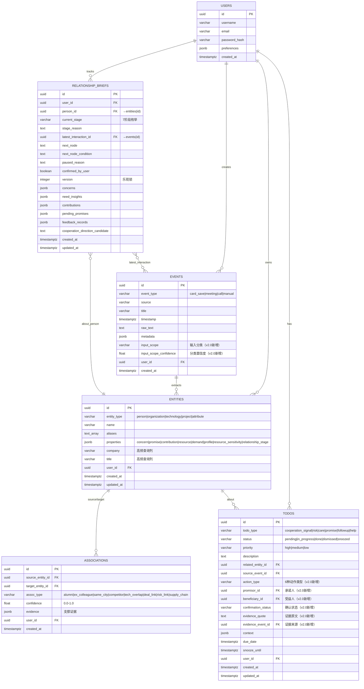

# EventLink 数据库设计文档

> **版本**: 0.2.0 (POC阶段)
> **日期**: 2026-06-04
> **阶段**: POC (0.2.x series)
> **设计师**: 架构师团队
> **参考**: PRD v4.3, 技术设计 v2.5 §3.1
> **状态**: 李总v1.2+许总POC反馈融合修订

---

## 1. 设计原则

### 1.1 PoC阶段策略
- **开发环境**: SQLite（零依赖，快速启动）
- **生产环境**: PostgreSQL 15（高性能、JSONB、全文索引）
- **数据规模**: 单用户1万条记录以内
- **范式**: 实用主义优先，适度反范式化（company/title提取到实体表）

### 1.2 数据原则
- **事件驱动**: Event是一切数据的源头
- **实体归一**: 通过5步算法避免重复实体
- **软删除**: 关键数据使用deleted_at而非物理删除
- **审计日志**: 全写操作记录created_at/updated_at

---

## 2. ER图



---

## 3. 表结构详细设计

### 3.1 Events表（事件表）

**用途**: 存储用户提交的所有事件（扫名片/会议/电话/手动）

| 字段名 | 类型 | 约束 | 默认值 | 说明 |
|--------|------|------|--------|------|
| id | UUID | PRIMARY KEY | gen_random_uuid() | 主键 |
| event_type | VARCHAR(20) | NOT NULL | - | card_save\|meeting\|call\|manual |
| source | VARCHAR(50) | NOT NULL | - | iamhere\|recording_r1\|manual |
| title | VARCHAR(200) | NOT NULL | - | 事件标题 |
| timestamp | TIMESTAMPTZ | NOT NULL | - | 事件发生时间 |
| raw_text | TEXT | NOT NULL | - | 原始文本内容 |
| metadata | JSONB | - | '{}' | 扩展元数据（会议类型/地点等） |
| input_scope | VARCHAR(30) | - | 'relationship_interaction' | 输入分类（F-44，v2.0新增） |
| input_scope_confidence | FLOAT | - | 1.0 | 分类置信度（F-44，v2.0新增） |
| user_id | UUID | NOT NULL, FK(users.id) | - | 用户ID |
| created_at | TIMESTAMPTZ | NOT NULL | NOW() | 创建时间 |

**索引**:
```sql
CREATE INDEX idx_events_user_timestamp ON events(user_id, timestamp DESC);
CREATE INDEX idx_events_type ON events(event_type);
CREATE INDEX idx_events_source ON events(source);
CREATE INDEX idx_events_input_scope ON events(input_scope) WHERE input_scope IS NOT NULL;  -- v2.0新增
```

**JSONB metadata结构**:
```json
{
  "meeting_type": "A|B|C|D",
  "location": "会议地点",
  "participants": ["张三", "李四"],
  "duration_minutes": 60,
  "card_image_url": "https://...",
  "language": "zh-CN|en-US"
}
```

---

### 3.2 Entities表（实体表）

**用途**: 存储归一后的实体（人/组织/技术/项目等）

| 字段名 | 类型 | 约束 | 默认值 | 说明 |
|--------|------|------|--------|------|
| id | UUID | PRIMARY KEY | gen_random_uuid() | 主键 |
| entity_type | VARCHAR(20) | NOT NULL | - | person\|organization\|technology\|project\|attribute |
| name | VARCHAR(100) | NOT NULL | - | 实体名称 |
| aliases | TEXT[] | - | '{}' | 别名数组 |
| properties | JSONB | - | '{}' | 扩展画像（concern/promise/contribution/resource/demand/profile/relationship_stage） |
| company | VARCHAR(100) | - | NULL | 公司（高频查询列） |
| title | VARCHAR(100) | - | NULL | 职位（高频查询列） |
| city | VARCHAR(50) | - | NULL | 城市（高频查询列） |
| user_id | UUID | NOT NULL, FK(users.id) | - | 用户ID |
| created_at | TIMESTAMPTZ | NOT NULL | NOW() | 创建时间 |
| updated_at | TIMESTAMPTZ | NOT NULL | NOW() | 更新时间 |

**索引**:
```sql
CREATE INDEX idx_entities_user_type ON entities(user_id, entity_type);
CREATE INDEX idx_entities_name ON entities(name);
CREATE INDEX idx_entities_company ON entities(company) WHERE company IS NOT NULL;
CREATE INDEX idx_entities_properties ON entities USING GIN(properties jsonb_path_ops);
```

**唯一约束**:
```sql
CREATE UNIQUE INDEX idx_entities_user_name_company 
  ON entities(user_id, name, COALESCE(company, ''))
  WHERE entity_type = 'person';
```

**JSONB properties结构**:
```json
{
  "resource_sensitivity": "matchable",
  "relationship_stage": "new_connection",
  "relationship": {
    "stage": "new_connection",
    "stage_reason": "首次记录互动",
    "paused_reason": null,
    "confirmed_by_user": false,
    "next_node": "了解对方核心需求",
    "next_node_condition": "完成首次深入交流"
  },
  "concern": [
    {
      "topic": "寻找AI方向技术合伙人",
      "source_event_id": "uuid-of-event",
      "confirmed": true,
      "created_at": "2026-06-03T10:00:00Z"
    }
  ],
  "promise": [
    {
      "content": "下周发一份AI算法团队介绍资料",
      "due_at": "2026-06-10T00:00:00Z",
      "source_event_id": "uuid-of-event",
      "status": "pending",
      "created_at": "2026-06-03T10:00:00Z"
    }
  ],
  "contribution": [
    {
      "content": "介绍了李四给张三认识",
      "target_entity_id": "uuid-of-target-entity",
      "date": "2026-06-01",
      "created_at": "2026-06-01T10:00:00Z"
    }
  ],
  "resource": {
    "tags": ["AI算法专家", "有5年CV经验"],
    "description": "计算机视觉领域专家，擅长目标检测与图像分割"
  },
  "demand": {
    "tags": ["寻找联合创始人", "需要前端开发"],
    "description": "创业项目需要技术合伙人，前端方向优先",
    "urgency": "high"
  },
  "profile": {
    "phone": "138xxxx",
    "email": "xxx@example.com",
    "wechat": "xxxxx",
    "linkedin": "https://...",
    "education": ["清华大学", "计算机系"],
    "industry": "人工智能",
    "skills": ["Python", "PyTorch", "NLP"],
    "callability": "可约咖啡"
  }
}
```

> **注意**: `resource` 和 `demand` 字段为 **Phase2** 使用，当前阶段保留结构但暂不主动填充。

**resource_sensitivity枚举说明**:
| 值 | 说明 | 匹配行为 |
|---|---|---|
| `matchable` | 可参与匹配 | 该实体的资源/需求可被匹配算法发现和推荐 |
| `no_match` | 不可匹配 | 该实体不参与任何匹配推荐，仅做记录留存 |

**resource字段详细结构**（Phase2）:
```json
{
  "tags": ["标签1", "标签2"],
  "description": "资源的自然语言描述"
}
```
- `tags`: 资源标签数组，用于关键词匹配（keyword维度25%权重）
- `description`: 资源的自然语言描述，用于LLM语义匹配（llm维度10%权重）

**demand字段详细结构**（Phase2）:
```json
{
  "tags": ["标签1", "标签2"],
  "description": "需求的自然语言描述",
  "urgency": "high|medium|low"
}
```
- `tags`: 需求标签数组，用于关键词匹配
- `description`: 需求的自然语言描述，用于LLM语义匹配
- `urgency`: 需求紧迫度，影响Todo优先级排序

---

### 3.3 Associations表（关联表）

**用途**: 存储实体间的关联关系（8种关联类型）

| 字段名 | 类型 | 约束 | 默认值 | 说明 |
|--------|------|------|--------|------|
| id | UUID | PRIMARY KEY | gen_random_uuid() | 主键 |
| source_entity_id | UUID | NOT NULL, FK(entities.id) | - | 源实体ID |
| target_entity_id | UUID | NOT NULL, FK(entities.id) | - | 目标实体ID |
| assoc_type | VARCHAR(30) | NOT NULL | - | 关联类型（8种） |
| confidence | FLOAT | NOT NULL | 0.0 | 置信度 0.0-1.0 |
| evidence | JSONB | - | '{}' | 支撑证据 |
| user_id | UUID | NOT NULL, FK(users.id) | - | 用户ID |
| created_at | TIMESTAMPTZ | NOT NULL | NOW() | 创建时间 |

**关联类型枚举**:
- `alumni` - 校友关系
- `ex_colleague` - 前同事
- `same_city` - 同城
- `competitor` - 竞对关系
- `tech_overlap` - 技术重叠
- `deal_link` - 交易关联
- `risk_link` - 风险关联（P2）
- `supply_chain` - 供应链关系

**索引**:
```sql
CREATE INDEX idx_assoc_source ON associations(source_entity_id);
CREATE INDEX idx_assoc_target ON associations(target_entity_id);
CREATE INDEX idx_assoc_type ON associations(assoc_type);
CREATE INDEX idx_assoc_confidence ON associations(confidence) WHERE confidence >= 0.7;
CREATE UNIQUE INDEX idx_assoc_unique 
  ON associations(user_id, source_entity_id, target_entity_id, assoc_type);
```

**JSONB evidence结构**:
```json
{
  "method": "同公司匹配",
  "matched_fields": ["company", "title"],
  "source_events": ["event_id_1", "event_id_2"],
  "extracted_from": "会议纪要提到：张三和李四都是阿里巴巴的前同事"
}
```

---

### 3.3b RelationshipBriefs表（关系推进卡表）

**用途**: 为重点联系人生成全貌视图卡片，整合关注点、需求洞察、承诺、反馈、关系阶段等关键信息（F-47，P0必须，v2.0新增）

| 字段名 | 类型 | 约束 | 默认值 | 说明 |
|--------|------|------|--------|------|
| id | UUID | PRIMARY KEY | gen_random_uuid() | 主键 |
| user_id | UUID | NOT NULL | - | 用户ID |
| person_id | UUID | NOT NULL, FK(entities.id) | - | 关联人物实体ID |
| current_stage | VARCHAR(30) | NOT NULL | 'new_connection' | 当前关系阶段（7阶段枚举） |
| stage_reason | TEXT | - | NULL | 阶段原因说明 |
| latest_interaction_id | UUID | FK(events.id) | NULL | 最近互动事件ID |
| next_node | TEXT | - | NULL | 下一推进节点 |
| next_node_condition | TEXT | - | NULL | 节点触发条件 |
| paused_reason | TEXT | - | NULL | 暂停原因 |
| confirmed_by_user | BOOLEAN | - | FALSE | 用户是否确认阶段变更 |
| version | INTEGER | NOT NULL | 1 | 乐观锁版本号 |
| concerns | JSONB | - | '[]' | 关注点列表 |
| need_insights | JSONB | - | '[]' | 需求洞察列表 |
| contributions | JSONB | - | '[]' | 贡献记录列表 |
| pending_promises | JSONB | - | '[]' | 待兑现承诺列表 |
| feedback_records | JSONB | - | '[]' | 反馈记录列表 |
| cooperation_direction_candidate | TEXT | - | NULL | 合作方向候选 |
| created_at | TIMESTAMPTZ | - | NOW() | 创建时间 |
| updated_at | TIMESTAMPTZ | - | NOW() | 更新时间 |

**索引**:
```sql
CREATE INDEX idx_briefs_user ON relationship_briefs(user_id);
CREATE INDEX idx_briefs_person ON relationship_briefs(person_id);
CREATE UNIQUE INDEX idx_briefs_user_person ON relationship_briefs(user_id, person_id);
```

**current_stage 7阶段枚举（F-48）**:

| 阶段值 | 中文名 | 说明 | PoC范围 |
|--------|--------|------|---------|
| `new_connection` | 新连接 | 首次建立联系 | ✅ 启用 |
| `understanding_needs` | 了解需求 | 深入了解对方需求 | ✅ 启用 |
| `value_response` | 价值回应 | 提供价值回应对方 | ✅ 启用 |
| `cooperation_exploration` | 合作探索 | 探讨合作可能性 | 保留枚举，UI不展示 |
| `intent_confirmed` | 意图确认 | 双方合作意图已确认 | 保留枚举，UI不展示 |
| `execution` | 执行中 | 合作正在执行 | 保留枚举，UI不展示 |
| `review` | 回顾复盘 | 阶段性回顾复盘 | 保留枚举，UI不展示 |

> **关键规则 RS-01**: 阶段不可仅由AI自动升级，必须用户确认。AI可基于行为数据建议升级，但最终升级操作需用户在推进卡上主动确认。

**JSONB字段结构示例**:

```json
{
  "concerns": [
    {
      "topic": "寻找AI方向技术合伙人",
      "source_event_id": "uuid-of-event",
      "created_at": "2026-06-03T10:00:00Z"
    }
  ],
  "need_insights": [
    {
      "content": "对方团队急需前端开发资源",
      "confidence": 0.85,
      "source_event_id": "uuid-of-event",
      "created_at": "2026-06-03T10:00:00Z"
    }
  ],
  "contributions": [
    {
      "content": "介绍了李四给张三认识",
      "date": "2026-06-01",
      "created_at": "2026-06-01T10:00:00Z"
    }
  ],
  "pending_promises": [
    {
      "content": "下周发一份AI算法团队介绍资料",
      "due_at": "2026-06-10T00:00:00Z",
      "promisor_type": "my_promise",
      "source_event_id": "uuid-of-event",
      "status": "pending",
      "created_at": "2026-06-03T10:00:00Z"
    }
  ],
  "feedback_records": [
    {
      "type": "stage_confirmation",
      "content": "用户确认从new_connection升级到understanding_needs",
      "created_at": "2026-06-04T15:00:00Z"
    }
  ]
}
```

---

### 3.4 Todos表（待办表）

**用途**: 存储AI生成的待办事项及用户追踪

| 字段名 | 类型 | 约束 | 默认值 | 说明 |
|--------|------|------|--------|------|
| id | UUID | PRIMARY KEY | gen_random_uuid() | 主键 |
| todo_type | VARCHAR(20) | NOT NULL | - | cooperation_signal\|risk\|care\|promise\|followup\|help |
| status | VARCHAR(20) | NOT NULL | 'pending' | pending\|in_progress\|done\|dismissed\|snoozed |
| priority | VARCHAR(10) | NOT NULL | 'medium' | high\|medium\|low |
| description | TEXT | NOT NULL | - | Todo描述 |
| related_entity_id | UUID | FK(entities.id) | NULL | 关联实体ID |
| source_event_id | UUID | FK(events.id) | NULL | 来源事件ID |
| action_type | VARCHAR(25) | - | 'my_promise' | 动作类型6种枚举（F-45，v2.0新增） |
| promisor_id | UUID | FK(entities.id) | NULL | 承诺人ID（F-45，v2.0新增） |
| beneficiary_id | UUID | FK(entities.id) | NULL | 受益人ID（F-45，v2.0新增） |
| confirmation_status | VARCHAR(15) | - | 'pending' | 确认状态（F-45，v2.0新增） |
| evidence_quote | TEXT | - | NULL | 证据原文（F-45 BLK-1，v2.0新增） |
| evidence_event_id | UUID | FK(events.id) | NULL | 证据来源事件ID（F-45，v2.0新增） |
| context | JSONB | - | '{}' | 上下文信息 |
| due_date | TIMESTAMPTZ | - | NULL | 截止时间 |
| snooze_until | TIMESTAMPTZ | - | NULL | 延迟到某时间 |
| user_id | UUID | NOT NULL, FK(users.id) | - | 用户ID |
| created_at | TIMESTAMPTZ | NOT NULL | NOW() | 创建时间 |
| updated_at | TIMESTAMPTZ | NOT NULL | NOW() | 更新时间 |

**CHECK约束（v2.0新增）**:
```sql
ALTER TABLE todos ADD CONSTRAINT todo_action_type_check
    CHECK (action_type IN ('my_promise','their_promise','my_followup','mutual_action','system_reminder','unclear'));
```

**action_type枚举说明（F-45，v2.0新增）**:

| action_type | 中文名 | 行为规则 |
|-------------|--------|---------|
| `my_promise` | 我的承诺 | 进入我的Todo列表，需跟进兑现 |
| `their_promise` | 对方承诺 | 显示"等待对方回应"，不入Todo |
| `my_followup` | 我的跟进 | 生成跟进型Todo |
| `mutual_action` | 共同行动 | 双方各生成一条Todo |
| `system_reminder` | 系统提醒 | 系统自动生成提醒型Todo |
| `unclear` | 待确认 | 标记为待确认，需用户手动确认后生成Todo |

**索引**:
```sql
CREATE INDEX idx_todos_user_status ON todos(user_id, status);
CREATE INDEX idx_todos_type ON todos(todo_type);
CREATE INDEX idx_todos_priority ON todos(priority);
CREATE INDEX idx_todos_due_date ON todos(due_date) WHERE due_date IS NOT NULL;
CREATE INDEX idx_todos_entity ON todos(related_entity_id);
```

**todo_type枚举与莫兰迪色映射**:

| todo_type | 中文名 | 莫兰迪色 | 色值 | 说明 |
|-----------|--------|---------|------|------|
| `promise` | 承诺 | 雾绿 | #A0C4A8 | 我答应过的事情，需跟进兑现 |
| `help` | 帮助 | 雾紫 | #B0A0C4 | 可以为对方提供的帮助 |
| `care` | 关心 | 雾蓝 | #A0B0C4 | 对方关注的事项，需留意 |
| `followup` | 跟进 | 雾金 | #C4C0A0 | 需要后续跟进的事项 |
| `cooperation_signal` | 合作信号 | 雾白 | #B8C4C0 | 发现潜在合作/商业机会 |
| `risk` | 风险 | 烟粉 | #C4A7A0 | 识别潜在风险或不利因素 |

**morandi_color在context中的存储**:
```json
{
  "morandi_color": "#A0C4A8"
}
```
> 前端可根据todo_type自动映射颜色，morandi_color字段作为冗余存储确保一致性。

**JSONB context结构**（按todo_type分类）:

**通用字段**（所有类型共享）:
```json
{
  "reason": "Todo生成的简要原因",
  "morandi_color": "#A0C4A8",
  "related_entities": ["entity_id_1", "entity_id_2"],
  "llm_explanation": "LLM生成的详细解释"
}
```

**promise类型特有字段**:
```json
{
  "due_at": "2026-06-10T00:00:00Z",
  "completion_note": "已发送资料至对方邮箱"
}
```

**care类型特有字段**:
```json
{
  "concern_topic": "寻找AI方向技术合伙人",
  "source_event_id": "uuid-of-event"
}
```

**help类型特有字段**:
```json
{
  "target_entity_id": "uuid-of-target-entity",
  "help_description": "可以介绍自己的算法团队给他"
}
```

**cooperation_signal类型特有字段**:
```json
{
  "signal_type": "resource_match",
  "related_entities": ["entity_id_1", "entity_id_2"]
}
```

**risk / followup类型**:
- 使用通用字段即可，无额外特有字段

**完整context示例（promise类型）**:
```json
{
  "reason": "您在6月1日会议中答应了张三发送算法团队介绍资料",
  "morandi_color": "#A0C4A8",
  "related_entities": ["entity_id_zhangsan"],
  "llm_explanation": "基于会议纪要，用户承诺下周发送资料...",
  "due_at": "2026-06-10T00:00:00Z",
  "completion_note": null
}
```

**context字段说明**:
| 字段 | 类型 | 适用类型 | 说明 |
|------|------|---------|------|
| reason | string | 全部 | Todo生成的简要原因 |
| morandi_color | string | 全部 | 莫兰迪色值，与todo_type对应 |
| related_entities | string[] | 全部 | 关联实体ID数组 |
| llm_explanation | string | 全部 | LLM生成的详细解释 |
| due_at | string(ISO8601) | promise | 承诺截止时间 |
| completion_note | string\|null | promise | 完成时的备注 |
| concern_topic | string | care | 对方关注的话题 |
| source_event_id | string(UUID) | care | 关注话题来源事件ID |
| target_entity_id | string(UUID) | help | 帮助目标实体ID |
| help_description | string | help | 帮助内容描述 |
| signal_type | string | cooperation_signal | 合作信号类型（resource_match/need_match/opportunity等） |

---

### 3.5 Users表（用户表）

**用途**: 用户账号管理（Phase 1暂时单用户）

| 字段名 | 类型 | 约束 | 默认值 | 说明 |
|--------|------|------|--------|------|
| id | UUID | PRIMARY KEY | gen_random_uuid() | 主键 |
| username | VARCHAR(50) | UNIQUE, NOT NULL | - | 用户名 |
| email | VARCHAR(100) | UNIQUE | NULL | 邮箱 |
| password_hash | VARCHAR(255) | NOT NULL | - | 密码哈希（bcrypt） |
| preferences | JSONB | - | '{}' | 用户偏好设置 |
| created_at | TIMESTAMPTZ | NOT NULL | NOW() | 创建时间 |

**索引**:
```sql
CREATE UNIQUE INDEX idx_users_username ON users(username);
CREATE UNIQUE INDEX idx_users_email ON users(email) WHERE email IS NOT NULL;
```

---

## 4. 索引策略

### 4.1 索引设计原则
1. **查询模式驱动**: 基于API查询模式设计索引
2. **复合索引优先**: 高频组合查询使用复合索引
3. **避免过度索引**: 写多读少的表谨慎添加索引
4. **JSONB GIN索引**: 对JSONB字段使用GIN索引支持灵活查询

### 4.2 关键查询优化

**查询1**: 用户最近的事件（首页）
```sql
-- 索引: idx_events_user_timestamp
SELECT * FROM events 
WHERE user_id = ? 
ORDER BY timestamp DESC 
LIMIT 20;
```

**查询2**: 实体搜索（模糊匹配）
```sql
-- 索引: idx_entities_name + idx_entities_company
SELECT * FROM entities 
WHERE user_id = ? 
  AND (name ILIKE ? OR company ILIKE ?)
LIMIT 10;
```

**查询3**: 实体关联图谱（BFS遍历）
```sql
-- 索引: idx_assoc_source + idx_assoc_target
SELECT * FROM associations 
WHERE (source_entity_id = ? OR target_entity_id = ?)
  AND confidence >= 0.7;
```

**查询4**: 今日待办（状态+截止时间）
```sql
-- 索引: idx_todos_user_status + idx_todos_due_date
SELECT * FROM todos 
WHERE user_id = ? 
  AND status IN ('pending', 'in_progress')
  AND (due_date IS NULL OR due_date <= NOW() + INTERVAL '1 day')
ORDER BY priority DESC, created_at ASC;
```

---

## 5. 数据迁移方案

### 5.1 SQLite → PostgreSQL 迁移

**场景**: 开发环境SQLite数据迁移到生产PostgreSQL

**步骤**:

```bash
# 1. 导出SQLite数据为SQL
sqlite3 eventlink_dev.db .dump > dump.sql

# 2. 转换SQL语法（脚本处理）
python scripts/sqlite_to_pg.py dump.sql > pg_dump.sql

# 3. 创建PostgreSQL schema
psql -U eventlink -d eventlink_prod -f schema.sql

# 4. 导入数据
psql -U eventlink -d eventlink_prod -f pg_dump.sql

# 5. 验证数据完整性
python scripts/verify_migration.py
```

**语法差异处理**:

| SQLite | PostgreSQL | 转换 |
|--------|-----------|------|
| `AUTOINCREMENT` | `SERIAL` | 改用UUID主键 |
| `TEXT` | `TEXT/VARCHAR` | 保持TEXT |
| `REAL` | `FLOAT/DOUBLE PRECISION` | 使用FLOAT |
| `BLOB` | `BYTEA` | 使用BYTEA |
| `datetime('now')` | `NOW()` | 替换为NOW() |

### 5.2 数据类型映射

```python
# scripts/sqlite_to_pg.py 核心逻辑
TYPE_MAPPING = {
    'INTEGER': 'INTEGER',
    'TEXT': 'TEXT',
    'REAL': 'FLOAT',
    'BLOB': 'BYTEA',
    'DATETIME': 'TIMESTAMPTZ',
}

def convert_create_table(sqlite_sql):
    # 替换类型
    for old, new in TYPE_MAPPING.items():
        sqlite_sql = sqlite_sql.replace(old, new)
    
    # 替换主键策略
    sqlite_sql = sqlite_sql.replace('AUTOINCREMENT', '')
    sqlite_sql = re.sub(r'id INTEGER PRIMARY KEY', 
                       'id UUID PRIMARY KEY DEFAULT gen_random_uuid()',
                       sqlite_sql)
    
    return sqlite_sql
```

### 5.3 Alembic增量迁移策略（v2.0新增）

**策略概述**: 从v1.2升级到v2.0采用Alembic增量迁移，确保生产数据零丢失、可回滚。

**迁移文件**: `alembic/versions/v120_v200_relationship_upgrade.py`

**迁移步骤**:

```python
"""v1.2 → v2.0: relationship_briefs表 + events/todos扩展字段

Revision ID: v120_v200
Revises: v110_v120
Create Date: 2026-06-04

迁移内容:
1. 新增 relationship_briefs 表（D1-1）
2. events 表追加 input_scope + input_scope_confidence 字段（D1-2）
3. todos 表追加 6个字段 + CHECK约束（D1-3）
4. entities.properties JSONB结构扩展（D1-4，应用层处理）
"""
from alembic import op
import sqlalchemy as sa
from sqlalchemy.dialects import postgresql

def upgrade():
    # === D1-1: 新增 relationship_briefs 表 ===
    op.create_table(
        'relationship_briefs',
        sa.Column('id', postgresql.UUID(as_uuid=True), primary_key=True,
                  server_default=sa.text('gen_random_uuid()')),
        sa.Column('user_id', postgresql.UUID(as_uuid=True), nullable=False),
        sa.Column('person_id', postgresql.UUID(as_uuid=True), nullable=False),
        sa.Column('current_stage', sa.String(30), nullable=False,
                  server_default='new_connection'),
        sa.Column('stage_reason', sa.Text(), nullable=True),
        sa.Column('latest_interaction_id', postgresql.UUID(as_uuid=True), nullable=True),
        sa.Column('next_node', sa.Text(), nullable=True),
        sa.Column('next_node_condition', sa.Text(), nullable=True),
        sa.Column('paused_reason', sa.Text(), nullable=True),
        sa.Column('confirmed_by_user', sa.Boolean(), server_default=sa.text('FALSE')),
        sa.Column('version', sa.Integer(), nullable=False, server_default='1'),
        sa.Column('concerns', postgresql.JSONB(), server_default=sa.text("'[]'::jsonb")),
        sa.Column('need_insights', postgresql.JSONB(), server_default=sa.text("'[]'::jsonb")),
        sa.Column('contributions', postgresql.JSONB(), server_default=sa.text("'[]'::jsonb")),
        sa.Column('pending_promises', postgresql.JSONB(), server_default=sa.text("'[]'::jsonb")),
        sa.Column('feedback_records', postgresql.JSONB(), server_default=sa.text("'[]'::jsonb")),
        sa.Column('cooperation_direction_candidate', sa.Text(), nullable=True),
        sa.Column('created_at', sa.TIMESTAMPTZ(), server_default=sa.text('NOW()')),
        sa.Column('updated_at', sa.TIMESTAMPTZ(), server_default=sa.text('NOW()')),
    )
    op.create_index('idx_briefs_user', 'relationship_briefs', ['user_id'])
    op.create_index('idx_briefs_person', 'relationship_briefs', ['person_id'])
    op.create_index('idx_briefs_user_person', 'relationship_briefs',
                    ['user_id', 'person_id'], unique=True)
    op.create_foreign_key('fk_briefs_person', 'relationship_briefs', 'entities',
                          ['person_id'], ['id'])
    op.create_foreign_key('fk_briefs_interaction', 'relationship_briefs', 'events',
                          ['latest_interaction_id'], ['id'])

    # === D1-2: events 表追加字段 ===
    op.add_column('events', sa.Column('input_scope', sa.String(30),
                   server_default='relationship_interaction'))
    op.add_column('events', sa.Column('input_scope_confidence', sa.Float(),
                   server_default='1.0'))
    op.create_index('idx_events_input_scope', 'events', ['input_scope'],
                    postgresql_where=sa.text('input_scope IS NOT NULL'))

    # === D1-3: todos 表追加字段 ===
    op.add_column('todos', sa.Column('action_type', sa.String(25),
                   server_default='my_promise'))
    op.add_column('todos', sa.Column('promisor_id', postgresql.UUID(as_uuid=True)))
    op.add_column('todos', sa.Column('beneficiary_id', postgresql.UUID(as_uuid=True)))
    op.add_column('todos', sa.Column('confirmation_status', sa.String(15),
                   server_default='pending'))
    op.add_column('todos', sa.Column('evidence_quote', sa.Text()))
    op.add_column('todos', sa.Column('evidence_event_id', postgresql.UUID(as_uuid=True)))

    # 添加外键约束
    op.create_foreign_key('todos_promisor_id_fkey', 'todos', 'entities',
                          ['promisor_id'], ['id'])
    op.create_foreign_key('todos_beneficiary_id_fkey', 'todos', 'entities',
                          ['beneficiary_id'], ['id'])
    op.create_foreign_key('todos_evidence_event_id_fkey', 'todos', 'events',
                          ['evidence_event_id'], ['id'])

    # 添加CHECK约束
    op.execute("""
        ALTER TABLE todos ADD CONSTRAINT todo_action_type_check
            CHECK (action_type IN (
                'my_promise','their_promise','my_followup',
                'mutual_action','system_reminder','unclear'
            ))
    """)

    # === D1-4: entities.properties JSONB扩展（应用层处理）===
    # 注意：JSONB内部结构变更无需DDL，由应用层ORM模型负责兼容读写
    # 建议执行数据回填：为现有person实体补充 relationship_stage 字段
    op.execute("""
        UPDATE entities e
        SET properties = jsonb_set(
            COALESCE(e.properties, '{}'::jsonb),
            '{relationship_stage}',
            '"new_connection"'::jsonb
        )
        WHERE e.entity_type = 'person'
          AND e.properties->>'relationship_stage' IS NULL
    """)


def downgrade():
    # 回滚顺序与upgrade相反
    op.drop_constraint('todo_action_type_check', 'todos', type_='check')
    op.drop_constraint('todos_evidence_event_id_fkey', 'todos', type_='foreignkey')
    op.drop_constraint('todos_beneficiary_id_fkey', 'todos', type_='foreignkey')
    op.drop_constraint('todos_promisor_id_fkey', 'todos', type_='foreignkey')

    op.drop_column('todos', 'evidence_event_id')
    op.drop_column('todos', 'evidence_quote')
    op.drop_column('todos', 'confirmation_status')
    op.drop_column('todos', 'beneficiary_id')
    op.drop_column('todos', 'promisor_id')
    op.drop_column('todos', 'action_type')

    op.drop_index('idx_events_input_scope', table_name='events')
    op.drop_column('events', 'input_scope_confidence')
    op.drop_column('events', 'input_scope')

    op.drop_constraint('fk_briefs_interaction', 'relationship_briefs', type_='foreignkey')
    op.drop_constraint('fk_briefs_person', 'relationship_briefs', type_='foreignkey')
    op.drop_index('idx_briefs_user_person', table_name='relationship_briefs')
    op.drop_index('idx_briefs_person', table_name='relationship_briefs')
    op.drop_index('idx_briefs_user', table_name='relationship_briefs')
    op.drop_table('relationship_briefs')
```

**迁移执行命令**:
```bash
# 生成迁移文件（如需手动调整）
alembic revision --autogenerate -m "v120_v200_relationship_upgrade"

# 执行升级
alembic upgrade head

# 验证升级结果
alembic current
alembic history --verbose

# 如需回滚
alembic downgrade -1
```

**迁移验证清单**:
| 验证项 | 方法 | 预期结果 |
|--------|------|---------|
| relationship_briefs表创建 | `\d relationship_briefs` | 20个字段，3个索引，2个FK |
| events新字段存在 | `SELECT column_name FROM information_schema.columns WHERE table_name='events'` | 包含input_scope, input_scope_confidence |
| todos新字段+CHECK | `\d todos` | 6个新字段 + todo_action_type_check约束 |
| 现有数据完整性 | `SELECT COUNT(*) FROM events` + `SELECT COUNT(*) FROM todos` | 数据量不变 |
| 回滚可用性 | `alembic downgrade -1` 后检查 | 恢复到v1.2 schema |

---

## 6. 性能优化

### 6.1 查询优化

**EXPLAIN ANALYZE 示例**:
```sql
-- 分析查询计划
EXPLAIN ANALYZE
SELECT e.*, a.assoc_type, a.confidence
FROM entities e
JOIN associations a ON (a.source_entity_id = e.id OR a.target_entity_id = e.id)
WHERE e.user_id = '...'
  AND a.confidence >= 0.7
ORDER BY a.confidence DESC
LIMIT 10;
```

**优化建议**:
1. 避免OR条件（改用UNION）
2. 使用部分索引（WHERE confidence >= 0.7）
3. 限制JOIN表数量（≤3张）

### 6.2 JSONB查询优化

**GIN索引创建**:
```sql
CREATE INDEX idx_entities_properties_gin 
  ON entities USING GIN(properties jsonb_path_ops);
```

**高效JSONB查询**:
```sql
-- ✅ 使用GIN索引
SELECT * FROM entities 
WHERE properties @> '{"industry": "人工智能"}';

-- ❌ 无法使用索引
SELECT * FROM entities 
WHERE properties->>'industry' = '人工智能';
```

### 6.3 分区策略（生产优化）

**按时间分区（事件表）**:
```sql
-- 按月分区
CREATE TABLE events_2026_06 PARTITION OF events
FOR VALUES FROM ('2026-06-01') TO ('2026-07-01');

CREATE TABLE events_2026_07 PARTITION OF events
FOR VALUES FROM ('2026-07-01') TO ('2026-08-01');
```

---

## 7. 数据安全

### 7.1 敏感字段加密

**字段级加密（AES-256-GCM）**:
```sql
-- 使用pgcrypto扩展
CREATE EXTENSION IF NOT EXISTS pgcrypto;

-- 加密存储
INSERT INTO entities (name, properties)
VALUES (
  'John Doe',
  jsonb_set(
    '{}',
    '{encrypted_phone}',
    to_jsonb(pgp_sym_encrypt('13812345678', 'encryption_key'))
  )
);

-- 解密查询
SELECT 
  name,
  pgp_sym_decrypt(properties->'encrypted_phone'::bytea, 'encryption_key') as phone
FROM entities;
```

### 7.2 数据隔离（单用户）

> **设计决策**: EventLink定位为AI驱动的**个人商务关系经营助手**，明确排除RBAC、多租户和团队协作。数据隔离通过应用层user_id过滤实现，不使用数据库行级安全（RLS）。

**应用层过滤原则**:
1. 所有查询必须携带`user_id`条件
2. 不依赖数据库RLS策略，由应用层保证数据隔离
3. 单用户场景下，user_id在应用启动时确定，贯穿整个会话

**应用层过滤实现（Python示例）**:

```python
from uuid import UUID
from typing import Optional

class DataIsolation:
    """单用户数据隔离 — 应用层过滤"""
    
    def __init__(self, current_user_id: UUID):
        self.user_id = current_user_id
    
    def filter_query(self, base_query: str) -> str:
        """为查询添加user_id过滤条件"""
        # 简单实现：在WHERE子句中追加user_id条件
        if "WHERE" in base_query.upper():
            return f"{base_query} AND user_id = :user_id"
        else:
            return f"{base_query} WHERE user_id = :user_id"
    
    def get_query_params(self) -> dict:
        """返回查询参数中的user_id"""
        return {"user_id": self.user_id}


# === 使用示例 ===

from sqlalchemy import select
from sqlalchemy.ext.asyncio import AsyncSession

async def get_user_events(
    session: AsyncSession, 
    user_id: UUID,
    limit: int = 20
):
    """获取用户的事件列表 — 应用层过滤"""
    stmt = (
        select(Event)
        .where(Event.user_id == user_id)          # 必须：user_id过滤
        .order_by(Event.timestamp.desc())
        .limit(limit)
    )
    result = await session.execute(stmt)
    return result.scalars().all()


async def get_user_todos(
    session: AsyncSession,
    user_id: UUID,
    status: Optional[str] = None
):
    """获取用户的Todo列表 — 应用层过滤"""
    stmt = select(Todo).where(Todo.user_id == user_id)  # 必须：user_id过滤
    if status:
        stmt = stmt.where(Todo.status == status)
    stmt = stmt.order_by(Todo.priority.desc(), Todo.created_at.asc())
    result = await session.execute(stmt)
    return result.scalars().all()


async def get_entity_with_associations(
    session: AsyncSession,
    user_id: UUID,
    entity_id: UUID
):
    """获取实体及其关联 — 应用层过滤（关联表也需要过滤）"""
    stmt = (
        select(Entity)
        .where(Entity.id == entity_id, Entity.user_id == user_id)  # 实体过滤
    )
    entity = (await session.execute(stmt)).scalar_one_or_none()
    
    if not entity:
        return None
    
    assoc_stmt = (
        select(Association)
        .where(Association.user_id == user_id)                     # 关联也要过滤
        .where(
            (Association.source_entity_id == entity_id) |
            (Association.target_entity_id == entity_id)
        )
    )
    associations = (await session.execute(assoc_stmt)).scalars().all()
    
    return {"entity": entity, "associations": associations}
```

**过滤检查清单**:
| 操作 | 过滤要求 | 示例 |
|------|---------|------|
| SELECT | WHERE user_id = ? | `SELECT * FROM events WHERE user_id = ?` |
| INSERT | 设置user_id字段 | `INSERT INTO events (..., user_id) VALUES (..., ?)` |
| UPDATE | WHERE user_id = ? | `UPDATE todos SET status = ? WHERE id = ? AND user_id = ?` |
| DELETE | WHERE user_id = ? | `DELETE FROM entities WHERE id = ? AND user_id = ?` |

### 7.3 数据主权

> **核心原则**: 用户对自己的所有数据拥有完全控制权。EventLink作为个人商务关系经营助手，数据主权是不可妥协的底线。

**数据所有权声明**:
1. 用户创建的所有数据（事件、实体、关联、待办）归用户所有
2. 任何数据收集、处理、存储行为必须透明可追溯
3. 用户有权随时导出、删除自己的全部数据
4. 删除操作为硬删除（非软删除），确保数据彻底清除

**数据导出方案**:

```python
import json
from uuid import UUID
from datetime import datetime
from sqlalchemy import select
from sqlalchemy.ext.asyncio import AsyncSession

async def export_user_data(session: AsyncSession, user_id: UUID) -> dict:
    """导出用户全部数据为JSON格式"""
    
    # 1. 导出事件
    events_stmt = select(Event).where(Event.user_id == user_id)
    events = (await session.execute(events_stmt)).scalars().all()
    
    # 2. 导出实体
    entities_stmt = select(Entity).where(Entity.user_id == user_id)
    entities = (await session.execute(entities_stmt)).scalars().all()
    
    # 3. 导出关联
    associations_stmt = select(Association).where(Association.user_id == user_id)
    associations = (await session.execute(associations_stmt)).scalars().all()
    
    # 4. 导出待办
    todos_stmt = select(Todo).where(Todo.user_id == user_id)
    todos = (await session.execute(todos_stmt)).scalars().all()
    
    # 5. 导出用户信息
    user_stmt = select(User).where(User.id == user_id)
    user = (await session.execute(user_stmt)).scalar_one()
    
    return {
        "export_version": "1.0",
        "exported_at": datetime.utcnow().isoformat(),
        "user": {
            "username": user.username,
            "email": user.email,
            "preferences": user.preferences,
            "created_at": user.created_at.isoformat()
        },
        "events": [e.__dict__ for e in events],
        "entities": [e.__dict__ for e in entities],
        "associations": [a.__dict__ for a in associations],
        "todos": [t.__dict__ for t in todos],
        "summary": {
            "total_events": len(events),
            "total_entities": len(entities),
            "total_associations": len(associations),
            "total_todos": len(todos)
        }
    }
```

**数据删除方案（硬删除+关联清理）**:

```sql
-- ============================================================
-- 数据删除方案：硬删除，按依赖顺序执行
-- 注意：必须在事务中执行，确保原子性
-- ============================================================

BEGIN;

-- 1. 删除待办（依赖实体和事件）
DELETE FROM todos WHERE user_id = :user_id;

-- 2. 删除关联（依赖实体）
DELETE FROM associations WHERE user_id = :user_id;

-- 3. 删除实体（独立表，但被todos和associations引用）
DELETE FROM entities WHERE user_id = :user_id;

-- 4. 删除事件（独立表，但被todos引用）
DELETE FROM events WHERE user_id = :user_id;

-- 5. 删除用户（最后删除，确保关联数据已清理）
DELETE FROM users WHERE id = :user_id;

COMMIT;

-- ============================================================
-- 验证删除结果
-- ============================================================
SELECT 'events' as table_name, COUNT(*) as remaining 
  FROM events WHERE user_id = :user_id
UNION ALL
SELECT 'entities', COUNT(*) 
  FROM entities WHERE user_id = :user_id
UNION ALL
SELECT 'associations', COUNT(*) 
  FROM associations WHERE user_id = :user_id
UNION ALL
SELECT 'todos', COUNT(*) 
  FROM todos WHERE user_id = :user_id;
-- 期望结果：所有表 remaining = 0
```

**删除安全措施**:
| 措施 | 说明 |
|------|------|
| 事务保证 | 所有删除操作在单个事务中执行，失败则回滚 |
| 依赖顺序 | 按外键依赖顺序删除：todos → associations → entities → events → users |
| 删除前确认 | 应用层要求用户二次确认（输入用户名确认） |
| 删除前备份 | 自动触发数据导出，保存为JSON文件后再执行删除 |
| 审计记录 | 删除操作记录到应用日志（不含数据内容，仅记录操作时间和用户ID） |

---

## 8. 备份与恢复

### 8.1 备份策略

**每日全量备份**:
```bash
#!/bin/bash
# scripts/backup.sh
DATE=$(date +%Y%m%d)
pg_dump -U eventlink eventlink_prod | gzip > backup_${DATE}.sql.gz

# 保留最近7天
find backup_*.sql.gz -mtime +7 -delete
```

**实时增量备份（WAL归档）**:
```bash
# postgresql.conf
wal_level = replica
archive_mode = on
archive_command = 'cp %p /backup/wal_archive/%f'
```

### 8.2 恢复演练

**恢复到指定时间点**:
```bash
# 1. 停止服务
systemctl stop eventlink

# 2. 恢复基础备份
gunzip -c backup_20260602.sql.gz | psql -U eventlink eventlink_prod

# 3. 应用WAL日志
pg_waldump /backup/wal_archive/* | psql -U eventlink eventlink_prod

# 4. 启动服务
systemctl start eventlink
```

---

## 9. 监控指标

### 9.1 关键指标

| 指标 | 阈值 | 监控方法 |
|------|------|---------|
| 查询响应时间P95 | <200ms | pg_stat_statements |
| 表大小增长率 | <100MB/day | pg_total_relation_size() |
| 索引使用率 | >80% | pg_stat_user_indexes |
| 缓存命中率 | >95% | pg_stat_database |
| 慢查询数量 | <10/day | log_min_duration_statement=1000 |

### 9.2 监控查询

```sql
-- 慢查询TOP 10
SELECT 
  query, 
  calls, 
  mean_exec_time, 
  total_exec_time
FROM pg_stat_statements
ORDER BY mean_exec_time DESC
LIMIT 10;

-- 表大小TOP 5
SELECT 
  schemaname, 
  tablename, 
  pg_size_pretty(pg_total_relation_size(schemaname||'.'||tablename)) as size
FROM pg_tables
WHERE schemaname = 'public'
ORDER BY pg_total_relation_size(schemaname||'.'||tablename) DESC
LIMIT 5;
```

---

## 10. 版本演进

| 版本 | 日期 | 变更 |
|------|------|------|
| v1.0 | 2026-06-02 | 初始版本，4张核心表 |
| v1.1 | 2026-06-03 | Todo类型修正（6种：opportunity/risk/context/action/pending_confirm/resource_maint）；移除RLS改为应用层过滤；添加resource_sensitivity字段；添加莫兰迪色映射；添加数据主权章节；Entities properties结构细化 |
| v1.2 | 2026-06-03 | Todo类型重命名（opportunity→cooperation_signal, context→care, action→promise, pending_confirm→followup, resource_maint→help）；莫兰迪色映射更新；Entities properties新增concern/promise/contribution字段；resource/demand标注Phase2；Todos context按类型分类定义 |
| **v2.0** | **2026-06-04** | **李总v1.2+许总POC反馈融合修订（共识清单D1-1~D1-7）：①新增relationship_briefs关系推进卡表（F-47 P0，20字段+3索引+唯一约束+7阶段枚举）②events表追加input_scope/input_scope_confidence字段及索引（F-44）③todos表追加6字段（action_type/promisor_id/beneficiary_id/confirmation_status/evidence_quote/evidence_event_id）+CHECK约束+枚举说明（F-45）④entities.properties JSONB扩展relationship_stage+完整relationship对象结构（F-48）⑤ER图新增RELATIONSHIP_BRIEFS节点及与EVENTS/ENTITIES关系线⑥新增§5.3 Alembic增量迁移策略（含upgrade/downgrade完整代码+验证清单）⑦参考基线对齐PRD v4.3 + 技术设计v2.5 §3.1** |
| v2.1 | TBD | 添加用户反馈表 |

---

*最后更新: 2026-06-04*
