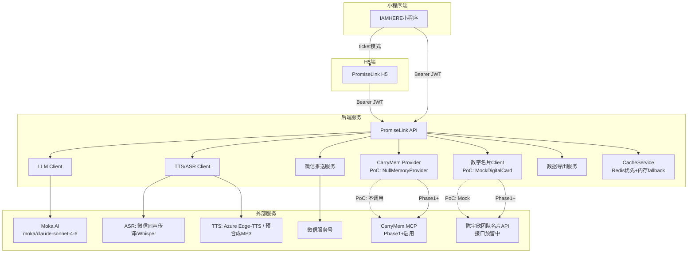
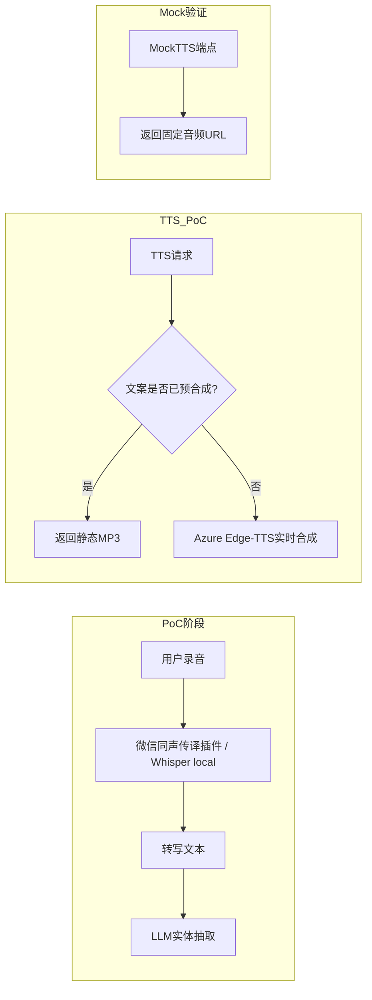
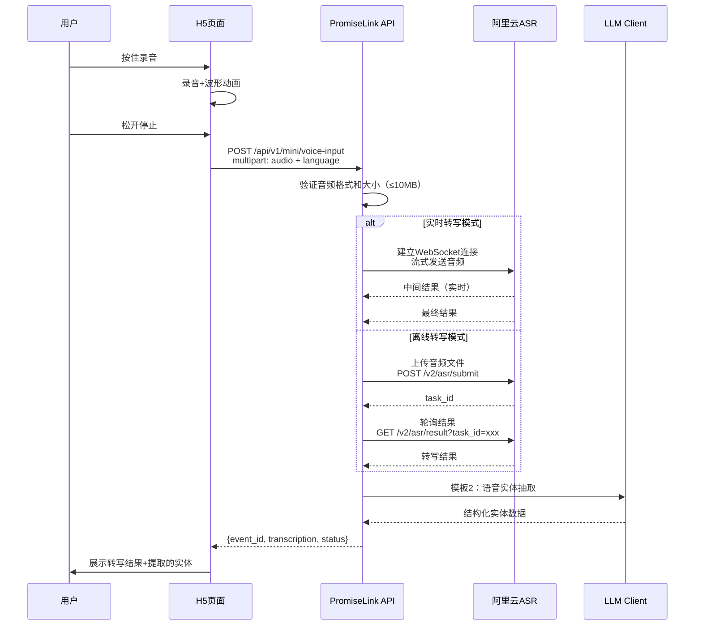
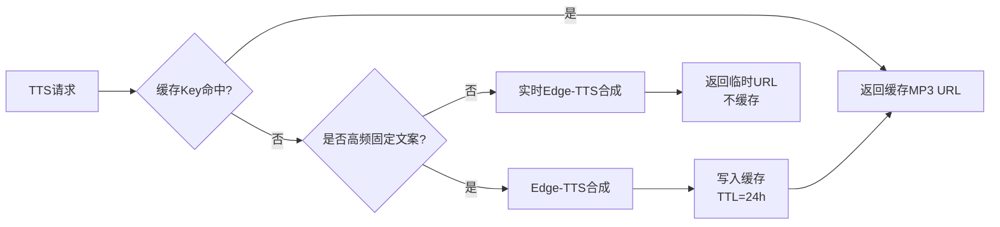
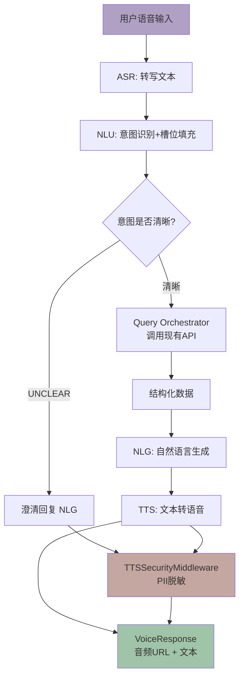
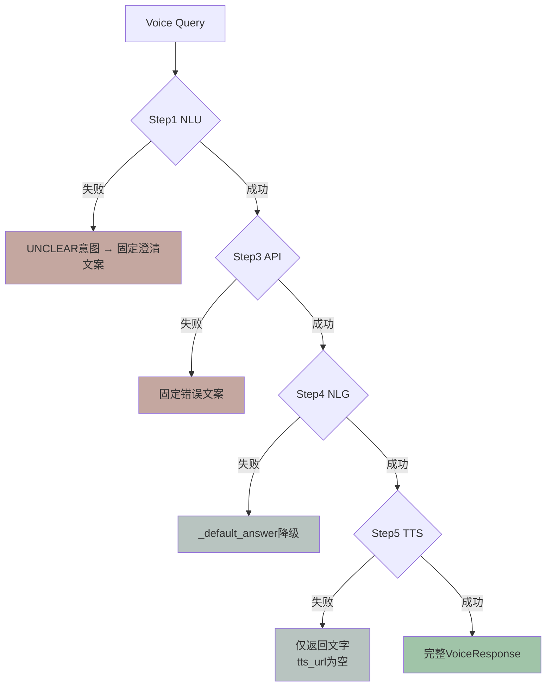

# PromiseLink集成设计文档 v2.9

> **版本**: v2.9（POC阶段 — 托管PoC部署模式+数字名片对接决策+Insight Engine + DataSourceAdapter + 依赖性/场景匹配 + 语义搜索 + CSV/Email/WeChat/VoiceQuery 集成规格）
> **日期**: 2026-06-09
> **设计师**: 架构师团队
> **参考**: PRD v4.3, 技术设计 v2.5, API设计 v1.0, 数据库设计 v2.0, LLM_Prompt_Templates v2.0
> **状态**: POC阶段 — 共识清单D7-1~D7-11融合修订 + DevSquad Review更新

---

## 关键决策（9条铁律）

| # | 决策 | 说明 |
|---|------|------|
| 1 | 产品定位 | AI驱动的**个人商务关系经营助手**（非"资源匹配平台"） |
| 2 | Todo类型 | 6种todo_type：cooperation_signal/risk/care/promise/followup/help；6种action_type：my_promise/their_promise/my_followup/mutual_action/system_reminder/unclear [0.2.0新增action_type] |
| 3 | 莫兰迪色系 | 雾白#B8C4C0/烟粉#C4A7A0/雾蓝#A0B0C4/雾绿#A0C4A8/雾金#C4C0A0/雾紫#B0A0C4 |
| 4 | 匹配算法 | ⏸️ **[F-05暂停] Phase2功能** — 六维算法（keyword25%+industry20%+topic15%+llm10%+history10%+callability20%）PoC阶段不启用 |
| 5 | 敏感度 | 2级：matchable/no_match |
| 6 | 部署 | PoC本地Docker+SQLite → Phase1云端Docker Compose+PG+Redis |
| 7 | 明确排除 | RBAC/多租户/团队协作/他人资源匹配/原生APP |
| 8 | 字段名 | todo_type（非todo_nature）、callability（非availability） |
| 9 | LLM Provider | Moka AI（https://api.moka-ai.com/v1），model: moka/claude-sonnet-4-6 [0.2.0新增] |

---

## 1. 集成概览

本文档定义12个关键集成模块的设计方案：

| # | 集成模块 | 优先级 | 状态 |
|---|---------|--------|------|
| 1 | IAMHERE小程序集成 | P0 | ✅ 设计完成（[D7-4] 微信OAuth code2session流程不变） |
| 2 | LLM集成设计 | P0 | ✅ 0.2.0更新（Moka AI + 模板0/3更新 + action_type） |
| 3 | TTS/ASR集成设计 | P0 | ✅ 0.2.1详细化（ASR:微信同声传译+Whisper+Protocol抽象层 / TTS:Edge-TTS+缓存策略+Protocol抽象层+PII脱敏 / Voice Orchestrator+NLG） |
| 4 | 微信服务号推送 | P1 | ✅ 设计完成（[D7-7] 模板消息/订阅消息框架不变） |
| 5 | CarryMem集成设计 | P1 | ✅ 0.2.0更新（三阶段路径：PoC→Phase1→Phase2） |
| 6 | 数字名片API对接 | P1 | 🔶 PoC阶段暂停，Phase1再评估（[D7-6] PRD v4.9确认PoC不对接外部数字名片平台） |
| 7 | 数据导出集成 | P1 | ✅ 0.2.0新增（[D7-9] GET /data/export + PII脱敏） |
| 8 | Redis缓存服务 | P1 | ✅ 设计完成（[D7-8] CacheService不变） |
| 9 | 集成测试策略 | P0 | ✅ 设计完成 |
| 10 | 配置管理 | P1 | ✅ 设计完成 |
| 11 | DependencyAnalyzer集成 | P2 | ✅ v2.6新增（F-55 依赖性全图谱路径分析） |
| 12 | ContextMatcher集成 | P2 | ✅ v2.6新增（F-56 场景匹配Event表驱动） |

**集成架构总览（[0.2.0更新]）**:



---

## 2. IAMHERE小程序集成（[D7-4] 微信OAuth code2session流程不变）

### 2.1 WebView嵌入方案

小程序通过WebView嵌入PromiseLink H5页面，实现完整功能交互。

**嵌入规则**:
- H5页面域名必须在小程序业务域名白名单中
- WebView URL必须为HTTPS
- 小程序与H5通过`wx.miniProgram.postMessage()`和URL参数进行双向通信
- H5页面需适配移动端视口（viewport meta标签）

**页面映射**:

| 小程序页面 | H5路由 | 功能 |
|-----------|--------|------|
| 人物详情 | `/person/:id` | 人物画像+待办+商机 |
| 今日简报 | `/digest/morning` | 早晨简报 |
| 待办列表 | `/todos` | Todo管理 |
| 名片扫描 | `/scan` | OCR+LLM解析 |
| 语音录入 | `/voice-input` | 录音+ASR转写 |

### 2.2 Token传递：临时授权码（Ticket）模式

> ⚠️ **安全警告**：v1.0版本使用明文JWT通过URL参数传递（`?token=xxx&openid=xxx`），
> 这是不安全的！v1.1已改为临时授权码模式。

#### 2.2.1 为什么不用明文Token

| 风险 | 说明 |
|------|------|
| URL日志泄露 | 浏览器历史、代理服务器、CDN日志都会记录完整URL，JWT一旦泄露可被伪造 |
| Referer泄露 | H5页面发起的子请求会在Referer头中携带完整URL（含token） |
| 微信缓存 | 微信WebView可能缓存含token的URL，他人使用同一设备时可获取 |
| 不可撤销 | JWT在过期前无法撤销，泄露窗口=token有效期 |
| 多次使用 | 明文token可被截获后无限次重放 |

#### 2.2.2 Ticket模式流程


#### 2.2.3 生成授权码

**端点**: `POST /api/v1/auth/ticket`

**请求**:
```json
{
  "action": "view_person",
  "person_id": "uuid-of-person",
  "user_id": "uuid-of-user"
}
```

**响应**:
```json
{
  "code": "T_AbCdEf12345",
  "expires_in": 60,
  "created_at": "2026-06-03T10:00:00Z"
}
```

**Ticket存储（Redis）**:
```redis
SET ticket:T_AbCdEf12345 '{"user_id":"uuid","action":"view_person","person_id":"uuid","created_at":"2026-06-03T10:00:00Z"}' EX 60
```

**安全特性**:
- Ticket前缀`T_`区分于其他Redis key
- 60秒有效期，超时自动删除
- 单次使用：exchange成功后立即`DEL`
- Ticket不包含任何用户敏感信息，仅是随机字符串
- 随机字符串长度≥16字符，防暴力破解

#### 2.2.4 交换Token

**端点**: `POST /api/v1/auth/exchange`

**请求**:
```json
{
  "ticket": "T_AbCdEf12345"
}
```

**响应**:
```json
{
  "access_token": "eyJhbGciOiJSUzI1NiIsInR5cCI6IkpXVCJ9...",
  "refresh_token": "eyJhbGciOiJSUzI1NiIsInR5cCI6IkpXVCJ9...",
  "token_type": "Bearer",
  "expires_in": 900,
  "user_id": "uuid"
}
```

**JWT Payload**:
```json
{
  "user_id": "uuid",
  "exp": 1622620800,
  "iat": 1622619900,
  "iss": "promiselink",
  "scope": "view_person"
}
```

**错误响应**:

| 错误码 | 说明 | HTTP状态码 |
|--------|------|-----------|
| E2003 | Ticket无效或已使用 | 401 |
| E2004 | Ticket已过期 | 401 |
| E2005 | Ticket格式错误 | 400 |

### 2.3 数据通信

#### 2.3.1 H5→小程序

```javascript
// H5向小程序发送消息
wx.miniProgram.postMessage({
  data: {
    type: 'todo_completed',
    todo_id: 'uuid',
    timestamp: Date.now()
  }
})

// H5调用小程序原生能力
wx.miniProgram.navigateTo({
  url: '/pages/scan/scan'
})

wx.miniProgram.navigateBack()
```

#### 2.3.2 小程序→H5

```javascript
// 小程序通过URL参数传递指令
const h5Url = `https://promiselink.com/h5?ticket=${ticket}&action=view_person&id=${personId}`

// 小程序接收H5消息
<web-view src="{{h5Url}}" bindmessage="onMessage"></web-view>

// 小程序端处理
onMessage(e) {
  const data = e.detail.data
  if (data.type === 'todo_completed') {
    this.refreshTodoList()
  }
}
```

### 2.4 配置示例

#### 2.4.1 小程序端

```javascript
// 小程序页面 wxml
<web-view src="{{h5Url}}" bindmessage="onMessage"></web-view>

// 小程序页面 js
Page({
  data: {
    h5Url: ''
  },

  async onLoad(options) {
    const { personId } = options

    // 1. 获取临时授权码
    const ticketRes = await wx.request({
      url: 'https://api.promiselink.com/api/v1/auth/ticket',
      method: 'POST',
      data: {
        action: 'view_person',
        person_id: personId,
        user_id: getApp().globalData.userId
      },
      header: {
        'Authorization': `Bearer ${getApp().globalData.mpToken}`
      }
    })

    // 2. 构造H5 URL（仅传递ticket，不传明文token）
    this.setData({
      h5Url: `https://promiselink.com/h5?ticket=${ticketRes.data.code}`
    })
  },

  onMessage(e) {
    const msg = e.detail.data[e.detail.data.length - 1]
    if (msg.type === 'navigate_back') {
      wx.navigateBack()
    }
  }
})
```

#### 2.4.2 H5端

```javascript
// H5端 auth.js — Token管理模块
class AuthManager {
  constructor() {
    this.TOKEN_KEY = 'promiselink_auth'
    this.REFRESH_KEY = 'promiselink_refresh'
  }

  // 初始化：用ticket换取JWT
  async init() {
    const params = new URLSearchParams(location.search)
    const ticket = params.get('ticket')

    if (!ticket) {
      throw new Error('缺少ticket参数')
    }

    // 清除URL中的ticket参数（防止泄露）
    window.history.replaceState({}, '', location.pathname)

    try {
      const res = await fetch('/api/v1/auth/exchange', {
        method: 'POST',
        headers: { 'Content-Type': 'application/json' },
        body: JSON.stringify({ ticket })
      })

      if (!res.ok) throw new Error('Ticket交换失败')

      const data = await res.json()

      // 使用sessionStorage（非localStorage）存储token
      // sessionStorage在标签页关闭后自动清除，降低泄露风险
      sessionStorage.setItem(this.TOKEN_KEY, data.access_token)
      sessionStorage.setItem(this.REFRESH_KEY, data.refresh_token)

      return data
    } catch (err) {
      console.error('认证失败:', err)
      throw err
    }
  }

  // 获取有效token（自动刷新）
  async getToken() {
    let token = sessionStorage.getItem(this.TOKEN_KEY)

    if (token && !this._isExpired(token)) {
      return token
    }

    // 尝试刷新
    const refreshToken = sessionStorage.getItem(this.REFRESH_KEY)
    if (refreshToken) {
      const res = await fetch('/api/v1/auth/refresh', {
        method: 'POST',
        headers: { 'Content-Type': 'application/json' },
        body: JSON.stringify({ refresh_token: refreshToken })
      })

      if (res.ok) {
        const data = await res.json()
        sessionStorage.setItem(this.TOKEN_KEY, data.access_token)
        sessionStorage.setItem(this.REFRESH_KEY, data.refresh_token)
        return data.access_token
      }
    }

    // 刷新失败，重定向到小程序重新获取ticket
    this._redirectToMiniProgram()
    return null
  }

  _isExpired(token) {
    try {
      const payload = JSON.parse(atob(token.split('.')[1]))
      return payload.exp * 1000 < Date.now()
    } catch {
      return true
    }
  }

  _redirectToMiniProgram() {
    if (window.wx && wx.miniProgram) {
      wx.miniProgram.navigateTo({ url: '/pages/login/login' })
    }
  }

  // 登出
  logout() {
    sessionStorage.removeItem(this.TOKEN_KEY)
    sessionStorage.removeItem(this.REFRESH_KEY)
  }
}

export const authManager = new AuthManager()
```

### 2.5 安全对比

| 维度 | v1.0明文Token | v1.1 Ticket模式 |
|------|-------------|----------------|
| URL暴露 | JWT完整暴露在URL中 | 仅暴露一次性ticket |
| 有效期 | JWT有效期15分钟 | Ticket有效期60秒 |
| 可撤销 | JWT无法主动撤销 | Ticket使用后立即删除 |
| 重放攻击 | 可在有效期内重放 | 一次性使用，无法重放 |
| 存储方式 | localStorage（持久化） | sessionStorage（标签页关闭即清除） |
| 泄露影响 | 整个JWT泄露=身份冒用 | Ticket泄露仅60秒窗口 |

---

## 3. LLM集成设计

### 3.1 接口封装

统一LLMClient类封装LLM调用，[0.2.0更新] 使用 **Moka AI** 作为唯一Provider。

```python
from abc import ABC, abstractmethod
from enum import Enum
from typing import Optional

# [0.2.0更新] 统一使用Moka AI
MOKA_API_BASE = "https://api.moka-ai.com/v1"
MOKA_MODEL = "moka/claude-sonnet-4-6"

class LLMClient:
    """统一LLM客户端 — [0.2.0] Moka AI单Provider"""

    def __init__(self, config: dict):
        self.api_key = config.get("api_key")
        self.base_url = config.get("base_url", MOKA_API_BASE)
        self.model = config.get("model", MOKA_MODEL)
        self.max_tokens = config.get("max_tokens", 4000)  # [0.2.0] 提升至4000支持12模块
        self.timeout = config.get("timeout", 30)
        self._client: Optional[httpx.AsyncClient] = None

    async def _get_client(self) -> httpx.AsyncClient:
        if self._client is None or self._client.is_closed:
            self._client = httpx.AsyncClient(
                base_url=self.base_url,
                headers={
                    "Authorization": f"Bearer {self.api_key}",
                    "Content-Type": "application/json",
                },
                timeout=self.timeout,
            )
        return self._client

    async def call(
        self,
        prompt: str,
        model: str = None,
        max_tokens: Optional[int] = None,
        temperature: float = 0.3,
    ) -> str:
        """调用Moka AI LLM，失败时规则降级"""
        client = await self._get_client()
        try:
            resp = await client.post(
                "/chat/completions",
                json={
                    "model": model or self.model,
                    "messages": [{"role": "user", "content": prompt}],
                    "max_tokens": max_tokens or self.max_tokens,
                    "temperature": temperature,
                },
            )
            resp.raise_for_status()
            data = resp.json()
            return data["choices"][0]["message"]["content"]
        except Exception as e:
            logger.warning(f"Moka AI调用失败: {e}，使用规则降级")
            return self._rule_based_fallback(prompt)

    def _rule_based_fallback(self, prompt: str) -> str:
        """规则降级：LLM不可用时的兜底策略"""
        return '{"error": "llm_unavailable", "fallback": true}'
```

> [deprecated] v1.2的多Provider降级策略（OpenAI→Claude→通义千问）已替换为Moka AI单Provider + 规则降级。如需多Provider回退，可在Phase 2引入。

### 3.2 Prompt模板库（14个模板）

> 每个模板包含：完整prompt文本、输入变量、输出格式、示例
> [0.2.0更新] 新增模板0（Input Scope分类）+ 模板13/14（RelationshipBrief/RelationshipStage），统一使用Moka AI moka/claude-sonnet-4-6模型

---

#### 模板0：Input Scope 分类 [0.2.0新增]

**用途**: 对用户输入进行语义分类，确定输入属于哪种scope，以便路由到正确的处理管线（F-44）

**输入变量**:

| 变量 | 类型 | 说明 |
|------|------|------|
| user_input | string | 用户原始输入文本 |
| context_hint | string | 上下文提示（可选，如来源渠道） |

**8种Scope定义（[0.2.0新增]）**:

| Scope | 说明 | 关键词特征 | 示例 |
|-------|------|-----------|------|
| `card_scan` | 名片信息 | 名片、OCR、姓名+公司+职位、电话、邮箱 | "扫了张总的名片" |
| `meeting` | 会议纪要 | 会议、纪要、讨论、参会人、议程、决议 | "今天开了产品评审会" |
| `call` | 电话记录 | 电话、通话、沟通、聊了、对方说 | "刚跟李总通了电话" |
| `manual_input` | 手动补全 | 补充、添加、手动录入、自由文本 | "补充一下王明的信息" |
| `wechat_chat` | 微信聊天 | 微信、聊天记录、朋友圈、群聊 | "微信上跟王总聊了项目" |
| `email` | 邮件往来 | 邮件、邮件内容、附件、抄送 | "收到李总发的邮件" |
| `import` | 批量导入 | 导入、Excel、CSV、批量、通讯录 | "从通讯录导入了50个联系人" |
| `calendar` | 日历事件 | 日历、日程、会议邀请、提醒 | "日历上有明天下午的会议" |

**关键词触发规则（[0.2.0新增]）**:
1. 包含"扫"、"OCR"、"名片" → `card_scan`
2. 包含"会议"、"纪要"、"评审" → `meeting`
3. 包含"电话"、"通话"、"通了" → `call`
4. 包含"微信"、"聊天" → `wechat_chat`
5. 包含"邮件"、"收件箱" → `email`
6. 包含"导入"、"Excel"、"CSV" → `import`
7. 包含"日历"、"日程"、"会议邀请" → `calendar`
8. 包含"补充"、"添加"、"手动" → `manual_input`
9. **fallback默认值**: 无法匹配以上任一规则时返回 `manual_input`

**Prompt**:
```
你是一个PromiseLink输入分类器。请判断以下用户输入属于哪种scope。

8种scope定义：
1. card_scan（名片扫描）：名片扫描/OCR识别结果，包含姓名、公司、职位、联系方式等结构化或半结构化信息
2. meeting（会议）：会议纪要、讨论记录，包含参会人、议题、决议等
3. call（电话）：通话记录、沟通摘要，包含对话双方及交流要点
4. manual_input（手动补全）：用户主动补充的信息录入，自由文本形式
5. wechat_chat（微信聊天）：微信对话记录、朋友圈互动、群聊内容
6. email（邮件）：邮件往来内容，含附件和抄送信息
7. import（批量导入）：从外部数据源批量导入联系人或事件
8. calendar（日历）：日历中的日程安排、会议邀请、提醒事项

分类规则：
1. 优先匹配最具体的scope（如同时满足card_scan和manual_input，选card_scan）
2. 如果输入包含多个scope特征，选择置信度最高的主scope
3. 如果无法明确判断，返回manual_input作为默认值（fallback）
4. 输出secondary_scopes数组，列出其他可能匹配的scope（置信度>0.3）

用户输入：
{user_input}

上下文提示：
{context_hint}

输出JSON格式：
{{
  "primary_scope": "scope名称",
  "scope_confidence": 0.0-1.0,
  "secondary_scopes": [
    {{"scope": "scope名称", "confidence": 0.0-1.0}}
  ],
  "reasoning": "分类理由",
  "suggested_pipeline": "推荐处理管线",
  "is_ai_inference": false,
  "confidence_level": "confirmed",
  "requires_confirmation": false
}}
```

**输出示例**:
```json
{
  "primary_scope": "card_scan",
  "scope_confidence": 0.95,
  "secondary_scopes": [
    {"scope": "manual_input", "confidence": 0.3}
  ],
  "reasoning": "输入包含完整的姓名、公司、职位、联系方式字段，符合名片OCR输出特征",
  "suggested_pipeline": "card_save",
  "is_ai_inference": false,
  "confidence_level": "confirmed",
  "requires_confirmation": false
}
```

---

#### 模板1：名片信息提取

**用途**: 从OCR识别的名片文本中提取结构化人物信息，包含resource/demand字段

**输入变量**:

| 变量 | 类型 | 说明 |
|------|------|------|
| ocr_text | string | OCR识别的原始文本 |

**Prompt**:
```
你是一个商务名片信息提取专家。请从以下OCR识别的文本中提取结构化信息。

规则：
1. 如果某个字段无法识别，设为null
2. 电话号码统一格式：保留原始格式
3. resource字段：从职位/公司推断此人的核心能力和资源
4. demand字段：从公司业务方向推断此人可能的需求
5. 如果无法推断resource/demand，设为空数组

OCR文本：
{ocr_text}

输出JSON格式：
{{
  "name": "姓名",
  "company": "公司",
  "title": "职位",
  "phone": "电话",
  "email": "邮箱",
  "city": "城市",
  "resource": ["能力1", "能力2"],
  "demand": ["需求1"],
  "industry": "行业",
  "confidence": 0.95
}}
```

**输出示例**:
```json
{
  "name": "张三",
  "company": "智源AI科技",
  "title": "CEO",
  "phone": "13812345678",
  "email": "zhangsan@zhiyuan-ai.com",
  "city": "北京",
  "resource": ["AI算法专家", "计算机视觉5年经验", "AI公司管理经验"],
  "demand": ["寻找联合创始人", "需要前端开发团队"],
  "industry": "人工智能",
  "confidence": 0.95
}
```

---

#### 模板2：语音实体抽取

**用途**: 从语音转写文本中提取人物实体、事件和资源信息

**输入变量**:

| 变量 | 类型 | 说明 |
|------|------|------|
| transcript | string | ASR转写的对话文本 |
| language | string | 语言代码（zh-CN/en-US） |

**Prompt**:
```
你是一个商务对话分析专家。请从以下对话转写文本中提取关键信息。

规则：
1. 人物：提取所有提及的人物，包括说话人和被提及的人
2. 事件：提取讨论的事件/会议/项目
3. 资源识别：识别每个人物拥有的核心资源（能力、人脉、渠道）
4. 需求识别：识别每个人物表达的需求
5. 关键词：提取业务相关词汇
6. 如果信息不足以判断，对应字段设为null

对话文本（{language}）：
{transcript}

输出JSON格式：
{{
  "persons": [
    {{
      "name": "姓名",
      "company": "公司（如提及）",
      "title": "职位（如提及）",
      "resource": ["此人的能力/人脉/渠道"],
      "demand": ["此人表达的需求"]
    }}
  ],
  "events": [
    {{
      "name": "事件名称",
      "time": "时间（如提及）",
      "location": "地点（如提及）",
      "topic": "主题"
    }}
  ],
  "keywords": ["关键词1", "关键词2"],
  "summary": "对话摘要（50字以内）"
}}
```

**输出示例**:
```json
{
  "persons": [
    {
      "name": "李总",
      "company": "盛恒资本",
      "title": "投资总监",
      "resource": ["早期项目投资渠道", "AI领域投资经验"],
      "demand": ["寻找AI赛道优质项目"]
    },
    {
      "name": "王明",
      "company": null,
      "title": null,
      "resource": ["推荐了3个AI项目"],
      "demand": []
    }
  ],
  "events": [
    {
      "name": "投资对接会",
      "time": "下周三",
      "location": "国贸",
      "topic": "AI项目路演"
    }
  ],
  "keywords": ["AI投资", "早期项目", "路演"],
  "summary": "李总寻找AI项目，王明推荐了3个项目并安排下周路演"
}
```

---

#### 模板3：Todo生成（含todo_type + action_type + Promise双向识别）

**用途**: 根据对话内容和上下文生成待办事项，**必须指定todo_type和action_type**，并识别promisor/beneficiary [0.2.0更新]

**输入变量**:

| 变量 | 类型 | 说明 |
|------|------|------|
| conversation | string | 对话/事件内容 |
| persons | string | 相关人物信息 |
| todo_type | string | Todo类型（6种之一） |
| user_context | string | 用户自身资源/需求背景 |

**6种todo_type及生成策略**:

| todo_type | 说明 | 生成策略 | 优先级倾向 |
|-----------|------|---------|-----------|
| promise | 承诺 | 提取"我答应过什么"，强调兑现承诺的行动步骤和截止时间 | high |
| help | 帮助 | 建议"我能为他做什么"，基于对方需求给出可执行的援助方案 | medium |
| care | 关注 | 提取"对方正在关心什么"，标记对方关注点以便跟进 | medium |
| followup | 跟进 | 标记需跟进的事项，强调待确认点和下一步行动 | medium |
| cooperation_signal | 合作信号 | 识别合作信号，发现资源互补和合作可能 | high |
| risk | 风险 | 识别潜在风险，强调预警和规避措施 | high |

**6种action_type及识别规则（[0.2.0新增]）**:

| action_type | 说明 | 触发关键词示例 |
|-------------|------|---------------|
| `my_promise` | 我的承诺 | 我答应、我承诺、我会、保证、一定...给... |
| `their_promise` | 对方承诺 | 他说、对方答应、他承诺、他说会... |
| `my_followup` | 我的跟进 | 跟进、确认一下、后续了解、回头问 |
| `mutual_action` | 共同行动 | 一起、共同、双方、协作、配合 |
| `system_reminder` | 系统提醒 | 定期、周期性、每周、每月、例行 |
| `unclear` | 待确认 | 暂时不确定、待确认、需要再确认 |

**Promise双向识别规则（[0.2.0新增]）**:
1. **promisor识别**：判断"谁做出了承诺动作"——用户自己→`my_promise`；对方→`their_promise`
2. **beneficiary识别**：判断"谁从该承诺中受益"——用户自己受益或双方受益
3. **confirmation强制规则**：所有生成的Todo默认`confirmation: "pending"`，必须用户确认后才变为`confirmed`

**降噪规则（[0.2.0新增]）**:
1. 排除纯寒暄内容（"你好"、"谢谢"、"再见"等）
2. 排除重复信息（同一事项不重复生成Todo）
3. 排除过于模糊的表述（"以后再说"、"有空聊聊"等无明确行动项的内容）
4. 排除已完成的动作（"已经发了"、"已经联系了"等过去完成时）
5. 单次对话最多生成3条Todo，按优先级排序

**Prompt**:
```
你是一个个人商务关系经营助手。请根据以下信息生成待办事项。

Todo类型：{todo_type}
- promise（承诺）：提取"我答应过什么"，给出兑现承诺的行动步骤和截止时间
- help（帮助）：建议"我能为他做什么"，基于对方需求给出可执行的援助方案
- care（关注）：提取"对方正在关心什么"，标记对方关注点以便跟进
- followup（跟进）：标记需跟进的事项，列出待确认点和下一步行动
- cooperation_signal（合作信号）：识别合作信号，发现资源互补和合作可能
- risk（风险）：识别潜在风险，给出预警和规避措施

Action类型（[0.2.0新增]必须从6种中选择最匹配的一种）：
- my_promise（我的承诺）：我答应、我承诺、我会、保证 → 进入用户Todo列表
- their_promise（对方承诺）：他说、对方答应、他承诺 → 显示"等待对方回应"
- my_followup（我的跟进）：跟进、确认、后续了解 → 生成跟进型Todo
- mutual_action（共同行动）：一起、共同、双方协作 → 双方各生成一条Todo
- system_reminder（系统提醒）：定期、周期性、每周 → 系统自动生成
- unclear（待确认）：暂时不确定、需再确认 → 标记待用户手动确认

Promise双向识别规则（[0.2.0新增]）：
1. 判断谁做出承诺（promisor）：用户自己→my_promise，对方→their_promise
2. 判断谁受益（beneficiary）：明确受益方
3. 所有Todo默认confirmation="pending"，需用户确认

降噪规则（[0.2.0新增]）：
1. 排除纯寒暄（你好/谢谢/再见）
2. 排除重复信息
3. 排除模糊表述（以后再说/有空聊聊）
4. 排除已完成动作（已经发了）
5. 单次最多3条Todo

对话内容：
{conversation}

相关人物：
{persons}

用户背景：
{user_context}

规则：
1. 描述必须简洁明确，不超过100字
2. 根据todo_type采用不同的语气和侧重点
3. priority必须与todo_type匹配
4. due_date建议：promise/cooperation_signal=3天内，risk=1天内，care/followup=7天内，help=5天内
5. context字段必须包含生成此Todo的原因
6. action_type必须从6种中选择最匹配的一种 [0.2.0强制]
7. 必须识别promisor和beneficiary（如有对应人物）[0.2.0强制]
8. confirmation默认为"pending"，表示待用户确认 [0.2.0强制]
9. evidence_quote必须包含原文引用作为证据 [0.2.0强制]

输出语言规则：
1. 输出语言必须与输入语言一致
2. 禁止建议索取资源
3. 禁止自动撮合
4. 推测必须标记

输出JSON格式：
{{
  "todo_type": "{todo_type}",
  "action_type": "my_promise|their_promise|my_followup|mutual_action|system_reminder|unclear",
  "description": "Todo描述",
  "priority": "high|medium|low",
  "due_date_suggestion": "建议截止时间（ISO 8601）",
  "confirmation": "pending",
  "promisor": "承诺人姓名或null",
  "beneficiary": "受益人姓名或null",
  "evidence_quote": "证据原文引用",
  "context": {{
    "reason": "生成原因",
    "suggested_action": "建议行动",
    "related_entities": ["相关人物名"]
  }},
  "is_ai_inference": true,
  "confidence_level": "confirmed|inferred|speculated",
  "requires_confirmation": true
}}
```

**输出示例（cooperation_signal + my_promise类型）[0.2.0更新]**:
```json
{
  "todo_type": "cooperation_signal",
  "action_type": "my_promise",
  "description": "⚪ 合作信号：李总寻找AI项目，王明有3个推荐项目可对接",
  "priority": "high",
  "due_date_suggestion": "2026-06-06T00:00:00Z",
  "confirmation": "pending",
  "promisor": "我（用户）",
  "beneficiary": "李总",
  "evidence_quote": "李总说'最近一直在看AI赛道的项目'，王明推荐了3个项目",
  "context": {
    "reason": "李总（盛恒资本投资总监）正在寻找AI赛道项目，与王明推荐的3个项目高度匹配，存在合作可能",
    "suggested_action": "联系王明获取项目详情，安排与李总的路演对接",
    "related_entities": ["李总", "王明"]
  },
  "is_ai_inference": true,
  "confidence_level": "inferred",
  "requires_confirmation": true
}
```

**输出示例（help + send类型）[0.2.0更新]**:
```json
{
  "todo_type": "help",
  "action_type": "send",
  "description": "🟢 帮助：张总最近在关注AI大模型落地，你可以分享相关案例",
  "priority": "medium",
  "due_date_suggestion": "2026-06-08T00:00:00Z",
  "confirmation": "pending",
  "promisor": null,
  "beneficiary": "张总",
  "evidence_quote": "张总提到'正在研究大模型落地场景'",
  "context": {
    "reason": "张总（AI公司CEO）正在研究大模型落地场景，你有相关行业案例可以分享",
    "suggested_action": "整理2-3个大模型落地案例，微信发给张总参考",
    "related_entities": ["张总"]
  },
  "is_ai_inference": false,
  "confidence_level": "confirmed",
  "requires_confirmation": false
}
```

---

#### 模板4：商机描述优化

**用途**: 优化用户输入的商机描述，使其结构化、清晰

**输入变量**:

| 变量 | 类型 | 说明 |
|------|------|------|
| raw_description | string | 用户原始描述 |
| related_person | string | 相关人物信息（可选） |

**Prompt**:
```
你是一个商务写作优化专家。请优化以下商机描述，使其更清晰、更结构化。

规则：
1. 明确区分需求方和资源方
2. 提取业务领域和关键词
3. 评估callability（可联络性）：该商机是否可以通过现有关系触达
4. 保持原意，不添加不存在的信息
5. 优化后描述不超过200字

原始描述：
{raw_description}

相关人物：
{related_person}

输出JSON格式：
{{
  "optimized_description": "优化后的描述",
  "demand_side": "需求方",
  "resource_side": "资源方",
  "domain": "业务领域",
  "keywords": ["关键词1", "关键词2"],
  "callability": "high|medium|low",
  "callability_reason": "可联络性评估原因"
}}
```

**输出示例**:
```json
{
  "optimized_description": "盛恒资本（投资总监李总）寻找AI赛道早期项目，预算500万-2000万，偏好计算机视觉和NLP方向。可通过王明引荐对接。",
  "demand_side": "盛恒资本（李总）",
  "resource_side": "王明（可引荐3个AI项目）",
  "domain": "AI投资",
  "keywords": ["AI投资", "早期项目", "计算机视觉", "NLP"],
  "callability": "high",
  "callability_reason": "王明与李总有直接联系，可安排路演对接"
}
```

---

#### 模板5：实体归一判断

**用途**: 判断两个实体是否为同一人/同一组织

**输入变量**:

| 变量 | 类型 | 说明 |
|------|------|------|
| entity_a | string | 实体A的信息（JSON） |
| entity_b | string | 实体B的信息（JSON） |

**Prompt**:
```
你是一个实体归一判断专家。请判断以下两个实体是否为同一人/同一组织。

规则：
1. 综合考虑姓名、公司、职位、联系方式、行业等多维度
2. 同一人可能在不同场景使用不同称呼（如"张三"/"张总"/"Zhang San"）
3. 同一人可能换了公司或职位
4. 如果信息冲突（如不同手机号+不同公司+不同行业），判断为不同人
5. 给出0.0-1.0的置信度分数

实体A：
{entity_a}

实体B：
{entity_b}

输出JSON格式：
{{
  "is_same": true|false,
  "confidence": 0.0-1.0,
  "reasoning": "判断理由",
  "conflict_fields": ["冲突字段列表"],
  "matched_fields": ["匹配字段列表"],
  "suggestion": "merge|keep_separate|need_confirm"
}}
```

**输出示例**:
```json
{
  "is_same": true,
  "confidence": 0.88,
  "reasoning": "姓名相同，公司相同，职位从CTO变更为CEO符合晋升路径，手机号前7位一致",
  "conflict_fields": ["title"],
  "matched_fields": ["name", "company", "phone_prefix", "industry"],
  "suggestion": "merge"
}
```

---

#### 模板6：关系发现

**用途**: 从文本中发现两个实体之间的潜在关联关系

**输入变量**:

| 变量 | 类型 | 说明 |
|------|------|------|
| entity_a | string | 实体A信息 |
| entity_b | string | 实体B信息 |
| context_text | string | 上下文文本（对话/事件记录） |

**Prompt**:
```
你是一个商务关系分析专家。请分析以下两个实体之间可能存在的关系。

关联类型（8种）：
- alumni：校友关系
- ex_colleague：前同事
- same_city：同城
- competitor：竞对关系
- tech_overlap：技术重叠
- deal_link：交易关联
- risk_link：风险关联
- supply_chain：供应链关系

实体A：
{entity_a}

实体B：
{entity_b}

上下文：
{context_text}

规则：
1. 基于实体信息和上下文文本综合判断
2. 一对实体可能存在多种关联
3. 每种关联给出0.0-1.0的置信度
4. 置信度≥0.7的关联才输出
5. 提供判断依据

输出JSON格式：
{{
  "associations": [
    {{
      "assoc_type": "关联类型",
      "confidence": 0.0-1.0,
      "evidence": "判断依据"
    }}
  ]
}}
```

**输出示例**:
```json
{
  "associations": [
    {
      "assoc_type": "alumni",
      "confidence": 0.92,
      "evidence": "两人均毕业于清华大学计算机系，张三2010届，李四2012届"
    },
    {
      "assoc_type": "tech_overlap",
      "confidence": 0.78,
      "evidence": "两人都在AI领域，张三专注CV，李四专注NLP，技术栈有重叠"
    }
  ]
}
```

---

#### 模板7：资源识别（新增）

**用途**: 从文本中识别人的资源（能力、人脉、渠道），用于私密资源经营

**输入变量**:

| 变量 | 类型 | 说明 |
|------|------|------|
| text | string | 包含人物信息的文本 |
| person_name | string | 目标人物姓名 |

**Prompt**:
```
你是一个个人商务关系经营助手的资源识别模块。请从以下文本中识别{person_name}的核心资源。

资源分类：
1. 能力资源：专业技能、行业经验、知识储备
2. 人脉资源：可触达的关键人物、社交网络
3. 渠道资源：可调动的资金、项目、市场渠道

规则：
1. 仅提取有明确文本依据的资源，不推测
2. 每个资源标注来源句子
3. 评估资源的稀缺性（高/中/低）
4. 评估资源的可触达性（callability）：用户是否可以通过现有关系链触达

文本：
{text}

目标人物：{person_name}

输出JSON格式：
{{
  "person": "{person_name}",
  "resources": [
    {{
      "category": "ability|network|channel",
      "description": "资源描述",
      "source_text": "来源原文",
      "scarcity": "high|medium|low",
      "callability": "high|medium|low",
      "callability_reason": "可触达性原因"
    }}
  ],
  "resource_summary": "资源概况（50字内）"
}}
```

**输出示例**:
```json
{
  "person": "李总",
  "resources": [
    {
      "category": "ability",
      "description": "AI领域早期项目投资经验，5年投资总监",
      "source_text": "李总是盛恒资本投资总监，专注AI赛道5年",
      "scarcity": "high",
      "callability": "high",
      "callability_reason": "通过王明可直接引荐"
    },
    {
      "category": "channel",
      "description": "盛恒资本500万-2000万早期项目投资预算",
      "source_text": "预算500万-2000万",
      "scarcity": "high",
      "callability": "medium",
      "callability_reason": "需通过路演形式对接，非直接可触达"
    },
    {
      "category": "network",
      "description": "AI创业者社群，可触达50+AI项目创始人",
      "source_text": "李总在AI创业者社群很活跃",
      "scarcity": "medium",
      "callability": "low",
      "callability_reason": "社群资源需通过李总引荐，间接触达"
    }
  ],
  "resource_summary": "李总拥有AI投资渠道和人脉网络，是高价值投资类资源"
}
```

---

#### 模板8：需求提取（新增）

**用途**: 从文本中提取人的需求，用于商机匹配

**输入变量**:

| 变量 | 类型 | 说明 |
|------|------|------|
| text | string | 包含人物信息的文本 |
| person_name | string | 目标人物姓名 |

**Prompt**:
```
你是一个个人商务关系经营助手的需求提取模块。请从以下文本中提取{person_name}的需求。

需求分类：
1. 人才需求：招聘、合作、推荐
2. 资金需求：融资、投资、预算
3. 资源需求：渠道、供应商、合作伙伴
4. 信息需求：行业信息、市场情报、技术趋势

规则：
1. 仅提取有明确文本依据的需求，不推测
2. 每个需求标注来源句子
3. 评估需求的紧迫性（高/中/低）
4. 评估需求的匹配潜力：用户是否有资源可以匹配此需求

文本：
{text}

目标人物：{person_name}

输出JSON格式：
{{
  "person": "{person_name}",
  "demands": [
    {{
      "category": "talent|funding|resource|information",
      "description": "需求描述",
      "source_text": "来源原文",
      "urgency": "high|medium|low",
      "match_potential": "high|medium|low",
      "match_reason": "匹配潜力原因"
    }}
  ],
  "demand_summary": "需求概况（50字内）"
}}
```

**输出示例**:
```json
{
  "person": "李总",
  "demands": [
    {
      "category": "resource",
      "description": "寻找AI赛道优质早期项目",
      "source_text": "李总正在寻找AI赛道的优质早期项目",
      "urgency": "high",
      "match_potential": "high",
      "match_reason": "用户认识多个AI创业者，可推荐项目"
    },
    {
      "category": "talent",
      "description": "需要AI技术顾问协助项目评估",
      "source_text": "李总提到评估AI项目需要技术顾问",
      "urgency": "medium",
      "match_potential": "medium",
      "match_reason": "用户有AI技术背景，可提供评估支持"
    }
  ],
  "demand_summary": "李总急需AI项目推荐和技术评估支持"
}
```

---

#### 模板9：敏感度判断（新增）

**用途**: 判断资源/需求是否适合进行匹配推荐，保护用户隐私

**输入变量**:

| 变量 | 类型 | 说明 |
|------|------|------|
| resource_text | string | 资源描述 |
| demand_text | string | 需求描述 |
| person_info | string | 人物信息 |

**Prompt**:
```
你是一个隐私保护专家。请判断以下资源/需求是否适合在个人商务关系经营助手中进行匹配推荐。

敏感度级别：
- matchable：可以匹配推荐。信息属于公开或半公开性质，匹配推荐不会造成隐私风险。
- no_match：不可匹配推荐。信息涉及敏感隐私，匹配推荐可能造成关系损害或隐私泄露。

判断标准：
1. 涉及个人财务状况（薪资、资产）→ no_match
2. 涉及未公开的商业机密 → no_match
3. 涉及个人健康/家庭隐私 → no_match
4. 明确表示不希望被推荐 → no_match
5. 公开可获取的行业信息 → matchable
6. 在公开场合表达的需求 → matchable
7. 一般性的职业能力和经验 → matchable
8. 通用的人脉关系（校友/同行）→ matchable

资源描述：
{resource_text}

需求描述：
{demand_text}

人物信息：
{person_info}

输出JSON格式：
{{
  "sensitivity": "matchable|no_match",
  "confidence": 0.0-1.0,
  "reasoning": "判断理由",
  "risk_points": ["风险点列表（如有）"],
  "safe_alternative": "安全的替代描述（如敏感，给出脱敏版本）"
}}
```

**输出示例**:
```json
{
  "sensitivity": "matchable",
  "confidence": 0.92,
  "reasoning": "李总的投资需求在公开路演中表达，属于半公开信息，匹配推荐不会造成隐私风险",
  "risk_points": [],
  "safe_alternative": null
}
```

**输出示例（no_match）**:
```json
{
  "sensitivity": "no_match",
  "confidence": 0.88,
  "reasoning": "张总私下透露正在考虑离职创业，此信息未公开，匹配推荐可能损害其当前职位",
  "risk_points": ["未公开的离职意向", "可能影响当前职位稳定性"],
  "safe_alternative": "张总对AI创业方向有兴趣（脱敏版本）"
}
```

---

#### 模板10：关系维护建议（新增）

**用途**: 基于交互历史生成关系维护建议，辅助用户经营人脉

**输入变量**:

| 变量 | 类型 | 说明 |
|------|------|------|
| person_info | string | 人物信息（JSON） |
| interaction_history | string | 交互历史摘要 |
| days_since_last | int | 距上次联系天数 |

**Prompt**:
```
你是一个个人商务关系经营助手的关系维护模块。请基于以下信息生成关系维护建议。

规则：
1. 根据关系亲密度和重要程度给出不同频次的维护建议
2. 维护方式要自然，避免刻意感
3. 建议要具体可执行，不要笼统的"保持联系"
4. 考虑时机（节日、行业事件、对方动态）
5. 生成todo_type为help的待办建议

人物信息：
{person_info}

交互历史：
{interaction_history}

距上次联系：{days_since_last}天

维护频次参考：
- 核心人脉（高频合作）：7-14天
- 重要人脉（有合作潜力）：14-30天
- 一般人脉（保持联络）：30-60天
- 沉默人脉（长期未联系）：60-90天

输出JSON格式：
{{
  "todo_type": "help",
  "description": "帮助建议描述",
  "priority": "high|medium|low",
  "suggested_action": "具体行动建议",
  "suggested_timing": "建议时机",
  "message_template": "可发送的消息模板（可选）",
  "reasoning": "建议理由"
}}
```

**输出示例**:
```json
{
  "todo_type": "help",
  "description": "🟢 帮助：与李总已21天未联系，建议分享AI行业资讯",
  "priority": "medium",
  "suggested_action": "微信分享一篇AI投资趋势文章，附简短评论",
  "suggested_timing": "工作日上午10-11点（投资圈阅读高峰）",
  "message_template": "李总，看到这篇AI投资趋势分析，跟您之前关注的CV方向相关，供参考 👆",
  "reasoning": "李总是重要投资人人脉，21天未联系接近维护窗口期，分享行业资讯是最自然的触达方式"
}
```

---

#### 模板11：承诺提取（新增）

**用途**: 从交流内容中提取"我答应过什么"，生成promise类型的Todo

**输入变量**:

| 变量 | 类型 | 说明 |
|------|------|------|
| conversation | string | 对话/交流内容 |
| persons | string | 相关人物信息 |

**Prompt**:
```
你是一个个人商务关系经营助手。请从以下交流内容中提取"我答应过什么"——即用户自己做出的承诺。

规则：
1. 仅提取用户（第一人称）做出的承诺，不提取对方的承诺
2. 承诺包括：答应做的事、答应提供的资源、答应的见面/通话、答应的介绍/推荐
3. 每个承诺必须包含：对谁承诺、承诺了什么
4. 如果承诺有明确时间，提取时间；如果没有，建议一个合理的截止时间
5. 不推测，仅提取有明确文本依据的承诺
6. 如果没有发现承诺，返回空数组

交流内容：
{conversation}

相关人物：
{persons}

输出JSON格式：
{{
  "promises": [
    {{
      "to_person": "承诺对象",
      "content": "承诺内容",
      "mentioned_deadline": "提及的截止时间（如无则为null）",
      "suggested_deadline": "建议截止时间（ISO 8601）",
      "priority": "high|medium|low",
      "source_text": "来源原文"
    }}
  ],
  "summary": "承诺概况（30字内）"
}}
```

**输出示例**:
```json
{
  "promises": [
    {
      "to_person": "李总",
      "content": "下周一前发送AI项目资料",
      "mentioned_deadline": "下周一",
      "suggested_deadline": "2026-06-09T00:00:00Z",
      "priority": "high",
      "source_text": "我说好下周一前把AI项目的资料发给您"
    },
    {
      "to_person": "王明",
      "content": "介绍AI算法工程师",
      "mentioned_deadline": null,
      "suggested_deadline": "2026-06-10T00:00:00Z",
      "priority": "medium",
      "source_text": "我答应帮他介绍一个做AI算法的工程师"
    }
  ],
  "summary": "2项承诺：给李总发资料、给王明介绍人"
}
```

---

#### 模板12：关注点提取（新增）

**用途**: 从交流内容中提取"对方正在关心什么"，生成care类型的Todo

**输入变量**:

| 变量 | 类型 | 说明 |
|------|------|------|
| conversation | string | 对话/交流内容 |
| persons | string | 相关人物信息 |

**Prompt**:
```
你是一个个人商务关系经营助手。请从以下交流内容中提取"对方正在关心什么"——即交流对象关注的议题和痛点。

规则：
1. 仅提取对方（非用户本人）表达的关注点
2. 关注点包括：正在解决的问题、正在考虑的方案、正在寻找的资源、表达过的担忧
3. 每个关注点必须包含：谁在关注、关注什么
4. 标注关注点的紧迫程度
5. 不推测，仅提取有明确文本依据的关注点
6. 如果没有发现关注点，返回空数组

交流内容：
{conversation}

相关人物：
{persons}

输出JSON格式：
{{
  "cares": [
    {{
      "person": "关注者",
      "topic": "关注议题",
      "detail": "关注详情",
      "urgency": "high|medium|low",
      "source_text": "来源原文"
    }}
  ],
  "summary": "关注点概况（30字内）"
}}
```

**输出示例**:
```json
{
  "cares": [
    {
      "person": "李总",
      "topic": "AI项目投资评估",
      "detail": "正在寻找AI赛道优质早期项目，关注计算机视觉和NLP方向",
      "urgency": "high",
      "source_text": "李总说他最近一直在看AI赛道的项目，特别是CV和NLP方向的"
    },
    {
      "person": "王明",
      "topic": "团队招聘",
      "detail": "正在招聘AI算法工程师，已经找了2个月还没找到合适的",
      "urgency": "medium",
      "source_text": "王明提到他们团队缺一个AI算法工程师，招了两个月了"
    }
  ],
  "summary": "2个关注点：李总关注AI投资，王明关注招聘"
}
```

---

### 3.3 重试机制

| 参数 | 值 | 说明 |
|------|---|------|
| 最大重试次数 | 3 | 超过3次返回错误 |
| 退避策略 | 指数退避 | 1s → 2s → 4s |
| 超时时间 | 30s | 单次请求超时 |
| 降级策略 | Moka AI → 规则降级 | [0.2.0] 单Provider + fallback |

```python
import asyncio
from tenacity import retry, stop_after_attempt, wait_exponential, retry_if_exception_type

@retry(
    stop=stop_after_attempt(3),
    wait=wait_exponential(multiplier=1, min=1, max=4),
    retry=retry_if_exception_type((LLMTimeoutError, LLMRateLimitError)),
)
async def call_with_retry(prompt: str, model: str = "moka/claude-sonnet-4-6") -> str:
    """[0.2.0] Moka AI重试调用"""
    return await llm_client.call(prompt, model=model)
```

### 3.4 成本控制

| 参数 | 值 | 说明 |
|------|---|------|
| 单次请求Token上限 | 4000 | 防止过长prompt（[0.2.0]提升以支持12模块填充） |
| 每日Token配额 | 10万 | 控制日成本 |
| 模型选择策略 | 统一使用Moka AI | moka/claude-sonnet-4-6 |
| 缓存策略 | 相同prompt缓存24h | 避免重复调用 |

**模型选择策略（[0.2.0更新] 统一Moka AI）**:

| 模板 | 推荐模型 | 原因 |
|------|---------|------|
| 模板0 Input Scope分类 | moka/claude-sonnet-4-6 | 分类任务，需要理解scope语义 |
| 模板1 名片提取 | moka/claude-sonnet-4-6 | 结构化提取，简单任务 |
| 模板2 语音实体抽取 | moka/claude-sonnet-4-6 | 需要理解上下文 |
| 模板3 Todo生成 | moka/claude-sonnet-4-6 | 需要理解6种action_type策略+降噪规则 |
| 模板4 商机优化 | moka/claude-sonnet-4-6 | 文本优化，中等任务 |
| 模板5 实体归一 | moka/claude-sonnet-4-6 | 需要推理判断 |
| 模板6 关系发现 | moka/claude-sonnet-4-6 | 需要综合分析 |
| 模板7 资源识别 | moka/claude-sonnet-4-6 | 需要深度理解 |
| 模板8 需求提取 | moka/claude-sonnet-4-6 | 需要深度理解 |
| 模板9 敏感度判断 | moka/claude-sonnet-4-6 | 需要安全判断 |
| 模板10 关系维护 | moka/claude-sonnet-4-6 | 基于规则+模板生成 |
| 模板11 承诺提取 | moka/claude-sonnet-4-6 | 需要理解承诺语义 |
| 模板12 关注点提取 | moka/claude-sonnet-4-6 | 需要理解关注意图 |

> [deprecated] v1.2的按模板选不同模型（gpt-3.5/gpt-4）策略已替换为统一moka/claude-sonnet-4-6。

### 3.5 错误处理

```python
class LLMError(Exception):
    """LLM调用基础异常"""

class LLMTimeoutError(LLMError):
    """请求超时"""

class LLMRateLimitError(LLMError):
    """速率限制"""

class LLMQuotaExceeded(LLMError):
    """配额耗尽"""

class LLMResponseParseError(LLMError):
    """响应解析失败"""

async def safe_llm_call(prompt: str, model: str = "gpt-4") -> dict:
    """安全的LLM调用，包含完整的错误处理和降级"""
    try:
        result = await llm_client.call(prompt, model=model)
        return json.loads(result)
    except LLMTimeoutError:
        # 降级到轻量模型
        result = await llm_client.call(prompt, model="gpt-3.5-turbo")
        return json.loads(result)
    except LLMQuotaExceeded:
        # 使用本地规则
        return rule_based_fallback(prompt)
    except LLMResponseParseError:
        # JSON解析失败，尝试修复
        return repair_json(result)
    except LLMError:
        # 其他LLM错误
        return {"error": "llm_unavailable", "fallback": True}
```

### 3.6 AI输出语言规则

> 所有Prompt模板必须遵守以下语言规则，确保AI输出安全、准确、可控。

#### 3.6.1 输出语言约束

所有Prompt模板必须包含以下输出语言约束指令：

```
输出语言规则：
1. 输出语言必须与输入语言一致（中文输入→中文输出，英文输入→英文输出）
2. 专业术语可保留原文，但必须附带中文解释
3. 日期格式统一使用ISO 8601
4. 数值不带单位时使用国际单位制
```

#### 3.6.2 禁止行为

| # | 禁止行为 | 说明 | 示例 |
|---|---------|------|------|
| 1 | 禁止AI自动判定对方资源 | AI不得对他人拥有的资源做出确定性判断 | ❌ "李总拥有500万投资预算" ✅ "李总提到有投资预算（来源：对话原文）" |
| 2 | 禁止AI建议索取资源 | AI不得建议用户向他人索取资源 | ❌ "你可以向李总申请投资" ✅ "你可以了解李总的投资方向是否与你的项目匹配" |
| 3 | 推测必须标记为推测 | 任何非直接引用的推断必须标注 | ❌ "李总需要AI项目" ✅ "李总可能需要AI项目（推测依据：对话中提到…）" |

#### 3.6.3 正确/错误输出示例

**场景：从对话中提取信息**

❌ **错误输出**：
```json
{
  "person": "李总",
  "resource": ["500万投资预算", "AI行业人脉"],
  "demand": ["需要你的AI项目推荐"]
}
```
> 问题：① "500万投资预算"是AI自动判定对方资源 ② "需要你的AI项目推荐"是AI建议索取资源 ③ 均无来源标注

✅ **正确输出**：
```json
{
  "person": "李总",
  "resource": ["投资预算（来源：李总提到'预算500万-2000万'）"],
  "demand": ["寻找AI赛道项目（来源：李总提到'正在寻找AI赛道的优质早期项目'）"],
  "speculation": []
}
```

**场景：生成Todo建议**

❌ **错误输出**：
```json
{
  "todo_type": "help",
  "description": "向李总申请500万投资"
}
```
> 问题：AI建议索取资源

✅ **正确输出**：
```json
{
  "todo_type": "help",
  "description": "李总正在寻找AI项目，你可以分享你的项目信息供其参考"
}
```

---

## 4. TTS/ASR集成设计

### 4.1 服务商选择（[0.2.0更新] Phase 1方案）

| 服务商 | 用途 | Phase 1策略 | 特点 |
|--------|------|------------|------|
| **微信同声传译插件** | ASR | **PoC首选** — 小程序内置，零额外依赖，实时转写 | 微信原生集成，无需第三方API |
| **Whisper (local)** | ASR | **备选** — 本地部署OpenAI Whisper模型，离线可用 | 隐私友好，无网络延迟 |
| 阿里云智能语音 | ASR+TTS | [deprecated] Phase 2再评估 | 中文识别率最高 |
| **Azure Edge-TTS** | TTS | **Phase 1首选** — 免费开源，预合成MP3缓存 | 多语言支持好，可本地运行 |
| **预合成MP3** | TTS | **PoC首选** — 常用文案预先合成，直接返回静态文件 | 零延迟，开发成本最低 |

### 4.1.1 Phase 1集成架构 [0.2.0新增]



### 4.1.2 Mock TTS验证端点 [0.2.0新增]

> PoC阶段使用Mock TTS端点验证完整链路，避免TTS服务依赖阻塞开发。

```python
class MockTTSClient(TTSClient):
    """PoC阶段 Mock TTS 实现用于验证"""

    VOICE_MAP = {
        "female_neutral": "mock_female_neutral",
        "female_warm": "mock_female_warm",
        "male_neutral": "mock_male_neutral",
        "male_professional": "mock_male_professional",
    }

    async def synthesize(
        self,
        text: str,
        voice: str = "female_neutral",
        language: str = "zh-CN",
        speed: float = 1.0,
        format: str = "mp3",
    ) -> TTSResult:
        """Mock TTS：返回预录制的固定音频"""
        logger.info(f"[MockTTS] synthesize: text='{text[:20]}...', voice={voice}")
        return TTSResult(
            audio_url=f"/static/mock_tts/{self.VOICE_MAP.get(voice, 'mock_female_neutral')}.mp3",
            duration=2.0,  # 固定2秒
            format="mp3",
            size=32000,   # 约32KB
        )
```

**预合成MP3列表（PoC常用文案）**:

| 文案ID | 文案内容 | 语音风格 | 用途 |
|--------|---------|---------|------|
| `morning_digest` | "早上好，今日有N条待办需要处理" | female_warm | 今日简报 |
| `todo_remind` | "您有一条待办即将到期" | male_professional | Todo提醒 |
| `person_brief` | "以下是XX的简要信息" | female_neutral | 人物速览 |

### 4.2 ASR（语音识别）详细设计 [0.2.1详细化]

> **Phase 1.1 首选方案**: 微信小程序同声传译插件（零额外依赖）
> **Phase 1.2 备选方案**: Whisper local（Taro自建小程序场景）
> **始终可用 Fallback**: 用户手动文字输入

#### 4.2.1 录音转写流程



#### 4.2.2 ASR接口封装

```python
from abc import ABC, abstractmethod
from dataclasses import dataclass
from typing import Optional

@dataclass
class ASRResult:
    text: str
    duration: float  # 音频时长（秒）
    language: str
    confidence: float  # 整体置信度
    segments: list  # 分段结果
    words: list  # 词级时间戳

class ASRClient(ABC):
    """ASR客户端抽象基类"""

    @abstractmethod
    async def transcribe(
        self,
        audio_file: bytes,
        language: str = "zh-CN",
        sample_rate: int = 16000,
        enable_words: bool = True,
    ) -> ASRResult:
        """离线转写"""
        ...

    @abstractmethod
    async def start_stream(self, language: str = "zh-CN") -> str:
        """开始实时转写流，返回stream_id"""
        ...

    @abstractmethod
    async def send_chunk(self, stream_id: str, audio_chunk: bytes) -> Optional[str]:
        """发送音频片段，返回中间结果"""
        ...

    @abstractmethod
    async def end_stream(self, stream_id: str) -> ASRResult:
        """结束实时转写流，返回最终结果"""
        ...


class AliyunASRClient(ASRClient):
    """阿里云ASR实现"""

    def __init__(self, config: dict):
        self.app_key = config["app_key"]
        self.access_key_id = config["access_key_id"]
        self.access_key_secret = config["access_key_secret"]
        self.ws_url = "wss://nls-gateway-cn-shanghai.aliyuncs.com/ws/v1"

    async def transcribe(self, audio_file: bytes, language: str = "zh-CN",
                         sample_rate: int = 16000, enable_words: bool = True) -> ASRResult:
        # 1. 上传音频到OSS（或直接发送）
        # 2. 调用阿里云一句话识别API
        # 3. 解析结果
        ...

    async def start_stream(self, language: str = "zh-CN") -> str:
        # 建立WebSocket连接
        ...

    async def send_chunk(self, stream_id: str, audio_chunk: bytes) -> Optional[str]:
        # 发送音频片段
        ...

    async def end_stream(self, stream_id: str) -> ASRResult:
        # 发送结束信号，获取最终结果
        ...
```

#### 4.2.3 实时转写流程

**适用场景**: 会议记录、长时间对话

```python
async def realtime_transcription(audio_stream, language: str = "zh-CN"):
    """实时转写：边录音边出文字"""
    stream_id = await asr_client.start_stream(language=language)

    intermediate_results = []

    try:
        async for chunk in audio_stream:
            # 发送音频片段
            partial = await asr_client.send_chunk(stream_id, chunk)
            if partial:
                intermediate_results.append(partial)
                # 通过SSE推送中间结果给前端
                await sse_push({"type": "partial", "text": partial})
    finally:
        # 获取最终结果
        final_result = await asr_client.end_stream(stream_id)
        return final_result
```

**前端SSE接收**:
```javascript
const eventSource = new EventSource('/api/v1/mini/voice-stream?session_id=xxx')

eventSource.onmessage = (event) => {
  const data = JSON.parse(event.data)
  if (data.type === 'partial') {
    updateTranscriptionDisplay(data.text)  // 实时更新文字
  } else if (data.type === 'final') {
    showFinalResult(data)  // 显示最终结果
    eventSource.close()
  }
}
```

#### 4.2.4 微信小程序同声传译插件（首选, Phase 1.1） [0.2.1新增]

> **定位**: IAMHERE微信小程序内置ASR方案，零额外SDK依赖。

**插件集成方式**:

| 项目 | 说明 |
|------|------|
| 录音API | `wx.getRecorderManager()` — 微信原生录音管理器 |
| 识别插件 | 微信同声传译插件（`wx.getRealtimeSpeechRecognition` 或同声传译插件） |
| 额外依赖 | 无需引入第三方SDK |
| 支持格式 | mp3 / tempFile（临时文件路径） |
| 识别模式 | 实时流式返回 + final result on stop |

**插件配置**:
```json
{
  "plugin": {
    "weixinSpeechRecognizer": {
      "version": "2.x",
      "lang": "zh_CN",
      "timeout": 15000,
      "maxDuration": 30000
    }
  },
  "requiredBackgroundModes": ["audioRecord"]
}
```

**小程序端集成代码**:
```javascript
// 小程序端 — 微信同声传译插件集成
const plugin = requirePlugin('WechatSI')  // 同声传译插件
const manager = plugin.getRecordRecognitionManager()

// 开始录音识别
function startVoiceInput() {
  manager.onStart(() => {
    console.log('录音开始')
    wx.showLoading({ title: '正在聆听...' })
  })

  manager.onRecognize((res) => {
    // 中间结果（实时返回文字流）
    console.log('中间结果:', res.result)
    updateTranscriptionDisplay(res.result)
  })

  manager.onStop((res) => {
    // 最终结果（录音停止时返回）
    wx.hideLoading()
    const finalText = res.result
    console.log('最终转写:', finalText)
    submitToAPI(finalText)
  })

  manager.onError((err) => {
    console.error('识别错误:', err)
    wx.showToast({ title: '识别失败，请重试', icon: 'none' })
    // Fallback: 引导用户手动输入
    showManualInputFallback()
  })

  // 启动录音（最长30秒）
  manager.start({
    lang: 'zh_CN',
    duration: 30000,
  })
}

function stopVoiceInput() {
  manager.stop()
}

// 提交转写文本到PromiseLink API
async function submitToAPI(text) {
  const token = wx.getStorageSync('promiselink_token')
  wx.request({
    url: `${API_BASE}/api/v1/mini/voice-input`,
    method: 'POST',
    header: { 'Authorization': `Bearer ${token}` },
    data: {
      transcription: text,
      source: 'wechat_plugin',  // 标识ASR来源
      language: 'zh-CN'
    },
    success: (res) => {
      // 跳转到处理结果页
      handleVoiceResult(res.data)
    }
  })
}
```

**局限与约束**:

| 局限 | 影响 | 缓解措施 |
|------|------|---------|
| 仅微信内可用 | 无法在H5/浏览器使用 | H5端使用Whisper local或引导跳转小程序 |
| 需要网络连接 | 离线环境不可用 | 提供手动文字输入Fallback |
| 不支持离线识别 | 弱网场景延迟高 | 增加超时提示 + 自动降级到文字输入 |
| 单次最长30秒 | 长语音需分段 | UI提示"请分段录制，每段不超过30秒" |
| 插件版本依赖 | 微信基础库版本要求 | 检测`wx.canIUse`做兼容性降级 |

**Fallback策略**:
```javascript
// ASR可用性检测 + Fallback链
function checkASRAvailability() {
  if (typeof plugin === 'undefined' || !plugin.getRecordRecognitionManager) {
    // 插件不可用 → 直接显示手动输入
    return 'manual_input'
  }

  // 检查网络状态
  const networkInfo = wx.getNetworkType()
  if (networkInfo.networkType === 'none') {
    return 'manual_input'  // 无网络 → 手动输入
  }

  return 'voice_input'  // 正常 → 语音录入
}
```

#### 4.2.5 Whisper Local（备选, Phase 1.2） [0.2.1新增]

> **定位**: 自建Taro小程序或非微信端场景的ASR备选方案。
> 服务端部署，支持离线推理（模型加载后无需网络）。

**技术选型**:

| 项目 | 选择 | 说明 |
|------|------|------|
| 模型 | `whisper-base` 或 `whisper-small`（中文优化版） | 不选whisper-large（太大，延迟高） |
| 推理框架 | `faster-whisper`（CTranslate2后端） | 比原始whisper快4x+，内存占用更低 |
| 运行时 | Python 3.10+ / torch + faster-whisper | 服务端部署 |
| 延迟目标 | ~1-3s（取决于模型大小和硬件） | base≈1s, small≈2-3s |
| 部署方式 | 与PromiseLink后端同容器 或 独立微服务 | PoC阶段同容器即可 |

**服务端实现**:
```python
import asyncio
from faster_whisper import WhisperModel
from dataclasses import dataclass
from typing import Optional
import logging

logger = logging.getLogger(__name__)

@dataclass
class WhisperConfig:
    model_size: str = "base"        # base | small | medium (不选large)
    device: str = "cpu"             # cpu | cuda | auto
    compute_type: str = "int8"      # int8(快) | float16(准)
    language: str = "zh"            # 默认中文
    beam_size: int = 5              # 搜索宽度


class WhisperASRProvider:
    """Whisper Local ASR Provider — Phase 1.2 备选方案"""

    def __init__(self, config: WhisperConfig):
        self.config = config
        self._model: Optional[WhisperModel] = None

    async def _load_model(self) -> WhisperModel:
        """懒加载模型（异步包装同步操作）"""
        if self._model is None:
            logger.info(f"[WhisperASR] 加载模型: {self.config.model_size}")
            loop = asyncio.get_event_loop()
            self._model = await loop.run_in_executor(
                None,
                lambda: WhisperModel(
                    self.config.model_size,
                    device=self.config.device,
                    compute_type=self.config.compute_type,
                )
            )
            logger.info("[WhisperASR] 模型加载完成")
        return self._model

    async def transcribe(
        self,
        audio_bytes: bytes,
        format: str = "wav",
        language: Optional[str] = None,
    ) -> ASRResult:
        """音频转写 — 输入音频字节，返回结构化结果"""
        model = await self._load_model()

        # 将字节写入临时文件（faster-whisper需要文件路径）
        import tempfile
        with tempfile.NamedTemporaryFile(suffix=f".{format}", delete=False) as f:
            f.write(audio_bytes)
            temp_path = f.name

        try:
            loop = asyncio.get_event_loop()
            segments, info = await loop.run_in_executor(
                None,
                lambda: model.transcribe(
                    temp_path,
                    language=language or self.config.language,
                    beam_size=self.config.beam_size,
                )
            )

            # 组装完整转写文本
            full_text = "".join(segment.text for segment in segments).strip()
            duration = info.duration
            language_detected = info.language
            probability = info.language_probability

            return ASRResult(
                text=full_text,
                duration=duration,
                language=language_detected,
                confidence=float(probability),
                segments=[
                    {
                        "text": seg.text.strip(),
                        "start": round(seg.start, 2),
                        "end": round(seg.end, 2),
                    }
                    for seg in segments
                ],
                words=[],  # whisper-base默认不输出word-level timestamps
            )
        finally:
            import os
            os.unlink(temp_path)

    def health_check(self) -> dict:
        """健康检查"""
        return {
            "provider": "whisper_local",
            "model_loaded": self._model is not None,
            "model_size": self.config.model_size,
            "device": self.config.device,
        }
```

**模型选择对比**:

| 模型 | 参数量 | 内存占用 | 延迟(CPU) | 中文准确率 | 推荐场景 |
|------|--------|---------|-----------|-----------|---------|
| whisper-tiny | 39M | ~150MB | <0.5s | ~82% | 极低资源/PoC验证 |
| **whisper-base** | **74M** | **~300MB** | **~1s** | **~88%** | ✅ **PoC首选** |
| **whisper-small** | **244M** | **~900MB** | **~2-3s** | **~92%** | ✅ **Phase 1.2推荐** |
| whisper-medium | 769M | ~2.8GB | ~5-8s | ~94% | Phase 2考虑 |
| whisper-large-v3 | 1550M | ~5.5GB | ~15s+ | ~96% | ❌ 不选（太慢） |

#### 4.2.6 ASR Client 抽象层 [0.2.1新增]

> **设计原则**: Protocol接口 + 多Provider实现 + Mock测试用。
> 所有ASR调用通过抽象层路由，业务代码不直接依赖具体Provider。

```python
from typing import Protocol, runtime_checkable
from dataclasses import dataclass
from enum import Enum

class ASRProviderType(str, Enum):
    WECHAT_PLUGIN = "wechat_plugin"
    WHISPER_LOCAL = "whisper_local"
    MOCK = "mock"

@dataclass
class ASRResult:
    """ASR转写统一结果"""
    text: str                    # 转写文本
    duration: float              # 音频时长（秒）
    language: str                # 检测到的语言
    confidence: float            # 整体置信度 0.0-1.0
    segments: list[dict]         # 分段结果 [{"text", "start", "end"}]
    words: list[dict]            # 词级时间戳 [{"word", "start", "end"}]
    provider: str = ""           # 来源provider标识

@runtime_checkable
class ASRProvider(Protocol):
    """ASR Provider 协议接口"""

    async def transcribe(self, audio_bytes: bytes, format: str = "wav") -> ASRResult:
        """离线/文件转写"""
        ...

    @property
    def provider_type(self) -> ASRProviderType:
        """Provider类型标识"""
        ...


class WechatASRProvider:
    """微信同声传译插件 ASR Provider

    注意：此Provider主要在小程序端运行，
    后端仅负责接收小程序已转写的文本并封装为ASRResult。
    """

    def __init__(self, config: dict):
        self.lang = config.get("lang", "zh_CN")
        self.timeout = config.get("timeout", 15000)
        self.max_duration = config.get("maxDuration", 30000)

    @property
    def provider_type(self) -> ASRProviderType:
        return ASRProviderType.WECHAT_PLUGIN

    async def transcribe(self, audio_bytes: bytes, format: str = "mp3") -> ASRResult:
        # 微信端的实际转写在小程序侧完成（通过插件）
        # 此方法用于后端对小程序上传的音频做二次确认/日志记录
        # 正常流程中，小程序直接提交转写文本
        raise NotImplementedError(
            "WechatASRProvider: 转写由小程序端插件完成，"
            "后端通过 /api/v1/mini/voice-input 接收已转写文本"
        )

    @staticmethod
    def from_wechat_payload(payload: dict) -> ASRResult:
        """从小程序端提交的payload构建ASRResult"""
        return ASRResult(
            text=payload.get("transcription", ""),
            duration=payload.get("duration", 0.0),
            language=payload.get("language", "zh-CN"),
            confidence=payload.get("confidence", 0.9),
            segments=payload.get("segments", []),
            words=[],
            provider="wechat_plugin",
        )


class WhisperASRProviderWrapper:
    """Whisper Local ASR Provider 包装器（适配Protocol接口）"""

    def __init__(self, inner: "WhisperASRProvider"):
        self._inner = inner

    @property
    def provider_type(self) -> ASRProviderType:
        return ASRProviderType.WHISPER_LOCAL

    async def transcribe(self, audio_bytes: bytes, format: str = "wav") -> ASRResult:
        result = await self._inner.transcribe(audio_bytes, format=format)
        result.provider = "whisper_local"
        return result


class MockASRProvider:
    """Mock ASR Provider — 测试用，返回固定转写文本"""

    def __init__(self, mock_text: str = "今天见了张总，讨论了AI项目的合作"):
        self._mock_text = mock_text

    @property
    def provider_type(self) -> ASRProviderType:
        return ASRProviderType.MOCK

    async def transcribe(self, audio_bytes: bytes, format: str = "wav") -> ASRResult:
        import logging
        logging.getLogger(__name__).info(
            f"[MockASR] transcribe: received {len(audio_bytes)} bytes, "
            f"returning mock text"
        )
        return ASRResult(
            text=self._mock_text,
            duration=3.0,
            language="zh-CN",
            confidence=1.0,
            segments=[
                {"text": self._mock_text, "start": 0.0, "end": 3.0}
            ],
            words=[],
            provider="mock",
        )


def create_asr_provider(config: dict) -> ASRProvider:
    """工厂方法：根据配置创建ASR Provider"""
    provider_type = config.get("provider", "mock")

    if provider_type == "wechat_plugin":
        return WechatASRProvider(config.get("wechat", {}))
    elif provider_type == "whisper_local":
        whisper_config = WhisperConfig(**config.get("whisper", {}))
        inner = WhisperASRProvider(whisper_config)
        return WhisperASRProviderWrapper(inner)
    else:
        return MockASRProvider()


# 使用示例
asr_provider = create_asr_provider({
    "provider": "whisper_local",
    "whisper": {"model_size": "base", "device": "cpu"}
})
```

### 4.3 TTS（语音合成）详细设计 [0.2.1详细化]

> **Phase 1.1 首选方案**: Azure Edge-TTS（免费、高质量、低延迟）
> **性能优化**: 高频固定回答预合成MP3缓存
> **安全要求**: TTS输入必须经过PII脱敏处理

#### 4.3.1 TTS接口封装

```python
@dataclass
class TTSResult:
    audio_url: str  # 音频文件URL
    duration: float  # 音频时长（秒）
    format: str  # 音频格式
    size: int  # 文件大小（字节）

class TTSClient(ABC):
    """TTS客户端抽象基类"""

    @abstractmethod
    async def synthesize(
        self,
        text: str,
        voice: str = "female_neutral",
        language: str = "zh-CN",
        speed: float = 1.0,
        format: str = "mp3",
    ) -> TTSResult:
        """文本转语音"""
        ...


class AliyunTTSClient(TTSClient):
    """阿里云TTS实现"""

    VOICE_MAP = {
        "female_neutral": "zhiyan",   # 知燕-中性女声
        "female_warm": "zhimi",       # 知蜜-温暖女声
        "male_neutral": "zhiqiang",   # 知强-中性男声
        "male_professional": "zhida", # 知达-专业男声
    }

    async def synthesize(self, text: str, voice: str = "female_neutral",
                         language: str = "zh-CN", speed: float = 1.0,
                         format: str = "mp3") -> TTSResult:
        # 1. 调用阿里云TTS API
        # 2. 保存音频到临时存储
        # 3. 返回音频URL
        ...
```

#### 4.3.2 语音播报场景

| 场景 | 端点 | 语音风格 | 文本来源 |
|------|------|---------|---------|
| 人物速览 | GET /api/v1/mini/person/:id/tts | female_neutral | LLM生成摘要 |
| 今日简报 | GET /api/v1/digest/morning/tts | female_warm | 摘要模板 |
| Todo提醒 | 推送触发 | male_professional | Todo描述 |

#### 4.3.3 Azure Edge-TTS（首选, Phase 1.1） [0.2.1新增]

> **定位**: Microsoft Edge在线TTS引擎，免费无限制，高质量中文语音合成。
> Python包: `pip install edge-tts`

**技术特性**:

| 项目 | 说明 |
|------|------|
| SDK | `edge-tts` — Microsoft Edge Read Aloud API的异步Python封装 |
| 费用 | **完全免费**，无API Key，无调用限额 |
| 延迟 | ~200-800ms（取决于文本长度和网络） |
| 音质 | Neural级别，接近Azure Cognitive Services付费版 |
| SSML支持 | ✅ 完整SSML标记（语速、音调、停顿、多角色） |
| 离线使用 | ❌ 需要网络连接 |
| 商用授权 | ⚠️ 个人学习用途OK，生产环境需确认Microsoft授权 |

**中文声音推荐**:

| 声音ID | 性别 | 风格 | 适用场景 |
|--------|------|------|---------|
| `zh-CN-XiaoxiaoNeural` | 女性 | 温柔清晰，年轻活力 | 信息播报、日常交互（**默认推荐**） |
| `zh-CN-YunxiNeural` | 男性 | 沉稳专业，成熟稳重 | 商务播报、正式通知 |
| `zh-CN-XiaoyiNeural` | 女性 | 活泼亲切，童声感 | 轻松提醒 |
| `zh-CN-YunjianNeural` | 男性 | 温暖磁性，叙事感强 | 故事化内容 |

**服务端实现**:
```python
import edge_tts
import asyncio
import logging
import hashlib
from pathlib import Path
from typing import Optional
from dataclasses import dataclass

logger = logging.getLogger(__name__)

# 默认TTS配置
DEFAULT_VOICE = "zh-CN-XiaoxiaoNeural"
DEFAULT_RATE = "-10%"       # 稍慢，适合信息播报
TTS_CACHE_DIR = Path("/var/cache/promiselink/tts")


@dataclass
class EdgeTTSConfig:
    voice: str = DEFAULT_VOICE
    rate: str = DEFAULT_RATE      # 语速: "+10%"(快) / "-10%"(慢) / "+0%"(正常)
    volume: str = "+0%"           # 音量
    pitch: str = "+0Hz"           # 音调


class EdgeTTSProvider:
    """Azure Edge-TTS Provider — Phase 1.1 首选方案"""

    def __init__(self, config: EdgeTTSConfig = None):
        self.config = config or EdgeTTSConfig()
        self._ensure_cache_dir()

    def _ensure_cache_dir(self):
        """确保缓存目录存在"""
        TTS_CACHE_DIR.mkdir(parents=True, exist_ok=True)

    async def synthesize(self, text: str, voice: str = None,
                         rate: str = None) -> bytes:
        """文本转语音 → 返回音频字节"""
        communicate = edge_tts.Communicate(
            text,
            voice=voice or self.config.voice,
            rate=rate or self.config.rate,
            volume=self.config.volume,
            pitch=self.config.pitch,
        )

        audio_bytes = b""
        async for chunk in communicate.stream():
            if chunk["type"] == "audio":
                audio_bytes += chunk["data"]

        logger.info(
            f"[EdgeTTS] synthesize: {len(text)}字 → {len(audio_bytes)} bytes"
        )
        return audio_bytes

    async def synthesize_to_file(self, text: str, output_path: str,
                                  voice: str = None, rate: str = None) -> str:
        """文本转语音 → 保存到文件 → 返回文件路径"""
        audio_bytes = await self.synthesize(text, voice, rate)

        path = Path(output_path)
        path.parent.mkdir(parents=True, exist_ok=True)
        path.write_bytes(audio_bytes)

        logger.info(f"[EdgeTTS] saved to: {output_path} ({len(audio_bytes)} bytes)")
        return output_path

    @staticmethod
    def list_voices() -> list[dict]:
        """列出所有可用声音"""
        # edge-tts 支持通过 --list-voices 获取完整列表
        # 此处返回常用中文声音子集
        return [
            {"id": "zh-CN-XiaoxiaoNeural", "gender": "Female", "locale": "zh-CN"},
            {"id": "zh-CN-YunxiNeural", "gender": "Male", "locale": "zh-CN"},
            {"id": "zh-CN-XiaoyiNeural", "gender": "Female", "locale": "zh-CN"},
            {"id": "zh-CN-YunjianNeural", "gender": "Male", "locale": "zh-CN"},
        ]
```

**SSML高级用法示例**:
```xml
<!-- 使用SSML控制语速、停顿和强调 -->
<speak version="1.0" xmlns="http://www.w3.org/2001/10/synthesis" xml:lang="zh-CN">
    <voice name="zh-CN-XiaoxiaoNeural">
        <prosody rate="-10%">
            您今天有<emphasis level="strong">3条</emphasis>待办需要处理。
            <break time="300ms"/>
            第一条是关于张总的项目跟进，截止日期是明天。
        </prosody>
    </voice>
</speak>
```

#### 4.3.4 预合成MP3缓存策略（性能优化） [0.2.1新增]

> **核心思路**: 高频固定回答预合成MP3存本地缓存/CDN，避免重复TTS调用。
> 动态回答走实时TTS。

**缓存架构**:


**缓存策略详情**:

| 项目 | 说明 |
|------|------|
| 缓存Key | `MD5(answer_text + voice_name + rate)` |
| 缓存TTL | 24小时（固定回答不会频繁变化） |
| 存储位置 | `/var/cache/promiselink/tts/`（Docker Volume挂载） |
| 文件命名 | `{md5_hash}.mp3` |
| 缓存淘汰 | LRU + TTL过期自动清理 |
| 访问方式 | 通过静态文件服务或CDN返回MP3 URL |

**高频固定回答列表（建议预合成）**:

| 缓存Key前缀 | 文案示例 | 触发场景 |
|-------------|---------|---------|
| `no_meeting_` | "您今天没有安排会议" | 日程查询-空结果 |
| `no_todo_` | "您当前没有待办事项" | Todo查询-空结果 |
| `greeting_morning_` | "早上好，今天是X月X日" | 每日简报开头 |
| `error_asr_` | "抱歉，没有听清，请再说一次" | ASR识别失败 |
| `confirm_todo_` | "好的，已为您记录" | Todo创建确认 |
| `person_not_found_` | "未找到该联系人的信息" | 人物查询-无结果 |

**缓存实现**:
```python
import hashlib
import os
from datetime import datetime, timedelta


class CachedTTSProvider:
    """TTS缓存装饰器 — 包装任意TTSProvider增加缓存层"""

    def __init__(self, inner_provider, cache_dir: Path = TTS_CACHE_DIR,
                 ttl_hours: int = 24):
        self._inner = inner_provider
        self.cache_dir = cache_dir
        self.ttl = timedelta(hours=ttl_hours)
        cache_dir.mkdir(parents=True, exist_ok=True)

    def _cache_key(self, text: str, voice: str, rate: str) -> str:
        """生成缓存Key: MD5(text + voice + rate)"""
        raw = f"{text}|{voice}|{rate}"
        return hashlib.md5(raw.encode()).hexdigest()

    def _cached_path(self, cache_key: str) -> Path:
        return self.cache_dir / f"{cache_key}.mp3"

    def _is_valid_cache(self, path: Path) -> bool:
        """检查缓存是否未过期"""
        if not path.exists():
            return False
        age = datetime.now().timestamp() - path.stat().st_mtime
        return age < self.ttl.total_seconds()

    async def synthesize(self, text: str, voice: str = None,
                         rate: str = None) -> bytes:
        """带缓存的TTS合成"""
        voice = voice or DEFAULT_VOICE
        rate = rate or DEFAULT_RATE
        key = self._cache_key(text, voice, rate)
        cached_file = self._cached_path(key)

        # 1. 缓存命中且未过期 → 直接返回
        if self._is_valid_cache(cached_file):
            logger.debug(f"[CachedTTS] cache hit: {key[:8]}...")
            return cached_file.read_bytes()

        # 2. 缓存未命中 → 调用底层Provider合成
        audio_bytes = await self._inner.synthesize(text, voice, rate)

        # 3. 写入缓存（仅对较短文本缓存，避免存储爆炸）
        if len(text) <= 200:
            cached_file.write_bytes(audio_bytes)
            logger.info(f"[CachedTTS] cached: {key[:8]}... ({len(audio_bytes)} bytes)")

        return audio_bytes

    async def synthesize_and_cache(self, text: str, session_id: str = "",
                                    voice: str = None, rate: str = None) -> str:
        """合成并返回可访问的URL（供VoiceOrchestrator使用）"""
        audio_bytes = await self.synthesize(text, voice, rate)
        voice = voice or DEFAULT_VOICE
        rate = rate or DEFAULT_RATE
        key = self._cache_key(text, voice, rate)
        cached_file = self._cached_path(key)

        # 确保文件已写入
        if not cached_file.exists():
            cached_file.write_bytes(audio_bytes)

        # 返回访问URL（静态文件服务路径）
        return f"/static/tts/cache/{key}.mp3"

    def clear_expired(self) -> int:
        """清理过期缓存，返回清理数量"""
        cleared = 0
        now = datetime.now().timestamp()
        for f in self.cache_dir.glob("*.mp3"):
            if now - f.stat().st_mtime > self.ttl.total_seconds():
                f.unlink()
                cleared += 1
        if cleared:
            logger.info(f"[CachedTTS] cleared {expired} expired files")
        return cleared
```

#### 4.3.5 TTS Client 抽象层 [0.2.1新增]

> **设计原则**: Protocol接口 + 多实现 + Mock测试 + 缓存装饰器。

```python
from typing import Protocol, runtime_checkable
from enum import Enum

class TTSProviderType(str, Enum):
    EDGE_TTS = "edge_tts"
    MOCK = "mock"
    CACHED = "cached"          # 装饰器包装
    PRESET_MP3 = "preset_mp3"  # 静态预合成

@runtime_checkable
class TTSProvider(Protocol):
    """TTS Provider 协议接口"""

    async def synthesize(self, text: str, voice: str = "", rate: str = "") -> bytes:
        """文本转语音 → 返回音频字节"""
        ...

    async def synthesize_to_file(self, text: str, output_path: str) -> str:
        """文本转语音 → 保存到文件 → 返回路径"""
        ...

    @property
    def provider_type(self) -> TTSProviderType:
        """Provider类型标识"""
        ...


class EdgeTTSProviderWrapper:
    """Edge-TTS Provider（适配Protocol接口）"""

    def __init__(self, inner: "EdgeTTSProvider"):
        self._inner = inner

    @property
    def provider_type(self) -> TTSProviderType:
        return TTSProviderType.EDGE_TTS

    async def synthesize(self, text: str, voice: str = "",
                         rate: str = "") -> bytes:
        return await self._inner.synthesize(text, voice or None, rate or None)

    async def synthesize_to_file(self, text: str, output_path: str) -> str:
        return await self._inner.synthesize_to_file(text, output_path)


class MockTTSProvider:
    """Mock TTS Provider — 测试用，返回固定音频数据"""

    # 返回一个有效的MP3文件头（最小有效MP3帧）
    _MOCK_MP3_BYTES: bytes = bytes([
        0xFF, 0xFB, 0x90, 0x00,  # MP3 frame header (MPEG1 Layer3)
        0x00, 0x00, 0x00, 0x00,
        0x00, 0x00, 0x00, 0x00,
        0xFF, 0xFB, 0x90, 0x00,
    ] * 256  # 重复以模拟 ~4KB 音频数据
    )

    @property
    def provider_type(self) -> TTSProviderType:
        return TTSProviderType.MOCK

    async def synthesize(self, text: str, voice: str = "",
                         rate: str = "") -> bytes:
        import logging
        logging.getLogger(__name__).info(
            f"[MockTTS] synthesize: text='{text[:30]}...' "
            f"→ returning mock MP3 ({len(self._MOCK_MP3_BYTES)} bytes)"
        )
        return self._MOCK_MP3_BYTES

    async def synthesize_to_file(self, text: str, output_path: str) -> str:
        from pathlib import Path
        data = await self.synthesize(text)
        p = Path(output_path)
        p.parent.mkdir(parents=True, exist_ok=True)
        p.write_bytes(data)
        return output_path


class CachedTTSProviderWrapper:
    """缓存TTS Provider 装饰器（适配Protocol接口）"""

    def __init__(self, inner: TTSProvider, cache_dir: Path = TTS_CACHE_DIR):
        self._inner = inner
        self._cache = CachedTTSProvider(inner, cache_dir=cache_dir)

    @property
    def provider_type(self) -> TTSProviderType:
        return TTSProviderType.CACHED

    async def synthesize(self, text: str, voice: str = "",
                         rate: str = "") -> bytes:
        return await self._cache.synthesize(text, voice, rate)

    async def synthesize_to_file(self, text: str, output_path: str) -> str:
        return await self._cache.synthesize_to_file(text, output_path)

    async def synthesize_and_cache(self, text: str, session_id: str = "") -> str:
        """返回可访问的URL"""
        return await self._cache.synthesize_and_cache(text, session_id)


def create_tts_provider(config: dict) -> TTSProvider:
    """工厂方法：根据配置创建TTS Provider"""
    provider_type = config.get("provider", "mock")

    if provider_type == "edge_tts":
        tts_config = EdgeTTSConfig(**config.get("edge_tts", {}))
        inner = EdgeTTSProvider(tts_config)
        base = EdgeTTSProviderWrapper(inner)
        # 默认启用缓存包装
        if config.get("enable_cache", True):
            return CachedTTSProviderWrapper(base)
        return base
    else:
        return MockTTSProvider()


# 使用示例
tts_provider = create_tts_provider({
    "provider": "edge_tts",
    "edge_tts": {"voice": "zh-CN-XiaoxiaoNeural", "rate": "-10%"},
    "enable_cache": True,
})
```

#### 4.3.6 TTS 输出安全（PII脱敏） [0.2.1新增]

> **安全要求**: TTS输入文本必须经过 PII 脱敏处理，防止敏感信息通过语音泄露。
> 规则复用 §6.6 数据导出中的 `redact_pii_from_text()` 函数。

**脱敏规则**:

| PII类型 | 正则模式 | 脱敏示例 | 风险等级 |
|---------|---------|---------|---------|
| 手机号 | `(\d{3})\d{4}(\d{4})` | `138****1234` | 🔴 高 |
| 邮箱 | `(\w)\w*(@)` | `u***@example.com` | 🟡 中 |
| 微信ID | `(wxid_\w{3})\w+` | `wxid_***` | 🟡 中 |
| 身份证号 | `(\d{6})\d{8}(\d{4})` | `110********1234` | 🔴 高 |
| 金额模糊化 | `(\d+(?:\.\d+)?)\s*元` | `约XX元`（泛化） | 🟡 中 |
| 地址泛化 | 具体地址匹配 | `某地` / `某小区` | 🟡 中 |

**安全中间件**:
```python
import re
from functools import wraps
from typing import Callable, Awaitable

# 复用Security_Design中的6种PII正则规则
PII_PATTERNS = [
    ("phone",     r'(\d{3})\d{4}(\d{4})',        r'\1****\2'),
    ("email",     r'(\w)\w*(@)',                   r'\1***\2'),
    ("wechat_id", r'(wxid_\w{3})\w+',              r'\1***'),
    ("id_card",   r'(\d{6})\d{8}(\d{4})',          r'\1********\2'),
    ("amount",    r'(\d+(?:\.\d+)?)\s*(?:元|块)',  r'约XX元'),
    ("address",   r'(北京市\w+区)\w+[号栋]',         r'\1某地'),
]


def redact_pii_from_text(text: str) -> str:
    """对文本进行PII脱敏处理 [复用§6.6]"""
    result = text
    for pattern_name, pattern, replacement in PII_PATTERNS:
        result = re.sub(pattern, replacement, result)
    return result


class TTSSecurityMiddleware:
    """TTS安全中间件 — 自动对所有TTS输入进行PII脱敏"""

    def __init__(self, tts_provider: TTSProvider):
        self._provider = tts_provider

    async def safe_synthesize(self, text: str, voice: str = "",
                               rate: str = "") -> tuple[bytes, dict]:
        """安全TTS合成：先脱敏，再合成，返回审计日志"""
        original_text = text
        redacted_text = redact_pii_from_text(text)

        audit_log = {
            "original_length": len(original_text),
            "redacted_length": len(redacted_text),
            "pii_detected": original_text != redacted_text,
            "pii_types_found": [],
        }

        # 检测哪些PII类型被触发了
        for pattern_name, pattern, _ in PII_PATTERNS:
            if re.search(pattern, original_text):
                audit_log["pii_types_found"].append(pattern_name)

        if audit_log["pii_detected"]:
            import logging
            logging.getLogger(__name__).warning(
                f"[TTSSecurity] PII detected and redacted in TTS input: "
                f"types={audit_log['pii_types_found']}"
            )

        # 用脱敏后的文本进行TTS合成
        audio_bytes = await self._provider.synthesize(redacted_text, voice, rate)
        return audio_bytes, audit_log


# 使用示例
secure_tts = TTSSecurityMiddleware(tts_provider)
audio_bytes, audit = await secure_tts.safe_synthesize(
    "张总的电话是13812345678，住在北京朝阳区望京某某小区",
    voice="zh-CN-XiaoxiaoNeural"
)
# audit: {"pii_detected": True, "pii_types_found": ["phone", "address"]}
# 实际TTS输入: "张总的电话是138****1234，住在北京朝阳区某地"
```

### 4.4 多语言支持

| 语言 | ASR | TTS | 说明 |
|------|-----|-----|------|
| zh-CN | ✅ 首选 | ✅ 首选 | 简体中文，主要支持 |
| en-US | ✅ 支持 | ✅ 支持 | 英文，商务场景 |
| zh-TW | ✅ 支持 | ⚠️ 有限 | 繁体中文，ASR可用 |
| ja-JP | ⚠️ 有限 | ⚠️ 有限 | 日文，需Azure |

**语言检测策略**:
```python
def detect_language(text: str) -> str:
    """检测文本语言，用于ASR/TTS语言选择"""
    # 1. 优先使用用户设置的语言
    # 2. 自动检测：基于Unicode范围判断
    # 3. 混合语言：以主要语言为准
    chinese_chars = sum(1 for c in text if '\u4e00' <= c <= '\u9fff')
    english_chars = sum(1 for c in text if c.isascii() and c.isalpha())

    if chinese_chars > english_chars:
        return "zh-CN"
    elif english_chars > chinese_chars:
        return "en-US"
    else:
        return "zh-CN"  # 默认中文
```

### 4.5 错误处理

| 错误场景 | 处理策略 | 用户提示 |
|---------|---------|---------|
| 音频格式不支持 | 返回400错误 | "不支持此音频格式，请使用WAV/MP3/PCM" |
| 音频过大（>10MB） | 返回413错误 | "音频文件过大，请控制在10分钟以内" |
| ASR识别率过低（<60%） | 返回提示 | "识别效果不佳，请在安静环境重新录制" |
| ASR API超时 | 重试2次 | "语音识别超时，请稍后重试" |
| TTS合成失败 | 降级到文字展示 | "语音播报暂时不可用" |
| 语言不支持 | 降级到中文 | "暂不支持该语言的语音识别" |

---

## 4.6 Voice Orchestrator — 语音问答流程编排器 [0.2.1新增]

> **定位**: 将 ASR → NLU → API调用 → NLG → TTS 串联为完整语音问答 Pipeline。
> 复用现有 LLM 基础设施（Moka AI）和 Query Orchestrator。

### 4.6.1 架构总览



**Pipeline 5步流程**:

| 步骤 | 组件 | 输入 | 输出 | 复用模块 |
|------|------|------|------|---------|
| Step 1 | NLU 意图识别 | 用户查询文本 | IntentResult（意图+置信度） | InputClassifier 扩展 |
| Step 2 | 槽位填充 | IntentResult + 原文 | Slots（参数映射） | SlotFiller（LLM模板） |
| Step 3 | API 调用 | Intent + Slots + UserID | 结构化数据 | QueryOrchestrator（现有） |
| Step 4 | NLG 回答生成 | Intent + Data + Slots | 自然语言回答文本 | Moka AI LLM（新Prompt） |
| Step 5 | TTS 音频生成 | 回答文本 | 音频URL | Edge-TTS / CachedTTS |

### 4.6.2 核心实现

```python
import uuid
import logging
from dataclasses import dataclass, field
from datetime import datetime
from enum import Enum
from typing import Optional, Any

logger = logging.getLogger(__name__)


# ====== 数据模型 ======

class VoiceIntent(str, Enum):
    """语音问答支持的意图类型"""
    SCHEDULE_QUERY = "schedule_query"       # 日程查询
    TODO_QUERY = "todo_query"               # 待办查询
    PERSON_QUERY = "person_query"           # 人物信息查询
    DIGEST_MORNING = "digest_morning"       # 今日简报
    CREATE_TODO = "create_todo"             # 创建待办
    UNCLEAR = "unclear"                     # 意图不清晰
    GREETING = "greeting"                   # 打招呼


@dataclass
class IntentResult:
    """NLU 意图识别结果"""
    intent: VoiceIntent
    confidence: float            # 0.0-1.0
    raw_query: str              # 原始查询文本
    slots: dict = field(default_factory=dict)   # 已提取的槽位
    reasoning: str = ""         # 识别理由


@dataclass
class VoiceResponse:
    """语音问答最终响应"""
    session_id: str
    intent: VoiceIntent
    answer_text: str            # 回答文本（已脱敏）
    tts_url: str                # TTS音频访问URL
    source_data: Optional[dict] = None  # 原始API返回数据
    pii_redacted: bool = False  # 是否经过了PII脱敏
    created_at: str = field(default_factory=lambda: datetime.utcnow().isoformat())


# ====== Voice Orchestrator 主类 ======

class VoiceOrchestrator:
    """语音问答流程编排器 [0.2.1新增]

    职责：
    1. 串联 ASR→NLU→API→NLG→TTS 完整Pipeline
    2. 协调各组件间的数据流转
    3. 处理异常和降级策略
    4. 确保TTS输出经过PII脱敏
    """

    def __init__(
        self,
        nlu_classifier,          # NLU分类器（复用InputClassifier扩展）
        slot_filler,             # 槽位填充器
        query_orchestrator,      # Query Orchestrator（现有API编排）
        nlg_generator,           # NLG生成器
        tts_service,             # TTS服务（带缓存）
        tts_security,            # TTS安全中间件（PII脱敏）
        config: dict = None,
    ):
        self.nlu = nlu_classifier
        self.slot_filler = slot_filler
        self.query_orchestrator = query_orchestrator
        self.nlg = nlg_generator
        self.tts = tts_service
        self.tts_security = tts_security
        self.config = config or {}

    async def process(
        self,
        query_text: str,
        user_id: str,
        session_id: str = None,
    ) -> VoiceResponse:
        """处理一次完整的语音问答请求

        Args:
            query_text: ASR转写的用户查询文本
            user_id: 用户ID
            session_id: 会话ID（可选，不传则自动生成）

        Returns:
            VoiceResponse: 包含回答文本、TTS URL、原始数据等
        """
        session_id = session_id or str(uuid.uuid4())
        logger.info(f"[VoiceOrch] session={session_id[:8]}... query='{query_text[:50]}'")

        # ========== Step 1: NLU 意图识别 ==========
        try:
            intent_result = await self.nlu.classify(query_text)
            logger.info(
                f"[VoiceOrch] Step1 NLU: intent={intent_result.intent.value} "
                f"conf={intent_result.confidence:.2f}"
            )
        except Exception as e:
            logger.error(f"[VoiceOrch] NLU失败: {e}, 降级为UNCLEAR")
            intent_result = IntentResult(
                intent=VoiceIntent.UNCLEAR,
                confidence=0.0,
                raw_query=query_text,
                reasoning="NLU service error",
            )

        # ---------- 意图不清晰 → 返回澄清回复 ----------
        if intent_result.intent == VoiceIntent.UNCLEAR:
            return await self._unclear_response(intent_result, session_id)

        # ========== Step 2: 槽位填充 + 参数映射 ==========
        try:
            slots = await self.slot_filler.fill(intent_result, query_text)
            logger.info(f"[VoiceOrch] Step2 Slots: {slots}")
        except Exception as e:
            logger.warning(f"[VoiceOrch] 槽位填充失败: {e}, 使用空slots")
            slots = intent_result.slots or {}

        # ========== Step 3: 调用现有API (Query Orchestrator) ==========
        try:
            api_result = await self.query_orchestrator.execute(
                intent=intent_result.intent,
                slots=slots,
                user_id=user_id,
            )
            logger.info(f"[VoiceOrch] Step3 API: OK")
        except Exception as e:
            logger.error(f"[VoiceOrch] API调用失败: {e}")
            # API失败时生成错误回复
            return await self._error_response(
                intent_result, session_id, error=str(e)
            )

        # ========== Step 4: NLG 回答生成 ==========
        try:
            answer_text = await self.nlg.generate(
                intent=intent_result.intent,
                data=api_result,
                slots=slots,
            )
            logger.info(f"[VoiceOrch] Step4 NLG: '{answer_text[:50]}...'")
        except Exception as e:
            logger.error(f"[VoiceOrch] NLG失败: {e}, 使用默认回复")
            answer_text = self._default_answer(intent_result.intent, api_result)

        # ========== Step 5: TTS 音频生成（经过PII脱敏） ==========
        try:
            tts_url = await self.tts_security.safe_synthesize_to_url(
                text=answer_text,
                voice=self.config.get("tts_voice", "zh-CN-XiaoxiaoNeural"),
                rate=self.config.get("tts_rate", "-10%"),
            )
            logger.info(f"[VoiceOrch] Step5 TTS: url={tts_url}")
        except Exception as e:
            logger.error(f"[VoiceOrch] TTS失败: {e}")
            tts_url = ""  # TTS失败时仅返回文字

        return VoiceResponse(
            session_id=session_id,
            intent=intent_result.intent,
            answer_text=answer_text,
            tts_url=tts_url,
            source_data=getattr(api_result, 'raw', api_result) if api_result else None,
            pii_redacted=True,  # TTSSecurityMiddleware保证
        )

    # ========== 内部方法 ==========

    async def _unclear_response(
        self, intent_result: IntentResult, session_id: str
    ) -> VoiceResponse:
        """意图不清晰时的回复"""
        unclear_text = (
            "抱歉，我不太确定您想问什么。您可以试试问我：\n"
            '"今天有什么安排？" 或 "张总的联系方式是什么？"'
        )
        tts_url = ""
        try:
            tts_url = await self.tts_security.safe_synthesize_to_url(text=unclear_text)
        except Exception:
            pass

        return VoiceResponse(
            session_id=session_id,
            intent=VoiceIntent.UNCLEAR,
            answer_text=unclear_text,
            tts_url=tts_url,
        )

    async def _error_response(
        self, intent_result: IntentResult, session_id: str, error: str
    ) -> VoiceResponse:
        """API调用失败时的回复"""
        error_text = "抱歉，暂时无法获取该信息，请稍后再试。"
        tts_url = ""
        try:
            tts_url = await self.tts_security.safe_synthesize_to_url(text=error_text)
        except Exception:
            pass

        return VoiceResponse(
            session_id=session_id,
            intent=intent_result.intent,
            answer_text=error_text,
            tts_url=tts_url,
        )

    @staticmethod
    def _default_answer(intent: VoiceIntent, data: Any) -> str:
        """NLG降级：基于意图类型的默认文字回复"""
        defaults = {
            VoiceIntent.SCHEDULE_QUERY: "日程信息已获取。",
            VoiceIntent.TODO_QUERY: "待办信息已获取。",
            VoiceIntent.PERSON_QUERY: "人物信息已获取。",
            VoiceIntent.DIGEST_MORNING: "今日简报已准备就绪。",
            VoiceIntent.CREATE_TODO: "待办事项已记录。",
        }
        return defaults.get(intent, "好的，已为您处理。")
```

### 4.6.3 API端点设计

**端点**: `POST /api/v1/voice/query`

**请求**:
```json
{
  "query_text": "我今天有什么会议",
  "user_id": "uuid-of-user",
  "session_id": "optional-existing-session",
  "source": "wechat_plugin",
  "language": "zh-CN"
}
```

**响应**:
```json
{
  "session_id": "sess_abc123",
  "intent": "schedule_query",
  "answer_text": "您今天有2个会议：上午10点产品评审会，下午3点与张总的项目对接会。",
  "tts_url": "/static/tts/cache/a1b2c3d4.mp3",
  "pii_redacted": true,
  "source_data": {
    "meetings": [
      {"title": "产品评审会", "time": "10:00", "duration": "2h"},
      {"title": "项目对接会", "time": "15:00", "participant": "张总"}
    ]
  },
  "created_at": "2026-06-05T10:30:00Z"
}
```

**错误响应**:

| 错误码 | 说明 | HTTP状态码 |
|--------|------|-----------|
| E4001 | 查询文本为空 | 400 |
| E4002 | ASR转写结果过长(>200字) | 400 |
| E4003 | 用户未认证 | 401 |
| E5001 | NLU服务不可用 | 503 |
| E5002 | TTS合成失败 | 503 |

### 4.6.4 降级策略



| 失败步骤 | 降级行为 | 用户体验影响 |
|---------|---------|------------|
| Step 1 NLU | 返回UNCLEAR固定文案 + TTS | 中等（可引导用户重新提问） |
| Step 3 API | 返回错误提示 + TTS | 低（告知稍后重试） |
| Step 4 NLG | 使用 `_default_answer()` 降级 | 低（信息量减少但可用） |
| Step 5 TTS | 仅返回文字（`tts_url=""`） | 低（前端展示文字即可） |

---

## 4.7 NLG（Natural Language Generation）— 自然语言生成 [0.2.1新增]

> **策略**: Prompt-based NLG（非训练模型）。
> 使用 Moka AI LLM 将结构化数据转换为自然语言口语化回答。
> **每种意图一个 NLG Prompt 模板**，无需训练数据，灵活可调。

### 4.7.1 设计原则

| 原则 | 说明 |
|------|------|
| Prompt驱动 | 不训练NLG模型，使用LLM +精心设计的Prompt模板 |
| 口语化输出 | 生成的文本适合TTS播报（短句、无markdown、无特殊格式） |
| 一意图一模板 | 每种VoiceIntent对应独立的NLG Prompt |
| 长度控制 | 回答控制在50字以内（适合语音播报） |
| PII感知 | 输出文本会经过TTS安全中间件的PII脱敏 |
| 可调试 | 每次NLG调用记录prompt和原始输出，便于迭代优化 |

### 4.7.2 NLG Prompt模板库

#### 日程查询（schedule_query）

```
你是一个商务助手的语音回答生成器。根据以下日程数据，生成简洁自然的口语化中文回答（适合TTS播报）。

要求：
- 控制在50字以内
- 包含时间和关键信息
- 无会议时友好告知
- 不要用markdown或特殊格式
- 用"您"称呼用户

日程数据：{api_result_json}

生成回答：
```

**输出示例**:
- 有会议: `"您今天有2个会议：上午10点产品评审会，下午3点与张总的项目对接会。"`
- 无会议: `"您今天没有安排会议，可以好好休息一下。"`

#### 待办查询（todo_query）

```
你是一个商务助手的语音回答生成器。根据以下待办数据，生成简洁自然的口语化中文回答（适合TTS播报）。

要求：
- 控制在50字以内
- 按优先级排序提及（高优先级先说）
- 无待办时正向表达
- 不要用markdown或特殊格式

待办数据：{api_result_json}

生成回答：
```

**输出示例**:
- 有待办: `"您有3条待办需要处理：最重要的是明天前给李总发资料，还有跟进王明的AI项目。"`
- 无待办: `"太棒了！您当前没有待办事项，一切井井有条。"`

#### 人物查询（person_query）

```
你是一个商务助手的语音回答生成器。根据以下人物信息，生成简洁自然的口语化中文回答（适合TTS播报）。

要求：
- 控制在50字以内
- 包含姓名、公司、职位等关键信息
- 未找到时友好告知
- 敏感信息（电话、地址）不要直接说出
- 不要用markdown或特殊格式

人物数据：{api_result_json}

生成回答：
```

**输出示例**:
- 找到了: `"张三是智源AI科技的CEO，主要做人工智能方向，你们上次讨论过合作事宜。"`
- 未找到: `"抱歉，没有找到这位联系人的信息。"`

#### 今日简报（digest_morning）

```
你是一个商务助手的语音回答生成器。根据以下今日简报数据，生成温暖自然的晨间口语中文（适合TTS播报）。

要求：
- 控制在80字以内（简报内容较多）
- 以问候语开头（如"早上好"）
- 正向积极的语气
- 包含关键数字（几个待办、几个提醒）
- 不要用markdown或特殊格式

简报数据：{api_result_json}

生成回答：
```

**输出示例**: `"早上好！今天是6月5日星期五。您今天有2个会议和3条待办需要处理，另外李总的项目跟进今天到期，记得关注哦。"`

#### 创建待办确认（create_todo）

```
你是一个商务助手的语音回答生成器。根据以下新建待办数据，生成简洁自然的确认性口语中文（适合TTS播报）。

要求：
- 控制在30字以内
- 确认语气（让用户知道已记录）
- 提及关键信息（什么待办、什么时候）
- 不要用markdown或特殊格式

待办数据：{api_result_json}

生成回答：
```

**输出示例**: `"好的，已为您记录：明天前给李总发送AI项目资料。"`

### 4.7.3 NLG Generator 实现

```python
from typing import Optional
from enum import Enum


class NLGTemplate(Enum):
    """NLG Prompt模板枚举"""
    SCHEDULE_QUERY = "schedule_query"
    TODO_QUERY = "todo_query"
    PERSON_QUERY = "person_query"
    DIGEST_MORNING = "digest_morning"
    CREATE_TODO = "create_todo"


# Prompt模板注册表
NLG_PROMPTS: dict[NLGTemplate, str] = {
    NLGTemplate.SCHEDULE_QUERY: """你是一个商务助手的语音回答生成器。根据以下日程数据，生成简洁自然的口语化中文回答（适合TTS播报）。
要求：
- 控制在50字以内
- 包含时间和关键信息
- 无会议时友好告知
- 不要用markdown或特殊格式
- 用"您"称呼用户

日程数据：{data}

生成回答：""",

    NLGTemplate.TODO_QUERY: """你是一个商务助手的语音回答生成器。根据以下待办数据，生成简洁自然的口语化中文回答（适合TTS播报）。
要求：
- 控制在50字以内
- 按优先级排序提及（高优先级先说）
- 无待办时正向表达
- 不要用markdown或特殊格式

待办数据：{data}

生成回答：""",

    NLGTemplate.PERSON_QUERY: """你是一个商务助手的语音回答生成器。根据以下人物信息，生成简洁自然的口语化中文回答（适合TTS播报）。
要求：
- 控制在50字以内
- 包含姓名、公司、职位等关键信息
- 未找到时友好告知
- 敏感信息（电话、地址）不要直接说出
- 不要用markdown或特殊格式

人物数据：{data}

生成回答：""",

    NLGTemplate.DIGEST_MORNING: """你是一个商务助手的语音回答生成器。根据以下今日简报数据，生成温暖自然的晨间口语中文（适合TTS播报）。
要求：
- 控制在80字以内
- 以问候语开头（如"早上好"）
- 正向积极的语气
- 包含关键数字（几个待办、几个提醒）
- 不要用markdown或特殊格式

简报数据：{data}

生成回答：""",

    NLGTemplate.CREATE_TODO: """你是一个商务助手的语音回答生成器。根据以下新建待办数据，生成简洁自然的确认性口语中文（适合TTS播报）。
要求：
- 控制在30字以内
- 确认语气（让用户知道已记录）
- 提及关键信息（什么待办、什么时候）
- 不要用markdown或特殊格式

待办数据：{data}

生成回答：""",
}


class NLGGenerator:
    """自然语言生成器 — Prompt-based NLG [0.2.1新增]

    复用 Moka AI LLM Client，通过精心设计的Prompt模板
    将结构化API数据转换为口语化中文回答。
    """

    def __init__(self, llm_client, config: dict = None):
        """
        Args:
            llm_client: Moka AI LLMClient 实例（复用现有基础设施）
            config: NLG配置（temperature, max_tokens等）
        """
        self.llm = llm_client
        self.config = config or {
            "temperature": 0.3,     # 低温度保证一致性
            "max_tokens": 200,      # 足够生成50-80字中文
        }

    def _resolve_template(self, intent: VoiceIntent) -> str:
        """根据意图类型选择Prompt模板"""
        mapping = {
            VoiceIntent.SCHEDULE_QUERY: NLGTemplate.SCHEDULE_QUERY,
            VoiceIntent.TODO_QUERY: NLGTemplate.TODO_QUERY,
            VoiceIntent.PERSON_QUERY: NLGTemplate.PERSON_QUERY,
            VoiceIntent.DIGEST_MORNING: NLGTemplate.DIGEST_MORNING,
            VoiceIntent.CREATE_TODO: NLGTemplate.CREATE_TODO,
        }
        template = mapping.get(intent)
        if not template:
            raise ValueError(f"No NLG template for intent: {intent.value}")
        return NLG_PROMPTS[template]

    async def generate(
        self,
        intent: VoiceIntent,
        data: Any,
        slots: dict = None,
    ) -> str:
        """生成自然语言回答

        Args:
            intent: 语音意图类型
            data: 结构化数据（来自Query Orchestrator的API返回）
            slots: 槽位填充结果（可选上下文）

        Returns:
            生成的口语化中文回答文本
        """
        import json

        # 1. 选择Prompt模板
        template = self._resolve_template(intent)

        # 2. 序列化数据为JSON
        if isinstance(data, dict):
            data_json = json.dumps(data, ensure_ascii=False, default=str)
        else:
            data_json = str(data)

        # 3. 填充Prompt
        prompt = template.format(data=data_json)
        if slots:
            prompt += f"\n\n额外上下文（槽位）：{json.dumps(slots, ensure_ascii=False)}"

        # 4. 调用Moka AI LLM生成
        try:
            result = await self.llm.call(
                prompt=prompt,
                temperature=self.config["temperature"],
                max_tokens=self.config["max_tokens"],
            )
            # 清理输出（去除可能的引号包裹）
            answer = result.strip().strip('"').strip("'")
            logger.info(
                f"[NLG] intent={intent.value} → {len(answer)}字: '{answer[:50]}...'"
            )
            return answer
        except Exception as e:
            logger.error(f"[NLG] 生成失败: {e}")
            raise

    @staticmethod
    def validate_output(text: str) -> bool:
        """验证NLG输出质量"""
        if not text or len(text) < 2:
            return False
        if len(text) > 150:
            logger.warning(f"[NLG] 输出过长: {len(text)}字，可能需要截断")
        # 检查是否包含markdown标记
        forbidden = ["#", "*", "`", "|", "{"]
        for marker in forbidden:
            if marker in text:
                logger.warning(f"[NLG] 输出包含禁止字符: {marker}")
        return True
```

### 4.7.4 NLG与现有LLM模板的关系

| 维度 | 现有LLM模板（§3.2） | NLG模板（§4.7） |
|------|-------------------|---------------|
| 目的 | 结构化数据提取/分析 | 自然语言回答生成 |
| 输入 | 原始文本（OCR/语音/对话） | 结构化JSON数据 |
| 输出 | JSON（实体/Todo/资源） | 纯文本（口语化中文） |
| 使用场景 | 后台数据处理 | 前端语音交互 |
| 复用关系 | NLG的输入常来自LLM模板的输出 | NLG是下游消费方 |
| LLM Provider | Moka AI moka/claude-sonnet-4-6 | ✅ 同一Provider |

---

## 5. 微信服务号推送集成（[D7-7] 模板消息/订阅消息框架不变）

### 5.1 推送通道设计

PromiseLink支持3种推送通道，按优先级选择：

| 通道 | 适用场景 | 到达率 | 实时性 | 限制 |
|------|---------|--------|--------|------|
| 模板消息 | Todo到期/商机提醒 | 高 | 高 | 需用户订阅，每月有限额 |
| 移动推送（H5 Push） | 实时通知 | 中 | 高 | 需浏览器授权 |
| 小程序卡片 | 重要事项提醒 | 高 | 中 | 需用户打开小程序 |

### 5.2 模板消息详细设计

#### 5.2.1 模板消息接口

```python
class WeChatPushClient:
    """微信服务号推送客户端"""

    def __init__(self, config: dict):
        self.appid = config["appid"]
        self.secret = config["secret"]
        self.api_base = "https://api.weixin.qq.com/cgi-bin"

    async def _get_access_token(self) -> str:
        """获取access_token（缓存2小时）"""
        ...

    async def send_template_message(
        self,
        openid: str,
        template_id: str,
        data: dict,
        url: str = None,
        miniprogram: dict = None,
    ) -> dict:
        """发送模板消息"""
        token = await self._get_access_token()
        payload = {
            "touser": openid,
            "template_id": template_id,
            "data": data,
        }
        if url:
            payload["url"] = url
        if miniprogram:
            payload["miniprogram"] = miniprogram

        async with httpx.AsyncClient() as client:
            resp = await client.post(
                f"{self.api_base}/message/template/send?access_token={token}",
                json=payload,
            )
            return resp.json()
```

#### 5.2.2 6种Todo类型推送模板

**模板1：promise（承诺）— 雾绿#A0C4A8**

```json
{
  "touser": "{{openid}}",
  "template_id": "TPL_PROMISE",
  "url": "https://promiselink.com/h5/todos/{{todo_id}}",
  "data": {
    "first": {"value": "🟢 你答应过XX的事，明天到期", "color": "#A0C4A8"},
    "keyword1": {"value": "{{person_name}} - {{promise_content}}"},
    "keyword2": {"value": "{{due_date}}"},
    "keyword3": {"value": "{{suggested_action}}"},
    "remark": {"value": "点击查看详情并兑现承诺 →"}
  }
}
```

**模板2：help（帮助）— 雾白#B8C4C0**

```json
{
  "touser": "{{openid}}",
  "template_id": "TPL_HELP",
  "url": "https://promiselink.com/h5/todos/{{todo_id}}",
  "data": {
    "first": {"value": "⚪ XX最近在关注YY，你可以帮到他", "color": "#B8C4C0"},
    "keyword1": {"value": "{{person_name}} - {{care_topic}}"},
    "keyword2": {"value": "{{help_suggestion}}"},
    "keyword3": {"value": "{{best_timing}}"},
    "remark": {"value": "点击查看帮助建议 →"}
  }
}
```

**模板3：care（关注）— 雾蓝#A0B0C4**

```json
{
  "touser": "{{openid}}",
  "template_id": "TPL_CARE",
  "url": "https://promiselink.com/h5/todos/{{todo_id}}",
  "data": {
    "first": {"value": "🔵 XX上次提到的YY，有新进展了吗", "color": "#A0B0C4"},
    "keyword1": {"value": "{{person_name}} - {{care_topic}}"},
    "keyword2": {"value": "{{last_mentioned}}"},
    "keyword3": {"value": "{{followup_question}}"},
    "remark": {"value": "点击查看关注详情 →"}
  }
}
```

**模板4：followup（跟进）— 雾紫#B0A0C4**

```json
{
  "touser": "{{openid}}",
  "template_id": "TPL_FOLLOWUP",
  "url": "https://promiselink.com/h5/todos/{{todo_id}}",
  "data": {
    "first": {"value": "🟣 有事项需要跟进", "color": "#B0A0C4"},
    "keyword1": {"value": "{{followup_description}}"},
    "keyword2": {"value": "{{pending_points}}"},
    "keyword3": {"value": "{{deadline}}"},
    "remark": {"value": "点击确认或跟进 →"}
  }
}
```

**模板5：cooperation_signal（合作信号）— 雾金#C4C0A0**

```json
{
  "touser": "{{openid}}",
  "template_id": "TPL_COOPERATION_SIGNAL",
  "url": "https://promiselink.com/h5/todos/{{todo_id}}",
  "data": {
    "first": {"value": "⚪ 你和XX在YY方面有合作可能", "color": "#C4C0A0"},
    "keyword1": {"value": "{{person_name}} - {{cooperation_topic}}"},
    "keyword2": {"value": "{{signal_evidence}}"},
    "keyword3": {"value": "{{suggested_action}}"},
    "remark": {"value": "点击查看合作详情 →"}
  }
}
```

**模板6：risk（风险）— 烟粉#C4A7A0**

```json
{
  "touser": "{{openid}}",
  "template_id": "TPL_RISK",
  "url": "https://promiselink.com/h5/todos/{{todo_id}}",
  "data": {
    "first": {"value": "🔴 风险预警", "color": "#C4A7A0"},
    "keyword1": {"value": "{{risk_description}}"},
    "keyword2": {"value": "{{risk_level}}"},
    "keyword3": {"value": "{{suggested_action}}"},
    "remark": {"value": "建议尽快处理 →"}
  }
}
```

### 5.3 移动推送（H5 Push API）

```javascript
// H5端推送订阅
async function subscribePush() {
  const registration = await navigator.serviceWorker.ready
  const subscription = await registration.pushManager.subscribe({
    userVisibleOnly: true,
    applicationServerKey: urlBase64ToUint8Array(VAPID_PUBLIC_KEY)
  })

  // 将subscription发送到后端
  await fetch('/api/v1/push/subscribe', {
    method: 'POST',
    headers: {
      'Content-Type': 'application/json',
      'Authorization': `Bearer ${await authManager.getToken()}`
    },
    body: JSON.stringify({ subscription })
  })
}
```

### 5.4 小程序卡片推送

```python
async def send_mini_program_card(
    openid: str,
    todo_id: str,
    todo_type: str,
    description: str,
) -> dict:
    """通过模板消息跳转小程序卡片"""
    return await wechat_client.send_template_message(
        openid=openid,
        template_id=TEMPLATE_MAP[todo_type],
        data={...},
        miniprogram={
            "appid": "wx_iamhere_appid",
            "pagepath": f"/pages/todo/detail?id={todo_id}"
        }
    )
```

### 5.5 推送频率控制策略

| 规则 | 限制 | 说明 |
|------|------|------|
| 每日推送上限 | 5条/用户 | 避免打扰 |
| 同类型推送间隔 | ≥2小时 | 同一todo_type不频繁推送 |
| 高优先级（risk/cooperation_signal） | 每日最多3条 | 重要信息优先 |
| 低优先级（help） | 每日最多1条 | 不紧急信息合并推送 |
| 免打扰时段 | 22:00-08:00 | 延迟到次日8点推送 |
| 用户可关闭 | 按类型/全局 | H5设置页管理 |

```python
class PushFrequencyController:
    """推送频率控制器"""

    async def can_push(self, user_id: str, todo_type: str) -> bool:
        """检查是否可以推送"""
        # 1. 检查每日上限
        daily_count = await redis.get(f"push:daily:{user_id}:{today()}")
        if daily_count and int(daily_count) >= 5:
            return False

        # 2. 检查同类型间隔
        last_push = await redis.get(f"push:type:{user_id}:{todo_type}")
        if last_push and time_since(last_push) < 2 * 3600:
            return False

        # 3. 检查免打扰时段
        if is_quiet_hours():
            return False

        # 4. 检查用户订阅设置
        if not await is_subscribed(user_id, todo_type):
            return False

        return True

    async def record_push(self, user_id: str, todo_type: str):
        """记录推送"""
        await redis.incr(f"push:daily:{user_id}:{today()}")
        await redis.setex(
            f"push:type:{user_id}:{todo_type}",
            7200,  # 2小时过期
            str(time.now())
        )
```

### 5.6 推送通道选择逻辑

```python
async def send_push(user_id: str, todo_type: str, data: dict):
    """智能选择推送通道"""
    if not await push_controller.can_push(user_id, todo_type):
        # 加入待推送队列，稍后合并推送
        await pending_queue.add(user_id, todo_type, data)
        return

    # 优先级1：高优先级Todo → 模板消息+小程序卡片
    if todo_type in ("risk", "cooperation_signal") and data.get("priority") == "high":
        await wechat_client.send_template_message(...)
        return

    # 优先级2：中优先级 → 模板消息
    if todo_type in ("promise", "followup"):
        await wechat_client.send_template_message(...)
        return

    # 优先级3：低优先级 → H5 Push（或合并推送）
    if todo_type in ("care", "help"):
        if h5_push_available(user_id):
            await h5_push_client.send(...)
        else:
            await pending_queue.add(user_id, todo_type, data)
        return
```

---

## 6. CarryMem集成设计

### 6.1 集成定位

> PromiseLink是CarryMem生态的下游应用。CarryMem提供记忆检索和规则匹配能力，
> PromiseLink**不把CarryMem当存储层**，仅作为智能增强的输入源。

**集成原则**:
- PromiseLink拥有自己的数据存储（SQLite/PG），不依赖CarryMem存储
- CarryMem提供recall_memories（记忆检索）和match_rules（规则匹配）能力
- PromiseLink通过declare向CarryMem声明新知识，但不期望回读
- CarryMem不可用时，PromiseLink通过NullMemoryProvider优雅降级
- **[0.2.0新增] CarryMem必须通过Protocol接口解耦**，PoC阶段使用NullMemoryProvider

### 6.1.1 三阶段集成路径 [0.2.0更新]

| 阶段 | 名称 | MemoryProvider | 启用能力 | 时间线 |
|------|------|---------------|---------|--------|
| **PoC** | 验证阶段 | `NullMemoryProvider` | 所有接口返回空/False，验证Protocol契约正确性 | 当前 |
| **Phase 1** | 基础集成 | `CarryMemMemoryProvider` | 基础偏好记忆 + 规则匹配（recall_memories + match_rules） | Phase 1 |
| **Phase 2** | 全量集成 | `CarryMemMemoryProvider` (完整) | 7种记忆类型全量 + 遗忘曲线 + 记忆衰减 | Phase 2+ |

**PoC阶段策略（当前）**:
- 使用 `NullMemoryProvider` 作为默认实现
- 所有 `recall_memories()` 调用返回空列表 `[]`
- 所有 `match_rules()` 调用返回空列表 `[]`
- 所有 `declare()` 调用返回 `False`（静默丢弃）
- 系统功能不受影响，仅缺少"记忆增强"效果

**Phase 1启用能力**:
- `recall_memories`: 检索用户偏好和基础交互历史
- `match_rules`: 匹配隐私规则和基础行为偏好
- `declare`: 声明关键新知识（实体创建、关系变更）

**Phase 2全量能力（7种记忆类型）**:
1. **preference_memory**: 用户偏好（沟通方式、关注领域、时间习惯）
2. **interaction_history**: 交互历史摘要（时间线、频次、质量）
3. **entity_knowledge**: 实体知识库（人物画像、组织信息）
4. **relationship_insight**: 关系洞察（信任度、合作潜力、风险因素）
5. **commitment_track**: 承诺追踪（待兑现承诺、完成率、逾期记录）
6. **pattern_learning**: 行为模式学习（最佳联系时间、响应模式）
7. **context_awareness**: 上下文感知（近期事件关联、环境因素）

**遗忘曲线机制（Phase 2）**:
```
memory_weight = base_weight × e^(-λ × days_since_last_access)
其中 λ = 0.01（默认衰减系数，可配置）
```

### 6.2 MemoryProvider Protocol

```python
from abc import ABC, abstractmethod
from dataclasses import dataclass
from typing import Optional

@dataclass
class Memory:
    """CarryMem记忆条目"""
    id: str
    content: str
    source: str
    relevance: float  # 相关度 0.0-1.0
    metadata: dict

@dataclass
class Rule:
    """CarryMem规则条目"""
    id: str
    condition: str
    action: str
    priority: int
    metadata: dict

class MemoryProvider(ABC):
    """记忆提供者协议 — 抽象接口"""

    @abstractmethod
    async def recall_memories(
        self,
        query: str,
        limit: int = 5,
        min_relevance: float = 0.5,
    ) -> list[Memory]:
        """检索相关记忆"""
        ...

    @abstractmethod
    async def match_rules(
        self,
        context: dict,
    ) -> list[Rule]:
        """匹配规则"""
        ...

    @abstractmethod
    async def declare(
        self,
        content: str,
        source: str = "promiselink",
        metadata: Optional[dict] = None,
    ) -> bool:
        """声明新知识（单向，不期望回读）"""
        ...
```

### 6.3 NullMemoryProvider（优雅降级）

```python
import logging

logger = logging.getLogger(__name__)

class NullMemoryProvider(MemoryProvider):
    """空实现 — CarryMem不可用时的降级方案"""

    async def recall_memories(
        self,
        query: str,
        limit: int = 5,
        min_relevance: float = 0.5,
    ) -> list[Memory]:
        logger.debug("CarryMem不可用，recall_memories返回空列表")
        return []

    async def match_rules(
        self,
        context: dict,
    ) -> list[Rule]:
        logger.debug("CarryMem不可用，match_rules返回空列表")
        return []

    async def declare(
        self,
        content: str,
        source: str = "promiselink",
        metadata: Optional[dict] = None,
    ) -> bool:
        logger.debug(f"CarryMem不可用，declare丢弃: {content[:50]}...")
        return False
```

### 6.4 CarryMemMemoryProvider（实际集成）

```python
class CarryMemMemoryProvider(MemoryProvider):
    """CarryMem MCP集成实现"""

    def __init__(self, config: dict):
        self.mcp_endpoint = config["mcp_endpoint"]  # CarryMem MCP服务地址
        self.api_key = config.get("api_key")
        self.timeout = config.get("timeout", 10)
        self._client: Optional[httpx.AsyncClient] = None

    async def _get_client(self) -> httpx.AsyncClient:
        if self._client is None or self._client.is_closed:
            self._client = httpx.AsyncClient(
                base_url=self.mcp_endpoint,
                headers={"Authorization": f"Bearer {self.api_key}"} if self.api_key else {},
                timeout=self.timeout,
            )
        return self._client

    async def recall_memories(
        self,
        query: str,
        limit: int = 5,
        min_relevance: float = 0.5,
    ) -> list[Memory]:
        """通过MCP协议检索相关记忆"""
        try:
            client = await self._get_client()
            resp = await client.post(
                "/tools/recall_memories",
                json={
                    "query": query,
                    "limit": limit,
                    "min_relevance": min_relevance,
                },
            )
            resp.raise_for_status()
            data = resp.json()
            return [
                Memory(
                    id=m["id"],
                    content=m["content"],
                    source=m.get("source", ""),
                    relevance=m.get("relevance", 0.0),
                    metadata=m.get("metadata", {}),
                )
                for m in data.get("memories", [])
            ]
        except Exception as e:
            logger.warning(f"CarryMem recall_memories失败: {e}")
            return []

    async def match_rules(
        self,
        context: dict,
    ) -> list[Rule]:
        """通过MCP协议匹配规则"""
        try:
            client = await self._get_client()
            resp = await client.post(
                "/tools/match_rules",
                json={"context": context},
            )
            resp.raise_for_status()
            data = resp.json()
            return [
                Rule(
                    id=r["id"],
                    condition=r["condition"],
                    action=r["action"],
                    priority=r.get("priority", 0),
                    metadata=r.get("metadata", {}),
                )
                for r in data.get("rules", [])
            ]
        except Exception as e:
            logger.warning(f"CarryMem match_rules失败: {e}")
            return []

    async def declare(
        self,
        content: str,
        source: str = "promiselink",
        metadata: Optional[dict] = None,
    ) -> bool:
        """向CarryMem声明新知识（单向）"""
        try:
            client = await self._get_client()
            resp = await client.post(
                "/tools/declare",
                json={
                    "content": content,
                    "source": source,
                    "metadata": metadata or {},
                },
            )
            resp.raise_for_status()
            return True
        except Exception as e:
            logger.warning(f"CarryMem declare失败: {e}")
            return False

    async def close(self):
        if self._client and not self._client.is_closed:
            await self._client.aclose()
```

### 6.5 集成点

| 集成点 | 方法 | 场景 | 降级行为 |
|--------|------|------|---------|
| Todo生成增强 | recall_memories | 生成Todo时检索相关记忆，提供更精准的建议 | 不检索记忆，仅基于当前事件生成 |
| 敏感度判断增强 | match_rules | 匹配CarryMem中的隐私规则，避免推荐敏感信息 | 仅依赖LLM模板9判断 |
| 关系维护增强 | recall_memories | 检索历史交互记忆，生成更个性化的维护建议 | 仅基于本地交互历史 |
| 新知识声明 | declare | 新实体/关联创建后，声明到CarryMem | 丢弃声明，不影响PromiseLink功能 |
| 商机匹配增强 | recall_memories | 匹配时检索用户历史偏好和成功案例 | 仅使用六维算法打分 |

### 6.6 Provider初始化

```python
def create_memory_provider(config: dict) -> MemoryProvider:
    """工厂方法：根据配置创建MemoryProvider"""
    provider_type = config.get("provider", "null")

    if provider_type == "carrymem":
        carrymem_config = config.get("carrymem", {})
        if carrymem_config.get("mcp_endpoint"):
            return CarryMemMemoryProvider(carrymem_config)
        else:
            logger.warning("CarryMem配置不完整，降级到NullMemoryProvider")
            return NullMemoryProvider()
    else:
        return NullMemoryProvider()

# 使用示例
memory_provider = create_memory_provider({
    "provider": "carrymem",
    "carrymem": {
        "mcp_endpoint": "https://carrymem.example.com/mcp",
        "api_key": "xxx",
        "timeout": 10,
    }
})
```

### 6.7 不做的事

| 不做 | 原因 |
|------|------|
| PromiseLink不把CarryMem当存储层 | PromiseLink有独立的数据存储，CarryMem仅提供智能增强 |
| PromiseLink不从CarryMem读取核心数据 | 核心数据（实体/关联/Todo）存储在本地SQLite/PG |
| PromiseLink不依赖CarryMem可用性 | NullMemoryProvider保证CarryMem不可用时系统正常运行 |
| PromiseLink不向CarryMem同步全量数据 | 仅声明关键新知识，不做双向同步 |

---

## 6.5 数字名片API对接 [0.2.0新增]

### 6.5.1 对接背景

> 陈宇欣团队负责数字名片服务，PromiseLink需要与其API对接以获取/同步名片数据。
> 当前为**接口预留**阶段，待对方接口就绪后实施对接。
>
> ⚠️ **PRD v4.9确认：PoC阶段不对接外部数字名片平台（如陈宇鑫公司），Phase1再评估对接方案**

### 6.5.2 接口预留设计

| 项目 | 说明 |
|------|------|
| **对接方** | 陈宇欣团队 — 数字名片服务 |
| **当前状态** | PoC阶段暂停对接，Phase1再评估 |
| **预计时间线** | Phase1阶段重新评估对接方案 |
| **备选方案** | Phase1评估结论为不对接时，名片扫描保持当前OCR+LLM自建链路 |
| **PoC策略** | 使用Mock数据模拟名片API响应，验证数据处理链路 |

### 6.5.3 Mock名片API（PoC验证用）

> ⚠️ MockDigitalCardClient保留为Phase1对接验证用，PoC阶段不激活

```python
class MockDigitalCardClient:
    """陈宇欣团队数字名片API的Mock实现（Phase1对接验证用，PoC阶段不激活）"""

    async def get_card(self, card_id: str) -> dict:
        """获取数字名片详情"""
        return {
            "card_id": card_id,
            "name": "张三",
            "company": "智源AI科技",
            "title": "CEO",
            "phone": "138****5678",  # PII脱敏
            "email": "z***@zhiyuan-ai.com",  # PII脱敏
            "wechat": "wxid_***",
            "avatar_url": "https://mock.example.com/avatar/default.png",
            "qr_code_url": "https://mock.example.com/qrcode/default.png",
            "updated_at": "2026-06-04T10:00:00Z",
        }

    async def search_cards(self, keyword: str, limit: int = 10) -> list[dict]:
        """搜索数字名片"""
        return [
            await self.get_card(f"mock_{i}")
            for i in range(min(limit, 3))
        ]

    async def sync_to_promiselink(self, card_data: dict) -> dict:
        """同步名片到PromiseLink实体系统"""
        # 调用PromiseLink内部实体创建逻辑
        return {"entity_id": "mock-entity-uuid", "status": "synced"}
```

### 6.5.4 自建小程序备选方案

> **触发条件**: Phase1评估结论为不对接时，名片扫描保持当前OCR+LLM自建链路

| 备选方案 | 实现方式 | 开发周期 | 优缺点 |
|---------|---------|---------|--------|
| 微信OCR + LLM提取 | 小程序调用`wx.scanCode`+ OCR API → LLM结构化提取 | 1周 | 无外部依赖，但识别率依赖OCR质量 |
| 手动录入增强 | 小程序表单录入 + LLM辅助补全 | 3天 | 最快实现，用户体验稍差 |

---

## 6.6 数据导出集成 [0.2.0新增]

### 6.6.1 导出端点设计

**端点**: `GET /api/v1/data/export`

**请求参数**:

| 参数 | 类型 | 必填 | 说明 |
|------|------|------|------|
| format | string | 否 | 导出格式：`json`（默认）或 `csv` |
| include_pii | boolean | 否 | 是否包含PII信息，默认`false` |
| signature | string | 是 | 请求签名（防篡改） |
| timestamp | int | 是 | 请求时间戳（Unix秒） |

**签名验证规则**:
```python
import hmac
import hashlib

def verify_export_signature(user_id: str, timestamp: int, signature: str, secret: str) -> bool:
    """验证导出请求签名"""
    # 1. 检查时间戳有效性（±5分钟）
    if abs(time.time() - timestamp) > 300:
        return False

    # 2. 重建签名
    expected = hmac.new(
        secret.encode(),
        f"{user_id}:{timestamp}".encode(),
        hashlib.sha256,
    ).hexdigest()

    # 3. 常量时间比较（防时序攻击）
    return hmac.compare_digest(expected, signature)
```

**PII脱敏处理（[0.2.0新增]）**:

```python
def redact_pii_from_text(text: str) -> str:
    """对文本中的PII信息进行脱敏处理"""
    import re

    # 手机号脱敏：13812345678 → 138****5678
    text = re.sub(r'(\d{3})\d{4}(\d{4})', r'\1****\2', text)

    # 邮箱脱敏：user@example.com → u***@example.com
    text = re.sub(r'(\w)\w*(@)', r'\1***\2', text)

    # 微信ID脱敏：wxid_xxxxx → wxid_***
    text = re.sub(r'(wxid_\w{3})\w+', r'\1***', text)

    # 身份证号脱敏
    text = re.sub(r'(\d{6})\d{8}(\d{4})', r'\1********\2', text)

    return text


def sanitize_evidence_quote(quote: str) -> str:
    """evidence_quote字段存储前sanitize，返回前redact"""
    # 存储前：保留原始文本用于AI分析
    # 返回前：redact_pii_from_text() 脱敏后返回给前端
    return redact_pii_from_text(quote)
```

**导出JSON格式示例**:
```json
{
  "export_version": "1.0",
  "exported_at": "2026-06-04T12:00:00Z",
  "pii_redacted": true,
  "user": {
    "username": "test_user"
  },
  "events": [...],
  "entities": [...],
  "associations": [...],
  "todos": [
    {
      "id": "uuid",
      "todo_type": "promise",
      "description": "...",
      "evidence_quote": "李总说'我的电话是138****5678'"  // 已脱敏
    }
  ],
  "summary": {
    "total_events": 10,
    "total_entities": 5,
    "total_todos": 8
  }
}
```

**CSV导出格式**:
- UTF-8 BOM编码（Excel兼容）
- 第一行为列名头
- PII字段统一脱敏
- 日期ISO 8601格式

**错误响应**:

| 错误码 | 说明 | HTTP状态码 |
|--------|------|-----------|
| E3001 | 签名验证失败 | 401 |
| E3002 | 请求已过期（时间戳超时） | 401 |
| E3003 | 用户无权导出 | 403 |
| E3004 | 导出格式不支持 | 400 |

---

## 7. 集成测试策略

### 7.1 测试分层

```
E2E测试 (10%) ←─ 完整业务流程（小程序→H5→API→LLM→推送）
    ↓
集成测试 (30%) ←─ 模块间协作（API↔LLM, API↔ASR, API↔CarryMem）
    ↓
单元测试 (60%) ←─ 函数/类级别（LLMClient, ASRClient, MemoryProvider）
```

### 7.2 各集成测试方法

#### 7.2.1 IAMHERE小程序集成测试

| 测试场景 | 方法 | 预期结果 |
|---------|------|---------|
| Ticket生成 | POST /auth/ticket | 返回T_前缀的code，60秒有效 |
| Ticket交换 | POST /auth/exchange | 返回有效JWT，ticket被消费 |
| Ticket过期 | 等待61秒后exchange | 返回E2004错误 |
| Ticket重放 | 同一ticket交换2次 | 第2次返回E2003错误 |
| Token存储 | H5端检查 | token存储在sessionStorage非localStorage |
| URL清理 | H5加载后检查 | URL中ticket参数被移除 |
| H5↔小程序通信 | postMessage | 消息正确传递 |

#### 7.2.2 LLM集成测试

| 测试场景 | 方法 | 预期结果 |
|---------|------|---------|
| 模板1 名片提取 | 输入OCR文本 | 返回含resource/demand的JSON |
| 模板2 语音实体抽取 | 输入转写文本 | 返回含resource识别的JSON |
| 模板3 Todo生成（6种类型） | 分别传入6种todo_type | 每种类型生成策略不同 |
| 模板4 商机优化 | 输入原始描述 | 返回含callability的优化描述 |
| 模板5 实体归一 | 输入两个相似实体 | 返回合并建议 |
| 模板6 关系发现 | 输入两个实体+上下文 | 返回关联类型和置信度 |
| 模板7 资源识别 | 输入含人物资源的文本 | 返回分类资源列表 |
| 模板8 需求提取 | 输入含需求的文本 | 返回分类需求列表 |
| 模板9 敏感度判断 | 输入敏感信息 | 返回no_match |
| 模板10 关系维护 | 输入交互历史 | 返回help建议 |
| Provider降级 | Mock OpenAI超时 | 自动切换到Claude |
| 规则降级 | 所有Provider不可用 | 返回fallback结果 |
| JSON解析修复 | LLM返回非法JSON | 自动修复或报错 |

#### 7.2.3 TTS/ASR集成测试

| 测试场景 | 方法 | 预期结果 |
|---------|------|---------|
| 离线转写 | 上传5段不同口音录音 | 准确率≥95% |
| 实时转写 | WebSocket流式发送 | 中间结果实时返回 |
| TTS合成 | 输入文本 | 返回可播放音频 |
| 多语言（中/英） | 输入中英文混合文本 | 正确识别和合成 |
| 音频过大 | 上传>10MB音频 | 返回413错误 |
| 识别率过低 | 上传噪音音频 | 返回提示信息 |

#### 7.2.4 微信推送集成测试

| 测试场景 | 方法 | 预期结果 |
|---------|------|---------|
| 6种Todo推送模板 | 分别触发6种类型 | 模板格式正确，颜色匹配 |
| 频率控制 | 短时间触发6条推送 | 第6条被拦截 |
| 同类型间隔 | 1小时内触发2条同类型 | 第2条被延迟 |
| 免打扰时段 | 23:00触发推送 | 延迟到次日8点 |
| 用户关闭推送 | 用户关闭后触发 | 不推送 |

#### 7.2.5 CarryMem集成测试

| 测试场景 | 方法 | 预期结果 |
|---------|------|---------|
| recall_memories正常 | 查询相关记忆 | 返回Memory列表 |
| match_rules正常 | 传入context | 返回Rule列表 |
| declare正常 | 声明新知识 | 返回True |
| CarryMem不可用 | 关闭MCP服务 | NullMemoryProvider降级，系统正常 |
| 超时处理 | MCP响应超时 | 返回空列表，不阻塞主流程 |

### 7.3 Mock策略

#### 7.3.1 LLM Mock

```python
import pytest
from unittest.mock import AsyncMock

@pytest.fixture
def mock_llm_client():
    """Mock LLM客户端，返回预设响应"""
    client = AsyncMock()

    # 名片提取Mock
    client.call.side_effect = lambda prompt, **kwargs: {
        "name": "测试用户",
        "company": "测试公司",
        "title": "测试职位",
        "phone": "13800000000",
        "email": "test@example.com",
        "resource": ["测试能力"],
        "demand": ["测试需求"],
    } if "名片" in prompt else {"fallback": True}

    return client
```

#### 7.3.2 ASR Mock

```python
@pytest.fixture
def mock_asr_client():
    """Mock ASR客户端"""
    client = AsyncMock()
    client.transcribe.return_value = ASRResult(
        text="今天见了张三，讨论了AI合作",
        duration=5.0,
        language="zh-CN",
        confidence=0.95,
        segments=[{"text": "今天见了张三，讨论了AI合作", "start": 0.0, "end": 5.0}],
        words=[{"word": "张三", "start": 1.0, "end": 1.5}],
    )
    return client
```

#### 7.3.3 CarryMem Mock

```python
@pytest.fixture
def mock_memory_provider():
    """Mock CarryMem Provider"""
    provider = AsyncMock(spec=MemoryProvider)
    provider.recall_memories.return_value = [
        Memory(
            id="mem_1",
            content="张三偏好通过微信沟通",
            source="promiselink",
            relevance=0.85,
            metadata={"type": "preference"},
        )
    ]
    provider.match_rules.return_value = [
        Rule(
            id="rule_1",
            condition="person.sensitivity == 'no_match'",
            action="skip_recommendation",
            priority=1,
            metadata={},
        )
    ]
    provider.declare.return_value = True
    return provider
```

#### 7.3.4 微信推送 Mock

```python
@pytest.fixture
def mock_wechat_client():
    """Mock微信推送客户端"""
    client = AsyncMock()
    client.send_template_message.return_value = {
        "errcode": 0,
        "errmsg": "ok",
        "msgid": 123456,
    }
    return client
```

### 7.4 端到端测试场景

#### E2E-001：完整名片扫描流程

```python
@pytest.mark.e2e
async def test_full_card_save_flow():
    """E2E：名片扫描 → 实体创建 → Todo生成 → 推送通知"""
    # 1. 上传名片图片
    event_resp = await client.post("/api/v1/events", json={
        "event_type": "card_save",
        "source": "iamhere",
        "title": "扫描张三名片",
        "raw_text": "张三\nCEO\n智源AI\n13812345678",
    })
    assert event_resp.status_code == 201

    # 2. 等待异步处理（LLM提取实体+生成Todo）
    await asyncio.sleep(2)

    # 3. 验证实体创建
    entities_resp = await client.get("/api/v1/entities?q=张三")
    assert entities_resp.json()["total"] >= 1
    entity = entities_resp.json()["items"][0]
    assert entity["name"] == "张三"
    assert "resource" in entity["properties"]

    # 4. 验证Todo生成
    todos_resp = await client.get("/api/v1/todos?status=pending")
    assert todos_resp.json()["total"] >= 1

    # 5. 验证推送通知（检查Mock调用）
    assert mock_wechat_client.send_template_message.called
```

#### E2E-002：完整语音录入流程

```python
@pytest.mark.e2e
async def test_full_voice_input_flow():
    """E2E：语音录入 → ASR转写 → LLM提取 → 实体+Todo创建"""
    # 1. 上传音频
    voice_resp = await client.post(
        "/api/v1/mini/voice-input",
        files={"audio": ("test.wav", audio_bytes, "audio/wav")},
        data={"language": "zh-CN"},
    )
    assert voice_resp.status_code == 201
    event_id = voice_resp.json()["event_id"]

    # 2. 等待异步处理
    await asyncio.sleep(3)

    # 3. 验证转写结果
    event_resp = await client.get(f"/api/v1/events/{event_id}")
    assert event_resp.json()["raw_text"] != ""

    # 4. 验证实体和Todo创建
    ...
```

#### E2E-003：Ticket认证完整流程

```python
@pytest.mark.e2e
async def test_ticket_auth_flow():
    """E2E：Ticket生成 → URL传递 → 交换JWT → API访问"""
    # 1. 生成Ticket
    ticket_resp = await client.post("/api/v1/auth/ticket", json={
        "action": "view_person",
        "person_id": "test-uuid",
        "user_id": "test-user-uuid",
    })
    assert ticket_resp.status_code == 200
    ticket = ticket_resp.json()["code"]
    assert ticket.startswith("T_")

    # 2. 交换JWT
    exchange_resp = await client.post("/api/v1/auth/exchange", json={
        "ticket": ticket,
    })
    assert exchange_resp.status_code == 200
    token = exchange_resp.json()["access_token"]

    # 3. 使用JWT访问API
    api_resp = await client.get(
        "/api/v1/entities",
        headers={"Authorization": f"Bearer {token}"},
    )
    assert api_resp.status_code == 200

    # 4. 验证Ticket不可重放
    replay_resp = await client.post("/api/v1/auth/exchange", json={
        "ticket": ticket,
    })
    assert replay_resp.status_code == 401
```

#### E2E-004：CarryMem降级流程

```python
@pytest.mark.e2e
async def test_carrymem_degradation():
    """E2E：CarryMem不可用时系统正常降级"""
    # 1. 关闭CarryMem服务
    mock_memory_provider.recall_memories.side_effect = ConnectionError()

    # 2. 创建事件（应正常工作）
    event_resp = await client.post("/api/v1/events", json={...})
    assert event_resp.status_code == 201

    # 3. 生成Todo（应降级到无记忆增强模式）
    await asyncio.sleep(2)
    todos_resp = await client.get("/api/v1/todos?status=pending")
    assert todos_resp.status_code == 200
```

---

## 8. 配置管理

### 8.1 环境变量

```bash
# LLM（[0.2.0更新] Moka AI）
LLM_PROVIDER=moka
LLM_API_KEY=sk-moka-xxx
LLM_BASE_URL=https://api.moka-ai.com/v1
LLM_MODEL=moka/claude-sonnet-4-6
LLM_TIMEOUT=30
LLM_MAX_RETRIES=3
LLM_MAX_TOKENS=4000
LLM_DAILY_QUOTA=100000

# TTS/ASR（[0.2.0更新] Phase 1方案）
ASR_PROVIDER=wechat_plugin  # wechat_plugin | whisper_local
TTS_PROVIDER=preset_mp3      # preset_mp3 | azure_edge_tts | mock
TTS_MOCK_ENABLED=true       # PoC阶段启用Mock TTS

# 微信（[D7-4] 不变）
WECHAT_APPID=xxx
WECHAT_SECRET=xxx
WECHAT_PUSH_ENABLED=true
WECHAT_MAX_DAILY_PUSH=5

# CarryMem（[0.2.0更新] 三阶段路径）
CARRYMEM_PROVIDER=null        # null(PoC) | carrymem(Phase1+)
CARRYMEM_MCP_ENDPOINT=https://carrymem.example.com/mcp
CARRYMEM_API_KEY=xxx
CARRYMEM_TIMEOUT=10

# 数字名片（[D7-6] 新增）
DIGITAL_CARD_PROVIDER=mock     # mock(PoC) | chen_yuxin_api(Phase1+) | self_built(备选)
DIGITAL_CARD_API_BASE_URL=

# 数据导出（[D7-9] 新增）
EXPORT_SIGNATURE_SECRET=xxx
EXPORT_MAX_RECORDS=10000

# Auth
JWT_SECRET=xxx
JWT_EXPIRES_IN=900
TICKET_EXPIRES_IN=60

# Redis缓存（[D7-8] 不变）
REDIS_URL=redis://localhost:6379/0
CACHE_FALLBACK=true            # Redis不可用时内存fallback
```

### 8.2 配置文件

```yaml
# config/integrations.yml
# [0.2.0更新] POC阶段配置

llm:
  provider: moka
  base_url: https://api.moka-ai.com/v1
  model: moka/claude-sonnet-4-6
  timeout: 30
  max_retries: 3
  max_tokens: 4000          # [0.2.0] 提升至4000
  daily_quota: 100000

tts:
  provider: preset_mp3      # [0.2.0] PoC首选预合成MP3
  mock_enabled: true        # [0.2.0] Mock TTS验证端点
  azure_edge_tts_fallback: true
  language: zh-CN
  preset_audios:
    morning_digest: /static/tts/morning_digest.mp3
    todo_remind: /static/tts/todo_remind.mp3
    person_brief: /static/tts/person_brief.mp3

asr:
  provider: wechat_plugin   # [0.2.0] PoC首选微信同声传译插件
  whisper_local_fallback: true
  language: zh-CN
  sample_rate: 16000
  max_file_size: 10485760  # 10MB
  min_confidence: 0.6

wechat:
  push_enabled: true
  max_daily_push: 5
  quiet_hours:
    start: "22:00"
    end: "08:00"
  type_interval_hours: 2
  templates:
    cooperation_signal: TPL_COOPERATION_SIGNAL
    risk: TPL_RISK
    care: TPL_CARE
    promise: TPL_PROMISE
    followup: TPL_FOLLOWUP
    help: TPL_HELP

carrymem:
  provider: null            # [0.2.0] PoC=NullMemoryProvider
  mcp_endpoint: ${CARRYMEM_MCP_ENDPOINT}
  api_key: ${CARRYMEM_API_KEY}
  timeout: 10
  # Phase 1+ 启用以下配置
  # memory_types_enabled: ["preference_memory", "interaction_history"]
  # forgetting_curve_lambda: 0.01

digital_card:
  provider: mock            # [D7-6新增]
  api_base_url: ""
  sync_on_card_save: true
  fallback_to_self_built_after_days: 21  # 超3周启动自建备选

data_export:
  signature_secret: ${EXPORT_SIGNATURE_SECRET}
  max_records: 10000
  default_format: json
  pii_redaction: true         # [D7-9] 默认PII脱敏
  cache_ttl_seconds: 300      # 签名有效期5分钟

redis:
  url: redis://localhost:6379/0
  cache_fallback: true       # [D7-8] 内存fallback不变
```

---

## 9. 监控告警

### 9.1 监控指标

| 集成模块 | 指标 | 阈值 | 监控方法 |
|---------|------|------|---------|
| LLM | 调用成功率 | <90%告警 | Prometheus counter |
| LLM | 平均响应时间 | >5s告警 | Prometheus histogram |
| LLM | Token日消耗 | >8万预警 | 自定义metric |
| ASR | 转写准确率 | <80%告警 | 定期抽检 |
| ASR | 平均转写时间 | >10s告警 | Prometheus histogram |
| TTS | 合成成功率 | <95%告警 | Prometheus counter |
| 微信推送 | 送达率 | <85%告警 | 回调统计 |
| 微信推送 | 推送延迟 | >30s告警 | Prometheus histogram |
| CarryMem | recall延迟 | >2s告警 | Prometheus histogram |
| CarryMem | 可用性 | <99%告警 | 健康检查 |
| 小程序 | WebView加载时间 | >3s告警 | 前端埋点 |

### 9.2 告警规则

```yaml
# alertmanager/rules/integrations.yml
groups:
  - name: llm_alerts
    rules:
      - alert: LLMSuccessRateLow
        expr: rate(llm_calls_success[5m]) / rate(llm_calls_total[5m]) < 0.9
        for: 5m
        labels:
          severity: warning
        annotations:
          summary: "LLM调用成功率低于90%"

      - alert: LLMHighLatency
        expr: histogram_quantile(0.95, rate(llm_call_duration_bucket[5m])) > 5
        for: 5m
        labels:
          severity: warning

  - name: asr_alerts
    rules:
      - alert: ASRAccuracyLow
        expr: asr_accuracy_score < 0.8
        for: 10m
        labels:
          severity: warning

  - name: carrymem_alerts
    rules:
      - alert: CarryMemUnavailable
        expr: carrymem_health_check == 0
        for: 2m
        labels:
          severity: info
        annotations:
          summary: "CarryMem不可用，已降级到NullMemoryProvider"
```

---

## 10. DataSourceAdapter 集成 [v2.5新增]

> PromiseLink从"被动记录"升级为"主动服务"，需要多源数据接入能力。DataSourceAdapter定义统一的数据源适配接口，使系统能从邮件、日历、微信等多种渠道获取Event数据。

### 10.1 Adapter接口定义 [v2.5新增]

DataSourceAdapter抽象基类，所有数据源适配器必须实现以下接口：

```python
from abc import ABC, abstractmethod
from dataclasses import dataclass
from enum import Enum


class EventType(str, Enum):
    MEETING = "meeting"
    CALL = "call"
    EMAIL = "email"
    WECHAT_FORWARD = "wechat_forward"
    CALENDAR = "calendar"
    MANUAL_INPUT = "manual_input"


@dataclass
class Event:
    """统一事件模型——所有Adapter输出此格式"""
    event_type: EventType
    raw_text: str
    source: str  # adapter名称，如 "email", "wechat_forward"


class DataSourceAdapter(ABC):
    """数据源适配器抽象基类"""

    @abstractmethod
    async def fetch_new_events(self) -> list[Event]:
        """拉取新事件，返回统一Event列表"""
        ...

    @abstractmethod
    async def authenticate(self) -> bool:
        """认证/授权，成功返回True"""
        ...
```

**具体适配器清单**：

| 适配器 | 类名 | 数据源 | 说明 |
|--------|------|--------|------|
| ManualInputAdapter | `ManualInputAdapter` | 手动输入 | 默认适配器，用户通过录入页输入 |
| VoiceAdapter | `VoiceAdapter` | 语音录入 | ASR转写后生成Event |
| EmailAdapter | `EmailAdapter` | 邮件 | IMAP/Exchange协议拉取 |
| CalendarAdapter | `CalendarAdapter` | 日历 | CalDAV/Exchange日历同步 |
| WeChatForwardAdapter | `WeChatForwardAdapter` | 微信转发 | 用户手动转发到小程序 |

**统一输出约束**：
- 所有Adapter输出统一 `Event(event_type, raw_text, source)` 格式
- `raw_text` 包含完整原始文本（邮件全文、语音转写全文等）
- 后续Pipeline步骤（Step 1-14）统一处理，无需关心数据来源

### 10.2 Email集成（Phase 1） [v2.5新增]

| 配置项 | 值 | 说明 |
|--------|-----|------|
| 协议 | IMAP / Exchange | IMAP为通用方案，Exchange为企业环境首选 |
| 认证 | OAuth2 | 遵循RFC 6749，支持Google/Microsoft OAuth2 |
| 同步频率 | 每15分钟 | 可配置，见Deployment Guide §Adapter Sync Jobs |

**数据流**：

```
Email → EmailAdapter.fetch_new_events()
      → Event(event_type=EMAIL, raw_text=完整邮件正文, source="email")
      → Pipeline Step 1-14
      → Todos(source_event_id → Event)
```

**关键设计决策**：
- **一封邮件 = 一个Event**：保持Event粒度一致，Pipeline负责拆解
- **Todo.action_type区分方向**：邮件中"我答应的"→`my_promise`，"对方答应的"→`their_promise`
- **邮件元数据保留**：`Event.metadata`存储发件人/收件人/时间戳，供后续关联Person实体

### 10.3 微信集成约束 [v2.5新增]

| 场景 | 可行性 | 说明 |
|------|--------|------|
| 个人微信 | ❌ 无API | 微信不开放个人消息API，无法自动抓取 |
| 企业微信 | ✅ API可用 | 需企业微信管理员授权，回调URL接收消息 |
| 手动转发 | ✅ PoC可行 | 用户手动转发聊天记录到小程序 |

**PoC策略**：
- **聚焦降低输入摩擦**：语音输入是最低摩擦方案（按住即说，无需打字）
- **微信转发方案**：用户长按聊天记录 → 转发到PromiseLink小程序 → 小程序接收文本 → 生成Event
- **企业微信方案留Phase 2**：需要企业环境支持，PoC不实现

**WeChatForwardAdapter实现（PoC）**：

```python
class WeChatForwardAdapter(DataSourceAdapter):
    """微信转发适配器——用户手动转发聊天记录到小程序"""

    async def fetch_new_events(self) -> list[Event]:
        # 小程序onShareAppMessage接收转发内容
        # 此处从消息队列获取待处理的转发消息
        messages = await self._poll_forwarded_messages()
        return [
            Event(
                event_type=EventType.WECHAT_FORWARD,
                raw_text=msg["content"],
                source="wechat_forward"
            )
            for msg in messages
        ]

    async def authenticate(self) -> bool:
        # 微信小程序登录态由wx.login()维护
        return True
```

### 10.4 供应链安全 [v2.5新增]

多源数据接入引入外部依赖，需严格管控供应链安全：

**依赖锁定与哈希校验**：

```bash
# 生成带哈希的锁文件
pip-compile --generate-hashes requirements.in > requirements.txt

# 安装时校验哈希
pip install --require-hashes -r requirements.txt
```

**CI/CD漏洞扫描**：

```yaml
# GitHub Actions集成
- name: Security Scan
  run: |
    pip install pip-audit bandit
    pip-audit -r requirements.txt
    bandit -r src/promiselink/adapters/ -ll
```

**Adapter审查流程**：

| 阶段 | 内容 | 负责人 |
|------|------|--------|
| 1. 代码审查 | Adapter代码逻辑、异常处理、日志规范 | 开发者 |
| 2. 依赖扫描 | pip-audit + bandit扫描新增依赖 | CI自动 |
| 3. 沙箱测试 | 隔离环境运行Adapter，验证无越权访问 | 测试工程师 |
| 4. 签署发布 | 审查通过后签署，标记版本号 | 架构师 |
| 5. 部署上线 | 灰度发布，监控异常指标 | 运维 |

---

## 11. DependencyAnalyzer 集成设计 [v2.6新增]

> F-55 依赖性全图谱路径分析。DependencyAnalyzer在Pipeline Step 8 Promise分析完成后构建Todo→Entity依赖图，计算每个Todo的依赖性分数（dependency_score），为PriorityScorerV2提供四维评分中的依赖性维度输入。

### 11.1 与Pipeline Step 8.5的集成点 [v2.6新增]

DependencyAnalyzer作为Pipeline Step 8.5执行，位于Step 8（Promise分析）之后、Step 9（Todo持久化）之前：

```
Pipeline Step 7: Entity关联  →  Step 8: Promise分析  →  Step 8.5: DependencyAnalyzer  →  Step 9: Todo持久化
                                                              │
                                                              ├── 构建依赖图
                                                              ├── 计算dependency_score
                                                              └── 写入Todo.metadata
```

**触发时机**：Pipeline Step 8 Promise分析完成后自动触发，无需额外调度。

**输入**：
- 当前Event提取的Todo列表
- 关联Entity列表（含历史Todo）
- AssociationDiscoveryEngine提供的Entity关联关系

**输出**：
- 每个Todo的`dependency_score`（0.0~1.0）
- 依赖链信息（上游/下游Todo），写入`Todo.metadata["dependency_chain"]`

### 11.2 与AssociationDiscoveryEngine的数据依赖关系 [v2.6新增]

DependencyAnalyzer依赖AssociationDiscoveryEngine提供的Entity关联数据构建跨Todo依赖图：

```python
# 依赖关系示意
class DependencyAnalyzer:
    def __init__(self, association_engine: AssociationDiscoveryEngine):
        self.association_engine = association_engine

    async def build_dependency_graph(self, todos: list[Todo], entities: list[Entity]) -> DependencyGraph:
        # 1. 从AssociationDiscoveryEngine获取Entity间关联
        associations = await self.association_engine.get_associations(entities)

        # 2. 构建Todo→Entity→Todo依赖链
        graph = DependencyGraph()
        for todo in todos:
            related_entities = [e for e in entities if todo.related_entity_id == e.id]
            for entity in related_entities:
                # 查找该Entity关联的其他Entity的活跃Todo
                linked_entities = associations.get_linked_entities(entity.id)
                for linked_entity in linked_entities:
                    linked_todos = await self._get_active_todos(linked_entity.id)
                    graph.add_edge(todo, linked_todos, weight=association.strength)

        return graph
```

**数据流向**：
```
AssociationDiscoveryEngine → Entity关联关系 → DependencyAnalyzer → 依赖图 → dependency_score
```

### 11.3 依赖图构建算法 [v2.6新增]

**算法**：基于BFS的依赖链遍历，从当前Todo出发，沿Entity关联关系扩展依赖链。

**复杂度**：O(N×E)，其中N=活跃Todo数，E=Entity关联数。

| 参数 | PoC典型值 | 说明 |
|------|----------|------|
| N（活跃Todo数） | 50~200 | 单用户活跃Todo |
| E（Entity关联数） | 20~100 | 人脉关联数 |
| 计算耗时 | < 500ms | 单次构建 |

**dependency_score计算公式**：

```python
dependency_score = normalize(
    upstream_count * 0.6 +    # 被多少人等待（上游依赖数）
    downstream_count * 0.3 +   # 阻塞多少人（下游影响数）
    chain_depth * 0.1          # 依赖链深度
)
```

**性能考量**：
- PoC阶段：全量计算，N×E < 20000，耗时可控
- Phase1：增量更新，仅重新计算受影响Todo的依赖分数
- Phase2：图数据库（Neo4j）存储依赖图，支持复杂路径查询

---

## 12. ContextMatcher 集成设计 [v2.6新增]

> F-56 场景匹配Event表驱动。ContextMatcher基于Event表中的日程数据，计算Todo的场景匹配分数（context_score），实现"即将见某人时，相关Todo自动提升优先级"。

### 12.1 与Pipeline Step 8.5的集成点 [v2.6新增]

ContextMatcher与DependencyAnalyzer并行执行于Pipeline Step 8.5：

```
Pipeline Step 8: Promise分析  →  Step 8.5:
                                       ├── DependencyAnalyzer（依赖性分数）
                                       └── ContextMatcher（场景匹配分数）
                                                │
                                                ├── 查询Event表（近期日程）
                                                ├── 匹配Todo关联Entity与日程参会人
                                                └── 计算context_score
```

**触发时机**：与DependencyAnalyzer相同，Pipeline Step 8完成后自动触发。

**输入**：
- 当前活跃Todo列表（含related_entity_id）
- Event表中的近期日程（meeting类型Event）
- 当前时间

**输出**：
- 每个Todo的`context_score`（0.0~1.0）
- 场景匹配信息（关联日程、时间距离），写入`Todo.metadata["context_match"]`

### 12.2 Event表查询优化 [v2.6新增]

ContextMatcher高频查询Event表以获取近期日程，需要索引优化保障查询性能。

**核心查询模式**：

```sql
-- 查询某用户近期的会议日程
SELECT id, event_type, event_data, created_at
FROM events
WHERE user_id = :user_id
  AND event_type = 'meeting'
  AND created_at >= NOW() - INTERVAL '7 days'
ORDER BY created_at DESC
LIMIT 50;
```

**索引设计**：

```sql
-- 复合索引：覆盖ContextMatcher的核心查询路径
CREATE INDEX idx_events_context ON events(user_id, event_type, created_at);
```

| 索引字段 | 排序 | 说明 |
|---------|------|------|
| `user_id` | ASC | 用户隔离，第一过滤条件 |
| `event_type` | ASC | 仅查询meeting类型 |
| `created_at` | DESC | 时间排序，支持范围查询 |

**查询性能预估**：

| 数据规模 | 无索引 | 有索引 | 说明 |
|---------|--------|--------|------|
| 1000条Event | ~50ms | <5ms | PoC典型规模 |
| 10000条Event | ~500ms | <10ms | Phase1规模 |
| 100000条Event | ~5s | <20ms | Phase2规模 |

### 12.3 与PriorityScorerV2的调用链 [v2.6新增]

ContextMatcher计算的context_score作为PriorityScorerV2四维评分的输入之一：

```
DependencyAnalyzer ──→ dependency_score ──┐
ContextMatcher    ──→ context_score    ──┤
                                         ├── PriorityScorerV2 ──→ dynamic_score
UrgencyCalculator──→ urgency_score    ──┤
ImportanceCalculator→ importance_score──┘
```

**PriorityScorerV2公式**：

```python
dynamic_score = (
    0.25 * urgency_score +       # 紧急性
    0.35 * importance_score +    # 重要性
    0.20 * dependency_score +    # 依赖性（F-55）
    0.20 * context_score         # 场景匹配（F-56）
)
```

**调用时序**：

```python
class PriorityScorerV2:
    def __init__(self, dependency_analyzer, context_matcher):
        self.dependency_analyzer = dependency_analyzer
        self.context_matcher = context_matcher

    async def calculate(self, todo: Todo) -> float:
        # 1. 计算四维分数（可并行）
        urgency = self._calc_urgency(todo)
        importance = self._calc_importance(todo)
        dependency = await self.dependency_analyzer.get_score(todo)
        context = await self.context_matcher.get_score(todo)

        # 2. 加权求和
        return (
            0.25 * urgency +
            0.35 * importance +
            0.20 * dependency +
            0.20 * context
        )
```

**降级策略**：当DependencyAnalyzer或ContextMatcher不可用时，回退到PoC公式（0.4×urgency + 0.6×importance），确保评分不中断。

---

## 13. EmbeddingProvider集成设计 [v2.7新增]

### 13.1 与Pipeline Step 5.5的集成点 [v2.7新增]

> **定位**: 在Pipeline Step 5（Entity提取/归一）之后，新增Step 5.5执行EmbeddingProvider嵌入生成，为语义搜索和关联发现增强提供向量数据。

**集成位置**:

```
Pipeline Step 5: Entity提取/归一
    ↓
Pipeline Step 5.5: EmbeddingProvider嵌入生成 [v2.7新增]
    ↓
Pipeline Step 6: Todo生成
    ↓
Pipeline Step 8.5: DependencyAnalyzer + ContextMatcher
    ↓
Pipeline Step 11: AssociationDiscoveryEngine（含语义增强）
```

**触发条件**:
- Entity新建或属性变更时触发embed
- Event创建时触发embed
- 批量场景（build_index）由POST /api/v1/search/reindex触发

### 13.2 Moka AI API调用链 [v2.7新增]

```
EmbeddingProvider.embed(text)
    ↓
httpx.AsyncClient.post("https://api.moka-ai.com/v1/embeddings")
    Headers: Authorization: Bearer {LLM_API_KEY}
    Body: {model: "text-embedding-3-small", input: [text]}
    ↓
Response: {data: [{embedding: [0.001, -0.002, ...], index: 0}]}
    ↓
SHA256(text) → cache[text_hash] = embedding
    ↓
struct.pack({dims}f, *embedding) → vector_embeddings.embedding BLOB  # dims由_actual_dims动态检测(API 768/本地 384)
```

**性能预估**:

| 操作 | 延迟 | 说明 |
|------|------|------|
| 单条embed | ~100ms | 含API调用+缓存写入 |
| 批量embed(100条) | ~2s | 单次API调用 |
| 缓存命中 | <1ms | 内存dict查询 |
| build_index(200条) | ~5s | 2次批量API调用+DB写入 |

### 13.3 与AssociationDiscoveryEngine的数据依赖 [v2.7新增]

```
EmbeddingProvider.embed(entity_text)
    ↓
vector_embeddings表（BLOB存储）
    ↓
SemanticAssociationEnhancer.enhance_score()
    ├── structured_score: 原有六维匹配
    └── semantic_score: cosine_similarity(entity_a_embedding, entity_b_embedding)
    ↓
final_score = 0.7 × structured_score + 0.3 × semantic_score
```

**数据流**: Entity属性 → compose_entity_text() → EmbeddingProvider.embed() → vector_embeddings → SemanticAssociationEnhancer

---

## 14. SemanticSearchEngine集成设计 [v2.7新增]

### 14.1 与Pipeline Step 5.5和Step 11的集成点 [v2.7新增]

**双集成点**:

1. **Step 5.5**: Pipeline执行时自动触发EmbeddingProvider，将Entity/Event的embedding写入vector_embeddings表
2. **Step 11**: AssociationDiscoveryEngine执行关联发现时，调用SemanticAssociationEnhancer进行语义增强

**调用时序**:

```python
# Step 5.5: Pipeline自动触发
async def pipeline_step_5_5(entity, embedding_provider):
    """Pipeline Step 5.5: 生成Entity embedding"""
    text = compose_entity_text(entity)
    embedding = await embedding_provider.embed(text)
    if embedding:
        await store_embedding(entity.user_id, "entity", entity.id, text, embedding)

# Step 11: 关联发现语义增强
async def pipeline_step_11(entity_a, entity_b, semantic_enhancer):
    """Pipeline Step 11: 关联发现（含语义增强）"""
    structured_result = structured_match(entity_a, entity_b)
    if semantic_enhancer:
        text_a = compose_entity_text(entity_a)
        text_b = compose_entity_text(entity_b)
        enhanced = await semantic_enhancer.enhance_score(
            structured_result["score"], text_a, text_b
        )
        structured_result["score"] = enhanced["final_score"]
        structured_result["semantic"] = enhanced
    return structured_result
```

### 14.2 sqlite-vec vs Python余弦降级 [v2.7新增]

| 特性 | sqlite-vec | Python余弦降级 |
|------|-----------|---------------|
| 安装 | `pip install sqlite-vec` | 无需额外安装 |
| 性能 | ~5ms/1000条 | ~50ms/1000条 |
| 精度 | float32 | float64（更高精度） |
| 索引 | vec0虚拟表 | 全表扫描 |
| 可用性 | 需编译环境 | 始终可用 |

**降级决策流程**:

```python
def create_search_engine(embedding_provider, db_path):
    """工厂方法：自动选择搜索引擎"""
    try:
        import sqlite_vec
        return SemanticSearchEngine(embedding_provider, db_path, vec_available=True)
    except ImportError:
        logger.warning("sqlite-vec不可用，降级为Python余弦相似度")
        return SemanticSearchEngine(embedding_provider, db_path, vec_available=False)
```

### 14.3 Phase 2 pgvector迁移路径 [v2.7新增]

| 迁移步骤 | 说明 | 风险 |
|----------|------|------|
| 1. 安装pgvector | `CREATE EXTENSION vector` | 低 |
| 2. 创建新表 | vector(768)列替代BLOB（PoC本地模式为384维BLOB） | 中（需数据迁移） |
| 3. 数据迁移 | BLOB→vector转换脚本 | 中（停机窗口） |
| 4. 索引构建 | IVFFlat/HNSW索引 | 低 |
| 5. 切换查询 | Python余弦→`<=>`操作符 | 低 |
| 6. 删除旧表 | DROP vector_embeddings BLOB列 | 低（确认后） |

---

## 15. CSV导入集成设计 [v2.8新增, F-08]

### 15.1 集成架构

```
用户上传CSV文件
    ↓
POST /api/v1/import/csv (FastAPI UploadFile)
    ↓
_decode_content() — UTF-8优先，GBK降级
    ↓
_parse_csv() — Python csv.DictReader解析
    ↓
_build_entity_data() — 构建Entity数据字典
    ↓
创建sentinel Event (source=csv_import)
    ↓
逐行 EntityResolutionEngine.resolve()
    ├─ CREATE → 新建Entity (status=confirmed)
    ├─ MERGE → 合并到已有Entity (threshold≥0.85)
    └─ CONFIRM → 新建provisional Entity (threshold≥0.70)
    ↓
返回导入统计 {total_rows, created, merged, skipped, parse_errors}
```

### 15.2 与Pipeline的关系

CSV导入**不触发完整Pipeline**（不经过EntityExtractor/TodoGenerator），仅执行EntityResolution归一。原因：CSV数据已是结构化信息，无需LLM提取。

### 15.3 与EntityResolution的数据依赖

- 输入: `_build_entity_data()` 构建的字典（name/company/title/properties）
- 输出: `ResolutionResult` → 决定CREATE/MERGE/CONFIRM
- 复用: `EntityResolutionEngine` 完整5步算法

---

## 16. 邮件同步集成设计 [v2.8新增, EmailAdapter]

### 16.1 集成架构

```
IMAP服务器 (imap.gmail.com:993)
    ↓ SSL/TLS
EmailAdapter.connect() — imaplib.IMAP4_SSL
    ↓
EmailAdapter.fetch_unread() — 搜索UNSEEN邮件
    ↓
parse_email_message() — 解析MIME结构
    ↓
EmailAdapter.parse_to_event() — 一封邮件→一个RawEvent
    ↓
POST /api/v1/email/sync → 创建Event (event_type=email)
    ↓ BackgroundTasks
Pipeline处理 (EntityExtractor → TodoGenerator → ...)
```

### 16.2 与DataSourceAdapter的关系

EmailAdapter继承`DataSourceAdapter`抽象基类，实现:
- `source_type` → "email"
- `fetch_new_events()` → 获取未读邮件→RawEvent列表
- `parse_to_event()` — EmailMessage → RawEvent

### 16.3 与Pipeline的关系

邮件同步**触发完整Pipeline**：邮件body_text作为raw_text进入EntityExtractor，LLM提取Person/承诺/关注点，TodoGenerator生成Todo。

### 16.4 邮件解析细节

| 组件 | 实现 | 说明 |
|------|------|------|
| 编码解码 | `email.header.decode_header` | 支持Base64/QP编码的中文主题 |
| 正文提取 | `_extract_body_text` / `_extract_body_html` | 优先text/plain，降级HTML→纯文本 |
| 附件处理 | `_extract_attachments` | 仅记录文件名，不下载内容 |
| 日期解析 | `email.utils.parsedate_to_datetime` | RFC 2822格式 |

---

## 17. 微信转发集成设计 [v2.8新增, WeChatForwardAdapter]

### 17.1 集成架构

```
用户粘贴/转发微信聊天记录
    ↓
POST /api/v1/wechat/forward (text字段)
    ↓
WeChatForwardAdapter.parse_forwarded_message()
    ├─ _extract_chat_messages() — 正则解析
    ├─ _identify_speakers() — 发言人识别
    └─ _compute_time_range() — 时间范围计算
    ↓
创建Event (event_type=wechat_forward, source=wechat_forward)
    ↓ BackgroundTasks
Pipeline处理 (EntityExtractor → TodoGenerator → ...)
```

### 17.2 与Pipeline的关系

微信转发**触发完整Pipeline**：聊天记录全文作为raw_text进入EntityExtractor，LLM提取Person/承诺/关注点。

### 17.3 格式识别策略

| 格式 | 识别方式 | 示例 |
|------|---------|------|
| 群聊 | "名字 时间" 行模式 | "张三 10:30\n消息内容" |
| 单聊 | 纯时间行模式 | "10:32\n对方消息" |
| 降级 | 无格式识别 | speaker="未知" |

### 17.4 与DataSourceAdapter的关系

WeChatForwardAdapter在§10 DataSourceAdapter中已定义（adapter_name枚举包含wechat_forward），但实际通过API端点调用而非定时同步。

---

## 18. 语音查询集成设计 [v2.8新增, F-50]

### 18.1 集成架构

```
用户语音输入
    ↓ ASR (微信同声传译/Whisper)
POST /api/v1/voice/query (text字段)
    ↓
NLUIntentClassifier.classify() — 规则+LLM两阶段
    ↓ IntentResult
VoiceQueryService.execute_query() — 按意图路由DB查询
    ├─ schedule_query → query_schedule()
    ├─ promise_tracker → query_promises()
    └─ relationship_status → query_relationship()
    ↓
NLGService.generate_nlu_response() — 自然语言回答生成
    ↓
返回 {intent, confidence, response, data}
```

### 18.2 与现有Voice API的关系

| 端点 | 用途 | 区别 |
|------|------|------|
| POST /voice/session | 语音会话管理 | 创建session记录+TTS预生成 |
| POST /voice/query | 语音查询 | 纯查询+NLG回答，无session管理 |

### 18.3 与Pipeline的关系

语音查询**不触发Event Pipeline**，而是直接查询已有数据。这是只读操作，不产生新的Event/Entity/Todo。

### 18.4 与NLU引擎的数据依赖

- 输入: 用户查询文本
- 中间: `NLUIntentClassifier` → `IntentResult(intent, confidence, slots)`
- 输出: DB查询结果 + NLG自然语言回答

---

## 19. 版本历史

| 版本 | 日期 | 变更 |
|------|------|------|
| v1.0 | 2026-06-02 | 初始版本，4个集成模块 |
| v1.1 | 2026-06-03 | 全面重构：Ticket模式替代明文Token；10个完整Prompt模板；ASR实时转写；3通道推送+6种Todo模板；CarryMem集成；集成测试策略 |
| v1.2 | 2026-06-03 | Todo类型重命名（opportunity→cooperation_signal, context→care, action→promise, pending_confirm→followup, resource_maint→help）；新增模板11承诺提取和模板12关注点提取；新增§3.6 AI输出语言规则（语言约束/禁止判定对方资源/禁止建议索取资源/推测标记）；微信推送模板更新为6种新类型对应文案 |
| **0.2.0** | **2026-06-04** | **POC阶段融合修订（D7-1~D7-11）：①D7-1模板3全面升级（6种action_type+Promise双向识别+promisor/beneficiary+confirmation强制+降噪5条+evidence_quote）②D7-2新增模板0 Input Scope分类（8种scope+9条关键词触发+fallback=manual_input）③D7-3 CarryMem三阶段路径（PoC NullProvider→Phase1基础记忆→Phase2全量7种记忆+遗忘曲线）④D7-5 TTS/ASR Phase1方案（微信同声传译/Whisper local + Azure Edge-TTS/预合成MP3 + MockTTSClient验证端点）⑤D7-6数字名片API对接预留（陈宇欣团队接口+MockDigitalCardClient+超3周自建备选）⑥D7-9数据导出集成（GET /data/export + HMAC-SHA256签名 + PII脱敏redact_pii_from_text/sanitize_evidence_quote）⑦D7-10关键决策9条铁律（#2补充action_type 6种 #4标注F-05暂停 #9新增Moka AI）⑧LLM Provider统一Moka AI (moka/claude-sonnet-4-6) ⑨集成模块扩展至10个 ⑩参考基线对齐PRD v4.3 + 技术设计v2.5 + 数据库v2.0 + LLM_Prompt_Templates v2.0** |
| **0.2.1** | **2026-06-05** | **Voice Service 集成规格详细化：①§4.2 ASR详细化[0.2.1] — 新增4.2.4微信同声传译插件(Phase1.1首选,含小程序端集成代码+局限/Fallback策略) + 4.2.5 Whisper Local备选(Phase1.2, faster-whisper+模型对比表base/small/medium) + 4.2.6 ASR Client抽象层(Protocol接口+WechatASRProvider+WhisperASRProviderWrapper+MockASRProvider+工厂方法) ②§4.3 TTS详细化[0.2.1] — 新增4.3.3 Azure Edge-TTS(免费Neural音质+4种中文声音推荐+SSML支持+EdgeTTSProvider实现) + 4.3.4预合成MP3缓存策略(MD5 Key+24h TTL+CachedTTSProvider装饰器+高频文案列表) + 4.3.5 TTS Client抽象层(Protocol接口+EdgeTTSWrapper+MockTTSProvider+CachedTTSWrapper+工厂方法) + 4.3.6 TTS输出安全PII脱敏(TTSSecurityMiddleware+6种PII正则复用§6.6+审计日志) ③§4.6 Voice Orchestrator[0.2.1新增] — 5步Pipeline架构(ASR→NLU→API→NLG→TTS) + VoiceOrchestrator核心类(VoiceIntent枚举+VoiceResponse数据模型+完整process()方法+降级策略) + API端点POST /api/v1/voice/query + 4级降级行为表 ④§4.7 NLG[0.2.1新增] — Prompt-based NLG策略(非训练模型) + 5个意图Prompt模板(schedule/todo/person/digest/create_todo含输出示例) + NLGGenerator实现(复用Moka AI+模板注册表+输出验证) + 与现有LLM模板关系对比表** |
| **v2.5** | **2026-06-06** | **DevSquad Review更新 — Insight Engine + DataSourceAdapter集成：①§10 DataSourceAdapter集成[v2.5新增] — 10.1 Adapter接口定义(DataSourceAdapter抽象基类+fetch_new_events/authenticate方法+5个具体适配器ManualInputAdapter/VoiceAdapter/EmailAdapter/CalendarAdapter/WeChatForwardAdapter+统一Event输出) ②§10.2 Email集成Phase1(IMAP/Exchange+OAuth2+一封邮件=一个Event+action_type区分方向) ③§10.3 微信集成约束(个人微信无API/企业微信API可用/手动转发PoC方案+语音最低摩擦策略) ④§10.4 供应链安全(依赖锁定哈希校验+CI/CD漏洞扫描+Adapter五阶段审查流程)** |
| **v2.6** | **2026-06-06** | **F-55/F-56 依赖性与场景匹配集成：①§11 DependencyAnalyzer集成设计[v2.6新增] — 11.1 与Pipeline Step 8.5集成点(Step8 Promise分析后触发→Step9 Todo持久化前) 11.2 与AssociationDiscoveryEngine数据依赖(Entity关联关系→Todo→Entity→Todo依赖链构建) 11.3 依赖图构建算法(BFS遍历+O(N×E)复杂度+N=Todo数/E=Entity关联数+dependency_score公式+性能考量PoC全量/Phase1增量/Phase2 Neo4j) ②§12 ContextMatcher集成设计[v2.6新增] — 12.1 与Pipeline Step 8.5集成点(与DependencyAnalyzer并行执行) 12.2 Event表查询优化(idx_events_context复合索引user_id+event_type+created_at+查询性能预估) 12.3 与PriorityScorerV2调用链(四维评分公式0.25×urgency+0.35×importance+0.20×dependency+0.20×context+降级策略)** |
| **v2.7** | **2026-06-06** | **F-57/F-58 语义搜索与关联发现增强集成：①§13 EmbeddingProvider集成设计[v2.7新增] — 13.1 与Pipeline Step 5.5集成点(Entity提取后触发嵌入生成) 13.2 Moka AI API调用链(text-embedding-3-small+SHA256缓存+性能预估单条~100ms/批量~2s) 13.3 与AssociationDiscoveryEngine数据依赖(Entity→embed→vector_embeddings→SemanticAssociationEnhancer) ②§14 SemanticSearchEngine集成设计[v2.7新增] — 14.1 双集成点(Step5.5嵌入生成+Step11语义增强) 14.2 sqlite-vec vs Python余弦降级(5ms vs 50ms/1000条) 14.3 Phase2 pgvector迁移路径(6步骤+风险评估)** |
| **v2.8** | **2026-06-07** | **F-08/F-21/F-36/F-39/EmailAdapter/WeChatForwardAdapter/F-50 集成规格：①§15 CSV导入集成设计[v2.8新增] — 15.1 集成架构(UploadFile→csv.DictReader→EntityResolution→统计) 15.2 与Pipeline关系(不触发完整Pipeline,仅EntityResolution) 15.3 与EntityResolution数据依赖 ②§16 邮件同步集成设计[v2.8新增] — 16.1 集成架构(IMAP→EmailAdapter→Event→Pipeline) 16.2 与DataSourceAdapter关系(继承抽象基类) 16.3 与Pipeline关系(触发完整Pipeline) 16.4 邮件解析细节(编码/正文/附件/日期) ③§17 微信转发集成设计[v2.8新增] — 17.1 集成架构(正则解析→Event→Pipeline) 17.2 与Pipeline关系(触发完整Pipeline) 17.3 格式识别策略(群聊/单聊/降级) 17.4 与DataSourceAdapter关系(API调用非定时同步) ④§18 语音查询集成设计[v2.8新增] — 18.1 集成架构(NLU→DB查询→NLG) 18.2 与现有Voice API关系(session vs query) 18.3 与Pipeline关系(只读不触发Pipeline) 18.4 与NLU引擎数据依赖** |
| **v2.9** | **2026-06-09** | **托管PoC部署模式+数字名片对接决策：①§1集成总览表更新 — 数字名片API对接状态从"接口预留中"改为"PoC阶段暂停，Phase1再评估" ②§6.5数字名片API对接更新 — 新增PRD v4.9确认PoC不对接外部数字名片平台说明+MockDigitalCardClient标注为Phase1对接验证用PoC阶段不激活 ③§6.5.4自建小程序备选方案触发条件更新 — 从"对接超3周"改为"Phase1评估结论为不对接时保持OCR+LLM自建链路"** |

---

*v2.9 完成于2026-06-09 — 托管PoC部署模式+数字名片对接决策+Insight Engine + DataSourceAdapter + 依赖性/场景匹配 + 语义搜索 + CSV/Email/WeChat/VoiceQuery 集成规格*
