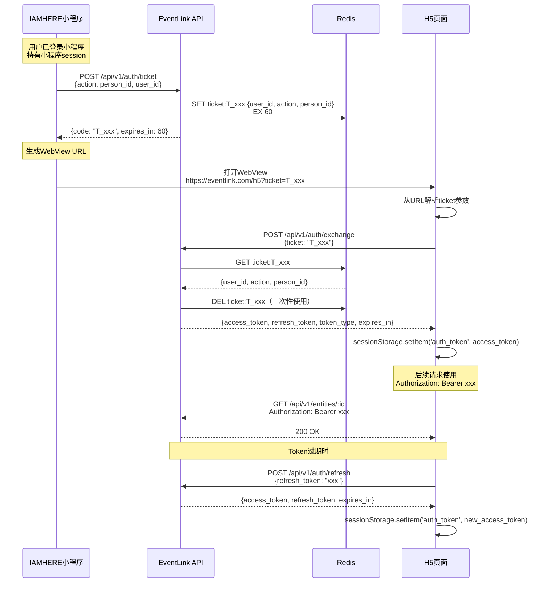
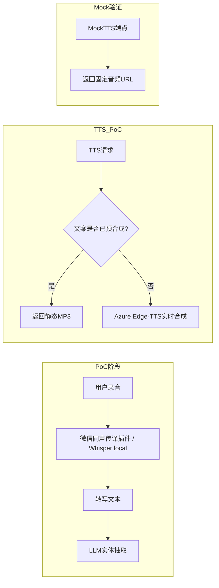

# EventLink集成设计文档 0.2.0

> **版本**: 0.2.0（POC阶段）
> **日期**: 2026-06-04
> **设计师**: 架构师团队
> **参考**: PRD v4.3, 技术设计 v2.5, API设计 v1.0, 数据库设计 v2.0, LLM_Prompt_Templates v2.0
> **状态**: POC阶段 — 共识清单D7-1~D7-11融合修订

---

## 关键决策（9条铁律）

| # | 决策 | 说明 |
|---|------|------|
| 1 | 产品定位 | AI驱动的**个人商务关系经营助手**（非"资源匹配平台"） |
| 2 | Todo类型 | 6种todo_type：cooperation_signal/risk/care/promise/followup/help；6种action_type：my_promise/their_promise/my_followup/mutual_action/system_reminder/unclear [0.2.0新增action_type] |
| 3 | 莫兰迪色系 | 雾白#B8C4C0/烟粉#C4A7A0/雾蓝#A0B0C4/雾绿#A0C4A8/雾金#C4C0A0/雾紫#B0A0C4 |
| 4 | 匹配算法 | ⏸️ **[F-05暂停] Phase2功能** — 六维算法（keyword25%+industry20%+topic15%+llm10%+history10%+callability20%）PoC阶段不启用 |
| 5 | 敏感度 | 2级：matchable/no_match |
| 6 | 部署 | PoC本地Docker+SQLite → Phase1云端Docker Compose+PG+Redis |
| 7 | 明确排除 | RBAC/多租户/团队协作/他人资源匹配/原生APP |
| 8 | 字段名 | todo_type（非todo_nature）、callability（非availability） |
| 9 | LLM Provider | Moka AI（https://api.moka-ai.com/v1），model: moka/claude-sonnet-4-6 [0.2.0新增] |

---

## 1. 集成概览

本文档定义10个关键集成模块的设计方案：

| # | 集成模块 | 优先级 | 状态 |
|---|---------|--------|------|
| 1 | IAMHERE小程序集成 | P0 | ✅ 设计完成（[D7-4] 微信OAuth code2session流程不变） |
| 2 | LLM集成设计 | P0 | ✅ 0.2.0更新（Moka AI + 模板0/3更新 + action_type） |
| 3 | TTS/ASR集成设计 | P0 | ✅ 0.2.0更新（Phase 1：Whisper/Azure Edge-TTS/Mock） |
| 4 | 微信服务号推送 | P1 | ✅ 设计完成（[D7-7] 模板消息/订阅消息框架不变） |
| 5 | CarryMem集成设计 | P1 | ✅ 0.2.0更新（三阶段路径：PoC→Phase1→Phase2） |
| 6 | 数字名片API对接 | P1 | 🔶 接口预留中（[D7-6] 陈宇欣团队+自建备选） |
| 7 | 数据导出集成 | P1 | ✅ 0.2.0新增（[D7-9] GET /data/export + PII脱敏） |
| 8 | Redis缓存服务 | P1 | ✅ 设计完成（[D7-8] CacheService不变） |
| 9 | 集成测试策略 | P0 | ✅ 设计完成 |
| 10 | 配置管理 | P1 | ✅ 设计完成 |

**集成架构总览（[0.2.0更新]）**:


---

## 2. IAMHERE小程序集成（[D7-4] 微信OAuth code2session流程不变）

### 2.1 WebView嵌入方案

小程序通过WebView嵌入EventLink H5页面，实现完整功能交互。

**嵌入规则**:
- H5页面域名必须在小程序业务域名白名单中
- WebView URL必须为HTTPS
- 小程序与H5通过`wx.miniProgram.postMessage()`和URL参数进行双向通信
- H5页面需适配移动端视口（viewport meta标签）

**页面映射**:

| 小程序页面 | H5路由 | 功能 |
|-----------|--------|------|
| 人物详情 | `/person/:id` | 人物画像+待办+商机 |
| 今日简报 | `/digest/morning` | 早晨简报 |
| 待办列表 | `/todos` | Todo管理 |
| 名片扫描 | `/scan` | OCR+LLM解析 |
| 语音录入 | `/voice-input` | 录音+ASR转写 |

### 2.2 Token传递：临时授权码（Ticket）模式

> ⚠️ **安全警告**：v1.0版本使用明文JWT通过URL参数传递（`?token=xxx&openid=xxx`），
> 这是不安全的！v1.1已改为临时授权码模式。

#### 2.2.1 为什么不用明文Token

| 风险 | 说明 |
|------|------|
| URL日志泄露 | 浏览器历史、代理服务器、CDN日志都会记录完整URL，JWT一旦泄露可被伪造 |
| Referer泄露 | H5页面发起的子请求会在Referer头中携带完整URL（含token） |
| 微信缓存 | 微信WebView可能缓存含token的URL，他人使用同一设备时可获取 |
| 不可撤销 | JWT在过期前无法撤销，泄露窗口=token有效期 |
| 多次使用 | 明文token可被截获后无限次重放 |

#### 2.2.2 Ticket模式流程



#### 2.2.3 生成授权码

**端点**: `POST /api/v1/auth/ticket`

**请求**:
```json
{
  "action": "view_person",
  "person_id": "uuid-of-person",
  "user_id": "uuid-of-user"
}
```

**响应**:
```json
{
  "code": "T_AbCdEf12345",
  "expires_in": 60,
  "created_at": "2026-06-03T10:00:00Z"
}
```

**Ticket存储（Redis）**:
```redis
SET ticket:T_AbCdEf12345 '{"user_id":"uuid","action":"view_person","person_id":"uuid","created_at":"2026-06-03T10:00:00Z"}' EX 60
```

**安全特性**:
- Ticket前缀`T_`区分于其他Redis key
- 60秒有效期，超时自动删除
- 单次使用：exchange成功后立即`DEL`
- Ticket不包含任何用户敏感信息，仅是随机字符串
- 随机字符串长度≥16字符，防暴力破解

#### 2.2.4 交换Token

**端点**: `POST /api/v1/auth/exchange`

**请求**:
```json
{
  "ticket": "T_AbCdEf12345"
}
```

**响应**:
```json
{
  "access_token": "eyJhbGciOiJSUzI1NiIsInR5cCI6IkpXVCJ9...",
  "refresh_token": "eyJhbGciOiJSUzI1NiIsInR5cCI6IkpXVCJ9...",
  "token_type": "Bearer",
  "expires_in": 900,
  "user_id": "uuid"
}
```

**JWT Payload**:
```json
{
  "user_id": "uuid",
  "exp": 1622620800,
  "iat": 1622619900,
  "iss": "eventlink",
  "scope": "view_person"
}
```

**错误响应**:

| 错误码 | 说明 | HTTP状态码 |
|--------|------|-----------|
| E2003 | Ticket无效或已使用 | 401 |
| E2004 | Ticket已过期 | 401 |
| E2005 | Ticket格式错误 | 400 |

### 2.3 数据通信

#### 2.3.1 H5→小程序

```javascript
// H5向小程序发送消息
wx.miniProgram.postMessage({
  data: {
    type: 'todo_completed',
    todo_id: 'uuid',
    timestamp: Date.now()
  }
})

// H5调用小程序原生能力
wx.miniProgram.navigateTo({
  url: '/pages/scan/scan'
})

wx.miniProgram.navigateBack()
```

#### 2.3.2 小程序→H5

```javascript
// 小程序通过URL参数传递指令
const h5Url = `https://eventlink.com/h5?ticket=${ticket}&action=view_person&id=${personId}`

// 小程序接收H5消息
<web-view src="{{h5Url}}" bindmessage="onMessage"></web-view>

// 小程序端处理
onMessage(e) {
  const data = e.detail.data
  if (data.type === 'todo_completed') {
    this.refreshTodoList()
  }
}
```

### 2.4 配置示例

#### 2.4.1 小程序端

```javascript
// 小程序页面 wxml
<web-view src="{{h5Url}}" bindmessage="onMessage"></web-view>

// 小程序页面 js
Page({
  data: {
    h5Url: ''
  },

  async onLoad(options) {
    const { personId } = options

    // 1. 获取临时授权码
    const ticketRes = await wx.request({
      url: 'https://api.eventlink.com/api/v1/auth/ticket',
      method: 'POST',
      data: {
        action: 'view_person',
        person_id: personId,
        user_id: getApp().globalData.userId
      },
      header: {
        'Authorization': `Bearer ${getApp().globalData.mpToken}`
      }
    })

    // 2. 构造H5 URL（仅传递ticket，不传明文token）
    this.setData({
      h5Url: `https://eventlink.com/h5?ticket=${ticketRes.data.code}`
    })
  },

  onMessage(e) {
    const msg = e.detail.data[e.detail.data.length - 1]
    if (msg.type === 'navigate_back') {
      wx.navigateBack()
    }
  }
})
```

#### 2.4.2 H5端

```javascript
// H5端 auth.js — Token管理模块
class AuthManager {
  constructor() {
    this.TOKEN_KEY = 'eventlink_auth'
    this.REFRESH_KEY = 'eventlink_refresh'
  }

  // 初始化：用ticket换取JWT
  async init() {
    const params = new URLSearchParams(location.search)
    const ticket = params.get('ticket')

    if (!ticket) {
      throw new Error('缺少ticket参数')
    }

    // 清除URL中的ticket参数（防止泄露）
    window.history.replaceState({}, '', location.pathname)

    try {
      const res = await fetch('/api/v1/auth/exchange', {
        method: 'POST',
        headers: { 'Content-Type': 'application/json' },
        body: JSON.stringify({ ticket })
      })

      if (!res.ok) throw new Error('Ticket交换失败')

      const data = await res.json()

      // 使用sessionStorage（非localStorage）存储token
      // sessionStorage在标签页关闭后自动清除，降低泄露风险
      sessionStorage.setItem(this.TOKEN_KEY, data.access_token)
      sessionStorage.setItem(this.REFRESH_KEY, data.refresh_token)

      return data
    } catch (err) {
      console.error('认证失败:', err)
      throw err
    }
  }

  // 获取有效token（自动刷新）
  async getToken() {
    let token = sessionStorage.getItem(this.TOKEN_KEY)

    if (token && !this._isExpired(token)) {
      return token
    }

    // 尝试刷新
    const refreshToken = sessionStorage.getItem(this.REFRESH_KEY)
    if (refreshToken) {
      const res = await fetch('/api/v1/auth/refresh', {
        method: 'POST',
        headers: { 'Content-Type': 'application/json' },
        body: JSON.stringify({ refresh_token: refreshToken })
      })

      if (res.ok) {
        const data = await res.json()
        sessionStorage.setItem(this.TOKEN_KEY, data.access_token)
        sessionStorage.setItem(this.REFRESH_KEY, data.refresh_token)
        return data.access_token
      }
    }

    // 刷新失败，重定向到小程序重新获取ticket
    this._redirectToMiniProgram()
    return null
  }

  _isExpired(token) {
    try {
      const payload = JSON.parse(atob(token.split('.')[1]))
      return payload.exp * 1000 < Date.now()
    } catch {
      return true
    }
  }

  _redirectToMiniProgram() {
    if (window.wx && wx.miniProgram) {
      wx.miniProgram.navigateTo({ url: '/pages/login/login' })
    }
  }

  // 登出
  logout() {
    sessionStorage.removeItem(this.TOKEN_KEY)
    sessionStorage.removeItem(this.REFRESH_KEY)
  }
}

export const authManager = new AuthManager()
```

### 2.5 安全对比

| 维度 | v1.0明文Token | v1.1 Ticket模式 |
|------|-------------|----------------|
| URL暴露 | JWT完整暴露在URL中 | 仅暴露一次性ticket |
| 有效期 | JWT有效期15分钟 | Ticket有效期60秒 |
| 可撤销 | JWT无法主动撤销 | Ticket使用后立即删除 |
| 重放攻击 | 可在有效期内重放 | 一次性使用，无法重放 |
| 存储方式 | localStorage（持久化） | sessionStorage（标签页关闭即清除） |
| 泄露影响 | 整个JWT泄露=身份冒用 | Ticket泄露仅60秒窗口 |

---

## 3. LLM集成设计

### 3.1 接口封装

统一LLMClient类封装LLM调用，[0.2.0更新] 使用 **Moka AI** 作为唯一Provider。

```python
from abc import ABC, abstractmethod
from enum import Enum
from typing import Optional

# [0.2.0更新] 统一使用Moka AI
MOKA_API_BASE = "https://api.moka-ai.com/v1"
MOKA_MODEL = "moka/claude-sonnet-4-6"

class LLMClient:
    """统一LLM客户端 — [0.2.0] Moka AI单Provider"""

    def __init__(self, config: dict):
        self.api_key = config.get("api_key")
        self.base_url = config.get("base_url", MOKA_API_BASE)
        self.model = config.get("model", MOKA_MODEL)
        self.max_tokens = config.get("max_tokens", 4000)  # [0.2.0] 提升至4000支持12模块
        self.timeout = config.get("timeout", 30)
        self._client: Optional[httpx.AsyncClient] = None

    async def _get_client(self) -> httpx.AsyncClient:
        if self._client is None or self._client.is_closed:
            self._client = httpx.AsyncClient(
                base_url=self.base_url,
                headers={
                    "Authorization": f"Bearer {self.api_key}",
                    "Content-Type": "application/json",
                },
                timeout=self.timeout,
            )
        return self._client

    async def call(
        self,
        prompt: str,
        model: str = None,
        max_tokens: Optional[int] = None,
        temperature: float = 0.3,
    ) -> str:
        """调用Moka AI LLM，失败时规则降级"""
        client = await self._get_client()
        try:
            resp = await client.post(
                "/chat/completions",
                json={
                    "model": model or self.model,
                    "messages": [{"role": "user", "content": prompt}],
                    "max_tokens": max_tokens or self.max_tokens,
                    "temperature": temperature,
                },
            )
            resp.raise_for_status()
            data = resp.json()
            return data["choices"][0]["message"]["content"]
        except Exception as e:
            logger.warning(f"Moka AI调用失败: {e}，使用规则降级")
            return self._rule_based_fallback(prompt)

    def _rule_based_fallback(self, prompt: str) -> str:
        """规则降级：LLM不可用时的兜底策略"""
        return '{"error": "llm_unavailable", "fallback": true}'
```

> [deprecated] v1.2的多Provider降级策略（OpenAI→Claude→通义千问）已替换为Moka AI单Provider + 规则降级。如需多Provider回退，可在Phase 2引入。

### 3.2 Prompt模板库（14个模板）

> 每个模板包含：完整prompt文本、输入变量、输出格式、示例
> [0.2.0更新] 新增模板0（Input Scope分类）+ 模板13/14（RelationshipBrief/RelationshipStage），统一使用Moka AI moka/claude-sonnet-4-6模型

---

#### 模板0：Input Scope 分类 [0.2.0新增]

**用途**: 对用户输入进行语义分类，确定输入属于哪种scope，以便路由到正确的处理管线（F-44）

**输入变量**:

| 变量 | 类型 | 说明 |
|------|------|------|
| user_input | string | 用户原始输入文本 |
| context_hint | string | 上下文提示（可选，如来源渠道） |

**8种Scope定义（[0.2.0新增]）**:

| Scope | 说明 | 关键词特征 | 示例 |
|-------|------|-----------|------|
| `card_scan` | 名片信息 | 名片、OCR、姓名+公司+职位、电话、邮箱 | "扫了张总的名片" |
| `meeting` | 会议纪要 | 会议、纪要、讨论、参会人、议程、决议 | "今天开了产品评审会" |
| `call` | 电话记录 | 电话、通话、沟通、聊了、对方说 | "刚跟李总通了电话" |
| `manual_input` | 手动补全 | 补充、添加、手动录入、自由文本 | "补充一下王明的信息" |
| `wechat_chat` | 微信聊天 | 微信、聊天记录、朋友圈、群聊 | "微信上跟王总聊了项目" |
| `email` | 邮件往来 | 邮件、邮件内容、附件、抄送 | "收到李总发的邮件" |
| `import` | 批量导入 | 导入、Excel、CSV、批量、通讯录 | "从通讯录导入了50个联系人" |
| `calendar` | 日历事件 | 日历、日程、会议邀请、提醒 | "日历上有明天下午的会议" |

**关键词触发规则（[0.2.0新增]）**:
1. 包含"扫"、"OCR"、"名片" → `card_scan`
2. 包含"会议"、"纪要"、"评审" → `meeting`
3. 包含"电话"、"通话"、"通了" → `call`
4. 包含"微信"、"聊天" → `wechat_chat`
5. 包含"邮件"、"收件箱" → `email`
6. 包含"导入"、"Excel"、"CSV" → `import`
7. 包含"日历"、"日程"、"会议邀请" → `calendar`
8. 包含"补充"、"添加"、"手动" → `manual_input`
9. **fallback默认值**: 无法匹配以上任一规则时返回 `manual_input`

**Prompt**:
```
你是一个EventLink输入分类器。请判断以下用户输入属于哪种scope。

8种scope定义：
1. card_scan（名片扫描）：名片扫描/OCR识别结果，包含姓名、公司、职位、联系方式等结构化或半结构化信息
2. meeting（会议）：会议纪要、讨论记录，包含参会人、议题、决议等
3. call（电话）：通话记录、沟通摘要，包含对话双方及交流要点
4. manual_input（手动补全）：用户主动补充的信息录入，自由文本形式
5. wechat_chat（微信聊天）：微信对话记录、朋友圈互动、群聊内容
6. email（邮件）：邮件往来内容，含附件和抄送信息
7. import（批量导入）：从外部数据源批量导入联系人或事件
8. calendar（日历）：日历中的日程安排、会议邀请、提醒事项

分类规则：
1. 优先匹配最具体的scope（如同时满足card_scan和manual_input，选card_scan）
2. 如果输入包含多个scope特征，选择置信度最高的主scope
3. 如果无法明确判断，返回manual_input作为默认值（fallback）
4. 输出secondary_scopes数组，列出其他可能匹配的scope（置信度>0.3）

用户输入：
{user_input}

上下文提示：
{context_hint}

输出JSON格式：
{{
  "primary_scope": "scope名称",
  "scope_confidence": 0.0-1.0,
  "secondary_scopes": [
    {{"scope": "scope名称", "confidence": 0.0-1.0}}
  ],
  "reasoning": "分类理由",
  "suggested_pipeline": "推荐处理管线",
  "is_ai_inference": false,
  "confidence_level": "confirmed",
  "requires_confirmation": false
}}
```

**输出示例**:
```json
{
  "primary_scope": "card_scan",
  "scope_confidence": 0.95,
  "secondary_scopes": [
    {"scope": "manual_input", "confidence": 0.3}
  ],
  "reasoning": "输入包含完整的姓名、公司、职位、联系方式字段，符合名片OCR输出特征",
  "suggested_pipeline": "card_save",
  "is_ai_inference": false,
  "confidence_level": "confirmed",
  "requires_confirmation": false
}
```

---

#### 模板1：名片信息提取

**用途**: 从OCR识别的名片文本中提取结构化人物信息，包含resource/demand字段

**输入变量**:

| 变量 | 类型 | 说明 |
|------|------|------|
| ocr_text | string | OCR识别的原始文本 |

**Prompt**:
```
你是一个商务名片信息提取专家。请从以下OCR识别的文本中提取结构化信息。

规则：
1. 如果某个字段无法识别，设为null
2. 电话号码统一格式：保留原始格式
3. resource字段：从职位/公司推断此人的核心能力和资源
4. demand字段：从公司业务方向推断此人可能的需求
5. 如果无法推断resource/demand，设为空数组

OCR文本：
{ocr_text}

输出JSON格式：
{{
  "name": "姓名",
  "company": "公司",
  "title": "职位",
  "phone": "电话",
  "email": "邮箱",
  "city": "城市",
  "resource": ["能力1", "能力2"],
  "demand": ["需求1"],
  "industry": "行业",
  "confidence": 0.95
}}
```

**输出示例**:
```json
{
  "name": "张三",
  "company": "智源AI科技",
  "title": "CEO",
  "phone": "13812345678",
  "email": "zhangsan@zhiyuan-ai.com",
  "city": "北京",
  "resource": ["AI算法专家", "计算机视觉5年经验", "AI公司管理经验"],
  "demand": ["寻找联合创始人", "需要前端开发团队"],
  "industry": "人工智能",
  "confidence": 0.95
}
```

---

#### 模板2：语音实体抽取

**用途**: 从语音转写文本中提取人物实体、事件和资源信息

**输入变量**:

| 变量 | 类型 | 说明 |
|------|------|------|
| transcript | string | ASR转写的对话文本 |
| language | string | 语言代码（zh-CN/en-US） |

**Prompt**:
```
你是一个商务对话分析专家。请从以下对话转写文本中提取关键信息。

规则：
1. 人物：提取所有提及的人物，包括说话人和被提及的人
2. 事件：提取讨论的事件/会议/项目
3. 资源识别：识别每个人物拥有的核心资源（能力、人脉、渠道）
4. 需求识别：识别每个人物表达的需求
5. 关键词：提取业务相关词汇
6. 如果信息不足以判断，对应字段设为null

对话文本（{language}）：
{transcript}

输出JSON格式：
{{
  "persons": [
    {{
      "name": "姓名",
      "company": "公司（如提及）",
      "title": "职位（如提及）",
      "resource": ["此人的能力/人脉/渠道"],
      "demand": ["此人表达的需求"]
    }}
  ],
  "events": [
    {{
      "name": "事件名称",
      "time": "时间（如提及）",
      "location": "地点（如提及）",
      "topic": "主题"
    }}
  ],
  "keywords": ["关键词1", "关键词2"],
  "summary": "对话摘要（50字以内）"
}}
```

**输出示例**:
```json
{
  "persons": [
    {
      "name": "李总",
      "company": "盛恒资本",
      "title": "投资总监",
      "resource": ["早期项目投资渠道", "AI领域投资经验"],
      "demand": ["寻找AI赛道优质项目"]
    },
    {
      "name": "王明",
      "company": null,
      "title": null,
      "resource": ["推荐了3个AI项目"],
      "demand": []
    }
  ],
  "events": [
    {
      "name": "投资对接会",
      "time": "下周三",
      "location": "国贸",
      "topic": "AI项目路演"
    }
  ],
  "keywords": ["AI投资", "早期项目", "路演"],
  "summary": "李总寻找AI项目，王明推荐了3个项目并安排下周路演"
}
```

---

#### 模板3：Todo生成（含todo_type + action_type + Promise双向识别）

**用途**: 根据对话内容和上下文生成待办事项，**必须指定todo_type和action_type**，并识别promisor/beneficiary [0.2.0更新]

**输入变量**:

| 变量 | 类型 | 说明 |
|------|------|------|
| conversation | string | 对话/事件内容 |
| persons | string | 相关人物信息 |
| todo_type | string | Todo类型（6种之一） |
| user_context | string | 用户自身资源/需求背景 |

**6种todo_type及生成策略**:

| todo_type | 说明 | 生成策略 | 优先级倾向 |
|-----------|------|---------|-----------|
| promise | 承诺 | 提取"我答应过什么"，强调兑现承诺的行动步骤和截止时间 | high |
| help | 帮助 | 建议"我能为他做什么"，基于对方需求给出可执行的援助方案 | medium |
| care | 关注 | 提取"对方正在关心什么"，标记对方关注点以便跟进 | medium |
| followup | 跟进 | 标记需跟进的事项，强调待确认点和下一步行动 | medium |
| cooperation_signal | 合作信号 | 识别合作信号，发现资源互补和合作可能 | high |
| risk | 风险 | 识别潜在风险，强调预警和规避措施 | high |

**6种action_type及识别规则（[0.2.0新增]）**:

| action_type | 说明 | 触发关键词示例 |
|-------------|------|---------------|
| `my_promise` | 我的承诺 | 我答应、我承诺、我会、保证、一定...给... |
| `their_promise` | 对方承诺 | 他说、对方答应、他承诺、他说会... |
| `my_followup` | 我的跟进 | 跟进、确认一下、后续了解、回头问 |
| `mutual_action` | 共同行动 | 一起、共同、双方、协作、配合 |
| `system_reminder` | 系统提醒 | 定期、周期性、每周、每月、例行 |
| `unclear` | 待确认 | 暂时不确定、待确认、需要再确认 |

**Promise双向识别规则（[0.2.0新增]）**:
1. **promisor识别**：判断"谁做出了承诺动作"——用户自己→`my_promise`；对方→`their_promise`
2. **beneficiary识别**：判断"谁从该承诺中受益"——用户自己受益或双方受益
3. **confirmation强制规则**：所有生成的Todo默认`confirmation: "pending"`，必须用户确认后才变为`confirmed`

**降噪规则（[0.2.0新增]）**:
1. 排除纯寒暄内容（"你好"、"谢谢"、"再见"等）
2. 排除重复信息（同一事项不重复生成Todo）
3. 排除过于模糊的表述（"以后再说"、"有空聊聊"等无明确行动项的内容）
4. 排除已完成的动作（"已经发了"、"已经联系了"等过去完成时）
5. 单次对话最多生成3条Todo，按优先级排序

**Prompt**:
```
你是一个个人商务关系经营助手。请根据以下信息生成待办事项。

Todo类型：{todo_type}
- promise（承诺）：提取"我答应过什么"，给出兑现承诺的行动步骤和截止时间
- help（帮助）：建议"我能为他做什么"，基于对方需求给出可执行的援助方案
- care（关注）：提取"对方正在关心什么"，标记对方关注点以便跟进
- followup（跟进）：标记需跟进的事项，列出待确认点和下一步行动
- cooperation_signal（合作信号）：识别合作信号，发现资源互补和合作可能
- risk（风险）：识别潜在风险，给出预警和规避措施

Action类型（[0.2.0新增]必须从6种中选择最匹配的一种）：
- my_promise（我的承诺）：我答应、我承诺、我会、保证 → 进入用户Todo列表
- their_promise（对方承诺）：他说、对方答应、他承诺 → 显示"等待对方回应"
- my_followup（我的跟进）：跟进、确认、后续了解 → 生成跟进型Todo
- mutual_action（共同行动）：一起、共同、双方协作 → 双方各生成一条Todo
- system_reminder（系统提醒）：定期、周期性、每周 → 系统自动生成
- unclear（待确认）：暂时不确定、需再确认 → 标记待用户手动确认

Promise双向识别规则（[0.2.0新增]）：
1. 判断谁做出承诺（promisor）：用户自己→my_promise，对方→their_promise
2. 判断谁受益（beneficiary）：明确受益方
3. 所有Todo默认confirmation="pending"，需用户确认

降噪规则（[0.2.0新增]）：
1. 排除纯寒暄（你好/谢谢/再见）
2. 排除重复信息
3. 排除模糊表述（以后再说/有空聊聊）
4. 排除已完成动作（已经发了）
5. 单次最多3条Todo

对话内容：
{conversation}

相关人物：
{persons}

用户背景：
{user_context}

规则：
1. 描述必须简洁明确，不超过100字
2. 根据todo_type采用不同的语气和侧重点
3. priority必须与todo_type匹配
4. due_date建议：promise/cooperation_signal=3天内，risk=1天内，care/followup=7天内，help=5天内
5. context字段必须包含生成此Todo的原因
6. action_type必须从6种中选择最匹配的一种 [0.2.0强制]
7. 必须识别promisor和beneficiary（如有对应人物）[0.2.0强制]
8. confirmation默认为"pending"，表示待用户确认 [0.2.0强制]
9. evidence_quote必须包含原文引用作为证据 [0.2.0强制]

输出语言规则：
1. 输出语言必须与输入语言一致
2. 禁止建议索取资源
3. 禁止自动撮合
4. 推测必须标记

输出JSON格式：
{{
  "todo_type": "{todo_type}",
  "action_type": "my_promise|their_promise|my_followup|mutual_action|system_reminder|unclear",
  "description": "Todo描述",
  "priority": "high|medium|low",
  "due_date_suggestion": "建议截止时间（ISO 8601）",
  "confirmation": "pending",
  "promisor": "承诺人姓名或null",
  "beneficiary": "受益人姓名或null",
  "evidence_quote": "证据原文引用",
  "context": {{
    "reason": "生成原因",
    "suggested_action": "建议行动",
    "related_entities": ["相关人物名"]
  }},
  "is_ai_inference": true,
  "confidence_level": "confirmed|inferred|speculated",
  "requires_confirmation": true
}}
```

**输出示例（cooperation_signal + my_promise类型）[0.2.0更新]**:
```json
{
  "todo_type": "cooperation_signal",
  "action_type": "my_promise",
  "description": "⚪ 合作信号：李总寻找AI项目，王明有3个推荐项目可对接",
  "priority": "high",
  "due_date_suggestion": "2026-06-06T00:00:00Z",
  "confirmation": "pending",
  "promisor": "我（用户）",
  "beneficiary": "李总",
  "evidence_quote": "李总说'最近一直在看AI赛道的项目'，王明推荐了3个项目",
  "context": {
    "reason": "李总（盛恒资本投资总监）正在寻找AI赛道项目，与王明推荐的3个项目高度匹配，存在合作可能",
    "suggested_action": "联系王明获取项目详情，安排与李总的路演对接",
    "related_entities": ["李总", "王明"]
  },
  "is_ai_inference": true,
  "confidence_level": "inferred",
  "requires_confirmation": true
}
```

**输出示例（help + send类型）[0.2.0更新]**:
```json
{
  "todo_type": "help",
  "action_type": "send",
  "description": "🟢 帮助：张总最近在关注AI大模型落地，你可以分享相关案例",
  "priority": "medium",
  "due_date_suggestion": "2026-06-08T00:00:00Z",
  "confirmation": "pending",
  "promisor": null,
  "beneficiary": "张总",
  "evidence_quote": "张总提到'正在研究大模型落地场景'",
  "context": {
    "reason": "张总（AI公司CEO）正在研究大模型落地场景，你有相关行业案例可以分享",
    "suggested_action": "整理2-3个大模型落地案例，微信发给张总参考",
    "related_entities": ["张总"]
  },
  "is_ai_inference": false,
  "confidence_level": "confirmed",
  "requires_confirmation": false
}
```

---

#### 模板4：商机描述优化

**用途**: 优化用户输入的商机描述，使其结构化、清晰

**输入变量**:

| 变量 | 类型 | 说明 |
|------|------|------|
| raw_description | string | 用户原始描述 |
| related_person | string | 相关人物信息（可选） |

**Prompt**:
```
你是一个商务写作优化专家。请优化以下商机描述，使其更清晰、更结构化。

规则：
1. 明确区分需求方和资源方
2. 提取业务领域和关键词
3. 评估callability（可联络性）：该商机是否可以通过现有关系触达
4. 保持原意，不添加不存在的信息
5. 优化后描述不超过200字

原始描述：
{raw_description}

相关人物：
{related_person}

输出JSON格式：
{{
  "optimized_description": "优化后的描述",
  "demand_side": "需求方",
  "resource_side": "资源方",
  "domain": "业务领域",
  "keywords": ["关键词1", "关键词2"],
  "callability": "high|medium|low",
  "callability_reason": "可联络性评估原因"
}}
```

**输出示例**:
```json
{
  "optimized_description": "盛恒资本（投资总监李总）寻找AI赛道早期项目，预算500万-2000万，偏好计算机视觉和NLP方向。可通过王明引荐对接。",
  "demand_side": "盛恒资本（李总）",
  "resource_side": "王明（可引荐3个AI项目）",
  "domain": "AI投资",
  "keywords": ["AI投资", "早期项目", "计算机视觉", "NLP"],
  "callability": "high",
  "callability_reason": "王明与李总有直接联系，可安排路演对接"
}
```

---

#### 模板5：实体归一判断

**用途**: 判断两个实体是否为同一人/同一组织

**输入变量**:

| 变量 | 类型 | 说明 |
|------|------|------|
| entity_a | string | 实体A的信息（JSON） |
| entity_b | string | 实体B的信息（JSON） |

**Prompt**:
```
你是一个实体归一判断专家。请判断以下两个实体是否为同一人/同一组织。

规则：
1. 综合考虑姓名、公司、职位、联系方式、行业等多维度
2. 同一人可能在不同场景使用不同称呼（如"张三"/"张总"/"Zhang San"）
3. 同一人可能换了公司或职位
4. 如果信息冲突（如不同手机号+不同公司+不同行业），判断为不同人
5. 给出0.0-1.0的置信度分数

实体A：
{entity_a}

实体B：
{entity_b}

输出JSON格式：
{{
  "is_same": true|false,
  "confidence": 0.0-1.0,
  "reasoning": "判断理由",
  "conflict_fields": ["冲突字段列表"],
  "matched_fields": ["匹配字段列表"],
  "suggestion": "merge|keep_separate|need_confirm"
}}
```

**输出示例**:
```json
{
  "is_same": true,
  "confidence": 0.88,
  "reasoning": "姓名相同，公司相同，职位从CTO变更为CEO符合晋升路径，手机号前7位一致",
  "conflict_fields": ["title"],
  "matched_fields": ["name", "company", "phone_prefix", "industry"],
  "suggestion": "merge"
}
```

---

#### 模板6：关系发现

**用途**: 从文本中发现两个实体之间的潜在关联关系

**输入变量**:

| 变量 | 类型 | 说明 |
|------|------|------|
| entity_a | string | 实体A信息 |
| entity_b | string | 实体B信息 |
| context_text | string | 上下文文本（对话/事件记录） |

**Prompt**:
```
你是一个商务关系分析专家。请分析以下两个实体之间可能存在的关系。

关联类型（8种）：
- alumni：校友关系
- ex_colleague：前同事
- same_city：同城
- competitor：竞对关系
- tech_overlap：技术重叠
- deal_link：交易关联
- risk_link：风险关联
- supply_chain：供应链关系

实体A：
{entity_a}

实体B：
{entity_b}

上下文：
{context_text}

规则：
1. 基于实体信息和上下文文本综合判断
2. 一对实体可能存在多种关联
3. 每种关联给出0.0-1.0的置信度
4. 置信度≥0.7的关联才输出
5. 提供判断依据

输出JSON格式：
{{
  "associations": [
    {{
      "assoc_type": "关联类型",
      "confidence": 0.0-1.0,
      "evidence": "判断依据"
    }}
  ]
}}
```

**输出示例**:
```json
{
  "associations": [
    {
      "assoc_type": "alumni",
      "confidence": 0.92,
      "evidence": "两人均毕业于清华大学计算机系，张三2010届，李四2012届"
    },
    {
      "assoc_type": "tech_overlap",
      "confidence": 0.78,
      "evidence": "两人都在AI领域，张三专注CV，李四专注NLP，技术栈有重叠"
    }
  ]
}
```

---

#### 模板7：资源识别（新增）

**用途**: 从文本中识别人的资源（能力、人脉、渠道），用于私密资源经营

**输入变量**:

| 变量 | 类型 | 说明 |
|------|------|------|
| text | string | 包含人物信息的文本 |
| person_name | string | 目标人物姓名 |

**Prompt**:
```
你是一个个人商务关系经营助手的资源识别模块。请从以下文本中识别{person_name}的核心资源。

资源分类：
1. 能力资源：专业技能、行业经验、知识储备
2. 人脉资源：可触达的关键人物、社交网络
3. 渠道资源：可调动的资金、项目、市场渠道

规则：
1. 仅提取有明确文本依据的资源，不推测
2. 每个资源标注来源句子
3. 评估资源的稀缺性（高/中/低）
4. 评估资源的可触达性（callability）：用户是否可以通过现有关系链触达

文本：
{text}

目标人物：{person_name}

输出JSON格式：
{{
  "person": "{person_name}",
  "resources": [
    {{
      "category": "ability|network|channel",
      "description": "资源描述",
      "source_text": "来源原文",
      "scarcity": "high|medium|low",
      "callability": "high|medium|low",
      "callability_reason": "可触达性原因"
    }}
  ],
  "resource_summary": "资源概况（50字内）"
}}
```

**输出示例**:
```json
{
  "person": "李总",
  "resources": [
    {
      "category": "ability",
      "description": "AI领域早期项目投资经验，5年投资总监",
      "source_text": "李总是盛恒资本投资总监，专注AI赛道5年",
      "scarcity": "high",
      "callability": "high",
      "callability_reason": "通过王明可直接引荐"
    },
    {
      "category": "channel",
      "description": "盛恒资本500万-2000万早期项目投资预算",
      "source_text": "预算500万-2000万",
      "scarcity": "high",
      "callability": "medium",
      "callability_reason": "需通过路演形式对接，非直接可触达"
    },
    {
      "category": "network",
      "description": "AI创业者社群，可触达50+AI项目创始人",
      "source_text": "李总在AI创业者社群很活跃",
      "scarcity": "medium",
      "callability": "low",
      "callability_reason": "社群资源需通过李总引荐，间接触达"
    }
  ],
  "resource_summary": "李总拥有AI投资渠道和人脉网络，是高价值投资类资源"
}
```

---

#### 模板8：需求提取（新增）

**用途**: 从文本中提取人的需求，用于商机匹配

**输入变量**:

| 变量 | 类型 | 说明 |
|------|------|------|
| text | string | 包含人物信息的文本 |
| person_name | string | 目标人物姓名 |

**Prompt**:
```
你是一个个人商务关系经营助手的需求提取模块。请从以下文本中提取{person_name}的需求。

需求分类：
1. 人才需求：招聘、合作、推荐
2. 资金需求：融资、投资、预算
3. 资源需求：渠道、供应商、合作伙伴
4. 信息需求：行业信息、市场情报、技术趋势

规则：
1. 仅提取有明确文本依据的需求，不推测
2. 每个需求标注来源句子
3. 评估需求的紧迫性（高/中/低）
4. 评估需求的匹配潜力：用户是否有资源可以匹配此需求

文本：
{text}

目标人物：{person_name}

输出JSON格式：
{{
  "person": "{person_name}",
  "demands": [
    {{
      "category": "talent|funding|resource|information",
      "description": "需求描述",
      "source_text": "来源原文",
      "urgency": "high|medium|low",
      "match_potential": "high|medium|low",
      "match_reason": "匹配潜力原因"
    }}
  ],
  "demand_summary": "需求概况（50字内）"
}}
```

**输出示例**:
```json
{
  "person": "李总",
  "demands": [
    {
      "category": "resource",
      "description": "寻找AI赛道优质早期项目",
      "source_text": "李总正在寻找AI赛道的优质早期项目",
      "urgency": "high",
      "match_potential": "high",
      "match_reason": "用户认识多个AI创业者，可推荐项目"
    },
    {
      "category": "talent",
      "description": "需要AI技术顾问协助项目评估",
      "source_text": "李总提到评估AI项目需要技术顾问",
      "urgency": "medium",
      "match_potential": "medium",
      "match_reason": "用户有AI技术背景，可提供评估支持"
    }
  ],
  "demand_summary": "李总急需AI项目推荐和技术评估支持"
}
```

---

#### 模板9：敏感度判断（新增）

**用途**: 判断资源/需求是否适合进行匹配推荐，保护用户隐私

**输入变量**:

| 变量 | 类型 | 说明 |
|------|------|------|
| resource_text | string | 资源描述 |
| demand_text | string | 需求描述 |
| person_info | string | 人物信息 |

**Prompt**:
```
你是一个隐私保护专家。请判断以下资源/需求是否适合在个人商务关系经营助手中进行匹配推荐。

敏感度级别：
- matchable：可以匹配推荐。信息属于公开或半公开性质，匹配推荐不会造成隐私风险。
- no_match：不可匹配推荐。信息涉及敏感隐私，匹配推荐可能造成关系损害或隐私泄露。

判断标准：
1. 涉及个人财务状况（薪资、资产）→ no_match
2. 涉及未公开的商业机密 → no_match
3. 涉及个人健康/家庭隐私 → no_match
4. 明确表示不希望被推荐 → no_match
5. 公开可获取的行业信息 → matchable
6. 在公开场合表达的需求 → matchable
7. 一般性的职业能力和经验 → matchable
8. 通用的人脉关系（校友/同行）→ matchable

资源描述：
{resource_text}

需求描述：
{demand_text}

人物信息：
{person_info}

输出JSON格式：
{{
  "sensitivity": "matchable|no_match",
  "confidence": 0.0-1.0,
  "reasoning": "判断理由",
  "risk_points": ["风险点列表（如有）"],
  "safe_alternative": "安全的替代描述（如敏感，给出脱敏版本）"
}}
```

**输出示例**:
```json
{
  "sensitivity": "matchable",
  "confidence": 0.92,
  "reasoning": "李总的投资需求在公开路演中表达，属于半公开信息，匹配推荐不会造成隐私风险",
  "risk_points": [],
  "safe_alternative": null
}
```

**输出示例（no_match）**:
```json
{
  "sensitivity": "no_match",
  "confidence": 0.88,
  "reasoning": "张总私下透露正在考虑离职创业，此信息未公开，匹配推荐可能损害其当前职位",
  "risk_points": ["未公开的离职意向", "可能影响当前职位稳定性"],
  "safe_alternative": "张总对AI创业方向有兴趣（脱敏版本）"
}
```

---

#### 模板10：关系维护建议（新增）

**用途**: 基于交互历史生成关系维护建议，辅助用户经营人脉

**输入变量**:

| 变量 | 类型 | 说明 |
|------|------|------|
| person_info | string | 人物信息（JSON） |
| interaction_history | string | 交互历史摘要 |
| days_since_last | int | 距上次联系天数 |

**Prompt**:
```
你是一个个人商务关系经营助手的关系维护模块。请基于以下信息生成关系维护建议。

规则：
1. 根据关系亲密度和重要程度给出不同频次的维护建议
2. 维护方式要自然，避免刻意感
3. 建议要具体可执行，不要笼统的"保持联系"
4. 考虑时机（节日、行业事件、对方动态）
5. 生成todo_type为help的待办建议

人物信息：
{person_info}

交互历史：
{interaction_history}

距上次联系：{days_since_last}天

维护频次参考：
- 核心人脉（高频合作）：7-14天
- 重要人脉（有合作潜力）：14-30天
- 一般人脉（保持联络）：30-60天
- 沉默人脉（长期未联系）：60-90天

输出JSON格式：
{{
  "todo_type": "help",
  "description": "帮助建议描述",
  "priority": "high|medium|low",
  "suggested_action": "具体行动建议",
  "suggested_timing": "建议时机",
  "message_template": "可发送的消息模板（可选）",
  "reasoning": "建议理由"
}}
```

**输出示例**:
```json
{
  "todo_type": "help",
  "description": "🟢 帮助：与李总已21天未联系，建议分享AI行业资讯",
  "priority": "medium",
  "suggested_action": "微信分享一篇AI投资趋势文章，附简短评论",
  "suggested_timing": "工作日上午10-11点（投资圈阅读高峰）",
  "message_template": "李总，看到这篇AI投资趋势分析，跟您之前关注的CV方向相关，供参考 👆",
  "reasoning": "李总是重要投资人人脉，21天未联系接近维护窗口期，分享行业资讯是最自然的触达方式"
}
```

---

#### 模板11：承诺提取（新增）

**用途**: 从交流内容中提取"我答应过什么"，生成promise类型的Todo

**输入变量**:

| 变量 | 类型 | 说明 |
|------|------|------|
| conversation | string | 对话/交流内容 |
| persons | string | 相关人物信息 |

**Prompt**:
```
你是一个个人商务关系经营助手。请从以下交流内容中提取"我答应过什么"——即用户自己做出的承诺。

规则：
1. 仅提取用户（第一人称）做出的承诺，不提取对方的承诺
2. 承诺包括：答应做的事、答应提供的资源、答应的见面/通话、答应的介绍/推荐
3. 每个承诺必须包含：对谁承诺、承诺了什么
4. 如果承诺有明确时间，提取时间；如果没有，建议一个合理的截止时间
5. 不推测，仅提取有明确文本依据的承诺
6. 如果没有发现承诺，返回空数组

交流内容：
{conversation}

相关人物：
{persons}

输出JSON格式：
{{
  "promises": [
    {{
      "to_person": "承诺对象",
      "content": "承诺内容",
      "mentioned_deadline": "提及的截止时间（如无则为null）",
      "suggested_deadline": "建议截止时间（ISO 8601）",
      "priority": "high|medium|low",
      "source_text": "来源原文"
    }}
  ],
  "summary": "承诺概况（30字内）"
}}
```

**输出示例**:
```json
{
  "promises": [
    {
      "to_person": "李总",
      "content": "下周一前发送AI项目资料",
      "mentioned_deadline": "下周一",
      "suggested_deadline": "2026-06-09T00:00:00Z",
      "priority": "high",
      "source_text": "我说好下周一前把AI项目的资料发给您"
    },
    {
      "to_person": "王明",
      "content": "介绍AI算法工程师",
      "mentioned_deadline": null,
      "suggested_deadline": "2026-06-10T00:00:00Z",
      "priority": "medium",
      "source_text": "我答应帮他介绍一个做AI算法的工程师"
    }
  ],
  "summary": "2项承诺：给李总发资料、给王明介绍人"
}
```

---

#### 模板12：关注点提取（新增）

**用途**: 从交流内容中提取"对方正在关心什么"，生成care类型的Todo

**输入变量**:

| 变量 | 类型 | 说明 |
|------|------|------|
| conversation | string | 对话/交流内容 |
| persons | string | 相关人物信息 |

**Prompt**:
```
你是一个个人商务关系经营助手。请从以下交流内容中提取"对方正在关心什么"——即交流对象关注的议题和痛点。

规则：
1. 仅提取对方（非用户本人）表达的关注点
2. 关注点包括：正在解决的问题、正在考虑的方案、正在寻找的资源、表达过的担忧
3. 每个关注点必须包含：谁在关注、关注什么
4. 标注关注点的紧迫程度
5. 不推测，仅提取有明确文本依据的关注点
6. 如果没有发现关注点，返回空数组

交流内容：
{conversation}

相关人物：
{persons}

输出JSON格式：
{{
  "cares": [
    {{
      "person": "关注者",
      "topic": "关注议题",
      "detail": "关注详情",
      "urgency": "high|medium|low",
      "source_text": "来源原文"
    }}
  ],
  "summary": "关注点概况（30字内）"
}}
```

**输出示例**:
```json
{
  "cares": [
    {
      "person": "李总",
      "topic": "AI项目投资评估",
      "detail": "正在寻找AI赛道优质早期项目，关注计算机视觉和NLP方向",
      "urgency": "high",
      "source_text": "李总说他最近一直在看AI赛道的项目，特别是CV和NLP方向的"
    },
    {
      "person": "王明",
      "topic": "团队招聘",
      "detail": "正在招聘AI算法工程师，已经找了2个月还没找到合适的",
      "urgency": "medium",
      "source_text": "王明提到他们团队缺一个AI算法工程师，招了两个月了"
    }
  ],
  "summary": "2个关注点：李总关注AI投资，王明关注招聘"
}
```

---

### 3.3 重试机制

| 参数 | 值 | 说明 |
|------|---|------|
| 最大重试次数 | 3 | 超过3次返回错误 |
| 退避策略 | 指数退避 | 1s → 2s → 4s |
| 超时时间 | 30s | 单次请求超时 |
| 降级策略 | Moka AI → 规则降级 | [0.2.0] 单Provider + fallback |

```python
import asyncio
from tenacity import retry, stop_after_attempt, wait_exponential, retry_if_exception_type

@retry(
    stop=stop_after_attempt(3),
    wait=wait_exponential(multiplier=1, min=1, max=4),
    retry=retry_if_exception_type((LLMTimeoutError, LLMRateLimitError)),
)
async def call_with_retry(prompt: str, model: str = "moka/claude-sonnet-4-6") -> str:
    """[0.2.0] Moka AI重试调用"""
    return await llm_client.call(prompt, model=model)
```

### 3.4 成本控制

| 参数 | 值 | 说明 |
|------|---|------|
| 单次请求Token上限 | 4000 | 防止过长prompt（[0.2.0]提升以支持12模块填充） |
| 每日Token配额 | 10万 | 控制日成本 |
| 模型选择策略 | 统一使用Moka AI | moka/claude-sonnet-4-6 |
| 缓存策略 | 相同prompt缓存24h | 避免重复调用 |

**模型选择策略（[0.2.0更新] 统一Moka AI）**:

| 模板 | 推荐模型 | 原因 |
|------|---------|------|
| 模板0 Input Scope分类 | moka/claude-sonnet-4-6 | 分类任务，需要理解scope语义 |
| 模板1 名片提取 | moka/claude-sonnet-4-6 | 结构化提取，简单任务 |
| 模板2 语音实体抽取 | moka/claude-sonnet-4-6 | 需要理解上下文 |
| 模板3 Todo生成 | moka/claude-sonnet-4-6 | 需要理解6种action_type策略+降噪规则 |
| 模板4 商机优化 | moka/claude-sonnet-4-6 | 文本优化，中等任务 |
| 模板5 实体归一 | moka/claude-sonnet-4-6 | 需要推理判断 |
| 模板6 关系发现 | moka/claude-sonnet-4-6 | 需要综合分析 |
| 模板7 资源识别 | moka/claude-sonnet-4-6 | 需要深度理解 |
| 模板8 需求提取 | moka/claude-sonnet-4-6 | 需要深度理解 |
| 模板9 敏感度判断 | moka/claude-sonnet-4-6 | 需要安全判断 |
| 模板10 关系维护 | moka/claude-sonnet-4-6 | 基于规则+模板生成 |
| 模板11 承诺提取 | moka/claude-sonnet-4-6 | 需要理解承诺语义 |
| 模板12 关注点提取 | moka/claude-sonnet-4-6 | 需要理解关注意图 |

> [deprecated] v1.2的按模板选不同模型（gpt-3.5/gpt-4）策略已替换为统一moka/claude-sonnet-4-6。

### 3.5 错误处理

```python
class LLMError(Exception):
    """LLM调用基础异常"""

class LLMTimeoutError(LLMError):
    """请求超时"""

class LLMRateLimitError(LLMError):
    """速率限制"""

class LLMQuotaExceeded(LLMError):
    """配额耗尽"""

class LLMResponseParseError(LLMError):
    """响应解析失败"""

async def safe_llm_call(prompt: str, model: str = "gpt-4") -> dict:
    """安全的LLM调用，包含完整的错误处理和降级"""
    try:
        result = await llm_client.call(prompt, model=model)
        return json.loads(result)
    except LLMTimeoutError:
        # 降级到轻量模型
        result = await llm_client.call(prompt, model="gpt-3.5-turbo")
        return json.loads(result)
    except LLMQuotaExceeded:
        # 使用本地规则
        return rule_based_fallback(prompt)
    except LLMResponseParseError:
        # JSON解析失败，尝试修复
        return repair_json(result)
    except LLMError:
        # 其他LLM错误
        return {"error": "llm_unavailable", "fallback": True}
```

### 3.6 AI输出语言规则

> 所有Prompt模板必须遵守以下语言规则，确保AI输出安全、准确、可控。

#### 3.6.1 输出语言约束

所有Prompt模板必须包含以下输出语言约束指令：

```
输出语言规则：
1. 输出语言必须与输入语言一致（中文输入→中文输出，英文输入→英文输出）
2. 专业术语可保留原文，但必须附带中文解释
3. 日期格式统一使用ISO 8601
4. 数值不带单位时使用国际单位制
```

#### 3.6.2 禁止行为

| # | 禁止行为 | 说明 | 示例 |
|---|---------|------|------|
| 1 | 禁止AI自动判定对方资源 | AI不得对他人拥有的资源做出确定性判断 | ❌ "李总拥有500万投资预算" ✅ "李总提到有投资预算（来源：对话原文）" |
| 2 | 禁止AI建议索取资源 | AI不得建议用户向他人索取资源 | ❌ "你可以向李总申请投资" ✅ "你可以了解李总的投资方向是否与你的项目匹配" |
| 3 | 推测必须标记为推测 | 任何非直接引用的推断必须标注 | ❌ "李总需要AI项目" ✅ "李总可能需要AI项目（推测依据：对话中提到…）" |

#### 3.6.3 正确/错误输出示例

**场景：从对话中提取信息**

❌ **错误输出**：
```json
{
  "person": "李总",
  "resource": ["500万投资预算", "AI行业人脉"],
  "demand": ["需要你的AI项目推荐"]
}
```
> 问题：① "500万投资预算"是AI自动判定对方资源 ② "需要你的AI项目推荐"是AI建议索取资源 ③ 均无来源标注

✅ **正确输出**：
```json
{
  "person": "李总",
  "resource": ["投资预算（来源：李总提到'预算500万-2000万'）"],
  "demand": ["寻找AI赛道项目（来源：李总提到'正在寻找AI赛道的优质早期项目'）"],
  "speculation": []
}
```

**场景：生成Todo建议**

❌ **错误输出**：
```json
{
  "todo_type": "help",
  "description": "向李总申请500万投资"
}
```
> 问题：AI建议索取资源

✅ **正确输出**：
```json
{
  "todo_type": "help",
  "description": "李总正在寻找AI项目，你可以分享你的项目信息供其参考"
}
```

---

## 4. TTS/ASR集成设计

### 4.1 服务商选择（[0.2.0更新] Phase 1方案）

| 服务商 | 用途 | Phase 1策略 | 特点 |
|--------|------|------------|------|
| **微信同声传译插件** | ASR | **PoC首选** — 小程序内置，零额外依赖，实时转写 | 微信原生集成，无需第三方API |
| **Whisper (local)** | ASR | **备选** — 本地部署OpenAI Whisper模型，离线可用 | 隐私友好，无网络延迟 |
| 阿里云智能语音 | ASR+TTS | [deprecated] Phase 2再评估 | 中文识别率最高 |
| **Azure Edge-TTS** | TTS | **Phase 1首选** — 免费开源，预合成MP3缓存 | 多语言支持好，可本地运行 |
| **预合成MP3** | TTS | **PoC首选** — 常用文案预先合成，直接返回静态文件 | 零延迟，开发成本最低 |

### 4.1.1 Phase 1集成架构 [0.2.0新增]



### 4.1.2 Mock TTS验证端点 [0.2.0新增]

> PoC阶段使用Mock TTS端点验证完整链路，避免TTS服务依赖阻塞开发。

```python
class MockTTSClient(TTSClient):
    """PoC阶段 Mock TTS 实现用于验证"""

    VOICE_MAP = {
        "female_neutral": "mock_female_neutral",
        "female_warm": "mock_female_warm",
        "male_neutral": "mock_male_neutral",
        "male_professional": "mock_male_professional",
    }

    async def synthesize(
        self,
        text: str,
        voice: str = "female_neutral",
        language: str = "zh-CN",
        speed: float = 1.0,
        format: str = "mp3",
    ) -> TTSResult:
        """Mock TTS：返回预录制的固定音频"""
        logger.info(f"[MockTTS] synthesize: text='{text[:20]}...', voice={voice}")
        return TTSResult(
            audio_url=f"/static/mock_tts/{self.VOICE_MAP.get(voice, 'mock_female_neutral')}.mp3",
            duration=2.0,  # 固定2秒
            format="mp3",
            size=32000,   # 约32KB
        )
```

**预合成MP3列表（PoC常用文案）**:

| 文案ID | 文案内容 | 语音风格 | 用途 |
|--------|---------|---------|------|
| `morning_digest` | "早上好，今日有N条待办需要处理" | female_warm | 今日简报 |
| `todo_remind` | "您有一条待办即将到期" | male_professional | Todo提醒 |
| `person_brief` | "以下是XX的简要信息" | female_neutral | 人物速览 |

### 4.2 ASR（语音识别）详细设计

#### 4.2.1 录音转写流程


#### 4.2.2 ASR接口封装

```python
from abc import ABC, abstractmethod
from dataclasses import dataclass
from typing import Optional

@dataclass
class ASRResult:
    text: str
    duration: float  # 音频时长（秒）
    language: str
    confidence: float  # 整体置信度
    segments: list  # 分段结果
    words: list  # 词级时间戳

class ASRClient(ABC):
    """ASR客户端抽象基类"""

    @abstractmethod
    async def transcribe(
        self,
        audio_file: bytes,
        language: str = "zh-CN",
        sample_rate: int = 16000,
        enable_words: bool = True,
    ) -> ASRResult:
        """离线转写"""
        ...

    @abstractmethod
    async def start_stream(self, language: str = "zh-CN") -> str:
        """开始实时转写流，返回stream_id"""
        ...

    @abstractmethod
    async def send_chunk(self, stream_id: str, audio_chunk: bytes) -> Optional[str]:
        """发送音频片段，返回中间结果"""
        ...

    @abstractmethod
    async def end_stream(self, stream_id: str) -> ASRResult:
        """结束实时转写流，返回最终结果"""
        ...


class AliyunASRClient(ASRClient):
    """阿里云ASR实现"""

    def __init__(self, config: dict):
        self.app_key = config["app_key"]
        self.access_key_id = config["access_key_id"]
        self.access_key_secret = config["access_key_secret"]
        self.ws_url = "wss://nls-gateway-cn-shanghai.aliyuncs.com/ws/v1"

    async def transcribe(self, audio_file: bytes, language: str = "zh-CN",
                         sample_rate: int = 16000, enable_words: bool = True) -> ASRResult:
        # 1. 上传音频到OSS（或直接发送）
        # 2. 调用阿里云一句话识别API
        # 3. 解析结果
        ...

    async def start_stream(self, language: str = "zh-CN") -> str:
        # 建立WebSocket连接
        ...

    async def send_chunk(self, stream_id: str, audio_chunk: bytes) -> Optional[str]:
        # 发送音频片段
        ...

    async def end_stream(self, stream_id: str) -> ASRResult:
        # 发送结束信号，获取最终结果
        ...
```

#### 4.2.3 实时转写流程

**适用场景**: 会议记录、长时间对话

```python
async def realtime_transcription(audio_stream, language: str = "zh-CN"):
    """实时转写：边录音边出文字"""
    stream_id = await asr_client.start_stream(language=language)

    intermediate_results = []

    try:
        async for chunk in audio_stream:
            # 发送音频片段
            partial = await asr_client.send_chunk(stream_id, chunk)
            if partial:
                intermediate_results.append(partial)
                # 通过SSE推送中间结果给前端
                await sse_push({"type": "partial", "text": partial})
    finally:
        # 获取最终结果
        final_result = await asr_client.end_stream(stream_id)
        return final_result
```

**前端SSE接收**:
```javascript
const eventSource = new EventSource('/api/v1/mini/voice-stream?session_id=xxx')

eventSource.onmessage = (event) => {
  const data = JSON.parse(event.data)
  if (data.type === 'partial') {
    updateTranscriptionDisplay(data.text)  // 实时更新文字
  } else if (data.type === 'final') {
    showFinalResult(data)  // 显示最终结果
    eventSource.close()
  }
}
```

### 4.3 TTS（语音合成）详细设计

#### 4.3.1 TTS接口封装

```python
@dataclass
class TTSResult:
    audio_url: str  # 音频文件URL
    duration: float  # 音频时长（秒）
    format: str  # 音频格式
    size: int  # 文件大小（字节）

class TTSClient(ABC):
    """TTS客户端抽象基类"""

    @abstractmethod
    async def synthesize(
        self,
        text: str,
        voice: str = "female_neutral",
        language: str = "zh-CN",
        speed: float = 1.0,
        format: str = "mp3",
    ) -> TTSResult:
        """文本转语音"""
        ...


class AliyunTTSClient(TTSClient):
    """阿里云TTS实现"""

    VOICE_MAP = {
        "female_neutral": "zhiyan",   # 知燕-中性女声
        "female_warm": "zhimi",       # 知蜜-温暖女声
        "male_neutral": "zhiqiang",   # 知强-中性男声
        "male_professional": "zhida", # 知达-专业男声
    }

    async def synthesize(self, text: str, voice: str = "female_neutral",
                         language: str = "zh-CN", speed: float = 1.0,
                         format: str = "mp3") -> TTSResult:
        # 1. 调用阿里云TTS API
        # 2. 保存音频到临时存储
        # 3. 返回音频URL
        ...
```

#### 4.3.2 语音播报场景

| 场景 | 端点 | 语音风格 | 文本来源 |
|------|------|---------|---------|
| 人物速览 | GET /api/v1/mini/person/:id/tts | female_neutral | LLM生成摘要 |
| 今日简报 | GET /api/v1/digest/morning/tts | female_warm | 摘要模板 |
| Todo提醒 | 推送触发 | male_professional | Todo描述 |

### 4.4 多语言支持

| 语言 | ASR | TTS | 说明 |
|------|-----|-----|------|
| zh-CN | ✅ 首选 | ✅ 首选 | 简体中文，主要支持 |
| en-US | ✅ 支持 | ✅ 支持 | 英文，商务场景 |
| zh-TW | ✅ 支持 | ⚠️ 有限 | 繁体中文，ASR可用 |
| ja-JP | ⚠️ 有限 | ⚠️ 有限 | 日文，需Azure |

**语言检测策略**:
```python
def detect_language(text: str) -> str:
    """检测文本语言，用于ASR/TTS语言选择"""
    # 1. 优先使用用户设置的语言
    # 2. 自动检测：基于Unicode范围判断
    # 3. 混合语言：以主要语言为准
    chinese_chars = sum(1 for c in text if '\u4e00' <= c <= '\u9fff')
    english_chars = sum(1 for c in text if c.isascii() and c.isalpha())

    if chinese_chars > english_chars:
        return "zh-CN"
    elif english_chars > chinese_chars:
        return "en-US"
    else:
        return "zh-CN"  # 默认中文
```

### 4.5 错误处理

| 错误场景 | 处理策略 | 用户提示 |
|---------|---------|---------|
| 音频格式不支持 | 返回400错误 | "不支持此音频格式，请使用WAV/MP3/PCM" |
| 音频过大（>10MB） | 返回413错误 | "音频文件过大，请控制在10分钟以内" |
| ASR识别率过低（<60%） | 返回提示 | "识别效果不佳，请在安静环境重新录制" |
| ASR API超时 | 重试2次 | "语音识别超时，请稍后重试" |
| TTS合成失败 | 降级到文字展示 | "语音播报暂时不可用" |
| 语言不支持 | 降级到中文 | "暂不支持该语言的语音识别" |

---

## 5. 微信服务号推送集成（[D7-7] 模板消息/订阅消息框架不变）

### 5.1 推送通道设计

EventLink支持3种推送通道，按优先级选择：

| 通道 | 适用场景 | 到达率 | 实时性 | 限制 |
|------|---------|--------|--------|------|
| 模板消息 | Todo到期/商机提醒 | 高 | 高 | 需用户订阅，每月有限额 |
| 移动推送（H5 Push） | 实时通知 | 中 | 高 | 需浏览器授权 |
| 小程序卡片 | 重要事项提醒 | 高 | 中 | 需用户打开小程序 |

### 5.2 模板消息详细设计

#### 5.2.1 模板消息接口

```python
class WeChatPushClient:
    """微信服务号推送客户端"""

    def __init__(self, config: dict):
        self.appid = config["appid"]
        self.secret = config["secret"]
        self.api_base = "https://api.weixin.qq.com/cgi-bin"

    async def _get_access_token(self) -> str:
        """获取access_token（缓存2小时）"""
        ...

    async def send_template_message(
        self,
        openid: str,
        template_id: str,
        data: dict,
        url: str = None,
        miniprogram: dict = None,
    ) -> dict:
        """发送模板消息"""
        token = await self._get_access_token()
        payload = {
            "touser": openid,
            "template_id": template_id,
            "data": data,
        }
        if url:
            payload["url"] = url
        if miniprogram:
            payload["miniprogram"] = miniprogram

        async with httpx.AsyncClient() as client:
            resp = await client.post(
                f"{self.api_base}/message/template/send?access_token={token}",
                json=payload,
            )
            return resp.json()
```

#### 5.2.2 6种Todo类型推送模板

**模板1：promise（承诺）— 雾绿#A0C4A8**

```json
{
  "touser": "{{openid}}",
  "template_id": "TPL_PROMISE",
  "url": "https://eventlink.com/h5/todos/{{todo_id}}",
  "data": {
    "first": {"value": "🟢 你答应过XX的事，明天到期", "color": "#A0C4A8"},
    "keyword1": {"value": "{{person_name}} - {{promise_content}}"},
    "keyword2": {"value": "{{due_date}}"},
    "keyword3": {"value": "{{suggested_action}}"},
    "remark": {"value": "点击查看详情并兑现承诺 →"}
  }
}
```

**模板2：help（帮助）— 雾白#B8C4C0**

```json
{
  "touser": "{{openid}}",
  "template_id": "TPL_HELP",
  "url": "https://eventlink.com/h5/todos/{{todo_id}}",
  "data": {
    "first": {"value": "⚪ XX最近在关注YY，你可以帮到他", "color": "#B8C4C0"},
    "keyword1": {"value": "{{person_name}} - {{care_topic}}"},
    "keyword2": {"value": "{{help_suggestion}}"},
    "keyword3": {"value": "{{best_timing}}"},
    "remark": {"value": "点击查看帮助建议 →"}
  }
}
```

**模板3：care（关注）— 雾蓝#A0B0C4**

```json
{
  "touser": "{{openid}}",
  "template_id": "TPL_CARE",
  "url": "https://eventlink.com/h5/todos/{{todo_id}}",
  "data": {
    "first": {"value": "🔵 XX上次提到的YY，有新进展了吗", "color": "#A0B0C4"},
    "keyword1": {"value": "{{person_name}} - {{care_topic}}"},
    "keyword2": {"value": "{{last_mentioned}}"},
    "keyword3": {"value": "{{followup_question}}"},
    "remark": {"value": "点击查看关注详情 →"}
  }
}
```

**模板4：followup（跟进）— 雾紫#B0A0C4**

```json
{
  "touser": "{{openid}}",
  "template_id": "TPL_FOLLOWUP",
  "url": "https://eventlink.com/h5/todos/{{todo_id}}",
  "data": {
    "first": {"value": "🟣 有事项需要跟进", "color": "#B0A0C4"},
    "keyword1": {"value": "{{followup_description}}"},
    "keyword2": {"value": "{{pending_points}}"},
    "keyword3": {"value": "{{deadline}}"},
    "remark": {"value": "点击确认或跟进 →"}
  }
}
```

**模板5：cooperation_signal（合作信号）— 雾金#C4C0A0**

```json
{
  "touser": "{{openid}}",
  "template_id": "TPL_COOPERATION_SIGNAL",
  "url": "https://eventlink.com/h5/todos/{{todo_id}}",
  "data": {
    "first": {"value": "⚪ 你和XX在YY方面有合作可能", "color": "#C4C0A0"},
    "keyword1": {"value": "{{person_name}} - {{cooperation_topic}}"},
    "keyword2": {"value": "{{signal_evidence}}"},
    "keyword3": {"value": "{{suggested_action}}"},
    "remark": {"value": "点击查看合作详情 →"}
  }
}
```

**模板6：risk（风险）— 烟粉#C4A7A0**

```json
{
  "touser": "{{openid}}",
  "template_id": "TPL_RISK",
  "url": "https://eventlink.com/h5/todos/{{todo_id}}",
  "data": {
    "first": {"value": "🔴 风险预警", "color": "#C4A7A0"},
    "keyword1": {"value": "{{risk_description}}"},
    "keyword2": {"value": "{{risk_level}}"},
    "keyword3": {"value": "{{suggested_action}}"},
    "remark": {"value": "建议尽快处理 →"}
  }
}
```

### 5.3 移动推送（H5 Push API）

```javascript
// H5端推送订阅
async function subscribePush() {
  const registration = await navigator.serviceWorker.ready
  const subscription = await registration.pushManager.subscribe({
    userVisibleOnly: true,
    applicationServerKey: urlBase64ToUint8Array(VAPID_PUBLIC_KEY)
  })

  // 将subscription发送到后端
  await fetch('/api/v1/push/subscribe', {
    method: 'POST',
    headers: {
      'Content-Type': 'application/json',
      'Authorization': `Bearer ${await authManager.getToken()}`
    },
    body: JSON.stringify({ subscription })
  })
}
```

### 5.4 小程序卡片推送

```python
async def send_mini_program_card(
    openid: str,
    todo_id: str,
    todo_type: str,
    description: str,
) -> dict:
    """通过模板消息跳转小程序卡片"""
    return await wechat_client.send_template_message(
        openid=openid,
        template_id=TEMPLATE_MAP[todo_type],
        data={...},
        miniprogram={
            "appid": "wx_iamhere_appid",
            "pagepath": f"/pages/todo/detail?id={todo_id}"
        }
    )
```

### 5.5 推送频率控制策略

| 规则 | 限制 | 说明 |
|------|------|------|
| 每日推送上限 | 5条/用户 | 避免打扰 |
| 同类型推送间隔 | ≥2小时 | 同一todo_type不频繁推送 |
| 高优先级（risk/cooperation_signal） | 每日最多3条 | 重要信息优先 |
| 低优先级（help） | 每日最多1条 | 不紧急信息合并推送 |
| 免打扰时段 | 22:00-08:00 | 延迟到次日8点推送 |
| 用户可关闭 | 按类型/全局 | H5设置页管理 |

```python
class PushFrequencyController:
    """推送频率控制器"""

    async def can_push(self, user_id: str, todo_type: str) -> bool:
        """检查是否可以推送"""
        # 1. 检查每日上限
        daily_count = await redis.get(f"push:daily:{user_id}:{today()}")
        if daily_count and int(daily_count) >= 5:
            return False

        # 2. 检查同类型间隔
        last_push = await redis.get(f"push:type:{user_id}:{todo_type}")
        if last_push and time_since(last_push) < 2 * 3600:
            return False

        # 3. 检查免打扰时段
        if is_quiet_hours():
            return False

        # 4. 检查用户订阅设置
        if not await is_subscribed(user_id, todo_type):
            return False

        return True

    async def record_push(self, user_id: str, todo_type: str):
        """记录推送"""
        await redis.incr(f"push:daily:{user_id}:{today()}")
        await redis.setex(
            f"push:type:{user_id}:{todo_type}",
            7200,  # 2小时过期
            str(time.now())
        )
```

### 5.6 推送通道选择逻辑

```python
async def send_push(user_id: str, todo_type: str, data: dict):
    """智能选择推送通道"""
    if not await push_controller.can_push(user_id, todo_type):
        # 加入待推送队列，稍后合并推送
        await pending_queue.add(user_id, todo_type, data)
        return

    # 优先级1：高优先级Todo → 模板消息+小程序卡片
    if todo_type in ("risk", "cooperation_signal") and data.get("priority") == "high":
        await wechat_client.send_template_message(...)
        return

    # 优先级2：中优先级 → 模板消息
    if todo_type in ("promise", "followup"):
        await wechat_client.send_template_message(...)
        return

    # 优先级3：低优先级 → H5 Push（或合并推送）
    if todo_type in ("care", "help"):
        if h5_push_available(user_id):
            await h5_push_client.send(...)
        else:
            await pending_queue.add(user_id, todo_type, data)
        return
```

---

## 6. CarryMem集成设计

### 6.1 集成定位

> EventLink是CarryMem生态的下游应用。CarryMem提供记忆检索和规则匹配能力，
> EventLink**不把CarryMem当存储层**，仅作为智能增强的输入源。

**集成原则**:
- EventLink拥有自己的数据存储（SQLite/PG），不依赖CarryMem存储
- CarryMem提供recall_memories（记忆检索）和match_rules（规则匹配）能力
- EventLink通过declare向CarryMem声明新知识，但不期望回读
- CarryMem不可用时，EventLink通过NullMemoryProvider优雅降级
- **[0.2.0新增] CarryMem必须通过Protocol接口解耦**，PoC阶段使用NullMemoryProvider

### 6.1.1 三阶段集成路径 [0.2.0更新]

| 阶段 | 名称 | MemoryProvider | 启用能力 | 时间线 |
|------|------|---------------|---------|--------|
| **PoC** | 验证阶段 | `NullMemoryProvider` | 所有接口返回空/False，验证Protocol契约正确性 | 当前 |
| **Phase 1** | 基础集成 | `CarryMemMemoryProvider` | 基础偏好记忆 + 规则匹配（recall_memories + match_rules） | Phase 1 |
| **Phase 2** | 全量集成 | `CarryMemMemoryProvider` (完整) | 7种记忆类型全量 + 遗忘曲线 + 记忆衰减 | Phase 2+ |

**PoC阶段策略（当前）**:
- 使用 `NullMemoryProvider` 作为默认实现
- 所有 `recall_memories()` 调用返回空列表 `[]`
- 所有 `match_rules()` 调用返回空列表 `[]`
- 所有 `declare()` 调用返回 `False`（静默丢弃）
- 系统功能不受影响，仅缺少"记忆增强"效果

**Phase 1启用能力**:
- `recall_memories`: 检索用户偏好和基础交互历史
- `match_rules`: 匹配隐私规则和基础行为偏好
- `declare`: 声明关键新知识（实体创建、关系变更）

**Phase 2全量能力（7种记忆类型）**:
1. **preference_memory**: 用户偏好（沟通方式、关注领域、时间习惯）
2. **interaction_history**: 交互历史摘要（时间线、频次、质量）
3. **entity_knowledge**: 实体知识库（人物画像、组织信息）
4. **relationship_insight**: 关系洞察（信任度、合作潜力、风险因素）
5. **commitment_track**: 承诺追踪（待兑现承诺、完成率、逾期记录）
6. **pattern_learning**: 行为模式学习（最佳联系时间、响应模式）
7. **context_awareness**: 上下文感知（近期事件关联、环境因素）

**遗忘曲线机制（Phase 2）**:
```
memory_weight = base_weight × e^(-λ × days_since_last_access)
其中 λ = 0.01（默认衰减系数，可配置）
```

### 6.2 MemoryProvider Protocol

```python
from abc import ABC, abstractmethod
from dataclasses import dataclass
from typing import Optional

@dataclass
class Memory:
    """CarryMem记忆条目"""
    id: str
    content: str
    source: str
    relevance: float  # 相关度 0.0-1.0
    metadata: dict

@dataclass
class Rule:
    """CarryMem规则条目"""
    id: str
    condition: str
    action: str
    priority: int
    metadata: dict

class MemoryProvider(ABC):
    """记忆提供者协议 — 抽象接口"""

    @abstractmethod
    async def recall_memories(
        self,
        query: str,
        limit: int = 5,
        min_relevance: float = 0.5,
    ) -> list[Memory]:
        """检索相关记忆"""
        ...

    @abstractmethod
    async def match_rules(
        self,
        context: dict,
    ) -> list[Rule]:
        """匹配规则"""
        ...

    @abstractmethod
    async def declare(
        self,
        content: str,
        source: str = "eventlink",
        metadata: Optional[dict] = None,
    ) -> bool:
        """声明新知识（单向，不期望回读）"""
        ...
```

### 6.3 NullMemoryProvider（优雅降级）

```python
import logging

logger = logging.getLogger(__name__)

class NullMemoryProvider(MemoryProvider):
    """空实现 — CarryMem不可用时的降级方案"""

    async def recall_memories(
        self,
        query: str,
        limit: int = 5,
        min_relevance: float = 0.5,
    ) -> list[Memory]:
        logger.debug("CarryMem不可用，recall_memories返回空列表")
        return []

    async def match_rules(
        self,
        context: dict,
    ) -> list[Rule]:
        logger.debug("CarryMem不可用，match_rules返回空列表")
        return []

    async def declare(
        self,
        content: str,
        source: str = "eventlink",
        metadata: Optional[dict] = None,
    ) -> bool:
        logger.debug(f"CarryMem不可用，declare丢弃: {content[:50]}...")
        return False
```

### 6.4 CarryMemMemoryProvider（实际集成）

```python
class CarryMemMemoryProvider(MemoryProvider):
    """CarryMem MCP集成实现"""

    def __init__(self, config: dict):
        self.mcp_endpoint = config["mcp_endpoint"]  # CarryMem MCP服务地址
        self.api_key = config.get("api_key")
        self.timeout = config.get("timeout", 10)
        self._client: Optional[httpx.AsyncClient] = None

    async def _get_client(self) -> httpx.AsyncClient:
        if self._client is None or self._client.is_closed:
            self._client = httpx.AsyncClient(
                base_url=self.mcp_endpoint,
                headers={"Authorization": f"Bearer {self.api_key}"} if self.api_key else {},
                timeout=self.timeout,
            )
        return self._client

    async def recall_memories(
        self,
        query: str,
        limit: int = 5,
        min_relevance: float = 0.5,
    ) -> list[Memory]:
        """通过MCP协议检索相关记忆"""
        try:
            client = await self._get_client()
            resp = await client.post(
                "/tools/recall_memories",
                json={
                    "query": query,
                    "limit": limit,
                    "min_relevance": min_relevance,
                },
            )
            resp.raise_for_status()
            data = resp.json()
            return [
                Memory(
                    id=m["id"],
                    content=m["content"],
                    source=m.get("source", ""),
                    relevance=m.get("relevance", 0.0),
                    metadata=m.get("metadata", {}),
                )
                for m in data.get("memories", [])
            ]
        except Exception as e:
            logger.warning(f"CarryMem recall_memories失败: {e}")
            return []

    async def match_rules(
        self,
        context: dict,
    ) -> list[Rule]:
        """通过MCP协议匹配规则"""
        try:
            client = await self._get_client()
            resp = await client.post(
                "/tools/match_rules",
                json={"context": context},
            )
            resp.raise_for_status()
            data = resp.json()
            return [
                Rule(
                    id=r["id"],
                    condition=r["condition"],
                    action=r["action"],
                    priority=r.get("priority", 0),
                    metadata=r.get("metadata", {}),
                )
                for r in data.get("rules", [])
            ]
        except Exception as e:
            logger.warning(f"CarryMem match_rules失败: {e}")
            return []

    async def declare(
        self,
        content: str,
        source: str = "eventlink",
        metadata: Optional[dict] = None,
    ) -> bool:
        """向CarryMem声明新知识（单向）"""
        try:
            client = await self._get_client()
            resp = await client.post(
                "/tools/declare",
                json={
                    "content": content,
                    "source": source,
                    "metadata": metadata or {},
                },
            )
            resp.raise_for_status()
            return True
        except Exception as e:
            logger.warning(f"CarryMem declare失败: {e}")
            return False

    async def close(self):
        if self._client and not self._client.is_closed:
            await self._client.aclose()
```

### 6.5 集成点

| 集成点 | 方法 | 场景 | 降级行为 |
|--------|------|------|---------|
| Todo生成增强 | recall_memories | 生成Todo时检索相关记忆，提供更精准的建议 | 不检索记忆，仅基于当前事件生成 |
| 敏感度判断增强 | match_rules | 匹配CarryMem中的隐私规则，避免推荐敏感信息 | 仅依赖LLM模板9判断 |
| 关系维护增强 | recall_memories | 检索历史交互记忆，生成更个性化的维护建议 | 仅基于本地交互历史 |
| 新知识声明 | declare | 新实体/关联创建后，声明到CarryMem | 丢弃声明，不影响EventLink功能 |
| 商机匹配增强 | recall_memories | 匹配时检索用户历史偏好和成功案例 | 仅使用六维算法打分 |

### 6.6 Provider初始化

```python
def create_memory_provider(config: dict) -> MemoryProvider:
    """工厂方法：根据配置创建MemoryProvider"""
    provider_type = config.get("provider", "null")

    if provider_type == "carrymem":
        carrymem_config = config.get("carrymem", {})
        if carrymem_config.get("mcp_endpoint"):
            return CarryMemMemoryProvider(carrymem_config)
        else:
            logger.warning("CarryMem配置不完整，降级到NullMemoryProvider")
            return NullMemoryProvider()
    else:
        return NullMemoryProvider()

# 使用示例
memory_provider = create_memory_provider({
    "provider": "carrymem",
    "carrymem": {
        "mcp_endpoint": "https://carrymem.example.com/mcp",
        "api_key": "xxx",
        "timeout": 10,
    }
})
```

### 6.7 不做的事

| 不做 | 原因 |
|------|------|
| EventLink不把CarryMem当存储层 | EventLink有独立的数据存储，CarryMem仅提供智能增强 |
| EventLink不从CarryMem读取核心数据 | 核心数据（实体/关联/Todo）存储在本地SQLite/PG |
| EventLink不依赖CarryMem可用性 | NullMemoryProvider保证CarryMem不可用时系统正常运行 |
| EventLink不向CarryMem同步全量数据 | 仅声明关键新知识，不做双向同步 |

---

## 6.5 数字名片API对接 [0.2.0新增]

### 6.5.1 对接背景

> 陈宇欣团队负责数字名片服务，EventLink需要与其API对接以获取/同步名片数据。
> 当前为**接口预留**阶段，待对方接口就绪后实施对接。

### 6.5.2 接口预留设计

| 项目 | 说明 |
|------|------|
| **对接方** | 陈宇欣团队 — 数字名片服务 |
| **当前状态** | 接口定义中，等待对方提供OpenAPI/Swagger文档 |
| **预计时间线** | 对方承诺2-3周内提供接口文档 |
| **备选方案** | 如对接超3周未完成，启动自建小程序名片扫描模块 |
| **PoC策略** | 使用Mock数据模拟名片API响应，验证数据处理链路 |

### 6.5.3 Mock名片API（PoC验证用）

```python
class MockDigitalCardClient:
    """陈宇欣团队数字名片API的Mock实现"""

    async def get_card(self, card_id: str) -> dict:
        """获取数字名片详情"""
        return {
            "card_id": card_id,
            "name": "张三",
            "company": "智源AI科技",
            "title": "CEO",
            "phone": "138****5678",  # PII脱敏
            "email": "z***@zhiyuan-ai.com",  # PII脱敏
            "wechat": "wxid_***",
            "avatar_url": "https://mock.example.com/avatar/default.png",
            "qr_code_url": "https://mock.example.com/qrcode/default.png",
            "updated_at": "2026-06-04T10:00:00Z",
        }

    async def search_cards(self, keyword: str, limit: int = 10) -> list[dict]:
        """搜索数字名片"""
        return [
            await self.get_card(f"mock_{i}")
            for i in range(min(limit, 3))
        ]

    async def sync_to_eventlink(self, card_data: dict) -> dict:
        """同步名片到EventLink实体系统"""
        # 调用EventLink内部实体创建逻辑
        return {"entity_id": "mock-entity-uuid", "status": "synced"}
```

### 6.5.4 自建小程序备选方案

> **触发条件**: 陈宇欣团队接口对接超3周未完成时自动激活

| 备选方案 | 实现方式 | 开发周期 | 优缺点 |
|---------|---------|---------|--------|
| 微信OCR + LLM提取 | 小程序调用`wx.scanCode`+ OCR API → LLM结构化提取 | 1周 | 无外部依赖，但识别率依赖OCR质量 |
| 手动录入增强 | 小程序表单录入 + LLM辅助补全 | 3天 | 最快实现，用户体验稍差 |

---

## 6.6 数据导出集成 [0.2.0新增]

### 6.6.1 导出端点设计

**端点**: `GET /api/v1/data/export`

**请求参数**:

| 参数 | 类型 | 必填 | 说明 |
|------|------|------|------|
| format | string | 否 | 导出格式：`json`（默认）或 `csv` |
| include_pii | boolean | 否 | 是否包含PII信息，默认`false` |
| signature | string | 是 | 请求签名（防篡改） |
| timestamp | int | 是 | 请求时间戳（Unix秒） |

**签名验证规则**:
```python
import hmac
import hashlib

def verify_export_signature(user_id: str, timestamp: int, signature: str, secret: str) -> bool:
    """验证导出请求签名"""
    # 1. 检查时间戳有效性（±5分钟）
    if abs(time.time() - timestamp) > 300:
        return False

    # 2. 重建签名
    expected = hmac.new(
        secret.encode(),
        f"{user_id}:{timestamp}".encode(),
        hashlib.sha256,
    ).hexdigest()

    # 3. 常量时间比较（防时序攻击）
    return hmac.compare_digest(expected, signature)
```

**PII脱敏处理（[0.2.0新增]）**:

```python
def redact_pii_from_text(text: str) -> str:
    """对文本中的PII信息进行脱敏处理"""
    import re

    # 手机号脱敏：13812345678 → 138****5678
    text = re.sub(r'(\d{3})\d{4}(\d{4})', r'\1****\2', text)

    # 邮箱脱敏：user@example.com → u***@example.com
    text = re.sub(r'(\w)\w*(@)', r'\1***\2', text)

    # 微信ID脱敏：wxid_xxxxx → wxid_***
    text = re.sub(r'(wxid_\w{3})\w+', r'\1***', text)

    # 身份证号脱敏
    text = re.sub(r'(\d{6})\d{8}(\d{4})', r'\1********\2', text)

    return text


def sanitize_evidence_quote(quote: str) -> str:
    """evidence_quote字段存储前sanitize，返回前redact"""
    # 存储前：保留原始文本用于AI分析
    # 返回前：redact_pii_from_text() 脱敏后返回给前端
    return redact_pii_from_text(quote)
```

**导出JSON格式示例**:
```json
{
  "export_version": "1.0",
  "exported_at": "2026-06-04T12:00:00Z",
  "pii_redacted": true,
  "user": {
    "username": "test_user"
  },
  "events": [...],
  "entities": [...],
  "associations": [...],
  "todos": [
    {
      "id": "uuid",
      "todo_type": "promise",
      "description": "...",
      "evidence_quote": "李总说'我的电话是138****5678'"  // 已脱敏
    }
  ],
  "summary": {
    "total_events": 10,
    "total_entities": 5,
    "total_todos": 8
  }
}
```

**CSV导出格式**:
- UTF-8 BOM编码（Excel兼容）
- 第一行为列名头
- PII字段统一脱敏
- 日期ISO 8601格式

**错误响应**:

| 错误码 | 说明 | HTTP状态码 |
|--------|------|-----------|
| E3001 | 签名验证失败 | 401 |
| E3002 | 请求已过期（时间戳超时） | 401 |
| E3003 | 用户无权导出 | 403 |
| E3004 | 导出格式不支持 | 400 |

---

## 7. 集成测试策略

### 7.1 测试分层

```
E2E测试 (10%) ←─ 完整业务流程（小程序→H5→API→LLM→推送）
    ↓
集成测试 (30%) ←─ 模块间协作（API↔LLM, API↔ASR, API↔CarryMem）
    ↓
单元测试 (60%) ←─ 函数/类级别（LLMClient, ASRClient, MemoryProvider）
```

### 7.2 各集成测试方法

#### 7.2.1 IAMHERE小程序集成测试

| 测试场景 | 方法 | 预期结果 |
|---------|------|---------|
| Ticket生成 | POST /auth/ticket | 返回T_前缀的code，60秒有效 |
| Ticket交换 | POST /auth/exchange | 返回有效JWT，ticket被消费 |
| Ticket过期 | 等待61秒后exchange | 返回E2004错误 |
| Ticket重放 | 同一ticket交换2次 | 第2次返回E2003错误 |
| Token存储 | H5端检查 | token存储在sessionStorage非localStorage |
| URL清理 | H5加载后检查 | URL中ticket参数被移除 |
| H5↔小程序通信 | postMessage | 消息正确传递 |

#### 7.2.2 LLM集成测试

| 测试场景 | 方法 | 预期结果 |
|---------|------|---------|
| 模板1 名片提取 | 输入OCR文本 | 返回含resource/demand的JSON |
| 模板2 语音实体抽取 | 输入转写文本 | 返回含resource识别的JSON |
| 模板3 Todo生成（6种类型） | 分别传入6种todo_type | 每种类型生成策略不同 |
| 模板4 商机优化 | 输入原始描述 | 返回含callability的优化描述 |
| 模板5 实体归一 | 输入两个相似实体 | 返回合并建议 |
| 模板6 关系发现 | 输入两个实体+上下文 | 返回关联类型和置信度 |
| 模板7 资源识别 | 输入含人物资源的文本 | 返回分类资源列表 |
| 模板8 需求提取 | 输入含需求的文本 | 返回分类需求列表 |
| 模板9 敏感度判断 | 输入敏感信息 | 返回no_match |
| 模板10 关系维护 | 输入交互历史 | 返回help建议 |
| Provider降级 | Mock OpenAI超时 | 自动切换到Claude |
| 规则降级 | 所有Provider不可用 | 返回fallback结果 |
| JSON解析修复 | LLM返回非法JSON | 自动修复或报错 |

#### 7.2.3 TTS/ASR集成测试

| 测试场景 | 方法 | 预期结果 |
|---------|------|---------|
| 离线转写 | 上传5段不同口音录音 | 准确率≥95% |
| 实时转写 | WebSocket流式发送 | 中间结果实时返回 |
| TTS合成 | 输入文本 | 返回可播放音频 |
| 多语言（中/英） | 输入中英文混合文本 | 正确识别和合成 |
| 音频过大 | 上传>10MB音频 | 返回413错误 |
| 识别率过低 | 上传噪音音频 | 返回提示信息 |

#### 7.2.4 微信推送集成测试

| 测试场景 | 方法 | 预期结果 |
|---------|------|---------|
| 6种Todo推送模板 | 分别触发6种类型 | 模板格式正确，颜色匹配 |
| 频率控制 | 短时间触发6条推送 | 第6条被拦截 |
| 同类型间隔 | 1小时内触发2条同类型 | 第2条被延迟 |
| 免打扰时段 | 23:00触发推送 | 延迟到次日8点 |
| 用户关闭推送 | 用户关闭后触发 | 不推送 |

#### 7.2.5 CarryMem集成测试

| 测试场景 | 方法 | 预期结果 |
|---------|------|---------|
| recall_memories正常 | 查询相关记忆 | 返回Memory列表 |
| match_rules正常 | 传入context | 返回Rule列表 |
| declare正常 | 声明新知识 | 返回True |
| CarryMem不可用 | 关闭MCP服务 | NullMemoryProvider降级，系统正常 |
| 超时处理 | MCP响应超时 | 返回空列表，不阻塞主流程 |

### 7.3 Mock策略

#### 7.3.1 LLM Mock

```python
import pytest
from unittest.mock import AsyncMock

@pytest.fixture
def mock_llm_client():
    """Mock LLM客户端，返回预设响应"""
    client = AsyncMock()

    # 名片提取Mock
    client.call.side_effect = lambda prompt, **kwargs: {
        "name": "测试用户",
        "company": "测试公司",
        "title": "测试职位",
        "phone": "13800000000",
        "email": "test@example.com",
        "resource": ["测试能力"],
        "demand": ["测试需求"],
    } if "名片" in prompt else {"fallback": True}

    return client
```

#### 7.3.2 ASR Mock

```python
@pytest.fixture
def mock_asr_client():
    """Mock ASR客户端"""
    client = AsyncMock()
    client.transcribe.return_value = ASRResult(
        text="今天见了张三，讨论了AI合作",
        duration=5.0,
        language="zh-CN",
        confidence=0.95,
        segments=[{"text": "今天见了张三，讨论了AI合作", "start": 0.0, "end": 5.0}],
        words=[{"word": "张三", "start": 1.0, "end": 1.5}],
    )
    return client
```

#### 7.3.3 CarryMem Mock

```python
@pytest.fixture
def mock_memory_provider():
    """Mock CarryMem Provider"""
    provider = AsyncMock(spec=MemoryProvider)
    provider.recall_memories.return_value = [
        Memory(
            id="mem_1",
            content="张三偏好通过微信沟通",
            source="eventlink",
            relevance=0.85,
            metadata={"type": "preference"},
        )
    ]
    provider.match_rules.return_value = [
        Rule(
            id="rule_1",
            condition="person.sensitivity == 'no_match'",
            action="skip_recommendation",
            priority=1,
            metadata={},
        )
    ]
    provider.declare.return_value = True
    return provider
```

#### 7.3.4 微信推送 Mock

```python
@pytest.fixture
def mock_wechat_client():
    """Mock微信推送客户端"""
    client = AsyncMock()
    client.send_template_message.return_value = {
        "errcode": 0,
        "errmsg": "ok",
        "msgid": 123456,
    }
    return client
```

### 7.4 端到端测试场景

#### E2E-001：完整名片扫描流程

```python
@pytest.mark.e2e
async def test_full_card_save_flow():
    """E2E：名片扫描 → 实体创建 → Todo生成 → 推送通知"""
    # 1. 上传名片图片
    event_resp = await client.post("/api/v1/events", json={
        "event_type": "card_save",
        "source": "iamhere",
        "title": "扫描张三名片",
        "raw_text": "张三\nCEO\n智源AI\n13812345678",
    })
    assert event_resp.status_code == 201

    # 2. 等待异步处理（LLM提取实体+生成Todo）
    await asyncio.sleep(2)

    # 3. 验证实体创建
    entities_resp = await client.get("/api/v1/entities?q=张三")
    assert entities_resp.json()["total"] >= 1
    entity = entities_resp.json()["items"][0]
    assert entity["name"] == "张三"
    assert "resource" in entity["properties"]

    # 4. 验证Todo生成
    todos_resp = await client.get("/api/v1/todos?status=pending")
    assert todos_resp.json()["total"] >= 1

    # 5. 验证推送通知（检查Mock调用）
    assert mock_wechat_client.send_template_message.called
```

#### E2E-002：完整语音录入流程

```python
@pytest.mark.e2e
async def test_full_voice_input_flow():
    """E2E：语音录入 → ASR转写 → LLM提取 → 实体+Todo创建"""
    # 1. 上传音频
    voice_resp = await client.post(
        "/api/v1/mini/voice-input",
        files={"audio": ("test.wav", audio_bytes, "audio/wav")},
        data={"language": "zh-CN"},
    )
    assert voice_resp.status_code == 201
    event_id = voice_resp.json()["event_id"]

    # 2. 等待异步处理
    await asyncio.sleep(3)

    # 3. 验证转写结果
    event_resp = await client.get(f"/api/v1/events/{event_id}")
    assert event_resp.json()["raw_text"] != ""

    # 4. 验证实体和Todo创建
    ...
```

#### E2E-003：Ticket认证完整流程

```python
@pytest.mark.e2e
async def test_ticket_auth_flow():
    """E2E：Ticket生成 → URL传递 → 交换JWT → API访问"""
    # 1. 生成Ticket
    ticket_resp = await client.post("/api/v1/auth/ticket", json={
        "action": "view_person",
        "person_id": "test-uuid",
        "user_id": "test-user-uuid",
    })
    assert ticket_resp.status_code == 200
    ticket = ticket_resp.json()["code"]
    assert ticket.startswith("T_")

    # 2. 交换JWT
    exchange_resp = await client.post("/api/v1/auth/exchange", json={
        "ticket": ticket,
    })
    assert exchange_resp.status_code == 200
    token = exchange_resp.json()["access_token"]

    # 3. 使用JWT访问API
    api_resp = await client.get(
        "/api/v1/entities",
        headers={"Authorization": f"Bearer {token}"},
    )
    assert api_resp.status_code == 200

    # 4. 验证Ticket不可重放
    replay_resp = await client.post("/api/v1/auth/exchange", json={
        "ticket": ticket,
    })
    assert replay_resp.status_code == 401
```

#### E2E-004：CarryMem降级流程

```python
@pytest.mark.e2e
async def test_carrymem_degradation():
    """E2E：CarryMem不可用时系统正常降级"""
    # 1. 关闭CarryMem服务
    mock_memory_provider.recall_memories.side_effect = ConnectionError()

    # 2. 创建事件（应正常工作）
    event_resp = await client.post("/api/v1/events", json={...})
    assert event_resp.status_code == 201

    # 3. 生成Todo（应降级到无记忆增强模式）
    await asyncio.sleep(2)
    todos_resp = await client.get("/api/v1/todos?status=pending")
    assert todos_resp.status_code == 200
```

---

## 8. 配置管理

### 8.1 环境变量

```bash
# LLM（[0.2.0更新] Moka AI）
LLM_PROVIDER=moka
LLM_API_KEY=sk-moka-xxx
LLM_BASE_URL=https://api.moka-ai.com/v1
LLM_MODEL=moka/claude-sonnet-4-6
LLM_TIMEOUT=30
LLM_MAX_RETRIES=3
LLM_MAX_TOKENS=4000
LLM_DAILY_QUOTA=100000

# TTS/ASR（[0.2.0更新] Phase 1方案）
ASR_PROVIDER=wechat_plugin  # wechat_plugin | whisper_local
TTS_PROVIDER=preset_mp3      # preset_mp3 | azure_edge_tts | mock
TTS_MOCK_ENABLED=true       # PoC阶段启用Mock TTS

# 微信（[D7-4] 不变）
WECHAT_APPID=xxx
WECHAT_SECRET=xxx
WECHAT_PUSH_ENABLED=true
WECHAT_MAX_DAILY_PUSH=5

# CarryMem（[0.2.0更新] 三阶段路径）
CARRYMEM_PROVIDER=null        # null(PoC) | carrymem(Phase1+)
CARRYMEM_MCP_ENDPOINT=https://carrymem.example.com/mcp
CARRYMEM_API_KEY=xxx
CARRYMEM_TIMEOUT=10

# 数字名片（[D7-6] 新增）
DIGITAL_CARD_PROVIDER=mock     # mock(PoC) | chen_yuxin_api(Phase1+) | self_built(备选)
DIGITAL_CARD_API_BASE_URL=

# 数据导出（[D7-9] 新增）
EXPORT_SIGNATURE_SECRET=xxx
EXPORT_MAX_RECORDS=10000

# Auth
JWT_SECRET=xxx
JWT_EXPIRES_IN=900
TICKET_EXPIRES_IN=60

# Redis缓存（[D7-8] 不变）
REDIS_URL=redis://localhost:6379/0
CACHE_FALLBACK=true            # Redis不可用时内存fallback
```

### 8.2 配置文件

```yaml
# config/integrations.yml
# [0.2.0更新] POC阶段配置

llm:
  provider: moka
  base_url: https://api.moka-ai.com/v1
  model: moka/claude-sonnet-4-6
  timeout: 30
  max_retries: 3
  max_tokens: 4000          # [0.2.0] 提升至4000
  daily_quota: 100000

tts:
  provider: preset_mp3      # [0.2.0] PoC首选预合成MP3
  mock_enabled: true        # [0.2.0] Mock TTS验证端点
  azure_edge_tts_fallback: true
  language: zh-CN
  preset_audios:
    morning_digest: /static/tts/morning_digest.mp3
    todo_remind: /static/tts/todo_remind.mp3
    person_brief: /static/tts/person_brief.mp3

asr:
  provider: wechat_plugin   # [0.2.0] PoC首选微信同声传译插件
  whisper_local_fallback: true
  language: zh-CN
  sample_rate: 16000
  max_file_size: 10485760  # 10MB
  min_confidence: 0.6

wechat:
  push_enabled: true
  max_daily_push: 5
  quiet_hours:
    start: "22:00"
    end: "08:00"
  type_interval_hours: 2
  templates:
    cooperation_signal: TPL_COOPERATION_SIGNAL
    risk: TPL_RISK
    care: TPL_CARE
    promise: TPL_PROMISE
    followup: TPL_FOLLOWUP
    help: TPL_HELP

carrymem:
  provider: null            # [0.2.0] PoC=NullMemoryProvider
  mcp_endpoint: ${CARRYMEM_MCP_ENDPOINT}
  api_key: ${CARRYMEM_API_KEY}
  timeout: 10
  # Phase 1+ 启用以下配置
  # memory_types_enabled: ["preference_memory", "interaction_history"]
  # forgetting_curve_lambda: 0.01

digital_card:
  provider: mock            # [D7-6新增]
  api_base_url: ""
  sync_on_card_save: true
  fallback_to_self_built_after_days: 21  # 超3周启动自建备选

data_export:
  signature_secret: ${EXPORT_SIGNATURE_SECRET}
  max_records: 10000
  default_format: json
  pii_redaction: true         # [D7-9] 默认PII脱敏
  cache_ttl_seconds: 300      # 签名有效期5分钟

redis:
  url: redis://localhost:6379/0
  cache_fallback: true       # [D7-8] 内存fallback不变
```

---

## 9. 监控告警

### 9.1 监控指标

| 集成模块 | 指标 | 阈值 | 监控方法 |
|---------|------|------|---------|
| LLM | 调用成功率 | <90%告警 | Prometheus counter |
| LLM | 平均响应时间 | >5s告警 | Prometheus histogram |
| LLM | Token日消耗 | >8万预警 | 自定义metric |
| ASR | 转写准确率 | <80%告警 | 定期抽检 |
| ASR | 平均转写时间 | >10s告警 | Prometheus histogram |
| TTS | 合成成功率 | <95%告警 | Prometheus counter |
| 微信推送 | 送达率 | <85%告警 | 回调统计 |
| 微信推送 | 推送延迟 | >30s告警 | Prometheus histogram |
| CarryMem | recall延迟 | >2s告警 | Prometheus histogram |
| CarryMem | 可用性 | <99%告警 | 健康检查 |
| 小程序 | WebView加载时间 | >3s告警 | 前端埋点 |

### 9.2 告警规则

```yaml
# alertmanager/rules/integrations.yml
groups:
  - name: llm_alerts
    rules:
      - alert: LLMSuccessRateLow
        expr: rate(llm_calls_success[5m]) / rate(llm_calls_total[5m]) < 0.9
        for: 5m
        labels:
          severity: warning
        annotations:
          summary: "LLM调用成功率低于90%"

      - alert: LLMHighLatency
        expr: histogram_quantile(0.95, rate(llm_call_duration_bucket[5m])) > 5
        for: 5m
        labels:
          severity: warning

  - name: asr_alerts
    rules:
      - alert: ASRAccuracyLow
        expr: asr_accuracy_score < 0.8
        for: 10m
        labels:
          severity: warning

  - name: carrymem_alerts
    rules:
      - alert: CarryMemUnavailable
        expr: carrymem_health_check == 0
        for: 2m
        labels:
          severity: info
        annotations:
          summary: "CarryMem不可用，已降级到NullMemoryProvider"
```

---

## 10. 版本历史

| 版本 | 日期 | 变更 |
|------|------|------|
| v1.0 | 2026-06-02 | 初始版本，4个集成模块 |
| v1.1 | 2026-06-03 | 全面重构：Ticket模式替代明文Token；10个完整Prompt模板；ASR实时转写；3通道推送+6种Todo模板；CarryMem集成；集成测试策略 |
| v1.2 | 2026-06-03 | Todo类型重命名（opportunity→cooperation_signal, context→care, action→promise, pending_confirm→followup, resource_maint→help）；新增模板11承诺提取和模板12关注点提取；新增§3.6 AI输出语言规则（语言约束/禁止判定对方资源/禁止建议索取资源/推测标记）；微信推送模板更新为6种新类型对应文案 |
| **0.2.0** | **2026-06-04** | **POC阶段融合修订（D7-1~D7-11）：①D7-1模板3全面升级（6种action_type+Promise双向识别+promisor/beneficiary+confirmation强制+降噪5条+evidence_quote）②D7-2新增模板0 Input Scope分类（8种scope+9条关键词触发+fallback=manual_input）③D7-3 CarryMem三阶段路径（PoC NullProvider→Phase1基础记忆→Phase2全量7种记忆+遗忘曲线）④D7-5 TTS/ASR Phase1方案（微信同声传译/Whisper local + Azure Edge-TTS/预合成MP3 + MockTTSClient验证端点）⑤D7-6数字名片API对接预留（陈宇欣团队接口+MockDigitalCardClient+超3周自建备选）⑥D7-9数据导出集成（GET /data/export + HMAC-SHA256签名 + PII脱敏redact_pii_from_text/sanitize_evidence_quote）⑦D7-10关键决策9条铁律（#2补充action_type 6种 #4标注F-05暂停 #9新增Moka AI）⑧LLM Provider统一Moka AI (moka/claude-sonnet-4-6) ⑨集成模块扩展至10个 ⑩参考基线对齐PRD v4.3 + 技术设计v2.5 + 数据库v2.0 + LLM_Prompt_Templates v2.0** |

---

*0.2.0 完成于2026-06-04 — POC阶段*
