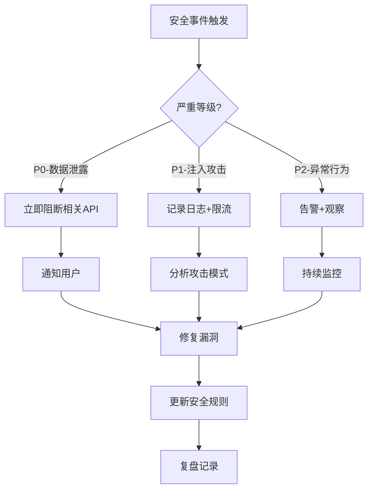

# EventLink 安全设计文档 — Engine与审计

> **版本**: v2.9 (POC阶段)
> **拆分日期**: 2026-06-08
> **来源**: Security_Design_v1.md 按攻击面拆分
> **设计师**: 架构师 + 安全工程师
> **参考**: PRD v4.3, 技术设计 v2.5 §8 (§3.1a + §8.0.3), API设计 v1.0, 数据库设计 v1.0

---

## 导航：EventLink 安全设计文档（v2.9 拆分版）

| 文档 | 攻击面 | 主要内容 |
|------|--------|----------|
| [Security_威胁模型与全局.md](./Security_威胁模型与全局.md) | 全局 | 概述与威胁模型、PoC/Phase差异、版本历史 |
| [Security_认证与API.md](./Security_认证与API.md) | REST API | 认证与授权、API安全 |
| [Security_数据保护与主权.md](./Security_数据保护与主权.md) | 数据库/合规 | 数据保护、数据主权 |
| [Security_LLM与AI输出.md](./Security_LLM与AI输出.md) | LLM Prompt | LLM安全、AI输出约束 |
| [Security_小程序与WebView.md](./Security_小程序与WebView.md) | WebView/小程序 | 小程序安全、WebView、TTS、语音助手 |
| **Security_Engine与审计.md** ⬅️ | Engine/审计 | Insight Engine、搜索、审计监控、测试清单 |

---

## 6. 微信小程序安全（续）

### 6.7 Insight Engine安全专项 [v2.5新增]

> **背景**：Insight Engine（PriorityScorer + ImplicitFeedbackCollector）引入动态优先级评分和隐式反馈机制，新增攻击面包括评分操纵、隐式反馈伪造、动态评分API滥用。

#### 6.7.1 评分操纵防护

| 防护措施 | 说明 | 实施阶段 |
|----------|------|----------|
| **completed_rank单调递增** | completed_rank只能递增，不能回填。设置新rank时校验 `new_rank > current_rank`，否则拒绝并记录审计日志 | PoC+ |
| **评分审计日志** | 评分计算结果写入 `score_audit_logs` 审计表，记录：user_id, todo_id, old_score, new_score, calculated_at, calculation_params | PoC+ |
| **异常评分波动检测** | 单日评分波动>20%触发告警。计算方式：`abs(new_score - old_score) / old_score > 0.2` 时写入 `security_anomaly` 审计事件 | Phase1+ |

```python
class PriorityScorerSecurity:
    """评分安全守卫"""

    async def validate_rank_monotonic(self, todo_id: str, new_rank: int) -> bool:
        """校验completed_rank单调递增"""
        todo = await self.repo.get_todo(todo_id)
        if todo.completed_rank and new_rank <= todo.completed_rank:
            await self.audit_log("rank_monotonic_violation", {
                "todo_id": todo_id,
                "current_rank": todo.completed_rank,
                "attempted_rank": new_rank,
            })
            raise SecurityException(
                f"completed_rank只能递增: current={todo.completed_rank}, attempted={new_rank}"
            )
        return True

    async def detect_score_anomaly(self, user_id: str, old_score: float, new_score: float):
        """检测异常评分波动"""
        if old_score > 0 and abs(new_score - old_score) / old_score > 0.2:
            await self.audit_log("score_anomaly", {
                "user_id": user_id,
                "old_score": old_score,
                "new_score": new_score,
                "fluctuation": f"{abs(new_score - old_score) / old_score * 100:.1f}%",
            })
```

**score_audit_logs表DDL**：

```sql
CREATE TABLE score_audit_logs (
    id UUID PRIMARY KEY DEFAULT gen_random_uuid(),
    user_id UUID NOT NULL,
    todo_id UUID NOT NULL,
    old_score FLOAT,
    new_score FLOAT NOT NULL,
    urgency FLOAT,
    importance FLOAT,
    calculation_params JSONB,    -- 评分参数快照
    created_at TIMESTAMPTZ NOT NULL DEFAULT now(),
    INDEX idx_score_audit_user_time (user_id, created_at)
);
```

#### 6.7.2 隐式反馈完整性

| 防护措施 | 说明 | 实施阶段 |
|----------|------|----------|
| **completed_rank与completed_at一致性校验** | 完成排名与完成时间戳必须一致：rank靠前的todo其completed_at不应晚于rank靠后的todo | PoC+ |
| **批量伪造完成事件防护** | 完成操作速率限制：≤30次/分钟/user_id。超过限制返回429 | PoC+ |
| **完成事件时间窗口校验** | completed_at不能是未来时间，不能早于todo创建时间 | PoC+ |

```python
class ImplicitFeedbackSecurity:
    """隐式反馈安全守卫"""

    COMPLETION_RATE_LIMIT = 30  # 次/分钟

    async def validate_completion_consistency(self, user_id: str, completions: list):
        """校验completed_rank与completed_at一致性"""
        sorted_by_rank = sorted(completions, key=lambda x: x.completed_rank)
        for i in range(len(sorted_by_rank) - 1):
            curr = sorted_by_rank[i]
            next_item = sorted_by_rank[i + 1]
            if curr.completed_at > next_item.completed_at:
                await self.audit_log("completion_consistency_violation", {
                    "user_id": user_id,
                    "todo_a": {"id": curr.id, "rank": curr.completed_rank, "at": curr.completed_at},
                    "todo_b": {"id": next_item.id, "rank": next_item.completed_rank, "at": next_item.completed_at},
                })

    async def check_completion_rate(self, user_id: str) -> bool:
        """检查完成操作速率"""
        key = f"completion_rate:{user_id}"
        count = await self.redis.incr(key)
        if count == 1:
            await self.redis.expire(key, 60)
        if count > self.COMPLETION_RATE_LIMIT:
            raise HTTPException(429, "完成操作过于频繁")
        return True
```

#### 6.7.3 动态评分API安全

| API端点 | 安全约束 | 限流规则 |
|---------|----------|----------|
| `POST /api/v1/insights/calculate` | 只能计算自己的优先级（user_id隔离），JWT中提取user_id与请求参数user_id校验一致 | 10次/分钟/user_id |
| `GET /api/v1/insights/scores` | 只能查看自己的评分结果，强制user_id过滤 | 30次/分钟/user_id |
| `GET /api/v1/insights/audit-logs` | 只能查看自己的审计日志，强制user_id过滤 | 10次/分钟/user_id |

```python
@app.post("/api/v1/insights/calculate")
@depends(RateLimiter(times=10, seconds=60))
async def calculate_priority(user_id: str = Depends(get_current_user)):
    """动态评分API - 强制user_id隔离"""
    # user_id从JWT提取，不接受请求参数覆盖
    scores = await priority_scorer.calculate_all(user_id)
    return {"scores": scores, "calculated_at": datetime.utcnow().isoformat()}
```

### 6.8 DataSourceAdapter安全专项 [v2.5新增]

> **背景**：DataSourceAdapter接口支持多源数据接入（邮件、日历、微信等），引入新的攻击面包括API密钥泄露、出站流量滥用、供应链攻击。

#### 6.8.1 Adapter配置安全

| 安全措施 | 说明 | 实施阶段 |
|----------|------|----------|
| **API密钥加密存储** | Adapter配置中的API密钥使用AES-256-GCM加密存储，复用§3.1字段加密机制。密钥不得明文出现在配置文件、日志或API响应中 | Phase1+ |
| **Adapter白名单机制** | 仅允许注册的Adapter类型运行，未注册Adapter的配置被拒绝。白名单存储在数据库 `adapter_registry` 表中 | Phase1+ |
| **同步频率限制** | Adapter同步最小间隔15分钟，防止频繁调用外部API。配置中 `sync_interval_minutes` 必须 ≥ 15 | Phase1+ |

```python
class AdapterConfigSecurity:
    """Adapter配置安全"""

    MIN_SYNC_INTERVAL = 15  # 分钟

    ALLOWED_ADAPTERS = {
        "email_imap",      # 邮件(IMAP)
        "calendar_caldav", # 日历(CalDAV)
        "wechat_official", # 微信公众号
    }

    async def validate_adapter_config(self, adapter_type: str, config: dict) -> bool:
        """校验Adapter配置"""
        # 白名单检查
        if adapter_type not in self.ALLOWED_ADAPTERS:
            raise HTTPException(400, f"不支持的Adapter类型: {adapter_type}")

        # 同步频率检查
        interval = config.get("sync_interval_minutes", 15)
        if interval < self.MIN_SYNC_INTERVAL:
            raise HTTPException(400, f"同步间隔不能小于{self.MIN_SYNC_INTERVAL}分钟")

        # API密钥加密存储
        if "api_key" in config:
            config["api_key_encrypted"] = self.encryptor.encrypt(config.pop("api_key"))

        return True
```

#### 6.8.2 出站流量控制

| 安全措施 | 说明 | 实施阶段 |
|----------|------|----------|
| **外部API调用白名单** | Adapter仅允许调用白名单内的域名。白名单配置在 `adapter_registry.allowed_domains` 中 | Phase1+ |
| **请求审计日志** | 所有外部API调用记录审计日志：adapter_type, url, method, status_code, response_time, timestamp | Phase1+ |
| **响应内容过滤** | 外部API响应经过 `sanitize_llm_input()` 清洗后再入库，防止注入攻击 | Phase1+ |

```python
class OutboundTrafficSecurity:
    """出站流量安全"""

    async def validate_outbound_url(self, adapter_type: str, url: str) -> bool:
        """校验出站URL白名单"""
        adapter = await self.get_adapter_registry(adapter_type)
        from urllib.parse import urlparse
        domain = urlparse(url).netloc
        if domain not in adapter.allowed_domains:
            await self.audit_log("outbound_url_blocked", {
                "adapter_type": adapter_type,
                "domain": domain,
                "url": url,
            })
            raise HTTPException(403, f"出站请求域名不在白名单: {domain}")
        return True
```

#### 6.8.3 供应链安全

| 安全措施 | 说明 | 实施阶段 |
|----------|------|----------|
| **依赖锁定+哈希校验** | `requirements.txt` 使用精确版本号（`==`）+ hash校验，防止依赖投毒 | PoC+ |
| **CI/CD集成漏洞扫描** | 每次PR触发 `pip-audit` + `bandit` + `trivy` 扫描，Critical/High漏洞阻断合并 | PoC+ |
| **Adapter审核流程** | 新Adapter上线前必须经过安全审核：代码审查 + 依赖扫描 + 渗透测试 | Phase1+ |

> **与§10.4依赖安全评估的关系**：§6.8.3的供应链安全是§10.4在Adapter场景的具体实施，Adapter作为外部集成点需要额外的审核流程。

### 6.9 Concern/Capability数据保护 [v2.5新增]

> **背景**：concerns/capabilities包含敏感个人信息（痛点、需求、专长），需要字段级保护。与§3.7 concern数据安全形成互补：§3.7关注concern的存储安全，§6.9关注concerns/capabilities的完整数据保护链路。

#### 6.9.1 数据敏感性分析

| 数据类型 | 敏感级别 | 风险说明 |
|----------|----------|----------|
| concerns（关注点/痛点） | **高** | 暴露他人真实需求、痛点、困境，属于敏感个人信息 |
| capabilities（能力/资源） | **中** | 暴露他人专长、资源、可提供价值，可能被滥用 |
| tag（受控词表分类） | **低** | 仅分类标签，不包含具体内容 |

#### 6.9.2 分阶段保护策略

| 阶段 | concerns保护 | capabilities保护 | 说明 |
|------|-------------|-----------------|------|
| **PoC** | 依赖现有PII脱敏机制（`redact_pii_from_text()`） | 同左 | 最小可行保护 |
| **Phase1** | pgcrypto字段加密（复用§3.3方案） | pgcrypto字段加密 | 与phone/email同级别保护 |
| **Phase2** | TDE透明加密 + 字段级访问控制 | TDE透明加密 | 增强保护 |

#### 6.9.3 行级安全策略（user_id隔离）

concerns/capabilities遵循与§2.3相同的单用户数据隔离原则：

```python
class ConcernCapabilityRepository:
    """concerns/capabilities数据访问 - 强制user_id隔离"""

    async def get_concerns(self, db, user_id: str, entity_id: str) -> list:
        """获取concerns - 强制user_id过滤"""
        result = await db.execute(
            select(Entity).where(
                Entity.user_id == user_id,    # 强制隔离
                Entity.id == entity_id
            )
        )
        entity = result.scalar_one_or_none()
        if entity and entity.properties.get("concerns"):
            return entity.properties["concerns"]
        return []

    async def update_concerns(self, db, user_id: str, entity_id: str, concerns: list):
        """更新concerns - 强制user_id过滤 + 审计日志"""
        result = await db.execute(
            select(Entity).where(
                Entity.user_id == user_id,
                Entity.id == entity_id
            )
        )
        entity = result.scalar_one_or_none()
        if not entity:
            raise HTTPException(404, "实体不存在或无权访问")

        entity.properties["concerns"] = concerns
        await self.audit_log("concerns_updated", {
            "user_id": user_id,
            "entity_id": entity_id,
            "concern_count": len(concerns),
        })
```

> **与§3.7 concern/promise/contribution数据安全的关系**：§3.7定义了concern的加密存储规则和脱敏发送规则，§6.9在此基础上扩展了capabilities的保护策略和分阶段实施方案，两者互补。

### 6.10 DependencyAnalyzer安全专项 [v2.6新增]

> **背景**：F-55依赖性全图谱路径分析引入DependencyAnalyzer，通过遍历my_promise→their_promise依赖链计算dependency_score。新增攻击面包括依赖图注入、阻塞链DoS、依赖性得分操纵。

#### 6.10.1 依赖图注入防护

| 防护措施 | 说明 | 实施阶段 |
|----------|------|----------|
| **action_type系统设置** | my_promise/their_promise的action_type必须由Pipeline Step 8(PromiseBidirectionalHandler)设置，不可由用户直接修改 | PoC+ |
| **action_type枚举校验** | 写入Todo时校验action_type必须在合法枚举值内，非法值拒绝写入 | PoC+ |
| **依赖边创建审计** | 每条my_promise→their_promise依赖边的创建记录审计日志：user_id, todo_id, linked_todo_id, action_type, created_at | PoC+ |

```python
class DependencyGraphSecurity:
    """依赖图安全守卫"""

    SYSTEM_SET_ACTION_TYPES = {"my_promise", "their_promise"}

    async def validate_action_type_source(self, todo_id: str, action_type: str, source: str) -> bool:
        """校验promise类型action_type必须由系统设置"""
        if action_type in self.SYSTEM_SET_ACTION_TYPES:
            if source != "pipeline_step_8":
                await self.audit_log("action_type_injection_blocked", {
                    "todo_id": todo_id,
                    "action_type": action_type,
                    "attempted_source": source,
                })
                raise SecurityException(
                    f"action_type '{action_type}' 只能由Pipeline Step 8设置，不可由用户直接修改"
                )
        return True
```

#### 6.10.2 阻塞链深度限制

| 防护措施 | 说明 | 实施阶段 |
|----------|------|----------|
| **MAX_DEPTH=3** | 依赖链遍历最大深度为3，超过3跳的链路截断，防止超深链遍历消耗资源（DoS防护） | PoC+ |
| **深度截断审计** | 链路被截断时记录审计日志：user_id, todo_id, actual_depth, max_depth | PoC+ |
| **遍历超时保护** | 单次依赖图遍历超时时间≤2秒，超时返回已计算的部分结果 | Phase1+ |

```python
class DependencyAnalyzerSecurity:
    """依赖分析安全守卫"""

    MAX_DEPTH = 3
    TRAVERSAL_TIMEOUT_MS = 2000

    async def validate_chain_depth(self, chain_depth: int, todo_id: str, user_id: str) -> bool:
        """校验依赖链深度"""
        if chain_depth > self.MAX_DEPTH:
            await self.audit_log("chain_depth_truncated", {
                "user_id": user_id,
                "todo_id": todo_id,
                "actual_depth": chain_depth,
                "max_depth": self.MAX_DEPTH,
            })
            return False  # 截断
        return True
```

#### 6.10.3 依赖性得分操纵防护

| 防护措施 | 说明 | 实施阶段 |
|----------|------|----------|
| **dependency_score系统计算** | dependency_score由DependencyAnalyzer算法计算，用户无法直接设置该字段 | PoC+ |
| **得分范围校验** | dependency_score必须在[0, 1]范围内，超出范围的计算结果被截断 | PoC+ |
| **得分计算审计** | 每次dependency_score计算记录审计日志：user_id, todo_id, chain_count, raw_score, final_score | PoC+ |

```python
class DependencyScoreSecurity:
    """依赖性得分安全守卫"""

    async def validate_score_source(self, todo_id: str, score: float, source: str) -> bool:
        """校验dependency_score必须由系统计算"""
        if source != "dependency_analyzer":
            await self.audit_log("score_injection_blocked", {
                "todo_id": todo_id,
                "attempted_score": score,
                "attempted_source": source,
            })
            raise SecurityException("dependency_score只能由DependencyAnalyzer计算，不可由用户直接设置")

    def clamp_score(self, raw_score: float) -> float:
        """得分范围截断至[0, 1]"""
        return max(0.0, min(1.0, raw_score))
```

### 6.11 ContextMatcher安全专项 [v2.6新增]

> **背景**：F-56场景匹配Event表驱动引入ContextMatcher，通过查询即将到来的Event匹配关联Todo提升context_score。新增攻击面包括跨用户数据泄露、全表扫描DoS、隐私信息越权访问。

#### 6.11.1 场景匹配数据隔离

| 防护措施 | 说明 | 实施阶段 |
|----------|------|----------|
| **user_id强制过滤** | ContextMatcher只查询当前user_id的Event和Entity，复用§2.3单用户数据隔离机制 | PoC+ |
| **related_entity_id归属校验** | 查询关联Entity时校验entity_id归属于当前user_id，防止越权访问 | PoC+ |
| **查询结果脱敏** | 匹配结果中的Event.raw_text在返回前调用`redact_pii_from_text()`脱敏 | PoC+ |

```python
class ContextMatcherSecurity:
    """场景匹配安全守卫"""

    async def validate_entity_ownership(self, entity_id: str, user_id: str) -> bool:
        """校验entity归属于当前用户"""
        entity = await self.repo.get_entity(entity_id, user_id)
        if not entity:
            await self.audit_log("entity_ownership_violation", {
                "user_id": user_id,
                "entity_id": entity_id,
            })
            raise HTTPException(403, "无权访问该实体")
        return True
```

#### 6.11.2 时间窗口限制

| 防护措施 | 说明 | 实施阶段 |
|----------|------|----------|
| **24h查询窗口** | get_upcoming_context仅查询未来24小时内的Event，防止全表扫描消耗资源 | PoC+ |
| **窗口参数不可覆盖** | 时间窗口参数由系统固定，不接受客户端传入，防止恶意扩大查询范围 | PoC+ |
| **查询频率限制** | 同一用户场景匹配查询≤30次/分钟，防止滥用 | Phase1+ |

```python
class ContextMatcherSecurity:
    """场景匹配安全守卫"""

    UPCOMING_WINDOW_HOURS = 24  # 固定24h窗口，不可由客户端覆盖

    async def get_upcoming_context(self, user_id: str, entity_id: str) -> list:
        """获取即将到来的上下文 - 固定24h窗口"""
        # 时间窗口参数由系统固定，不接受客户端传入
        cutoff = datetime.utcnow() + timedelta(hours=self.UPCOMING_WINDOW_HOURS)
        events = await self.repo.get_events_in_window(
            user_id=user_id,
            entity_id=entity_id,
            start=datetime.utcnow(),
            end=cutoff,
        )
        return events
```

#### 6.11.3 即将见面信息隐私

| 防护措施 | 说明 | 实施阶段 |
|----------|------|----------|
| **get_upcoming_context仅返回当前用户数据** | 即将见面信息只返回当前user_id的Event和Entity，不泄露其他用户的日程 | PoC+ |
| **context_score系统计算** | context_score由ContextMatcher算法计算，用户无法直接设置 | PoC+ |
| **匹配结果不暴露他人信息** | 匹配结果中的参与者信息仅返回当前用户视角的数据，不返回其他参与者的私有信息 | PoC+ |

```python
class ContextMatcherSecurity:
    """场景匹配安全守卫"""

    async def filter_match_result(self, user_id: str, match_result: dict) -> dict:
        """过滤匹配结果，确保不暴露他人私有信息"""
        # 仅保留当前用户视角的数据
        filtered = {
            "todo_id": match_result["todo_id"],
            "context_score": match_result["context_score"],
            "upcoming_events": [
                {
                    "event_id": e["event_id"],
                    "title": e["title"],
                    "start_time": e["start_time"],
                    # 不返回其他参与者的私有信息
                }
                for e in match_result.get("upcoming_events", [])
            ],
        }
        return filtered
```

### 6.12 EmbeddingProvider安全专项 [v2.7新增]

#### 6.12.1 API Key安全

| 防护措施 | 说明 | 实施阶段 |
|----------|------|----------|
| **复用LLM API Key** | EmbeddingProvider复用Moka AI的LLM_API_KEY，不新增独立密钥 | PoC+ |
| **.env存储** | API Key存储在.env文件中，不硬编码、不提交Git | PoC+ |
| **传输加密** | 所有API调用使用HTTPS（https://api.moka-ai.com/v1） | PoC+ |
| **Key轮换** | Phase1支持API Key热轮换，无需重启服务 | Phase1 |

```python
class EmbeddingProviderSecurity:
    """EmbeddingProvider安全守卫"""

    @staticmethod
    def validate_api_key(api_key: str) -> bool:
        """验证API Key格式"""
        if not api_key or len(api_key) < 20:
            return False
        # 不记录Key到日志
        return True

    @staticmethod
    def sanitize_log(text: str) -> str:
        """日志脱敏：移除API Key相关信息"""
        import re
        # 移除Bearer token
        text = re.sub(r'Bearer\s+\S+', 'Bearer ***', text)
        return text
```

#### 6.12.2 缓存安全

| 防护措施 | 说明 | 实施阶段 |
|----------|------|----------|
| **内存存储** | SHA256(text)→embedding缓存仅存储在内存dict中，不持久化到磁盘 | PoC+ |
| **重启清空** | 服务重启时缓存自动清空，无残留数据 | PoC+ |
| **无敏感信息** | 缓存键为SHA256哈希，缓存值为float数组，不含原始文本 | PoC+ |
| **Phase1 Redis** | 迁移至Redis时设置TTL=7天，启用ACL访问控制 | Phase1 |

#### 6.12.3 数据隔离

| 防护措施 | 说明 | 实施阶段 |
|----------|------|----------|
| **user_id隔离** | vector_embeddings表按user_id存储和查询，embedding归属明确 | PoC+ |
| **API层强制** | 搜索API的user_id从JWT提取，忽略客户端传入值 | PoC+ |
| **查询范围限制** | embed/search操作仅返回当前user_id的数据 | PoC+ |

### 6.13 SemanticSearch安全专项 [v2.7新增]

#### 6.13.1 搜索数据隔离

| 防护措施 | 说明 | 实施阶段 |
|----------|------|----------|
| **user_id强制过滤** | 所有搜索查询WHERE条件必须包含user_id，SQL层强制 | PoC+ |
| **JWT提取user_id** | POST /api/v1/search/semantic的user_id从JWT Token提取，忽略请求体中的user_id字段 | PoC+ |
| **结果二次校验** | 搜索结果返回前，校验每条结果的user_id与当前用户一致 | PoC+ |

```python
class SemanticSearchSecurity:
    """语义搜索安全守卫"""

    async def filter_search_results(
        self, user_id: str, results: list[dict]
    ) -> list[dict]:
        """搜索结果二次校验：确保仅返回当前用户数据"""
        return [
            r for r in results
            if r.get("user_id") == user_id
        ]
```

#### 6.13.2 sqlite-vec文件安全

| 防护措施 | 说明 | 实施阶段 |
|----------|------|----------|
| **文件权限0o600** | SQLite数据库文件权限设置为0o600，仅owner可读写 | PoC+ |
| **虚拟表不持久化** | vec_entities虚拟表为内存级，不写入磁盘文件 | PoC+ |
| **Phase2 pgvector** | 迁移至PostgreSQL后，使用PG行级安全策略(RLS) | Phase2 |

#### 6.13.3 向量注入防护

| 防护措施 | 说明 | 实施阶段 |
|----------|------|----------|
| **系统生成** | embedding由EmbeddingProvider系统生成，不接受用户直接写入 | PoC+ |
| **不可写API** | 无直接写入vector_embeddings的API端点，仅通过Pipeline自动触发 | PoC+ |
| **source_text审计** | vector_embeddings.source_text记录生成embedding的原始文本，可审计 | PoC+ |
| **输入清洗** | compose_entity_text()输出经过sanitize处理，移除特殊字符 | PoC+ |

```python
class VectorInjectionGuard:
    """向量注入防护守卫"""

    ALLOWED_TARGET_TYPES = {"entity", "event"}

    def validate_embedding_request(
        self, target_type: str, target_id: str, user_id: str
    ) -> bool:
        """验证embedding写入请求合法性"""
        # 1. target_type白名单
        if target_type not in self.ALLOWED_TARGET_TYPES:
            return False
        # 2. target_id格式校验（UUID）
        import re
        if not re.match(
            r'^[0-9a-f]{8}-[0-9a-f]{4}-[0-9a-f]{4}-[0-9a-f]{4}-[0-9a-f]{12}$',
            target_id
        ):
            return False
        # 3. user_id非空
        if not user_id:
            return False
        return True
```

### 6.14 CSV导入安全专项 [v2.8新增, F-08]

> **对应功能**: F-08 CSV导入（POST /api/v1/import/csv）

**安全威胁与缓解措施**:

| 威胁 | 缓解措施 | 实施阶段 |
|------|---------|---------|
| **CSV注入** | 清除公式前缀（`=+@-`），纯文本化 | PoC+ |
| **大文件DoS** | 文件大小限制10MB + 行数限制5000 | PoC+ |
| **编码攻击** | UTF-8优先 + GBK降级，拒绝二进制内容 | PoC+ |
| **恶意文件名** | 仅接受.csv后缀，忽略路径 | PoC+ |
| **数据注入** | EntityResolution归一防止重复注入 | PoC+ |

**CSV注入防护**:
```python
def _sanitize_csv_value(value: str) -> str:
    """清除CSV注入公式前缀"""
    if value and value[0] in ('=', '+', '@', '-', '\t', '\r'):
        return "'" + value  # 添加单引号前缀转义
    return value
```

**文件上传安全检查清单**:
- [x] 文件后缀校验（.csv only）
- [x] 文件大小限制（10MB）
- [x] 空文件拒绝
- [x] 必需列校验（name）
- [x] user_id数据隔离

### 6.15 EmailAdapter安全专项 [v2.8新增, EmailAdapter]

> **对应功能**: EmailAdapter邮件同步（POST /api/v1/email/sync）

**安全威胁与缓解措施**:

| 威胁 | 缓解措施 | 实施阶段 |
|------|---------|---------|
| **IMAP凭证泄露** | 应用密码存.env，不提交Git；Phase2升级OAuth2 | PoC+ |
| **邮件内容PII** | Pipeline处理时自动脱敏（复用redact_pii_from_text） | PoC+ |
| **恶意邮件附件** | 不存储附件，仅提取body_text | PoC+ |
| **IMAP连接劫持** | 强制SSL/TLS，拒绝非加密连接 | PoC+ |
| **邮件洪水** | 同步频率限制15分钟/次 + 单次最多100封 | Phase1+ |

**IMAP凭证安全**:
```python
# 环境变量注入，不硬编码
EMAIL_IMAP_HOST = os.getenv("EMAIL_IMAP_HOST")
EMAIL_APP_PASSWORD = os.getenv("EMAIL_APP_PASSWORD")  # 应用专用密码
```

**邮件内容安全处理**:
- 附件: 仅记录文件名列表，不下载/存储附件内容
- HTML邮件: 提取纯文本body_text，丢弃HTML标签
- PII: 进入Pipeline后统一脱敏

### 6.16 WeChatForwardAdapter安全专项 [v2.8新增, WeChatForwardAdapter]

> **对应功能**: 微信聊天记录转发（POST /api/v1/wechat/forward）

**安全威胁与缓解措施**:

| 威胁 | 缓解措施 | 实施阶段 |
|------|---------|---------|
| **文本长度DoS** | 请求体限制512KB（Pydantic max_length） | PoC+ |
| **正则ReDoS** | 使用简单正则模式，避免回溯爆炸 | PoC+ |
| **聊天内容PII** | Pipeline处理时自动脱敏 | PoC+ |
| **伪造聊天记录** | 无验证（用户自愿输入，信任模型） | — |
| **XSS注入** | 纯文本存储，前端渲染转义 | PoC+ |

**正则安全**: `_SPEAKER_LINE_PATTERN` 使用 `\S{1,20}` 限制长度，避免回溯。

**数据隔离**: Event创建时强制使用JWT中的user_id，忽略客户端传入值。

---

## 8. 安全审计与监控

### 8.1 审计日志设计

**审计日志原则**：谁在什么时候做了什么（Who, When, What）。

```python
class AuditLog(Base):
    """审计日志表"""
    __tablename__ = "audit_logs"

    id: Mapped[uuid.UUID] = mapped_column(primary_key=True, default=uuid.uuid4)
    user_id: Mapped[str] = mapped_column(index=True)
    action: Mapped[str] = mapped_column(String(50))  # create/read/update/delete/export
    resource_type: Mapped[str] = mapped_column(String(30))  # event/entity/todo/association
    resource_id: Mapped[str | None] = mapped_column(String(36))
    detail: Mapped[str | None] = mapped_column(Text)  # JSON格式，不含PII
    ip_address: Mapped[str | None] = mapped_column(String(45))
    user_agent: Mapped[str | None] = mapped_column(String(200))
    created_at: Mapped[datetime] = mapped_column(default=func.now(), index=True)

    __table_args__ = (
        Index("idx_audit_user_time", "user_id", "created_at"),
        Index("idx_audit_action", "action", "created_at"),
    )
```

**审计事件清单**：

| 事件 | action | 记录内容 | 阶段 |
|------|--------|----------|------|
| 用户登录 | auth.login | openid前4位 | PoC+ |
| 数据创建 | create.{resource} | resource_type, resource_id | PoC+ |
| 数据更新 | update.{resource} | 变更字段列表 | PoC+ |
| 数据删除 | delete.{resource} | resource_type, resource_id | PoC+ |
| 数据导出 | export.json/csv | 导出格式 | Phase1+ |
| LLM调用 | llm.call | model, tokens, blocked | PoC+ |
| Prompt注入拦截 | security.injection_blocked | 拦截原因 | PoC+ |
| Token撤销 | auth.token_revoked | jti | Phase1+ |
| 异常访问 | security.anomaly | 异常类型 | Phase1+ |

### 8.2 异常行为检测

| 异常类型 | 检测规则 | 响应动作 | 阶段 |
|----------|----------|----------|------|
| 频率异常 | 同一API >100次/分钟 | 限流429 | PoC+ |
| 时间异常 | 凌晨2-5点大量操作 | 告警 | Phase1+ |
| 数据量异常 | 单次导出>1万条 | 告警+人工确认 | Phase1+ |
| LLM滥用 | 单日调用>100次 | 限流+告警 | PoC+ |
| 认证异常 | 同一账户5分钟内>10次401 | 锁定15分钟 | Phase1+ |

### 8.3 安全事件响应流程



### 8.4 日志保留策略

| 日志类型 | 保留周期 | 存储位置 | 阶段 |
|----------|----------|----------|------|
| 审计日志 | 90天 | 数据库 | PoC+ |
| API访问日志 | 30天 | 文件/ELK | Phase1+ |
| LLM调用日志 | 90天 | 数据库 | PoC+ |
| 安全事件日志 | 1年 | 数据库+文件 | Phase1+ |
| 错误日志 | 7天 | 文件 | PoC+ |

---

## 10. 安全测试清单

### 10.1 OWASP Top 10对照检查

| OWASP Top 10 (2021) | 风险 | EventLink防护措施 | 测试方法 | 阶段 |
|----------------------|------|-------------------|----------|------|
| A01-权限控制失效 | 越权访问其他用户数据 | user_id应用层过滤 | 修改JWT中user_id尝试越权 | PoC+ |
| A02-加密机制失效 | PII明文存储 | AES-256-GCM字段加密 | 检查数据库文件中PII是否加密 | Phase1+ |
| A03-注入 | SQL注入 | ORM参数化查询 | sqlmap自动化扫描 | PoC+ |
| A04-不安全设计 | Ticket可重用 | 60秒一次性Redis存储 | 重复使用同一ticket交换 | Phase1+ |
| A05-安全配置错误 | 调试信息泄露 | 错误信息安全 | 触发500错误检查响应 | PoC+ |
| A06-易受攻击组件 | 依赖库漏洞 | 定期依赖扫描 | `pip audit` / Dependabot | Phase1+ |
| A07-认证失败 | JWT伪造 | RS256签名验证 | 修改JWT payload尝试伪造 | PoC+ |
| A08-软件和数据完整性 | 供应链攻击 | 锁定依赖版本 | hash校验下载包 | Phase1+ |
| A09-日志监控不足 | 攻击无法追溯 | 审计日志+异常检测 | 模拟攻击检查日志记录 | Phase1+ |
| A10-服务器端请求伪造 | LLM调用SSRF | URL白名单+超时 | 构造恶意URL测试LLM调用 | Phase1+ |

### 10.2 渗透测试要点

| 测试项 | 测试方法 | 预期结果 | 优先级 |
|--------|----------|----------|--------|
| JWT伪造 | 修改payload后用HS256签名 | RS256验证失败 | P0 |
| 越权访问 | 修改user_id参数 | 返回403或空数据 | P0 |
| SQL注入 | 在输入中注入SQL语句 | 参数化查询阻止注入 | P0 |
| Prompt注入 | 输入"忽略之前指令" | 检测并拒绝 | P0 |
| Ticket重放 | 重复使用已交换的ticket | 返回401 | P1 |
| 限流绕过 | 快速发送200次请求 | 第101次返回429 | P1 |
| XSS | 输入`<script>alert(1)</script>` | 输入被过滤或转义 | P1 |
| PII泄露 | 检查API响应中PII字段 | PII返回脱敏值 | P1 |
| 数据导出越权 | 用A用户Token导出B用户数据 | 仅返回A用户数据 | P0 |
| LLM成本攻击 | 发送超长文本触发大量Token消耗 | 输入截断+限流 | P2 |

### 10.3 安全扫描工具配置

| 工具 | 用途 | 配置 | 阶段 |
|------|------|------|------|
| `pip audit` | Python依赖漏洞扫描 | CI/CD自动运行 | PoC+ |
| `bandit` | Python代码安全扫描 | `bandit -r src/ -ll` | PoC+ |
| `safety` | 依赖安全检查 | `safety check --full-report` | Phase1+ |
| `sqlmap` | SQL注入自动化测试 | 针对API端点测试 | Phase1+ |
| `OWASP ZAP` | Web应用安全扫描 | 自动化爬取+主动扫描 | Phase1+ |
| `Trivy` | Docker镜像漏洞扫描 | CI/CD自动运行 | Phase1+ |

**CI/CD安全扫描配置**：

```yaml
# .github/workflows/security.yml
name: Security Scan
on: [push, pull_request]
jobs:
  security:
    runs-on: ubuntu-latest
    steps:
      - uses: actions/checkout@v4
      - name: pip audit
        run: pip install pip-audit && pip-audit -r requirements.txt
      - name: bandit scan
        run: pip install bandit && bandit -r src/ -ll -ii
      - name: trivy scan
        run: trivy image eventlink:latest
```

### 10.4 依赖安全评估（v2.0新增）

> **对应 OWASP A06-易受攻击组件**：EventLink 的 Python 依赖库可能包含已知漏洞，需建立持续监控机制。

**核心依赖及风险评估**：

| 依赖库 | 用途 | 风险等级 | 监控方式 |
|--------|------|----------|----------|
| `cryptography` | AES-256-GCM加密 / HS256签名 / 密钥派生 | **高**（安全核心） | 锁定版本 + 每周扫描 |
| `pyjwt` | JWT签发与验证 | **高**（认证核心） | 锁定版本 + 每周扫描 |
| `fastapi` | Web框架 | **中** | 锁定版本 + CI扫描 |
| `sqlalchemy` | ORM（防SQL注入） | **中** | 锁定版本 + CI扫描 |
| `httpx` | HTTP客户端（LLM调用） | **中** | 锁定版本 + CI扫描 |
| `redis` (asyncio) | Redis客户端（限流/缓存/黑名单） | **低** | CI扫描 |

**依赖安全管理策略**：

| 措施 | 说明 | 阶段 |
|------|------|------|
| **锁定依赖版本** | `requirements.txt` 使用精确版本号（`==`），禁止浮动范围（`>=`） | PoC+ |
| **CI/CD自动扫描** | 每次 PR 触发 `pip-audit` + `bandit` + `trivy`，漏洞阻断合并 | PoC+ |
| **每周定时扫描** | GitHub Dependabot 或定时 Job 扫描已知漏洞（CVE） | Phase1+ |
| **漏洞响应SLA** | 严重(Critical)24小时内修复、高(High)72小时内修复、中(Medium)下个迭代修复 | Phase1+ |
| **供应链验证** | PyPI 包 hash 校验，防止依赖包投毒攻击 | Phase1+ |

**依赖安全基线配置**：

```yaml
# .dependabot.yml（Phase1启用）
version: 2
updates:
  - package-ecosystem: pip
    directory: "/"
    schedule:
      interval: weekly
    open-pull-requests-limit: 3
    labels:
      - security
      - dependencies
    commit-message:
      prefix: "security(deps)"
    ignore:
      # 仅忽略补丁版本变更的提醒，安全修复不忽略
      - dependency-name: "*"
        update-types: ["version-update:semver-patch"]
```

```bash
# 手动安全扫描命令（开发阶段）
pip-audit -r requirements.txt --desc       # 详细CVE描述
bandit -r src/ -ll -f json -o bandit-report.json  # 输出JSON报告
trivy image --severity HIGH,CRITICAL eventlink:latest  # 仅报告高危
```
