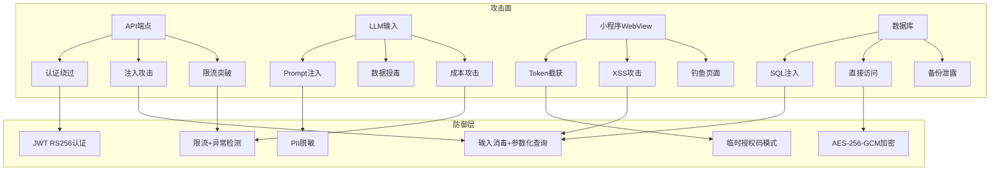

# EventLink 安全设计文档 — 威胁模型与全局

> **版本**: v2.9 (POC阶段)
> **拆分日期**: 2026-06-08
> **来源**: Security_Design_v1.md 按攻击面拆分
> **设计师**: 架构师 + 安全工程师
> **参考**: PRD v4.3, 技术设计 v2.5 §8 (§3.1a + §8.0.3), API设计 v1.0, 数据库设计 v1.0

---

## 导航：EventLink 安全设计文档（v2.9 拆分版）

| 文档 | 攻击面 | 主要内容 |
|------|--------|----------|
| **Security_威胁模型与全局.md** ⬅️ | 全局 | 概述与威胁模型、PoC/Phase差异、版本历史 |
| [Security_认证与API.md](./Security_认证与API.md) | REST API | 认证与授权、API安全 |
| [Security_数据保护与主权.md](./Security_数据保护与主权.md) | 数据库/合规 | 数据保护、数据主权 |
| [Security_LLM与AI输出.md](./Security_LLM与AI输出.md) | LLM Prompt | LLM安全、AI输出约束 |
| [Security_小程序与WebView.md](./Security_小程序与WebView.md) | WebView/小程序 | 小程序安全、WebView、TTS、语音助手 |
| [Security_Engine与审计.md](./Security_Engine与审计.md) | Engine/审计 | Insight Engine、搜索、审计监控、测试清单 |

---

## 1. 概述与威胁模型

### 1.1 安全设计原则

EventLink定位为**AI驱动的个人商务关系经营助手**，安全设计遵循以下核心原则：

| 原则 | 描述 | 实施方式 |
|------|------|----------|
| **数据归属用户** | 用户数据所有权归用户，EventLink仅是处理者 | 数据主权声明、可携带/可删除/可透明 |
| **最小权限** | 系统仅获取完成功能所需的最小权限 | 无RBAC、单用户数据隔离、字段级加密 |
| **纵深防御** | 多层安全措施，单点突破不导致全局失守 | 传输加密+存储加密+应用层过滤+审计日志 |
| **默认安全** | 安全配置为默认值，无需用户主动开启 | TLS强制、输入验证默认启用、PII默认加密 |
| **私密优先** | 作为私密助手，无跨用户数据访问 | user_id应用层过滤、无公开API、无资源撮合 |

**明确排除的安全需求**（私密助手不需要，v2.0从3项扩展至8项）：
- ❌ RBAC权限模型 / 多租户隔离 / 团队协作权限
- ❌ 他人资源匹配授权 / 跨用户数据共享
- ❌ 企业级审计合规（SOC2/ISO27001）
- ❌ 他人可提供资源匹配（只能匹配自己人脉的供给，不做跨用户资源撮合）
- ❌ 多租户隔离 / 企业管理看板（单用户私密助手定位）
- ❌ resource_permissions表 / 跨用户资源访问控制
- ❌ 原生APP开发（微信小程序为唯一入口，降低攻击面）
- ❌ 外部数据源自动集成（LinkedIn/企查查等，避免第三方数据引入合规风险）

### 1.2 STRIDE威胁模型分析

> **v2.0更新**：采用技术设计 v2.5 §8.0.3 的 **STRIDE简化版**，合并原有详细威胁条目，增加当前实施状态追踪。

**STRIDE简化版威胁模型**：

| 威胁类型 | 场景 | 缓解措施 | 当前状态 |
|---------|------|---------|---------|
| **S**poofing（欺骗） | 伪造用户身份冒充登录 | JWT HS256签名 + 微信OAuth双重验证 | ✅ 已实现 |
| **T**ampering（篡改） | API请求参数被中间人篡改 | HTTPS (TLS 1.3) + HMAC请求签名 | ⚠️ PoC阶段HTTP，Phase1升级TLS |
| **R**epudiation（抵赖） | 用户否认执行了某操作 | 操作审计日志(Audit Logger) | 📋 Phase1实现 |
| **I**nformation Disclosure（信息泄露） | PII数据（手机号/邮箱/微信等）泄露 | AES-256-GCM字段加密 + `redact_pii_from_text()` 脱敏 | ✅ 已实现 |
| **D**enial of Service（拒绝服务） | API被恶意大量请求 / LLM调用耗尽资源 | Rate Limit（100次/分钟/user）+ 超时控制+ 异常检测 | ⚠️ 基础实现 |
| **E**levation of Privilege（权限提升） | 越权访问其他用户数据 / input_scope伪造 | `user_id`应用层强制过滤 + SC-01服务端校验 | ✅ 已实现 |

**分阶段安全重点关注**：

| 阶段 | 优先关注的威胁类型 | 说明 |
|------|-------------------|------|
| **PoC** | S / I / D | 身份伪造(本地HS256)、信息脱敏(redact_pii)、越权访问(user_id过滤)为核心底线 |
| **Phase1** | T / R / D | 补齐TLS防篡改、操作审计日志、完整Rate Limit |
| **Phase2** | 全量6项 | KMS密钥管理、ML异常检测、设备绑定等增强措施 |

> **与v1.2的变更说明**：v1.2版本包含10条详细威胁条目（含WebView Token截获、SQL注入、Prompt注入等子场景），v2.0将其合并为6类STRIDE标准分类。各子场景的详细缓解措施仍保留在后续对应章节中（如Prompt注入见§4.1、SQL注入见§5.2、Ticket安全见§2.2）。

### 1.3 攻击面分析

**攻击面清单**：

| 攻击面 | 入口点 | 暴露数据 | 防御优先级 |
|--------|--------|----------|------------|
| REST API | `/api/v1/*` | 全部业务数据 | P0 |
| LLM Prompt | 事件文本输入 | 用户PII | P0 |
| 小程序WebView | H5页面URL | 认证凭据 | P0 |
| 数据库 | SQLite/PG文件 | 加密后PII | P1 |
| Redis | 6379端口 | Ticket/会话 | P1 |
| Docker | 容器端口映射 | 服务配置 | P2 |

---

## 9. PoC vs Phase1 vs Phase2安全差异

### 9.1 各阶段安全措施对比表

| 安全措施 | PoC（本地Docker+SQLite） | Phase1（云端Docker Compose+PG+Redis） | Phase2（生产增强） |
|----------|--------------------------|---------------------------------------|-------------------|
| **传输加密** | HTTP（本地内网） | TLS 1.3（Let's Encrypt） | TLS 1.3（商业证书+OCSP） |
| **认证算法** | HS256（简化） | RS256（非对称） | RS256 + 设备绑定 |
| **Token传递** | URL参数（开发便利） | Ticket模式（安全） | Ticket + Cookie HttpOnly |
| **PII加密** | 不加密（开发便利） | AES-256-GCM字段级加密 | AES-256-GCM + TDE |
| **数据库加密** | SQLite明文 | pgcrypto字段加密 | TDE透明加密 |
| **密钥管理** | 环境变量 | Docker Secret | KMS托管 |
| **限流** | 内存（100次/分） | Redis（100次/分/user） | Redis令牌桶（100+突发200） |
| **请求签名** | 无 | HMAC-SHA256 | HMAC-SHA256 |
| **CORS** | localhost | 生产域名白名单 | 多域名白名单 |
| **LLM脱敏** | 不脱敏（开发调试） | PII脱敏后发送 | PII脱敏 + 本地模型备选 |
| **审计日志** | 文件日志 | 数据库审计表 | 数据库 + ELK |
| **异常检测** | 无 | 基础规则 | 机器学习模型 |
| **数据导出** | 无 | JSON/CSV | JSON/CSV/PDF |
| **数据删除** | 软删除 | 硬删除+关联清理 | 硬删除+备份清理 |
| **Token撤销** | 无（重启服务） | Redis黑名单 | Redis黑名单+设备管理 |
| **备份加密** | 无 | 加密备份 | 加密备份+异地容灾 |

### 9.2 PoC简化策略

PoC阶段为本地单用户开发环境，安全策略适度简化：

1. **认证简化**：使用HS256替代RS256，减少密钥管理复杂度
2. **加密简化**：PII字段不加密，便于开发调试和数据验证
3. **传输简化**：HTTP本地通信，无需TLS证书
4. **限流简化**：内存限流，不依赖Redis
5. **审计简化**：文件日志替代数据库审计表

**PoC安全底线**（不可简化）：
- ✅ user_id应用层过滤（数据隔离是核心安全需求）
- ✅ 输入验证（SQL注入/XSS防护）
- ✅ LLM Prompt注入检测
- ✅ 错误信息安全

### 9.3 Phase1增强项

Phase1为云端生产部署，必须补齐所有安全措施：

1. **RS256认证**：非对称签名，支持多服务验证
2. **Ticket模式**：小程序WebView安全认证
3. **AES-256-GCM**：PII字段级加密
4. **TLS 1.3**：全链路加密
5. **Redis限流**：按用户ID精确限流
6. **HMAC签名**：防重放攻击
7. **PII脱敏**：LLM调用前自动脱敏
8. **数据库审计**：结构化审计日志
9. **数据导出/删除**：数据主权保障

### 9.4 Phase2增强项

Phase2为生产增强阶段，提升安全水位：

1. **KMS密钥管理**：密钥不落盘，运行时获取
2. **TDE透明加密**：数据库全量加密
3. **设备绑定**：JWT绑定设备指纹，限制并发设备
4. **Cookie HttpOnly**：替代sessionStorage存储Token
5. **ML异常检测**：机器学习模型检测异常行为
6. **本地LLM备选**：敏感数据可选用本地模型处理
7. **加密备份+异地容灾**：数据安全兜底

---

## 11. 版本历史

| 版本 | 日期 | 变更内容 | 作者 |
|------|------|----------|------|
| v1.0 | 2026-06-03 | 初始版本，包含完整安全设计11章节 | 架构师 + 安全工程师 |
| v1.1 | 2026-06-03 | Todo类型重命名(opportunity→cooperation_signal等)；新增§3.6 concern/promise/contribution数据安全；新增§4.6 AI输出安全约束 | 架构师 + 安全工程师 |
| v2.0 | 2026-06-04 | **v2.0大版本更新（10项D3变更）**：①版本头更新参考PRD v4.3+技术设计v2.5 §8 ②§3.6新增PII检测正则规则表(6种PII+3条注意事项+redact_pii_from_text实现) ③§2.1b新增JWT HS256认证规范(Payload结构+4项安全约束) ④§1.2 STRIDE威胁模型替换为简化版(含实施状态追踪+分阶段重点) ⑤§5.6新增input_scope SC-01输入分类越权防护 ⑥§4.7新增evidence_quote LLM输出证据字段安全处理(4层安全措施) ⑦§1.1 Non-goals从3项扩展至8项 ⑧§6.5新增TTS语音播报安全评估(隐私分级+推送安全+缓存安全) ⑨§7.2a新增数据导出安全(PII脱敏+频率限制+审计日志) ⑩§10.4新增依赖安全评估(核心依赖风险表+管理策略+Dependabot配置) | 架构师 + 安全工程师 |
| v2.0[0.2.1] | 2026-06-05 | **F-50 语音助手安全专项（增量更新）**：§6.6新增Voice Assistant安全专项(5个子节) ①§6.6.1 Voice API端点安全(POST /voice/session + GET /voice/tts安全约束表 + sanitize_voice_input清洗函数) ②§6.6.2 NLU Prompt Injection防护(威胁模型+攻击示例+4层纵深防护+安全Prompt模板) ③§6.6.3 ASR数据隐私策略(5类数据存储策略表+保留期限+用户权利) ④§6.6.4 voice_sessions数据访问控制(RBAC归属校验代码+敏感字段脱敏) ⑤§6.6.5车载场景特殊安全考虑(4种驾驶场景风险缓解表)。复用已有组件：JWT中间件/redact_pii_from_text/RBAC/user_scope | 架构师 + 安全工程师 |
| v2.5 | 2026-06-06 | **Insight Engine + DataSourceAdapter + Concern/Capability安全专项**：①§6.7新增Insight Engine安全专项(评分操纵防护+隐式反馈完整性+动态评分API安全+score_audit_logs表DDL) ②§6.8新增DataSourceAdapter安全专项(Adapter配置安全+出站流量控制+供应链安全) ③§6.9新增Concern/Capability数据保护(敏感性分析+分阶段保护策略+行级安全策略) | 架构师 + 安全工程师 |
| v2.6 | 2026-06-06 | **F-55/F-56安全专项**：①§6.10新增DependencyAnalyzer安全专项(依赖图注入防护+阻塞链深度限制MAX_DEPTH=3+依赖性得分操纵防护) ②§6.11新增ContextMatcher安全专项(场景匹配数据隔离+24h时间窗口限制+即将见面信息隐私) |
| v2.7 | 2026-06-06 | **F-57/F-58安全专项**：①§6.12新增EmbeddingProvider安全专项(API Key复用LLM密钥+.env存储+缓存内存存储重启清空+user_id数据隔离) ②§6.13新增SemanticSearch安全专项(搜索数据隔离user_id强制过滤+JWT提取+sqlite-vec文件权限0o600+向量注入防护系统生成only) |
| v2.8 | 2026-06-07 | **F-08/EmailAdapter/WeChatForwardAdapter安全专项**：①§6.14新增CSV导入安全专项(CSV注入防护+大文件DoS+编码攻击+恶意文件名+数据注入5项威胁缓解) ②§6.15新增EmailAdapter安全专项(IMAP凭证泄露+邮件PII+恶意附件+连接劫持+邮件洪水5项威胁缓解+SSL强制+附件仅记录不存储) ③§6.16新增WeChatForwardAdapter安全专项(文本长度DoS+正则ReDoS+聊天PII+XSS注入4项威胁缓解+512KB限制+简单正则) | 架构师 + 安全工程师 |
| v2.9 | 2026-06-08 | **安全修复记录**：①§2.6新增安全修复记录章节 ②2.6.1 PoC登录密钥验证CRITICAL修复(EVENTLINK_POC_SECRET环境变量) ③2.6.2 强制JWT认证CRITICAL修复(get_current_user_id+13端点迁移+poc_anonymous_access) ④2.6.3 PBKDF2动态盐值派生CRITICAL修复(SHA256哈希派生替代硬编码盐值) ⑤2.6.4 API速率限制HIGH修复(滑动窗口限流器+Redis后端+三级限流60/10/20) | 架构师 + 安全工程师 |

---

> **文档状态**: ✅ v2.9 更新完成（安全修复记录：PoC登录密钥验证 + 强制JWT认证 + PBKDF2动态盐值派生 + API速率限制）
> **下次审查**: Phase1开发启动前
> **安全负责人**: 架构师
> **对齐文档**: 技术设计 v2.5 §3.1a + §8.0.3
