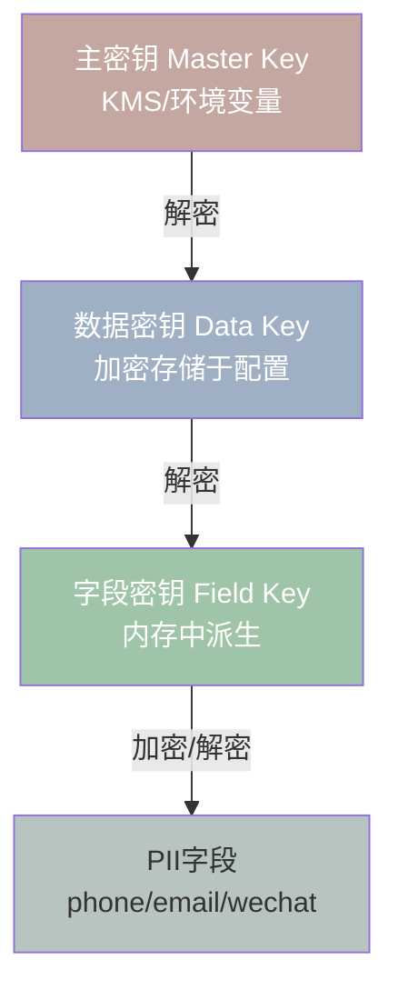
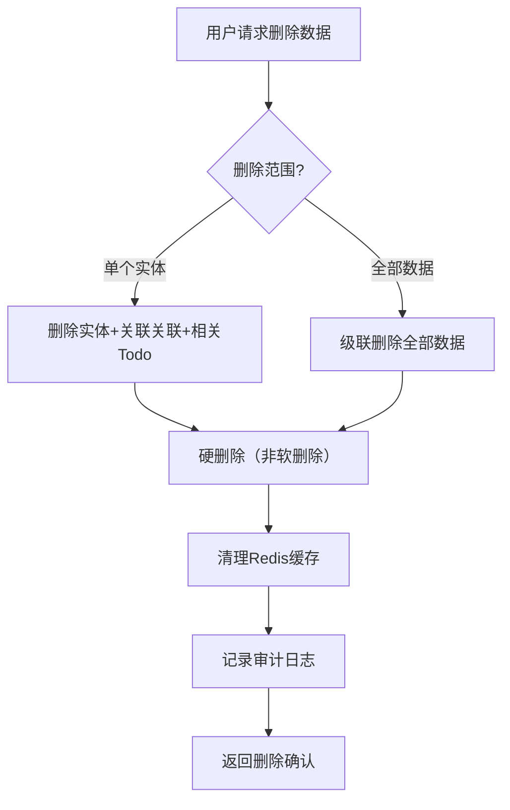

# EventLink 安全设计文档 — 数据保护与主权

> **版本**: v3.0 (托管PoC模式更新)
> **拆分日期**: 2026-06-08
> **来源**: Security_Design_v1.md 按攻击面拆分
> **设计师**: 架构师 + 安全工程师
> **参考**: PRD v4.3, 技术设计 v2.5 §8 (§3.1a + §8.0.3), API设计 v1.0, 数据库设计 v1.0

---

## 导航：EventLink 安全设计文档（v2.9 拆分版）

| 文档 | 攻击面 | 主要内容 |
|------|--------|----------|
| [Security_威胁模型与全局.md](./Security_威胁模型与全局.md) | 全局 | 概述与威胁模型、PoC/Phase差异、版本历史 |
| [Security_认证与API.md](./Security_认证与API.md) | REST API | 认证与授权、API安全 |
| **Security_数据保护与主权.md** ⬅️ | 数据库/合规 | 数据保护、数据主权 |
| [Security_LLM与AI输出.md](./Security_LLM与AI输出.md) | LLM Prompt | LLM安全、AI输出约束 |
| [Security_小程序与WebView.md](./Security_小程序与WebView.md) | WebView/小程序 | 小程序安全、WebView、TTS、语音助手 |
| [Security_Engine与审计.md](./Security_Engine与审计.md) | Engine/审计 | Insight Engine、搜索、审计监控、测试清单 |

---

## 3. 数据保护

### 3.1 PII字段加密（AES-256-GCM）

EventLink对敏感个人信息（PII）实施字段级加密，即使数据库文件被获取也无法直接读取明文。

**加密策略**：

| 字段类别 | 加密算法 | 示例字段 | 说明 |
|----------|----------|----------|------|
| 高敏感PII | AES-256-GCM | phone, email, wechat, id_card | 必须加密，解密需数据密钥 |
| 中敏感PII | AES-256-GCM | company, title, address | Phase2加密 |
| 非敏感数据 | 不加密 | name, entity_type, todo_type | 可直接查询索引 |

**todo_type枚举值**（v1.1更新）：

| 枚举值 | 含义 | 安全级别 | 说明 |
|--------|------|----------|------|
| cooperation_signal | 合作信号 | 非敏感 | 识别到的潜在合作机会 |
| care | 关怀 | 非敏感 | 基于上下文的关怀提醒 |
| promise | 承诺 | 中敏感 | 个人行为数据，需user_id隔离 |
| followup | 跟进 | 非敏感 | 待确认事项的跟进提醒 |
| help | 帮助 | 非敏感 | 资源维护类帮助记录 |

**加密实现**：

```python
import os
import base64
from cryptography.hazmat.primitives.ciphers.aead import AESGCM

class FieldEncryptor:
    """字段级AES-256-GCM加密器"""

    def __init__(self, data_key: bytes):
        self._aesgcm = AESGCM(data_key)

    def encrypt(self, plaintext: str) -> str:
        """加密字段值，返回 base64(nonce + ciphertext + tag)"""
        nonce = os.urandom(12)  # 96-bit nonce
        ct = self._aesgcm.encrypt(nonce, plaintext.encode("utf-8"), None)
        return base64.b64encode(nonce + ct).decode("ascii")

    def decrypt(self, encrypted: str) -> str:
        """解密字段值"""
        raw = base64.b64decode(encrypted)
        nonce = raw[:12]
        ct = raw[12:]
        return self._aesgcm.decrypt(nonce, ct, None).decode("utf-8")

# 使用示例
encryptor = FieldEncryptor(data_key=get_data_key())
encrypted_phone = encryptor.encrypt("13800138000")
# 存储: "ENCRYPTED:base64data..."
decrypted = encryptor.decrypt(encrypted_phone)
```

**Entity properties中的加密存储**：

```python
# 加密前
properties = {
    "basic": {
        "company": "某科技公司",
        "title": "CTO",
        "phone": "13800138000",      # 需加密
        "email": "cto@example.com",   # 需加密
        "wechat": "cto_wx",           # 需加密
    },
    "resource": {
        "capabilities": ["技术架构", "团队管理"],
        "sensitivity": "matchable",
    }
}

# 加密后存储
properties = {
    "basic": {
        "company": "某科技公司",
        "title": "CTO",
        "phone": "ENC:AQIDBA...==",     # AES-256-GCM加密
        "email": "ENC:BQYGCQ...==",     # AES-256-GCM加密
        "wechat": "ENC:CAkIDQ...==",    # AES-256-GCM加密
    },
    "resource": {
        "capabilities": ["技术架构", "团队管理"],
        "sensitivity": "matchable",
    }
}
```

### 3.2 传输加密

| 阶段 | 方案 | 配置 |
|------|------|------|
| PoC | HTTP（本地Docker内网） | 无TLS，仅本地访问 |
| 托管PoC | HTTPS（Let's Encrypt TLS 1.2+） | 强制HTTPS，禁止HTTP访问 |
| Phase1 | TLS 1.3（Nginx终止） | 证书: Let's Encrypt，HSTS启用 |
| Phase2 | TLS 1.3（Nginx终止） | 证书: 商业证书，OCSP Stapling |

**Nginx TLS配置（Phase1+）**：

```nginx
server {
    listen 443 ssl http2;
    server_name eventlink.com;

    ssl_certificate /etc/letsencrypt/live/eventlink.com/fullchain.pem;
    ssl_certificate_key /etc/letsencrypt/live/eventlink.com/privkey.pem;
    ssl_protocols TLSv1.3;
    ssl_ciphers TLS_AES_256_GCM_SHA384:TLS_CHACHA20_POLY1305_SHA256;
    ssl_prefer_server_ciphers on;
    add_header Strict-Transport-Security "max-age=31536000; includeSubDomains" always;
}
```

### 3.3 数据库加密

| 阶段 | 数据库 | 加密方案 | 说明 |
|------|--------|----------|------|
| PoC | SQLite | SQLCipher | 整库加密，密钥从环境变量读取 |
| Phase1 | PostgreSQL | pgcrypto + 字段级加密 | 传输层SSL + 敏感字段pgcrypto |
| Phase2 | PostgreSQL | TDE（透明数据加密） | 云RDS自带TDE |

**SQLite SQLCipher配置（PoC）**：

```python
# SQLAlchemy连接SQLCipher
from sqlalchemy import create_engine

db_key = os.environ.get("SQLCIPHER_KEY", "default-dev-key")
engine = create_engine(f"sqlite:///./data/eventlink.db?key={db_key}",
                       module=sqlcipher3)
```

**PostgreSQL pgcrypto（Phase1+）**：

```sql
-- 启用pgcrypto扩展
CREATE EXTENSION IF NOT EXISTS pgcrypto;

-- 加密函数封装
CREATE OR REPLACE FUNCTION encrypt_pii(data TEXT, key BYTEA)
RETURNS TEXT AS $$
BEGIN
    RETURN encode(encrypt(data::bytea, key, 'aes256/cbc/pad:pkcs'), 'base64');
END;
$$ LANGUAGE plpgsql STRICT;

-- 解密函数封装
CREATE OR REPLACE FUNCTION decrypt_pii(data TEXT, key BYTEA)
RETURNS TEXT AS $$
BEGIN
    RETURN convert_from(decrypt(decode(data, 'base64'), key, 'aes256/cbc/pad:pkcs'), 'UTF8');
END;
$$ LANGUAGE plpgsql STRICT;
```

### 3.4 加密密钥管理（分层密钥体系）



| 密钥层级 | 用途 | 存储 | 轮换周期 |
|----------|------|------|----------|
| 主密钥（MK） | 加密数据密钥 | KMS / 环境变量 | 90天 |
| 数据密钥（DK） | 加密字段密钥 | 加密后存配置文件 | 30天 |
| 字段密钥（FK） | 加密具体PII字段 | 内存派生，不落盘 | 每次启动 |

**密钥派生代码**：

```python
import os
import hashlib
from cryptography.hazmat.primitives.kdf.hkdf import HKDF
from cryptography.hazmat.primitives import hashes

class KeyManager:
    """分层密钥管理器"""

    def __init__(self, master_key: bytes):
        self._master_key = master_key

    def derive_data_key(self, context: str = "eventlink-data-v1") -> bytes:
        """从主密钥派生数据密钥"""
        hkdf = HKDF(
            algorithm=hashes.SHA256(),
            length=32,
            salt=None,
            info=context.encode(),
        )
        return hkdf.derive(self._master_key)

    def derive_field_key(self, data_key: bytes, field_name: str) -> bytes:
        """从数据密钥派生字段密钥"""
        hkdf = HKDF(
            algorithm=hashes.SHA256(),
            length=32,
            salt=None,
            info=f"field-{field_name}".encode(),
        )
        return hkdf.derive(data_key)

# 初始化
master_key = os.environ.get("EVENTLINK_MASTER_KEY", "").encode()
if not master_key:
    master_key = os.urandom(32)  # PoC: 随机生成
km = KeyManager(master_key)
data_key = km.derive_data_key()
phone_key = km.derive_field_key(data_key, "phone")
```

### 3.5 敏感字段清单

| 字段名 | 所属模型 | 敏感级别 | 加密策略 | 脱敏规则 |
|--------|----------|----------|----------|----------|
| phone | Entity.properties.basic | 高 | AES-256-GCM | `138****8000` |
| email | Entity.properties.basic | 高 | AES-256-GCM | `c**@example.com` |
| wechat | Entity.properties.basic | 高 | AES-256-GCM | `ct****` |
| id_card | Entity.properties.basic | 高 | AES-256-GCM | `110***********1234` |
| address | Entity.properties.basic | 中 | Phase2加密 | `北京市朝阳区****` |
| company | Entity.properties.basic | 中 | Phase2加密 | 不脱敏 |
| title | Entity.properties.basic | 低 | 不加密 | 不脱敏 |
| raw_text | Event | 中 | Phase2加密 | PII自动脱敏 |
| openid | User | 高 | AES-256-GCM | 不返回前端 |

### 3.6 PII检测正则规则（v2.0新增，对应技术设计§3.1a）

以下6种PII类型的检测正则为 `redact_pii_from_text()` 函数的实现依据，用于API返回层和导出时的自动脱敏。

**PII正则规则表**：

| PII类型 | 正则表达式 | 掩码规则 | 脱敏示例 |
|---------|-----------|----------|----------|
| 手机号（中国大陆） | `1[3-9]\d{9}` | 前3后4中间`****` | `138****1234` |
| 邮箱 | `[a-zA-Z0-9._%+-]+@[a-zA-Z0-9.-]+\.[a-zA-Z]{2,}` | 用户名部分替换为`***` | `***@example.com` |
| 身份证号 | `\d{17}[\dXx]` | 前6后4中间`******` | `**************1234` |
| 银行卡号 | `\d{16,19}` | 前4后4中间`****` | `**** **** **** 1234` |
| 微信号 | `[a-zA-Z][-a-zA-Z0-9_]{5,19}` | 第2位后替换为`***` | `w***` |
| 地址中的门牌号 | `(\w+路)\d+号` | 号码替换为`**号` | `科技路**号` |

**注意事项**：

1. **单元测试覆盖**：每种PII类型必须编写独立的单元测试用例，覆盖正常匹配、边界值（如手机号首位非1、身份证校验位X/x）、以及不含PII的文本不应误匹配的场景。测试文件位置：`tests/test_pii_redaction.py`
2. **脱敏执行层级**：脱敏仅在**API返回层**执行，存储层保留原文（已AES-256-GCM加密）。即：数据库存密文 → 解密后得到明文 → API返回前调用 `redact_pii_from_text()` → 返回脱敏后的文本
3. **导出同等执行**：数据导出功能（JSON/CSV）在生成导出文件时，同样调用 `redact_pii_from_text()` 执行脱敏处理，确保导出文件中不包含明文PII

```python
# 实现位置：src/eventlink/core/text_utils.py
import re

def redact_pii_from_text(text: str) -> str:
    """Redact PII from text for API responses and data export."""
    if not text:
        return text
    # 手机号: 138****1234
    text = re.sub(r'(\d{3})\d{4}(\d{4})', r'\1****\2', text)
    # 邮箱: ***@example.com
    text = re.sub(r'\b(\w?)\w*?(@\w+\.\w+)', r'***\1\2', text)
    # 身份证号: **************1234 (保留后4位)
    text = re.sub(r'(\d{14})\d{4}', r'\1********', text)
    # 银行卡号: **** **** **** 1234
    text = re.sub(r'(\d{4})\d{8,11}(\d{4})', r'\1**** \2', text)
    # 微信号: w***
    text = re.sub(r'([a-zA-Z])[-a-zA-Z0-9_]{5,19}', r'\1***', text)
    # 门牌号: 科技路**号
    text = re.sub(r'((?:\w+)路)\d+号', r'\1**号', text)
    return text
```

### 3.7 concern/promise/contribution数据安全（v1.1新增）

EventLink的Todo数据中包含三类具有特殊安全属性的字段，需分别实施差异化的安全策略：

| 数据类型 | 所属字段 | 数据性质 | 安全等级 | 安全策略 |
|----------|----------|----------|----------|----------|
| **concern**（对方关注点） | Entity.properties.concern | PII（涉及他人隐私偏好） | 高 | AES-256-GCM加密存储，脱敏后发送LLM |
| **promise**（承诺） | Todo(promise类型) | 个人行为数据 | 中 | user_id强制隔离，不跨用户可见 |
| **contribution**（帮助记录） | Entity.properties.contribution | 关系数据 | 中 | 访问控制：仅记录者本人可读写 |

**concern（对方关注点）安全规则**：

- concern记录的是用户对他人关注点的观察，属于**他人隐私信息（PII）**
- 存储时必须加密（AES-256-GCM），与phone/email/wechat同级别保护
- 发送给LLM前必须脱敏，使用占位符替换（如`CONCERN_001`）
- API返回时默认脱敏，需显式请求才返回明文

```python
# concern加密存储示例
concern_data = {
    "topics": ["融资", "技术合伙人"],  # 对方关注的话题
    "urgency": "high",
    "note": "下次见面重点聊融资需求"
}
encrypted_concern = encryptor.encrypt(json.dumps(concern_data))
# 存储: Entity.properties.concern = "ENC:AQIDBA...=="
```

**promise（承诺）安全规则**：

- promise记录的是用户自己做出的承诺，属于**个人行为数据**
- 强制user_id隔离：所有查询必须附加`WHERE user_id = ?`
- 不允许跨用户访问：即使同一实体的promise，也只有承诺者本人可见
- 审计日志记录所有promise的创建和状态变更

```python
# promise数据隔离示例
class PromiseRepository:
    async def get_promises(self, db, user_id: str, entity_id: str):
        """获取承诺 - 强制user_id过滤，即使指定了entity_id"""
        result = await db.execute(
            select(Todo).where(
                Todo.user_id == user_id,        # 强制隔离
                Todo.entity_id == entity_id,
                Todo.todo_type == "promise"      # 仅promise类型
            )
        )
        return result.scalars().all()
```

**contribution（帮助记录）安全规则**：

- contribution记录的是用户提供的帮助，属于**关系数据**
- 访问控制：仅记录者本人（user_id）可读写
- 不可被其他用户查询或引用
- 删除实体时级联删除相关contribution记录

```python
# contribution访问控制示例
class ContributionService:
    async def get_contributions(self, db, user_id: str, entity_id: str):
        """获取帮助记录 - 仅返回当前用户记录的贡献"""
        result = await db.execute(
            select(Entity).where(
                Entity.user_id == user_id,       # 仅记录者可访问
                Entity.id == entity_id
            )
        )
        entity = result.scalar_one_or_none()
        if entity and entity.properties.get("contribution"):
            return entity.properties["contribution"]
        return []
```

---

## 7. 数据主权

### 7.1 数据所有权声明

> **EventLink数据主权声明**
>
> 1. 用户通过EventLink录入的所有数据（包括但不限于联系人信息、事件记录、待办事项、关联关系）的**所有权归用户个人所有**。
> 2. EventLink及其运营方仅作为**数据处理者**，不拥有用户数据，不将用户数据用于任何商业目的。
> 3. EventLink不会在用户之间共享、交换或匹配数据。所有匹配逻辑均为"用户的需求匹配用户自己人脉的供给"。
> 4. 用户有权随时导出、查看、删除自己的全部数据。

**托管模式补充声明**：

> 托管PoC模式下，用户数据存储于服务方(我方)的云服务器，特此补充声明：
>
> 1. 数据所有权仍归用户，我方仅作为**数据处理者（Processor）**
> 2. 用户可随时通过Privacy API导出或删除其全部数据
> 3. 我方运维人员不得访问用户原始数据（PII字段加密存储）

### 7.2 数据可携带（JSON/CSV导出）

| API端点 | 格式 | 说明 |
|---------|------|------|
| `GET /api/v1/export/json` | JSON | 完整数据导出，包含关联关系 |
| `GET /api/v1/export/csv?entity=entities` | CSV | 按实体类型导出 |

```python
@app.get("/api/v1/export/json")
async def export_json(user_id: str = Depends(get_current_user)):
    """导出用户全部数据为JSON"""
    data = {
        "export_time": datetime.utcnow().isoformat(),
        "user_id": user_id,
        "version": "1.0",
        "events": [serialize(e) for e in await get_user_events(user_id)],
        "entities": [serialize(e) for e in await get_user_entities(user_id)],
        "associations": [serialize(a) for a in await get_user_associations(user_id)],
        "todos": [serialize(t) for t in await get_user_todos(user_id)],
    }
    return JSONResponse(content=data)
```

### 7.2a 数据导出安全（v2.0新增，对应技术设计§5.2a CarryMem数据导出）

> **导出端点**：`GET /api/v1/data/export?format=json|csv`（Phase1提前实现）
> **包含数据**：entities + events + todos + relationship_briefs

**导出安全要求**：

| 安全措施 | 说明 | 实施阶段 |
|----------|------|----------|
| **PII自动脱敏** | 导出前调用 `redact_pii_from_text()` 对所有文本字段执行6种PII脱敏 | PoC+ |
| **user_id强制隔离** | 导出仅返回当前认证用户的数据，不可传他人user_id | PoC+ |
| **导出频率限制** | 同一用户每24小时最多导出3次，防止批量数据窃取 | Phase1+ |
| **导出审计日志** | 每次导出记录：时间、格式、数据量、IP地址 | Phase1+ |
| **文件时效性** | 导出链接有效期30分钟，过期自动删除 | Phase1+ |

**导出脱敏实现**：

```python
@app.get("/api/v1/data/export")
async def export_data(format: str = "json", user_id: str = Depends(get_current_user)):
    """安全导出用户数据（PII已脱敏）"""
    # 1. 频率限制检查
    await check_export_rate_limit(user_id)  # 24h内最多3次

    # 2. 获取用户全部数据（强制user_id过滤）
    data = await gather_user_data(user_id)

    # 3. PII脱敏处理
    data = apply_pii_redaction(data, redact_pii_from_text)

    # 4. 审计日志
    await audit_log(user_id, "data_export", {"format": format, "record_count": len(data)})

    # 5. 返回（JSON直接返回 / CSV生成临时下载链接）
    if format == "csv":
        url = generate_temp_download_url(data, ttl=1800)  # 30分钟有效
        return {"download_url": url, "expires_in": 1800}
    return JSONResponse(content=data)
```

> **与§7.3数据删除的关系**：导出是数据主权的体现（用户有权携带自己的数据），但必须在安全前提下执行。导出的数据均为脱敏后数据，原始加密PII不出现在导出文件中。

### 7.3 数据可删除（硬删除+关联清理）



```python
@app.delete("/api/v1/account/data")
async def delete_all_user_data(user_id: str = Depends(get_current_user)):
    """删除用户全部数据（硬删除）"""
    # 级联删除顺序：Todo → Association → Entity → Event → UserWechatBinding
    await db.execute(delete(Todo).where(Todo.user_id == user_id))
    await db.execute(delete(Association).where(Association.user_id == user_id))
    await db.execute(delete(Entity).where(Entity.user_id == user_id))
    await db.execute(delete(Event).where(Event.user_id == user_id))
    await db.execute(delete(UserWechatBinding).where(UserWechatBinding.user_id == user_id))
    await db.commit()

    # 清理Redis
    await redis.delete(f"user_cache:{user_id}")

    # 审计日志
    await audit_log(user_id, "data_deleted", "全部用户数据已删除")

    return {"message": "所有数据已永久删除", "deleted_at": datetime.utcnow().isoformat()}
```

### 7.4 数据最小化原则

| 原则 | 实施 | 说明 |
|------|------|------|
| 只收集必要数据 | 不收集设备信息、位置信息、行为追踪 | 私密助手不需要 |
| PII按需存储 | phone/email/wechat仅在用户提供时存储 | 名片OCR提取需用户确认 |
| LLM调用最小化 | 仅发送必要字段，脱敏后发送 | 不发送原始文本给LLM |
| 日志最小化 | 审计日志不记录PII明文 | 仅记录操作类型和时间 |
| 缓存最小化 | Redis缓存不存储PII | 仅缓存非敏感聚合数据 |

**托管PoC数据最小化补充**：

- 托管PoC下我方作为数据处理者，需遵守数据最小化原则
- 运维操作仅访问系统日志和健康指标，不访问用户业务数据
- 数据库备份文件为加密存储

### 7.5 数据透明性（用户可查看所有存储数据）

```python
@app.get("/api/v1/account/data-summary")
async def data_summary(user_id: str = Depends(get_current_user)):
    """用户查看所有存储数据的摘要"""
    return {
        "user_id": user_id,
        "data_categories": {
            "events": {"count": await count_events(user_id), "fields": ["event_type", "title", "raw_text", "timestamp"]},
            "entities": {"count": await count_entities(user_id), "fields": ["entity_type", "name", "properties", "aliases"]},
            "associations": {"count": await count_associations(user_id), "fields": ["assoc_type", "confidence"]},
            "todos": {"count": await count_todos(user_id), "fields": ["todo_type(cooperation_signal/care/promise/followup/help)", "title", "status", "priority"]},
        },
        "pii_fields_stored": ["phone", "email", "wechat"],
        "pii_encrypted": True,
        "last_updated": datetime.utcnow().isoformat(),
    }
```

### 7.6 数据私密性（无跨用户数据访问）

EventLink作为**个人商务关系经营助手**，核心安全保证：

- ✅ 所有API查询强制`WHERE user_id = ?`过滤
- ✅ 无公开API、无资源搜索、无用户发现功能
- ✅ 匹配算法仅在**用户自己的人脉**中匹配
- ✅ 不存在"推荐人脉"、"发现资源"等跨用户功能
- ❌ 明确排除：他人资源匹配、团队协作、资源授权共享

---

## 版本历史

| 版本 | 日期 | 变更内容 |
|------|------|----------|
| v2.9 | 2026-06-08 | 初始拆分版，PII字段加密、传输加密、数据主权声明、数据最小化 |
| v3.0 | 2026-06-09 | 托管PoC模式更新：§3.2 传输加密新增托管PoC行；§7.1 新增托管模式补充声明；§7.4 新增托管PoC数据最小化补充 |
