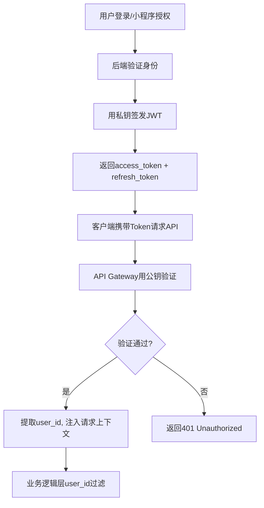
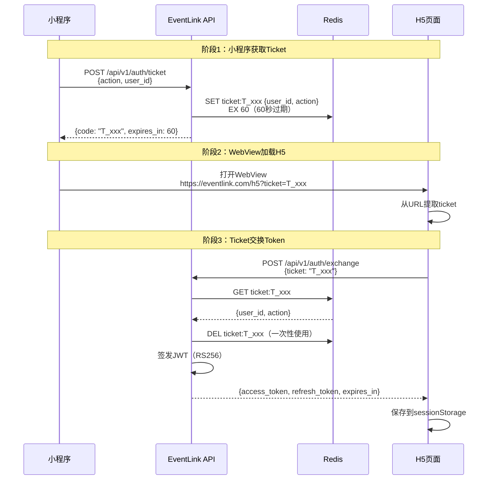
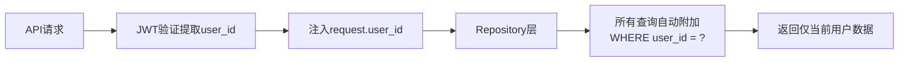
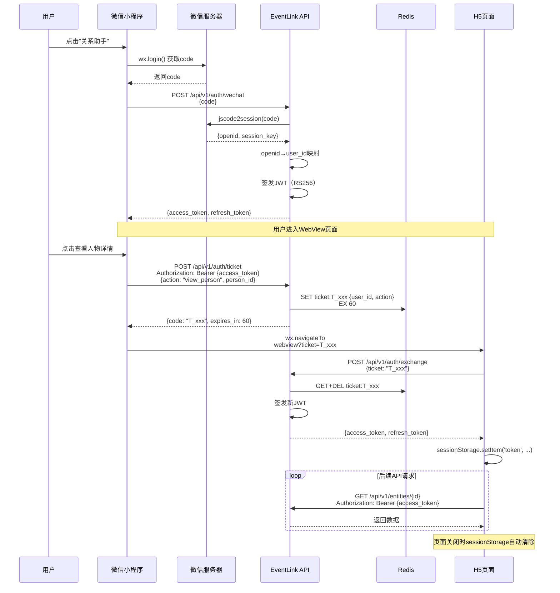

# EventLink 安全设计文档 — 认证与API

> **版本**: v2.9 (POC阶段)
> **拆分日期**: 2026-06-08
> **来源**: Security_Design_v1.md 按攻击面拆分
> **设计师**: 架构师 + 安全工程师
> **参考**: PRD v4.3, 技术设计 v2.5 §8 (§3.1a + §8.0.3), API设计 v1.0, 数据库设计 v1.0

---

## 导航：EventLink 安全设计文档（v2.9 拆分版）

| 文档 | 攻击面 | 主要内容 |
|------|--------|----------|
| [Security_威胁模型与全局.md](./Security_威胁模型与全局.md) | 全局 | 概述与威胁模型、PoC/Phase差异、版本历史 |
| **Security_认证与API.md** ⬅️ | REST API | 认证与授权、API安全 |
| [Security_数据保护与主权.md](./Security_数据保护与主权.md) | 数据库/合规 | 数据保护、数据主权 |
| [Security_LLM与AI输出.md](./Security_LLM与AI输出.md) | LLM Prompt | LLM安全、AI输出约束 |
| [Security_小程序与WebView.md](./Security_小程序与WebView.md) | WebView/小程序 | 小程序安全、WebView、TTS、语音助手 |
| [Security_Engine与审计.md](./Security_Engine与审计.md) | Engine/审计 | Insight Engine、搜索、审计监控、测试清单 |

---

## 2. 认证与授权

### 2.1 JWT RS256认证方案

EventLink采用RS256（非对称签名）算法，公钥验证、私钥签名，便于未来多服务验证。



**JWT Payload结构**：

```json
{
  "sub": "user-uuid",
  "iat": 1749000000,
  "exp": 1749000900,
  "type": "access",
  "jti": "unique-token-id"
}
```

**密钥管理**：

| 阶段 | 密钥存储 | 密钥轮换 | 说明 |
|------|----------|----------|------|
| PoC | 本地文件系统（`keys/private.pem`） | 手动 | 开发环境，单机部署 |
| Phase1 | Docker Secret / 环境变量 | 90天自动 | 云端部署，CI/CD注入 |
| Phase2 | KMS（阿里云/AWS KMS） | 30天自动 | 密钥不落盘，运行时获取 |

**密钥生成**：

```python
# 生成RSA密钥对
from cryptography.hazmat.primitives.asymmetric import rsa
from cryptography.hazmat.primitives import serialization

private_key = rsa.generate_private_key(
    public_exponent=65537,
    key_size=2048,
)

# 保存私钥（权限600）
with open("keys/private.pem", "wb") as f:
    f.write(private_key.private_bytes(
        encoding=serialization.Encoding.PEM,
        format=serialization.PrivateFormat.PKCS8,
        encryption_algorithm=serialization.NoEncryption(),
    ))

# 保存公钥（用于验证）
public_key = private_key.public_key()
with open("keys/public.pem", "wb") as f:
    public_key.public_bytes(
        encoding=serialization.Encoding.PEM,
        format=serialization.PublicFormat.SubjectPublicKeyInfo,
    )
```

### 2.1b JWT HS256认证规范（v2.0新增，对应技术设计§8.0.3）

> **说明**：技术设计 v2.5 §8.0.3 确认 EventLink 采用 **HS256**（对称签名）算法作为JWT认证方案。HS256 适用于单服务部署场景，密钥管理更简单。RS256（§2.1）保留作为 Phase2 多服务验证的备选方案。

**Token格式**：`Bearer <JWT>`

**签名算法**：HS256（使用 Python `cryptography` 库）

**Payload结构**：

```json
{
  "sub": "user_id (UUID)",
  "iat": "签发时间 (Unix timestamp)",
  "exp": "过期时间 (默认24h)",
  "role": "user (预留扩展)"
}
```

**4项安全约束**：

| 约束 | 说明 | 实施阶段 |
|------|------|----------|
| **Secret Key强度** | Secret Key ≥ 256位随机值，启动时校验非默认值（禁止硬编码、禁止空值、禁止弱密钥） | PoC+ |
| **Token黑名单机制** | 登出时将 access_token 的 jti 写入 Redis 黑名单，TTL = token 剩余有效期 | Phase1+ |
| **Refresh Token旋转** | 每次刷新生成新 refresh_token，旧 token 立即失效（防重放） | Phase1+ |
| **CORS严格控制** | 跨域 CORS 仅允许配置的 Origin 白名单列表，**禁止使用 `*`** | PoC+ |

**HS256 密钥管理**：

```bash
# 密钥生成（仅初始化时执行一次）
python -c "
import secrets
key = secrets.token_hex(32)  # 256位随机值
print(key)
" > /secrets/jwt_hs256_secret.txt
chmod 600 /secrets/jwt_hs256_secret.txt

# 环境变量注入（禁止硬编码到代码中）
export JWT_HS256_SECRET=$(cat /secrets/jwt_hs256_secret.txt)
```

```python
# HS256 JWT 签发与验证
import jwt
from datetime import datetime, timedelta

def create_access_token(user_id: str, secret: str) -> str:
    """签发 HS256 Access Token"""
    payload = {
        "sub": user_id,
        "iat": datetime.utcnow(),
        "exp": datetime.utcnow() + timedelta(hours=24),
        "role": "user",
    }
    return jwt.encode(payload, secret, algorithm="HS256")

def verify_token(token: str, secret: str) -> dict:
    """验证 HS256 Token"""
    try:
        return jwt.decode(token, secret, algorithms=["HS256"])
    except jwt.ExpiredSignatureError:
        raise HTTPException(401, "Token已过期")
    except jwt.InvalidTokenError:
        raise HTTPException(401, "Token无效")
```

### 2.2 临时授权码模式（Ticket→JWT交换）

小程序通过WebView打开H5页面时，不直接传递JWT Token，而是使用一次性临时授权码（ticket）交换Token。



**Ticket安全属性**：

| 属性 | 值 | 说明 |
|------|-----|------|
| 有效期 | 60秒 | 极短窗口，降低截获风险 |
| 使用次数 | 1次 | exchange后立即从Redis删除 |
| 格式 | `T_` + 16位随机字符串 | 前缀标识，随机不可预测 |
| 存储 | Redis（非数据库） | 内存存储，过期自动清除 |
| 绑定 | user_id + action | 限制授权范围 |

**Ticket生成与验证代码**：

```python
import secrets
import json
from datetime import datetime, timedelta

async def create_ticket(redis, user_id: str, action: str) -> dict:
    """生成一次性临时授权码"""
    code = f"T_{secrets.token_urlsafe(16)}"
    ticket_data = json.dumps({
        "user_id": user_id,
        "action": action,
        "created_at": datetime.utcnow().isoformat(),
    })
    await redis.setex(f"ticket:{code}", 60, ticket_data)  # 60秒过期
    return {"code": code, "expires_in": 60}

async def exchange_ticket(redis, code: str) -> dict | None:
    """验证并消费一次性授权码"""
    key = f"ticket:{code}"
    data = await redis.get(key)
    if not data:
        return None  # 已过期或已使用
    await redis.delete(key)  # 一次性使用，立即删除
    return json.loads(data)
```

### 2.3 单用户数据隔离

EventLink是私密助手，**无RBAC、无多租户、无团队协作**。数据隔离通过`user_id`应用层过滤实现。



**数据隔离实现**：

```python
from functools import wraps

def user_scope(func):
    """装饰器：确保所有查询都带user_id过滤"""
    @wraps(func)
    async def wrapper(db, user_id: str, *args, **kwargs):
        # 强制注入user_id到查询条件
        kwargs["user_id"] = user_id
        return await func(db, *args, **kwargs)
    return wrapper

# Repository示例
class EntityRepository:
    async def get_by_id(self, db, entity_id: str, user_id: str):
        """获取实体 - 强制user_id过滤"""
        result = await db.execute(
            select(Entity).where(
                Entity.id == entity_id,
                Entity.user_id == user_id  # 应用层隔离
            )
        )
        return result.scalar_one_or_none()

    async def list_entities(self, db, user_id: str, entity_type: str = None):
        """列出实体 - 强制user_id过滤"""
        query = select(Entity).where(Entity.user_id == user_id)
        if entity_type:
            query = query.where(Entity.entity_type == entity_type)
        result = await db.execute(query)
        return result.scalars().all()
```

### 2.4 Token刷新与撤销机制

| 机制 | 说明 | PoC | Phase1 | Phase2 |
|------|------|-----|--------|--------|
| Access Token有效期 | 短期Token | 15分钟 | 15分钟 | 15分钟 |
| Refresh Token有效期 | 长期Token | 7天 | 7天 | 7天 |
| Token刷新 | 用refresh_token换新access_token | ✅ | ✅ | ✅ |
| Token撤销 | 主动失效Token | ❌（重启服务） | ✅ Redis黑名单 | ✅ Redis黑名单 |
| 并发会话控制 | 限制同时在线设备 | ❌ | ❌ | ✅ 最多3设备 |

**Token撤销（Phase1+）**：

```python
async def revoke_token(redis, jti: str, exp: int):
    """将Token加入黑名单"""
    ttl = exp - int(datetime.utcnow().timestamp())
    if ttl > 0:
        await redis.setex(f"token_blacklist:{jti}", ttl, "1")

async def is_token_revoked(redis, jti: str) -> bool:
    """检查Token是否已被撤销"""
    return await redis.exists(f"token_blacklist:{jti}")
```

### 2.5 小程序→H5认证流程（完整时序图）



### 2.6 安全修复记录 (2026-06-08, v2.9新增)

#### 2.6.1 PoC登录密钥验证 (CRITICAL修复)

**问题**: `/auth/login` 端点允许任意 `user_id` 获取JWT token，无任何验证。

**修复**: 新增 `EVENTLINK_POC_SECRET` 环境变量验证。未设置此变量时，PoC登录端点完全禁用，返回403。设置后，请求需携带正确的 `poc_secret` 才能获取token。

**影响文件**: `api/v1/auth.py`

#### 2.6.2 强制JWT认证 (CRITICAL修复)

**问题**: `get_optional_user_id` 在无token时返回固定测试用户ID `"00000000-0000-0000-0000-000000000001"`，导致所有未认证请求共享同一身份。

**修复**:
- 新增 `get_current_user_id` 依赖，无token时返回401
- 所有13个API端点从 `get_optional_user_id` 迁移至 `get_current_user_id`
- `get_optional_user_id` 返回 `str | None`，保留用于可选认证场景
- 新增 `poc_anonymous_access` 配置项（默认False），PoC环境可显式开启匿名访问

**影响文件**: `core/auth.py`, 13个API路由文件

#### 2.6.3 PBKDF2动态盐值派生 (CRITICAL修复)

**问题**: `crypto.py` 使用硬编码固定盐值 `b"eventlink-pii-salt"`，所有部署实例共享同一盐。

**修复**: 盐值从 `secret_key` 的SHA256哈希派生，每个部署实例（不同secret_key）产生不同的派生盐。

**影响文件**: `core/crypto.py`

**注意**: 此修复会导致已有加密数据无法解密。升级时需先导出数据→修改secret_key→重新加密导入。

#### 2.6.4 API速率限制 (HIGH, F-24)

**实现**: 滑动窗口限流器，Redis后端+内存回退。
- 认证用户: 60请求/分钟
- 未认证: 10请求/分钟
- LLM端点(/voice/, /media/): 20请求/分钟
- 超限返回429 + Retry-After header

**影响文件**: `core/rate_limiter.py`, `api/dependencies.py`

---

## 5. API安全

### 5.1 限流策略

EventLink为单用户私密助手，采用统一限流策略，**无RBAC分级**。

| 阶段 | 限流规则 | 存储后端 | 说明 |
|------|----------|----------|------|
| PoC | 100次/分钟/IP | 内存 | 本地部署，单用户 |
| Phase1 | 100次/分钟/user_id | Redis | 云端部署，按用户限流 |
| Phase2 | 100次/分钟/user_id + 突发200 | Redis + 令牌桶 | 允许短时突发 |

**限流实现（Phase1，基于Redis）**：

```python
from fastapi import Request, HTTPException
from fastapi_limiter import FastAPILimiter
from fastapi_limiter.depends import RateLimiter

# 初始化
await FastAPILimiter.init(redis)

# 应用到路由
@app.get("/api/v1/entities")
@depends(RateLimiter(times=100, seconds=60))
async def list_entities(request: Request, user_id: str = Depends(get_current_user)):
    ...
```

### 5.2 输入验证

**JSON Schema验证**：

```python
from pydantic import BaseModel, Field, field_validator
import re

class EventCreateRequest(BaseModel):
    """事件创建请求验证"""
    event_type: str = Field(..., pattern="^(card_save|meeting|call|manual)$")
    source: str = Field(..., max_length=100)
    title: str = Field(..., min_length=1, max_length=500)
    raw_text: str = Field(..., max_length=10000)

    @field_validator("title", "raw_text")
    @classmethod
    def no_sql_injection(cls, v: str) -> str:
        """防止SQL注入关键词"""
        dangerous_patterns = [
            r"(?i)(\b(union|select|insert|update|delete|drop|alter)\b.*\b(from|table|into)\b)",
            r"(?i);\s*(drop|delete|update|alter)",
            r"--\s*$",
            r"/\*.*\*/",
        ]
        for pattern in dangerous_patterns:
            if re.search(pattern, v):
                raise ValueError("输入包含不允许的内容")
        return v

    @field_validator("raw_text")
    @classmethod
    def no_xss(cls, v: str) -> str:
        """防止XSS攻击"""
        xss_patterns = [r"<script", r"javascript:", r"on\w+\s*="]
        for pattern in xss_patterns:
            if re.search(pattern, v, re.IGNORECASE):
                raise ValueError("输入包含不允许的HTML内容")
        return v
```

**SQL注入防护**：

- 所有数据库查询使用SQLAlchemy ORM，**禁止拼接SQL**
- 参数化查询为默认行为
- 代码审查中检查原始SQL使用

```python
# ✅ 安全：ORM参数化查询
result = await db.execute(
    select(Entity).where(Entity.user_id == user_id, Entity.name == name)
)

# ❌ 禁止：字符串拼接
# result = await db.execute(text(f"SELECT * FROM entities WHERE name = '{name}'"))
```

### 5.3 CORS策略

| 阶段 | 允许的Origin | 方法 | 说明 |
|------|-------------|------|------|
| PoC | `http://localhost:*` | GET, POST, PATCH, DELETE | 本地开发 |
| Phase1 | `https://eventlink.com` + 小程序域名 | GET, POST, PATCH, DELETE | 生产环境 |
| Phase2 | Phase1 + 自定义域名 | GET, POST, PATCH, DELETE | 多域名 |

```python
# FastAPI CORS配置
app.add_middleware(
    CORSMiddleware,
    allow_origins=settings.cors_origins,  # 从配置读取
    allow_credentials=True,
    allow_methods=["GET", "POST", "PATCH", "DELETE"],
    allow_headers=["Authorization", "Content-Type"],
    max_age=3600,
)
```

### 5.4 请求签名与防重放

| 阶段 | 签名方案 | 防重放 | 说明 |
|------|----------|--------|------|
| PoC | 无 | 无 | 本地部署，信任网络 |
| Phase1 | HMAC-SHA256 | timestamp + nonce（Redis 5分钟去重） | 生产环境 |
| Phase2 | HMAC-SHA256 | timestamp + nonce + 请求签名 | 增强安全 |

**Phase1请求签名**：

```python
import hmac
import hashlib
import time

def sign_request(method: str, path: str, body: str, secret: str) -> dict:
    """生成请求签名头"""
    timestamp = str(int(time.time()))
    nonce = secrets.token_hex(8)
    message = f"{method}\n{path}\n{timestamp}\n{nonce}\n{body}"
    signature = hmac.new(
        secret.encode(), message.encode(), hashlib.sha256
    ).hexdigest()
    return {
        "X-Timestamp": timestamp,
        "X-Nonce": nonce,
        "X-Signature": signature,
    }
```

### 5.5 错误信息安全

```python
from fastapi import HTTPException

# ✅ 安全：不泄露内部信息
@app.exception_handler(Exception)
async def global_exception_handler(request, exc):
    logger.error(f"Unhandled exception: {exc}", exc_info=True)
    return JSONResponse(
        status_code=500,
        content={"detail": "服务器内部错误，请稍后重试"},
    )

# ❌ 禁止：泄露堆栈信息
# return JSONResponse(status_code=500, content={"detail": str(exc)})

# ✅ 安全：验证错误不暴露字段名
class SafeValidationError(Exception):
    def __init__(self, message: str = "请求参数无效"):
        self.message = message
```

| 错误类型 | 返回信息 | 日志记录 |
|----------|----------|----------|
| 400 Bad Request | "请求参数无效" | 完整验证错误 |
| 401 Unauthorized | "认证失败" | Token验证失败原因 |
| 403 Forbidden | "无权访问" | 资源ID + user_id |
| 404 Not Found | "资源不存在" | 请求路径 |
| 429 Too Many Requests | "请求过于频繁" | user_id + 限流详情 |
| 500 Internal Error | "服务器内部错误" | 完整堆栈 |

### 5.6 input_scope输入分类越权防护（SC-01）（v2.0新增，对应技术设计v2.4 BLK-2 P0阻塞修复）

> **威胁场景**：`POST /api/v1/events` 接口的 `input_scope` 字段决定事件处理管线路由（如 `identity_update` 仅更新基础信息，不抽取关注/承诺）。如果客户端可伪造该字段值，可能导致绕过安全检查或触发非预期的管线逻辑。

**安全约束 SC-01 核心原则：永远不以客户端传入的 input_scope 值作为最终分类结果。**

**校验规则**：

| 客户端传入值 | 服务端行为 | 说明 |
|-------------|-----------|------|
| 不传 / 传 `"auto"` | 调用 `InputClassifier.classify(raw_text, event_type)` 获取服务端分类结果 | 默认行为 |
| 传合法枚举值（8种之一） | **仅作为 hint**，仍以 `classify()` 结果为准 | 客户端建议不被信任 |
| 传非法值（不在枚举内） | 返回 `400 Bad Request` | 拒绝非法输入 |

**合法 input_scope 枚举值（8种）**：

```python
VALID_SCOPES = {
    "relationship_interaction",   # 关系互动（完整管线）
    "identity_update",            # 身份更新（仅更新基础信息）
    "meeting_minutes",            # 会议纪要（完整管线+承诺证据来源）
    "partner_feedback",           # 合作伙伴反馈 → 终止（不进入后续管线）
    "internal_review",            # 内部评审 → 终止（不进入后续管线）
    "resource_inquiry",           # 资源询问
    "care_expression",            # 关怀表达
    "cooperation_signal",         # 合作信号
}
```

**实现伪代码**：

```python
from fastapi import HTTPException

def resolve_input_scope(client_scope: str | None, raw_text: str, event_type: str) -> dict:
    """SC-01: 服务端强制校验 input_scope，防止客户端伪造"""
    # 1. 非法值校验
    if client_scope and client_scope not in VALID_SCOPES and client_scope != "auto":
        raise HTTPException(status_code=400, detail=f"Invalid input_scope: {client_scope}")

    # 2. 永远以服务端 classify() 结果为准
    result = InputClassifier.classify(raw_text, event_type)
    return result  # {scope, confidence, reason}
```

**安全验证要点**：
- 单元测试必须覆盖：非法值→400、auto→服务端分类、合法hint→仍以服务端为准
- 集成测试：构造包含恶意 `input_scope` 的请求，确认不影响管线路由安全
